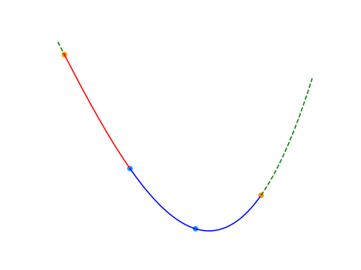

本页面将简要介绍二分查找及其变体，由二分法衍生的二分答案以及三分法。

## 二分法

### 定义

二分查找（英语：binary search），也称折半搜索（英语：half-interval search）、对数搜索（英语：logarithmic search），是用来在一个有序数组中查找某一元素的算法。

### 过程

以在一个升序数组中查找一个数为例。

它每次考察数组当前部分的中间元素，如果中间元素刚好是要找的，就结束搜索过程；如果中间元素小于所查找的值，那么左侧的只会更小，不会有所查找的元素，只需到右侧查找；如果中间元素大于所查找的值同理，只需到左侧查找。

### 性质

#### 时间复杂度

二分查找的最优时间复杂度为 $O(1)$。

二分查找的平均时间复杂度和最坏时间复杂度均为 $O(\log n)$。因为在二分搜索过程中，算法每次都把查询的区间减半，所以对于一个长度为 $n$ 的数组，至多会进行 $O(\log n)$ 次查找。

#### 空间复杂度

迭代版本的二分查找的空间复杂度为 $O(1)$。

递归（无尾调用消除）版本的二分查找的空间复杂度为 $O(\log n)$。

### 实现

为方便讲解，本部分的示例代码的待查数组下标范围均为 $[0,len-1]$，读者也可以根据需要自行改写。

```cpp
int binary_search(int arr[], const int len, const int key) {
  int left = 0, right = len - 1, mid;  // 查找[left, right]区间
  while (left <= right) {
    mid = left + ((right - left) >> 1);  // 直接平均可能会溢出，所以用这个算法
    if (arr[mid] < key)
      left = mid + 1;
    else if (arr[mid] > key)
      right = mid - 1;
    else  // 最后检测相等是因为多数搜索情况不是大于就是小于
      return mid;
  }
  return -1;  // 执行到这一步就意味着key不在数组中
}
```

### 变体

上面给出的代码虽然能返回给定值在数组中的位置，但对于一些其它的要求，比如需要查找第一个值等于给定值的元素，一般的二分无法做到。举一个例子，对于数组 ${1, 2, 2, 2, 3}$，元素 `2` 出现的第一个位置是 `1`, 但上面算法给出的结果却是 `2`。所以我们需要在保证复杂度的情况下对一般的二分查找进行修改，使其能够正确输出答案。

根据查找要求不同，二分法有多种变体。网上的实现有很多，甚至有许多代码不尽相同的实例能够完成相同的工作。二分的代码该如何写是由该算法定义的 **查找区间** 决定的。通常我们会使用 **左闭右闭** 型（即 $[left,right]$）或 **左闭右开** 型（即 $[left,right)$)。这两种方式写出的代码通常不同，但没有优劣之分，都能达到同样的效果。下面简要介绍两种变体。

!!! warning "注意"
    二分查找各种变体代码很相似，请读者注意观察他们的 **循环条件**、**左右边界的取值** 以及 **返回值的选择** 的不同。

#### 左侧边界

左侧边界，即查找第一个等于给定值的元素。

=== "左闭右闭"

    ```cpp
    int binary_search(int arr[], const int len, const int key) {
        int left = 0, right = len - 1, mid;
        while (left <= right) {
            mid = left + ((right - left) >> 1);
            if (arr[mid] < key)
                left = mid + 1;
            else
                right = mid - 1;
        }
        if (left >= len) return -1; // 防止left越界
        return arr[left] == key ? left : -1; // 最后的arr[left]不一定等于key
    }
    ```

    ???+question "细节问题"
        - 为什么 `right` 要初始化为 `len - 1` ？  
        因为我们定义的查找区间是 `[left, right]` ，所以应初始化 `right` 为最后一个元素的位置。  
        - 为什么循环条件是 `left <= right` ？  
        这就需要我们考虑什么时候结束循环，显然搜索区间为空时应该结束。在此处，当 `left > right` 时，区间 `[left, right]` 才会为空。（实际上，在 `left > right` 时，
         `left` 总是等于 `right + 1` 的）。  
        - 为什么 `left = mid + 1` ， `right = mid - 1` ?  
        因为我们定义的查找区间为 `[left, right]` ，所以每次区间更新时都要让新区间是闭区间，即 `[left, mid - 1]` 与 `[mid + 1, right]` 。  
        - 为什么这样做可以找到左侧边界？  
        此处就是该变体与一般二分的最大不同，当已经找到元素的位置时，继续更新区间，向左侧边界靠拢。

=== "左闭右开"

    ```cpp
    int binary_search(int arr[], const int len, const int key) {
        int left = 0, right = len, mid;
        while (left < right) {
            mid = left + ((right - left) >> 1);
            if (arr[mid] < key)
                left = mid + 1;
            else
                right = mid;
        }
        if (left >= len) return -1; // 防止越界
        return arr[left] == key ? left : -1;
    }
    ```

    ???+question "细节问题"
        - 为什么 `right` 要初始化为 `len` ？  
        因为我们定义的查找区间是 `[left, right)` ，所以应初始化 `right` 为最后一个元素的位置的下一个位置。  
        - 为什么循环条件是 `left < right` ？  
        搜索区间为空时应该结束循环。在此处，当 `left >= right` 时，区间 `[left, right)` 才会为空。（实际上，在 `left >= right` 时，
         `left` 总是等于 `right` 的）。  
        - 为什么 `left = mid + 1` ， `right = mid` ?  
        因为我们定义的查找区间为 `[left, right)` ，所以每次区间更新时都要让新区间是左闭右开区间，即 `[left, mid)` 与 `[mid + 1, right)` 。  
        - 为什么这样做可以找到左侧边界？  
        此处就是该变体与一般二分的一个不同，当已经找到元素的位置时，继续更新区间，向左侧边界靠拢。

#### 右侧边界

右侧边界，即查找最后一个等于给定值的元素。

=== "左闭右闭"

    ```cpp
    int binary_search(int arr[], const int len, const int key) {
        int left = 0, right = len - 1, mid;
        while (left <= right) {
            mid = left + ((right - left) >> 1);
            if (arr[mid] <= key) // 注意
                left = mid + 1;
            else
                right = mid - 1;
        }
        if (right < 0) return -1; // 防止越界
        return arr[right] == key ? right : -1;
    }
    ```

=== "左闭右开"

    ```cpp
    int binary_search(int arr[], const int len, const int key) {
        int left = 0, right = len, mid;
        while (left < right) {
            mid = left + ((right - left) >> 1);
            if (arr[mid] <= key)
                left = mid + 1;
            else
                right = mid;
        }
        right -= 1; // 注意元素的位置为right-1
        if (right < 0) return -1;
        return arr[right] == key ? right : -1;
    }
    ```

???+question "细节问题"
    -   为什么这样做可以找到右侧边界？  
        此处就是该变体与一般二分的最大不同，当已经找到元素的位置时，继续更新区间，向右侧边界靠拢。
    
    其余部分与左侧边界基本相同，不再赘述。

#### 总结

不难发现，变体算法的 **循环条件**、**左右边界的取值** 以及 **返回值的选择** 是由其定义的查找区间决定的。读者只需理解以上变体的细节并将其总结，
就能够写出满足其它要求的变体。下面给出了其它两种变体的参考实现。

??? node "其它变体"
    === "查找第一个大于等于给定值的元素"
    
        === "左闭右闭"
    
            ```cpp
            int binary_search(int arr[], const int len, const int key) {
                if (key > arr[len - 1]) return -1; 
                int left = 0, right = len - 1, mid;
                while (left <= right) {
                    mid = left + ((right - left) >> 1);
                    if (arr[mid] < key)
                        left = mid + 1;
                    else
                        right = mid - 1;
                }
                return left;
            }
            ```
    
        === "左闭右开"
    
            ```cpp
            int binary_search(int arr[], const int len, const int key) {
                if (key > arr[len - 1]) return -1; 
                int left = 0, right = len, mid;
                while (left < right) {
                    mid = left + ((right - left) >> 1);
                    if (arr[mid] < key)
                        left = mid + 1;
                    else
                        right = mid;
                }
                return left;
            }
            ```
    
    === "查找最后一个小于等于给定值的元素"
    
        === "左闭右闭"
    
            ```cpp
            int binary_search(int arr[], const int len, const int key) {
                if (key < arr[0]) return -1;
                int left = 0, right = len - 1, mid;
                while (left <= right) {
                    mid = left + ((right - left) >> 1);
                    if (arr[mid] <= key)
                        left = mid + 1;
                    else
                        right = mid - 1;
                }
                return right;
            }
            ```
    
        === "左闭右开"
    
            ```cpp
            int binary_search(int arr[], const int len, const int key) {
                if (key < arr[0]) return -1;
                int left = 0, right = len, mid;
                while (left < right) {
                    mid = left + ((right - left) >> 1);
                    if (arr[mid] <= key)
                        left = mid + 1;
                    else
                        right = mid;
                }
                return right - 1;
            }
            ```

### 最大值最小化

注意，这里的有序是广义的有序，如果一个数组中的左侧或者右侧都满足某一种条件，而另一侧都不满足这种条件，也可以看作是一种有序（如果把满足条件看做 $1$，不满足看做 $0$，至少对于这个条件的这一维度是有序的）。换言之，二分搜索法可以用来查找满足某种条件的最大（最小）的值。

要求满足某种条件的最大值的最小可能情况（最大值最小化），首先的想法是从小到大枚举这个作为答案的「最大值」，然后去判断是否合法。若答案单调，就可以使用二分搜索法来更快地找到答案。因此，要想使用二分搜索法来解这种「最大值最小化」的题目，需要满足以下三个条件：

1. 答案在一个固定区间内；
2. 可能查找一个符合条件的值不是很容易，但是要求能比较容易地判断某个值是否是符合条件的；
3. 可行解对于区间满足一定的单调性。换言之，如果 $x$ 是符合条件的，那么有 $x + 1$ 或者 $x - 1$ 也符合条件。（这样下来就满足了上面提到的单调性）

当然，最小值最大化是同理的。

### STL 的二分查找

C++ 标准库中实现了查找首个不小于给定值的元素的函数 [`std::lower_bound`](https://zh.cppreference.com/w/cpp/algorithm/lower_bound) 和查找首个大于给定值的元素的函数 [`std::upper_bound`](https://zh.cppreference.com/w/cpp/algorithm/upper_bound)，二者均定义于头文件 `<algorithm>` 中。

二者均采用二分实现，所以调用前必须保证元素有序。

### bsearch

bsearch 函数为 C 标准库实现的二分查找，定义在 `<stdlib.h>` 中。在 C++ 标准库里，该函数定义在 `<cstdlib>` 中。qsort 和 bsearch 是 C 语言中唯二的两个算法类函数。

bsearch 函数相比 qsort（[排序相关 STL](./stl-sort.md)）的四个参数，在最左边增加了参数「待查元素的地址」。之所以按照地址的形式传入，是为了方便直接套用与 qsort 相同的比较函数，从而实现排序后的立即查找。因此这个参数不能直接传入具体值，而是要先将待查值用一个变量存储，再传入该变量地址。

于是 bsearch 函数总共有五个参数：待查元素的地址、数组名、元素个数、元素大小、比较规则。比较规则仍然通过指定比较函数实现，详见 [排序相关 STL](./stl-sort.md)。

bsearch 函数的返回值是查找到的元素的地址，该地址为 void 类型。

注意：bsearch 与上文的 lower_bound 和 upper_bound 有两点不同：

- 当符合条件的元素有重复多个的时候，会返回执行二分查找时第一个符合条件的元素，从而这个元素可能位于重复多个元素的中间部分。
- 当查找不到相应的元素时，会返回 NULL。

用 lower_bound 可以实现与 bsearch 完全相同的功能，所以可以使用 bsearch 通过的题目，直接改写成 lower_bound 同样可以实现。但是鉴于上述不同之处的第二点，例如，在序列 1、2、4、5、6 中查找 3，bsearch 实现 lower_bound 的功能会变得困难。

利用 bsearch 实现 lower_bound 的功能比较困难，是否一定就不能实现？答案是否定的，存在比较 tricky 的技巧。借助编译器处理比较函数的特性：总是将第一个参数指向待查元素，将第二个参数指向待查数组中的元素，也可以用 bsearch 实现 lower_bound 和 upper_bound，如下文示例。只是，这要求待查数组必须是全局数组，从而可以直接传入首地址。

```cpp
int A[100005];  // 示例全局数组

// 查找首个不小于待查元素的元素的地址
int lower(const void *p1, const void *p2) {
  int *a = (int *)p1;
  int *b = (int *)p2;
  if ((b == A || compare(a, b - 1) > 0) && compare(a, b) > 0)
    return 1;
  else if (b != A && compare(a, b - 1) <= 0)
    return -1;  // 用到地址的减法，因此必须指定元素类型
  else
    return 0;
}

// 查找首个大于待查元素的元素的地址
int upper(const void *p1, const void *p2) {
  int *a = (int *)p1;
  int *b = (int *)p2;
  if ((b == A || compare(a, b - 1) >= 0) && compare(a, b) >= 0)
    return 1;
  else if (b != A && compare(a, b - 1) < 0)
    return -1;  // 用到地址的减法，因此必须指定元素类型
  else
    return 0;
}
```

因为现在的 OI 选手很少写纯 C，并且此方法作用有限，所以不是重点。对于新手而言，建议老老实实地使用 C++ 中的 lower_bound 和 upper_bound 函数。

### 二分答案

解题的时候往往会考虑枚举答案然后检验枚举的值是否正确。若满足单调性，则满足使用二分法的条件。把这里的枚举换成二分，就变成了「二分答案」。

???+note "[Luogu P1873 砍树](https://www.luogu.com.cn/problem/P1873)"
    伐木工人米尔科需要砍倒 $M$ 米长的木材。这是一个对米尔科来说很容易的工作，因为他有一个漂亮的新伐木机，可以像野火一样砍倒森林。不过，米尔科只被允许砍倒单行树木。
    
    米尔科的伐木机工作过程如下：米尔科设置一个高度参数 $H$（米），伐木机升起一个巨大的锯片到高度 $H$，并锯掉所有的树比 $H$ 高的部分（当然，树木不高于 $H$ 米的部分保持不变）。米尔科就得到树木被锯下的部分。
    
    例如，如果一行树的高度分别为 $20,~15,~10,~17$，米尔科把锯片升到 $15$ 米的高度，切割后树木剩下的高度将是 $15,~15,~10,~15$，而米尔科将从第 $1$ 棵树得到 $5$ 米木材，从第 $4$ 棵树得到 $2$ 米木材，共 $7$ 米木材。
    
    米尔科非常关注生态保护，所以他不会砍掉过多的木材。这正是他尽可能高地设定伐木机锯片的原因。你的任务是帮助米尔科找到伐木机锯片的最大的整数高度 $H$，使得他能得到木材至少为 $M$ 米。即，如果再升高 $1$ 米锯片，则他将得不到 $M$ 米木材。

??? note "解题思路"
    我们可以在 $1$ 到 $10^9$ 中枚举答案，但是这种朴素写法肯定拿不到满分，因为从 $1$ 枚举到 $10^9$ 太耗时间。我们可以在 $[1,~10^9]$ 的区间上进行二分作为答案，然后检查各个答案的可行性（一般使用贪心法）。**这就是二分答案。**

??? note "参考代码"
    此处的参考代码选用了“左闭右开”的形式（也可以使用“左闭右闭”的形式），思路与上文查找右侧边界基本相同。
    
    ```cpp
    int a[1000005];
    int n, m;
    
    bool check(int k) {  // 检查可行性，k 为锯片高度
      long long sum = 0;
      for (int i = 1; i <= n; ++i)       // 检查每一棵树
        if (a[i] > k)                    // 如果树高于锯片高度
          sum += (long long)(a[i] - k);  // 累加树木长度
      return sum >= m;                   // 如果满足最少长度代表可行
    }
    
    int find() {
      int l = 1, r = 1e9 + 1;  // 因为是左闭右开的，所以 10^9 要加 1
      while (l < r) {          // 如果两点不相邻
        int mid = l + ((r - l) >> 1);  // 取中间值
        if (check(mid))                // 如果可行
          l = mid + 1;                 // 升高锯片高度
        else
          r = mid;  // 否则降低锯片高度
      }
      return r - 1;  // 返回右边值-1
    }
    
    int main() {
      cin >> n >> m;
      for (int i = 1; i <= n; ++i) cin >> a[i];
      cout << find();
      return 0;
    }
    ```

## 三分法

### 引入

如果需要求出单峰函数的极值点，通常使用二分法衍生出的三分法求单峰函数的极值点。

??? note "为什么不通过求导函数的零点来求极值点？"
    客观上，求出导数后，通过二分法求出导数的零点（由于函数是单峰函数，其导数在同一范围内的零点是唯一的）得到单峰函数的极值点是可行的。
    
    但首先，对于一些函数，求导的过程和结果比较复杂。
    
    其次，某些题中需要求极值点的单峰函数并非一个单独的函数，而是多个函数进行特殊运算得到的函数（如求多个单调性不完全相同的一次函数的最小值的最大值）。此时函数的导函数可能是分段函数，且在函数某些点上可能不可导。

???+warning "注意"
    只要函数是单峰函数，三分法既可以求出其最大值，也可以求出其最小值。为行文方便，除特殊说明外，下文中均以求单峰函数的最小值为例。

三分法与二分法的基本思想类似，但每次操作需在当前区间 $[l,r]$（下图中除去虚线范围内的部分）内任取两点 $lmid,rmid(lmid < rmid)$（下图中的两蓝点）。如下图，如果 $f(lmid)<f(rmid)$，则在 $[rmid,r]$（下图中的红色部分）中函数必然单调递增，最小值所在点（下图中的绿点）必然不在这一区间内，可舍去这一区间。反之亦然。



???+ warning "注意"
    在计算 $lmid$ 和 $rmid$ 时，需要防止数据溢出的现象出现。

三分法每次操作会舍去两侧区间中的其中一个。为减少三分法的操作次数，应使两侧区间尽可能大。因此，每一次操作时的 $lmid$ 和 $rmid$ 分别取 $mid-\varepsilon$ 和 $mid+\varepsilon$ 是一个不错的选择。

### 实现

#### 伪代码

$$
\begin{array}{ll}
1 & \textbf{Input. } \text{A range } [l,r] \text{ meaning that the domain of } f(x) \text{.} \\
2 & \textbf{Output. } \text{The maximum value of } f(x) \text{ and the value of } x \text{ at that time } \text{.} \\
3 & \textbf{Method. } \\
4 & \textbf{while } r - l > \varepsilon\\
5 & \qquad mid\gets \frac{lmid+rmid}{2}\\
6 & \qquad lmid\gets mid - \varepsilon \\
7 & \qquad rmid\gets mid + \varepsilon \\
8 & \qquad \textbf{if } f(lmid) < f(rmid) \\
9 & \qquad \qquad r\gets mid \\
10 & \qquad \textbf{else } \\
11 & \qquad \qquad l\gets mid
\end{array}
$$

#### C++

```cpp
while (r - l > eps) {
  mid = (lmid + rmid) / 2;
  lmid = mid - eps;
  rmid = mid + eps;
  if (f(lmid) < f(rmid))
    r = mid;
  else
    l = mid;
}
```

### 例题

???+note "[洛谷 P3382 - 【模板】三分法](https://www.luogu.com.cn/problem/P3382)"


给定一个 $N$ 次函数和范围 $[l, r]$，求出使函数在 $[l, x]$ 上单调递增且在 $[x, r]$ 上单调递减的唯一的 $x$ 的值。

??? note "解题思路"


本题要求求 $N$ 次函数在 $[l, r]$ 取最大值时自变量的值，显然可以使用三分法。

??? note "参考代码"
    ```cpp
    --8<-- "docs/basic/code/binary/binary_1.cpp"
    ```

### 习题

- [Uva 1476 - Error Curves](https://onlinejudge.org/index.php?option=com_onlinejudge&Itemid=8&category=447&page=show_problem&problem=4222)
- [Uva 10385 - Duathlon](https://uva.onlinejudge.org/index.php?option=com_onlinejudge&Itemid=8&category=15&page=show_problem&problem=1326)
- [UOJ 162 -【清华集训 2015】灯泡测试](https://uoj.ac/problem/162)
- [洛谷 P7579 -「RdOI R2」称重（weigh）](https://www.luogu.com.cn/problem/P7579)

## 分数规划

参见：[分数规划](../misc/frac-programming.md)

分数规划通常描述为下列问题：每个物品有两个属性 $c_i$，$d_i$，要求通过某种方式选出若干个，使得 $\frac{\sum{c_i}}{\sum{d_i}}$ 最大或最小。

经典的例子有最优比率环、最优比率生成树等等。

分数规划可以用二分法来解决。

## 拓展 - 插值查找

插值查找是对二分查找的改进，其将二分查找中的查找点的选择改进为自适应选择。简单地说，它通过插值公式对元素的索引进行推测。

### 复杂度

插值查找的最优时间复杂度为 $O(1)$，最坏时间复杂度为 $O(n)$，插值查找的平均时间复杂度为 $O(\log \log n)$，证明过程可以参考 [关于插值查找复杂度的证明](http://www.cs.technion.ac.il/~itai/publications/Algorithms/p550-perl.pdf)。

在数据分布均匀的情况下，插值查找的效率很高，但如果数据分布不均匀，插值查找反而会比二分慢。

插值查找的空间复杂度显然为 $O(1)$。

### 实现

```cpp
int interpolation_search(int arr[], const int len, const int key) {
  int left = 0, right = len - 1, mid;
  while ((arr[left] != arr[right]) && (arr[left] <= key) &&
         (arr[right] >= key)) {
    // 注意：循环条件与mid的计算相较于二分略有不同
    mid =
        left + ((key - arr[left]) * (right - left) / (arr[right] - arr[left]));
    if (arr[mid] < key)
      left = mid + 1;
    else if (arr[mid] > key)
      right = mid - 1;
    else
      return mid;
  }
  return key == arr[left] ? left : -1;
}
```

此外还有其它高效的查找算法，如斐波那契查找、二叉树查找等。但在 OI 中，二分查找因其简单、稳定、高效且易于变形的特点而最为广泛使用。
