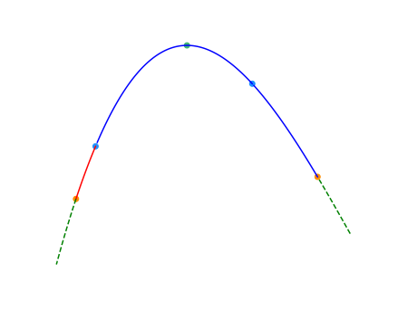
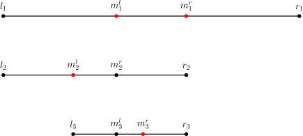

本页面将简要介绍二分查找、二分答案，以及由二分法衍生的三分法．

## 二分查找

二分查找（binary search），也称折半搜索（half-interval search）、对数搜索（logarithmic search），是用来在一个有序序列中查找某一元素的算法．

### 过程

以在一个升序数组中查找一个数为例．

它每次访问数组当前部分的中间元素，如果中间元素刚好是要找的，就结束搜索过程；如果中间元素小于所查找的值，那么左侧的元素都不大于中间元素，不可能有所查找的元素，只需到右侧查找；如果中间元素大于所查找的值同理，只需到左侧查找．

具体地，设数组 $a$ 下标从 $1$ 开始，长度为 $n$，要查找数 $x$ 在哪个位置．令 $l,r$ 表示当前只考虑数组中下标 $i$ 满足 $l\le i\le r$ 的数．一开始时，令 $l\gets1$，$r\gets n$．每次访问中间元素 $a_{\textit{mid}}$，其中 $\textit{mid}=\left\lfloor\dfrac{l+r}{2}\right\rfloor$，然后分情况讨论：

-   若 $a_{\textit{mid}}<x$，由于数组升序，下标小于等于 $\textit{mid}$ 的数一定都比 $x$ 小，因此一定不用查找这些数，只需要查找下标大于 $\textit{mid}$ 的数就可以了，也就是令 $l\gets \textit{mid}+1$，$r$ 不变．
-   若 $a_{\textit{mid}}>x$，由于数组升序，下标大于等于 $\textit{mid}$ 的数一定都比 $x$ 大，因此一定不用查找这些数，只需要查找下标小于 $\textit{mid}$ 的数就可以了，也就是令 $l$ 不变，$r\gets \textit{mid}-1$．
-   若 $a_{\textit{mid}}=x$，我们就找到了数 $x$ 的位置，算法结束．

如果直到考虑范围为空，即 $l>r$ 时都没有找到数 $x$ 的位置，就说明 $x$ 不在数组 $a$ 中．

### 性质

#### 时间复杂度

二分查找的最优时间复杂度为 $O(1)$．

二分查找的平均时间复杂度和最坏时间复杂度均为 $O(\log n)$．因为在二分查找过程中，算法每次都把待查找的区间减半，所以对于一个长度为 $n$ 的数组，至多会进行 $O(\log n)$ 次和目标元素的比较．

#### 空间复杂度

迭代版本的二分查找的空间复杂度为 $O(1)$．

递归（无尾调用消除）版本的二分查找的空间复杂度为 $O(\log n)$．

### 实现

```cpp
int binary_search(int x, int l = 1, int r = n) {  // 在升序数组中查找数 x 的下标
  int ret = -1;                                   // 未找到时返回 -1
  while (l <= r) {
    int mid = (l + r) >> 1;  // l + r 可能溢出，详见下方 Note
    if (a[mid] < x)
      l = mid + 1;
    else if (a[mid] > x)
      r = mid - 1;
    else {  // 最后检测相等是因为多数搜索情况不是大于就是小于
      ret = mid;
      break;
    }
  }
  return ret;
}
```

???+ note "Note"
    -   参考 [编译优化 #移位代替乘法](../lang/optimizations.md#移位代替乘法)，对于 $s$ 是有符号数的情况，当你可以保证 $s\ge 0$ 时，`s >> 1` 比 `s / 2` 指令数更少．
    
    -   当 $l$ 或 $r$ 特别大时，$l+r$ 可能会溢出．若此时 $r-l$ 不会溢出，可以将代码中的 `(l + r) >> 1` 更换为 `l + ((r - l) >> 1)`．

???+ warning "Warning"
    当 $s$ 为负奇数时，`s >> 1` 和 `s / 2` 的结果相差 $1$，并不相同．这是因为前者向负无穷取整（C++20 列入标准，此前为实现定义），后者向零取整．详见 [C++ 位操作符](../lang/op.md#位操作符)．因此 $l + r$ 可能为负时，`(l + r) / 2` 可能取到 $r$，在 `r = mid` 的写法中会导致 **死循环**．例如 $l = -1,~r = 0$ 时，`(l + r) / 2` 等于 $0$．在实现代码时需要注意这点不同．

### bsearch

`bsearch` 函数为 C 标准库实现的二分查找，定义在 `<stdlib.h>` 中．在 C++ 标准库里，该函数定义在 `<cstdlib>` 中．qsort 和 `bsearch` 是 C 语言标准库中仅有的两个算法类函数．

`bsearch` 函数相比 qsort（[排序相关 STL](./stl-sort.md)）的四个参数，在最左边增加了参数「待查元素的地址」．之所以按照地址的形式传入，是为了方便直接套用与 qsort 相同的比较函数，从而实现排序后的立即查找．因此这个参数不能直接传入具体值，而是要先将待查值用一个变量存储，再传入该变量地址．

于是 `bsearch` 函数总共有五个参数：待查元素的地址、数组首地址、元素个数、元素大小、比较规则．比较规则仍然通过指定比较函数实现，详见 [排序相关 STL](./stl-sort.md)．

`bsearch` 函数的返回值是查找到的元素的地址，返回类型为 `void *`．

注意：`bsearch` 与下文将要介绍的 `std::lower_bound` 和 `std::upper_bound` 有两点不同：

-   当有多个符合条件的元素时，返回其中哪一个未指定．
-   当查找不到相应的元素时，会返回 `NULL`．

用 `lower_bound` 可以实现与 `bsearch` 近乎相同的功能（只需要特别判断查找不到元素的情况即可做到完全相同），所以可以使用 `bsearch` 通过的题目，直接改写成 `lower_bound` 同样可以实现．

## 二分答案

二分答案是利用问题答案的广义有序性质（通常也被称为单调性），通过类似二分查找的方式快速求出答案的算法．

如果没有特殊说明，二分答案通常代指整数范围的二分答案，即已知答案必定是整数．

能够利用二分答案的问题通常形如「求满足条件 $P$ 的最大（小）值」，并具有如下性质：

1.  如果给出任意数 $x$，容易判断 $x$ 是否满足条件；
2.  问题的答案可以划定一个粗略的上下界，即可以确定 $L$ 和 $R$ 使得若答案 $x$ 存在，则 $x$ 必然满足 $L\le x \le R$；
3.  划定的粗略的上下界范围很大，一个个枚举并且判断会超时；
4.  条件 $P$ 具有广义的有序性质．

假设存在一个函数 $f(x)$，当且仅当 $x$ 满足条件 $P$ 时 $f(x)=1$，否则 $f(x)=0$，则可以用下列方式定义条件 $P$ 的广义有序性质：

-   若对于任意的 $L\le i<j \le R$，$f(i)\le f(j)$，即 $f(x)$ 单调不减．将 $i=L,\dots,R$ 的 $f(i)$ 写成一个 01 序列时形如 `00...011...1`．此时二分答案可以求出满足条件 $P$ 的 **最小值**．

-   若对于任意的 $L \le i<j \le R$，$f(i)\ge f(j)$，即 $f(x)$ 单调不增．对应的 01 序列形如 `11...100...0`．此时二分答案可以求出满足条件 $P$ 的 **最大值**．

换言之，第一种有序性质是指：如果知道 $x$ 满足条件 $P$，则所有比 $x$ 大的数一定都满足条件 $P$．二分答案可以求出符合「比它小的数都不满足条件 $P$，它和比它大的数都满足条件 $P$」这一描述的 $x$．

而第二种有序性质是指：如果知道 $x$ 满足条件 $P$，则所有比 $x$ 小的数一定都满足条件 $P$．二分答案可以求出符合「它和比它小的数都满足条件 $P$，比它大的数都不满足条件 $P$」这一描述的 $x$．

### 过程

以利用二分答案求最小值为例（此时算法要求问题满足上文所述的第一种有序性质）．设答案的粗略上下界为 $L$ 和 $R$．

令 $l,r$ 表示当前可以确定答案 $x$ 一定满足 $l \le x \le r$．和二分查找类似，一开始时，令 $l\gets L$，$r\gets R$．每次我们判断 $\textit{mid}=\left\lfloor\dfrac{l+r}{2}\right\rfloor$ 是否满足条件 $P$，然后分情况讨论：

-   如果 $\textit{mid}$ 不满足条件（即 $f(\textit{mid})$ 为 $0$），根据问题的有序性质，此时小于等于 $\textit{mid}$ 的所有数都不满足条件，都无需考虑，因此令 $l\gets \textit{mid}+1$，$r$ 不变．
-   如果 $\textit{mid}$ 满足条件（即 $f(\textit{mid})$ 为 $1$），根据问题的有序性质，此时大于等于 $\textit{mid}$ 的所有数都满足条件，但是因为题目要求最小值，所以所有大于 $\textit{mid}$ 的数都没必要考虑了，只考虑小于等于 $\textit{mid}$ 的数就可以了．此时令 $r \gets \textit{mid}$，$l$ 不变．

当答案范围满足 $l=r$（即不再满足 $l<r$）时，算法结束．此时 $l$ 或 $r$ 为答案．

需要注意的是：若上下界内答案不存在（即通常所说的无解），每次查询 $f(\textit{mid})$ 都会返回 $0$，因此算法结束后 $l=r=R$，且 $f(l)=0$．因此如果需要判断无解，额外检查 $f(l)$ 是否等于 $0$ 即可．

和二分查找类似，算法每次都把待搜索的区间减半，因此算法的时间复杂度为 $O(M \log (R-L+1))$，其中 $M$ 为每次判断 $\textit{mid}$ 是否满足条件 $P$ 的时间复杂度．

### 实现

根据上面的算法描述，可以给出如下实现：

```cpp
// 求 [L, R] 内满足条件 P 的最小整数 x，要求 L <= R
// 条件 P 需要满足第一种有序性质，即 f(x) 单调不减
// 在代码实现中，通常 check(x) = f(x)
// 若区间内无解，返回 -1
int binary_search_min(int L, int R) {
  if (L > R) return -1;
  int l = L, r = R;
  while (l < r) {
    int mid = (l + r) >> 1;
    if (check(mid))  // f(mid) = 1，满足条件 P
      r = mid;       // 答案在 [l, mid]
    else
      l = mid + 1;  // 答案在 [mid + 1, r]
  }
  // 此时 l == r
  if (!check(l)) return -1;  // 无解判断
  return l;
}
```

使用 `-1` 表示无解时，需要保证它不会与合法答案混淆．

### 实现细节

在查看题解时，我们可能会看到另一种实现方式：

```cpp
// 求 [L, R] 内满足 check(x) 的最小整数 x
// 要求 check 在 [L, R] 上单调不减
// 若区间为空或区间内无解，返回 -1
int binary_search_min(int L, int R) {
  if (L > R) return -1;
  int l = L, r = R;
  while (l <= r) {
    int mid = (l + r) >> 1;
    if (check(mid))
      r = mid - 1;
    else
      l = mid + 1;
  }

  if (l > R) return -1;
  return l;
}
```

这两种写法求出的答案是相同的，但维护的循环不变量不同．

??? note "为什么两种写法都能找到最小可行值？"
    先假设 $[L,R]$ 非空，且区间内存在答案，记最小的满足条件 $P$ 的数为 $\textit{ans}$．由 $f$ 单调不减的性质，在原区间 $[L,R]$ 内有
    
    $$
    f(x)=0\quad (x<\textit{ans}),\qquad
    f(x)=1\quad (x\ge \textit{ans}).
    $$
    
    **`l < r` 的写法将答案保留在闭区间内．**
    
    它维护的不变量是
    
    $$
    l\le \textit{ans}\le r.
    $$
    
    每次取 $\textit{mid}=\left\lfloor\dfrac{l+r}{2}\right\rfloor$．若 $f(\textit{mid})=1$，则 $\textit{ans}\le\textit{mid}$，令 $r\gets\textit{mid}$；若 $f(\textit{mid})=0$，则 $\textit{ans}>\textit{mid}$，令 $l\gets\textit{mid}+1$．两种更新都保持不变量．
    
    当 $l<r$ 时，有 $l\le\textit{mid}<r$，因此每次迭代都会使区间严格缩小．循环结束时 $l=r$，由不变量可知 $\textit{ans}=l$．
    
    **`l <= r` 的写法排除已经确定的部分，答案可能位于右边界的后一位．**
    
    它维护的不变量是：在原区间 $[L,R]$ 内，所有 $x<l$ 都满足 $f(x)=0$，所有 $x>r$ 都满足 $f(x)=1$．在答案存在的前提下，这意味着
    
    $$
    l\le \textit{ans}\le r+1.
    $$
    
    若 $f(\textit{mid})=1$，则原区间内所有 $x\ge\textit{mid}$ 都满足 $f(x)=1$，可以令 $r\gets\textit{mid}-1$；若 $f(\textit{mid})=0$，则原区间内所有 $x\le\textit{mid}$ 都满足 $f(x)=0$，可以令 $l\gets\textit{mid}+1$．
    
    每次迭代都会从待搜索区间中排除至少一个整数，因此循环最终会结束．
    
    而循环执行时，有 $l\le\textit{mid}\le r$．若执行 $r\gets\textit{mid}-1$，则新的右边界满足 $r\ge l-1$；若执行 $l\gets\textit{mid}+1$，则新的左边界满足 $l\le r+1$．因此，无论采用哪种更新，更新后都有 $l\le r+1$．循环在 $l>r$ 时结束，结合整数边界的性质可知，此时必有 $l=r+1$．再由答案位置不变量 $l\le\textit{ans}\le r+1$，得到 $\textit{ans}=l$．
    
    这里需要注意：待搜索区间 $[l,r]$ 不一定始终包含答案．例如，若本轮恰好取到 $\textit{mid}=\textit{ans}$，执行 $r\gets\textit{mid}-1$ 后，就有 $\textit{ans}=r+1$．此时答案虽然已经不在 $[l,r]$ 内，却仍然满足不变量 $l\le\textit{ans}\le r+1$，因此不会影响上述正确性证明．
    
    **无解时，两种写法的终止位置不同．**
    
    对于 `l <= r` 的写法，若循环结束后有 $l\le R$，由于左边界始终满足 $l\ge L$，可知 $l$ 位于原区间内．再由 $l=r+1$ 以及「原区间内所有 $x>r$ 都满足 $f(x)=1$」这一不变量，可知 $f(l)=1$，因此不必再次调用 `check(l)`．
    
    若无解，则最终有 $l=R+1$，已经超出原搜索区间．由于我们只要求 `check` 在 $[L,R]$ 内可用，因此应先检查 `l > R`，不能直接调用 `check(l)` 来判断是否有解．
    
    而对于 `l < r` 的写法，回顾前面的描述可以得知，如果在区间内无解，则最终 $l=r=R$．此时需要额外判断 `check(l)` 是否为 $0$ 来区别到底是答案为 $R$ 还是区间内无解．
    
    综上，在 $L\le R$ 且 $f$ 在 $[L,R]$ 上单调不减的前提下，两种写法都能在有限次迭代后结束．若区间内存在可行值，它们最终都得到 $l=\textit{ans}$，返回区间内满足条件的最小整数；若区间内无解，`l < r` 的写法通过结束后的 `check(l)` 判定无解，`l <= r` 的写法通过结束后的 `l > R` 判定无解，两者均返回约定的无解标记．对于 $L>R$ 的空区间，两段代码都会在进入循环前直接返回无解标记．因此，两种实现虽然维护的循环不变量和终止位置不同，但都能正确完成所要求的最小可行值查询，并得到相同的返回结果．

这两种写法说明，二分实现的正确性取决于边界含义、循环不变量、循环条件和更新规则之间的配合．仅根据区间端点是否包含在内，或者循环使用 `l < r` 还是 `l <= r`，还不足以判断一种写法是否正确．

证明一种写法正确，需要确认：

1.  初始化满足循环不变量．
2.  每次更新都保持不变量，并使待搜索区间中的整数个数严格减少，从而保证循环最终结束．
3.  循环结束时，能够由不变量和终止条件确定返回值就是答案；若允许无解，还需说明如何识别无解情况．

在讨论实现方式时，需要特别区分「尚待搜索的区间」与「保证包含最终答案的区间」：由于边界条件不同，二者不一定相同，不能统一要求答案始终位于待搜索区间内．

下面列出几种常见写法．均假设 $L\le R$、问题满足第一种有序性质，且最小可行值 $\textit{ans}$ 存在．答案的位置以「答案位置不变量」一列为准．

| 写法                     | 初始 $l,r$        | 循环条件     | $\textit{mid}$                            | $f(\textit{mid})=1$ 时  | $f(\textit{mid})=0$ 时  | 答案位置不变量                   | 结束时     | 返回  |
| ---------------------- | --------------- | -------- | ----------------------------------------- | ---------------------- | ---------------------- | ------------------------- | ------- | --- |
| 闭区间 $[l,r]$，排除已判定部分    | $l=L,\ r=R$     | $l\le r$ | $\left\lfloor\dfrac{l+r}{2}\right\rfloor$ | $r\gets\textit{mid}-1$ | $l\gets\textit{mid}+1$ | $l\le\textit{ans}\le r+1$ | $l=r+1$ | $l$ |
| 闭区间 $[l,r]$，保留答案       | $l=L,\ r=R$     | $l<r$    | $\left\lfloor\dfrac{l+r}{2}\right\rfloor$ | $r\gets\textit{mid}$   | $l\gets\textit{mid}+1$ | $l\le\textit{ans}\le r$   | $l=r$   | $l$ |
| 左闭右开区间 $[l,r)$，排除已判定部分 | $l=L,\ r=R+1$   | $l<r$    | $\left\lfloor\dfrac{l+r}{2}\right\rfloor$ | $r\gets\textit{mid}$   | $l\gets\textit{mid}+1$ | $l\le\textit{ans}\le r$   | $l=r$   | $l$ |
| 左开右闭区间 $(l,r]$，保留答案    | $l=L-1,\ r=R$   | $l+1<r$  | $\left\lfloor\dfrac{l+r}{2}\right\rfloor$ | $r\gets\textit{mid}$   | $l\gets\textit{mid}$   | $l<\textit{ans}\le r$     | $l+1=r$ | $r$ |
| 开区间 $(l,r)$，维护两侧边界     | $l=L-1,\ r=R+1$ | $l+1<r$  | $\left\lfloor\dfrac{l+r}{2}\right\rfloor$ | $r\gets\textit{mid}$   | $l\gets\textit{mid}$   | $l<\textit{ans}\le r$     | $l+1=r$ | $r$ |

表中还有几点需要说明：

-   第 3 行的 $[l, r)$ 是待搜索区间，但答案可能恰好等于 $r$．
-   第 4 行将答案保留在 $(l, r]$ 内，依赖初始右边界 $R$ 满足 $f(R) = 1$．循环执行时 $r - l \ge 2$，因此第 4、5 行的中点改用上取整也正确．
-   第 5 行中的 $(l, r)$ 表示两个边界之间尚待判断的位置．可以将初始的 $L - 1$ 视为值为 0 的虚拟哨兵，将 $R + 1$ 视为值为 1 的虚拟哨兵．循环只在原区间内调用判定函数，不需要实际计算哨兵处的函数值．
-   若要处理无解情况：第 1、3、5 行可以通过返回值是否为 $R + 1$ 判断；第 2 行需要检查 $f(l)$；第 4 行需要先检查 $f(R)$．

### 最大值最小化与最小值最大化

最大值最小化与最小值最大化问题是典型的能够应用二分答案算法解决的问题．

以最大值最小化问题为例．通常每个方案对应一个需要考虑的集合 $S$．若要求在所有方案中，使得方案对应集合 $S$ 中数最大值最小化，可以转化问题为：求最小的 $k$，使得存在方案满足 $\max(S) \le k$．

而这个问题具备广义有序性质：若存在方案满足 $\max(S) \le k$，则对于 $i\ge k$，该方案也满足 $\max(S)\le i$．因此对于 $i \ge k$，存在方案满足 $\max(S) \le i$，同样符合题目条件．于是可以通过二分答案解决．最小值最大化问题同理．

### STL 的二分答案

#### std::lower\_bound 与 std::upper\_bound

C++ 标准库中实现了：

-   查找首个不小于给定值的元素的函数 [`std::lower_bound`](https://zh.cppreference.com/w/cpp/algorithm/lower_bound)．
-   查找首个大于给定值的元素的函数 [`std::upper_bound`](https://zh.cppreference.com/w/cpp/algorithm/upper_bound)．

二者均采用二分实现，所以调用前必须保证元素有序（注意这里的有序是指基于下面的比较函数而言的，不一定是数学意义上的有序），这样二者的问题才满足广义的有序性质（即对于 `std::lower_bound`，若 $a_i$ 不小于给定值时，$i$ 之后的数同样不小于给定值；对于 `std::upper_bound`，若 $a_i$ 大于给定值时，$i$ 之后的数同样大于给定值）．

`std::lower_bound` 和 `std::upper_bound` 均有四个参数，分别是：

-   `first`：序列的起始 [迭代器](../lang/csl/iterator.md)，指向序列的首个元素．
-   `last`：序列的终止迭代器，指向序列的最后一个元素的 **后一位置**．换言之，如果 `last` 是双向迭代器，则 `--last` 指向的是序列的最后一个元素．
-   `value`：给定值．
-   `comp`（可选）：比较函数，参考 `sort` 函数的书写方式．需要注意 `std::lower_bound` 以 `comp(元素, value)` 的形式调用，而 `std::upper_bound` 以 `comp(value, 元素)` 的形式调用．

二者的返回值均为满足条件的元素的迭代器，类型同传入的一致．也就是说，如果传入数组指针，则返回满足条件的元素对应的数组指针．如果找不到满足条件的元素，返回 `last`．

二者均定义于头文件 `<algorithm>` 中．

???+ note "用法示例"
    -   在下标从 $1$ 开始，长度为 $n$ 的数组 $a$ 中下标 $l$ 到 $r$ 的位置查找首个不小于 $x$ 的数，并获取这个数的下标：`lower_bound(a+l,a+r+1,x)-a`．
    -   在下标从 $0$ 开始，长度为 $n$ 的数组 $a$ 中查找首个大于 $x$ 的数（需保证这个数存在），并获取这个数的值：`*upper_bound(a,a+n,x)`．
    -   在长度为 $n$ 的 vector $a$ 中查找首个不小于 $x$ 的数并获取这个数的下标（注意 vector 下标从 $0$ 开始）：`lower_bound(a.begin(),a.end(),x)-a.begin()`．

???+ note "关于迭代器"
    上述起始、终止迭代器必须是 ForwardIterator．数组指针以及 vector、set、map、string 的迭代器均符合这一迭代器要求．

??? note "关于算法的时间复杂度"
    在 GCC 使用的 libstdc++ 标准库实现中，二者均使用 `std::advance` 来访问中间元素．这意味着当迭代器支持随机访问时（比如传入数组或是 vector 迭代器），函数的复杂度才是 $O(\log n)$ 的．如果不支持随机访问（比如 set 或者 map），函数的复杂度为每次查询中间元素的时间复杂度之和（通常为线性）．例如，在 set 或者 map 中，执行 `lower_bound(st.begin(),st.end(),val)` 类似的操作，时间复杂度为 $O(n)$．此时应改用成员函数 `st.lower_bound(val)`．

??? note "利用 `bsearch` 实现 `std::lower_bound` 与 `std::upper_bound`"
    由于 bsearch 在查找不到元素时会返回 NULL（见 [bsearch](./binary.md#bsearch)），例如，在序列 1、2、4、5、6 中查找 3，`bsearch` 实现 `lower_bound` 的功能会变得困难．
    
    利用 `bsearch` 实现 `std::lower_bound` 和 `std::upper_bound` 时，可以利用其比较函数的参数约定：第一个参数指向待查元素，第二个参数指向待查数组中的元素．所以只要比较函数能得到数组首地址即可实现．
    
    ```cpp
    int A[100005];  // 示例全局数组
    
    // compare 比较两个 int 指针指向的值：*p1 > *p2 返回正数，相等返回
    // 0，小于返回负数
    int compare(const void*, const void*);
    
    // 查找首个不小于待查元素的元素的地址
    int lower(const void* p1, const void* p2) {
      int* a = (int*)p1;
      int* b = (int*)p2;
      if ((b == A || compare(a, b - 1) > 0) && compare(a, b) > 0)
        return 1;
      else if (b != A && compare(a, b - 1) <= 0)
        return -1;  // 用到地址的减法，因此必须指定元素类型
      else
        return 0;
    }
    
    // 查找首个大于待查元素的元素的地址
    int upper(const void* p1, const void* p2) {
      int* a = (int*)p1;
      int* b = (int*)p2;
      if ((b == A || compare(a, b - 1) >= 0) && compare(a, b) >= 0)
        return 1;
      else if (b != A && compare(a, b - 1) < 0)
        return -1;  // 用到地址的减法，因此必须指定元素类型
      else
        return 0;
    }
    ```
    
    注意：若答案是尾后位置（如待查元素大于所有元素），上述方法仍会返回 `NULL`，需要单独处理．
    
    因为现在的 OI 选手很少写纯 C，并且此方法作用有限，所以不是重点．对于新手而言，建议直接使用 C++ 中的 `std::lower_bound` 和 `std::upper_bound` 函数．

#### std::partition\_point

C++11 引入了 [`std::partition_point`](https://zh.cppreference.com/w/cpp/algorithm/partition_point)．其作用是在一个已分区的序列中，通过二分答案快速定位「分区点」．

`std::partition_point` 有三个参数，分别是：

-   `first`、`last`：同上．
-   `p`：一个一元 [谓词](../lang/csl/container.md#关联式容器)．这是一个可调用对象，支持传入一个参数 $v$，并返回一个布尔值表示 $v$ 是否符合分区条件．

设传入的序列为 $a$，则该函数返回第一个不满足分区条件的元素的迭代器，即返回迭代器指向下标 $x$ 最小的满足 $p(a_x)$ 等于 `false` 的元素．

该序列需要已分区，即需要满足上文所述第二种广义有序性质．换言之，将序列中每个元素 $v$ 的 $p(v)$ 的结果列成一个 01 序列，则该序列形如 `11...100...0`，该函数返回第一个 $0$ 对应位置的迭代器．

??? note "`std::partition_point` 与 `std::lower_bound` 和 `std::upper_bound` 的关系"
    实际上，`std::lower_bound` 和 `std::upper_bound` 是 `std::partition_point` 的特殊形式．
    
    定义函数 `f`，其代码为：`bool f(int v) { return !(val <= v); }`．将 `f` 作为谓词传入 `std::partition_point` 中，即可得到和 `std::lower_bound` 相同的结果．`std::upper_bound` 同理．

### 实数二分答案

实数二分答案，也称浮点二分，是二分答案在答案为实数时的一种形式．

与整数二分答案不同，实数二分答案通常不要求求出精确的答案，而是求一个满足给定精度要求的实数近似值．

#### 过程

以求最小值为例．设答案的粗略上下界为 $L$ 和 $R$．记 $l,r$ 表示当前可以确定答案 $x$ 一定满足 $l\le x\le r$．一开始时，令 $l\gets L$，$r\gets R$．每次取 $\textit{mid}=\dfrac{l+r}{2}$（注意，这里是实数运算），判断 $\textit{mid}$ 是否满足条件 $P$：

-   若 $\textit{mid}$ 满足条件，与整数情形类似，令 $r\gets \textit{mid}$，$l$ 不变．
-   若 $\textit{mid}$ 不满足条件，与整数情形类似，令 $l\gets \textit{mid}$，$r$ 不变．

需要注意的是，与整数二分答案不同，实数二分答案不能通过 `mid + 1` 或 `mid - 1` 缩小区间，因为实数域中不存在相邻元素；只能令边界等于 $\textit{mid}$，依赖区间长度不断减半来逼近答案．

当区间长度 $r-l$ 不超过给定精度 $\textit{eps}$，或达到预设的迭代次数时，算法结束．此时 $l$、$r$ 或 $\dfrac{l+r}{2}$ 均可作为答案的近似值（若要求最终返回值满足条件 $P$，应返回 $r$）．求最大值时，只需将上述两种情况的方向反过来：若 $\textit{mid}$ 满足条件，则令 $l\gets \textit{mid}$；否则令 $r\gets \textit{mid}$（相应地，若要求最终返回值满足条件 $P$，应返回 $l$）．

若采用 `while (r - l > eps)`，实数二分答案的时间复杂度为 $O(M \log((R-L)/\textit{eps}))$．若采用固定迭代次数 $k$，则时间复杂度为 $O(Mk)$．其中 $M$ 为每次判断 $\textit{mid}$ 是否满足条件 $P$ 的时间复杂度．由于实数运算存在浮点误差，实际实现中通常不直接判断 $l=r$，而是判断 $r-l<\textit{eps}$，或直接循环固定次数，例如 $60$ 至 $100$ 次，以避免死循环并保证精度．

#### 实现

```cpp
double binary_search_iter(double L, double R) {  // 固定迭代次数实现
  double l = L, r = R;
  for (int i = 0; i < 100; ++i) {
    double mid = (l + r) / 2;
    if (check(mid))
      r = mid;
    else
      l = mid;
  }
  return r;
}

const double eps = 1e-7;  // 精度要求，通常取题目要求精度的 1/100 或更小

double binary_search_eps(double L, double R) {  // eps 实现
  double l = L, r = R;
  while (r - l > eps) {
    double mid = (l + r) / 2;
    if (check(mid))
      r = mid;
    else
      l = mid;
  }
  return r;
}
```

???+ warning "Warning"
    `eps` 不宜过大，否则精度不足；也不宜过小，否则可能因浮点误差无法达到而死循环．若答案范围很大或精度要求很高，建议使用固定迭代次数而非 `while (r - l > eps)`．

### 例题

???+ note "[Luogu P1873 砍树](https://www.luogu.com.cn/problem/P1873)"
    伐木工人米尔科需要砍倒 $M$ 米长的木材．这是一个对米尔科来说很容易的工作，因为他有一个漂亮的新伐木机，可以像野火一样砍倒森林．不过，米尔科只被允许砍倒单行树木．
    
    米尔科的伐木机工作过程如下：米尔科设置一个高度参数 $H$（米），伐木机升起一个巨大的锯片到高度 $H$，并锯掉所有的树比 $H$ 高的部分（当然，树木不高于 $H$ 米的部分保持不变）．米尔科就得到树木被锯下的部分．
    
    例如，如果一行树的高度分别为 $20,~15,~10,~17$，米尔科把锯片升到 $15$ 米的高度，切割后树木剩下的高度将是 $15,~15,~10,~15$，而米尔科将从第一棵树得到 $5$ 米木材，从第四棵树得到 $2$ 米木材，共 $7$ 米木材．
    
    米尔科非常关注生态保护，所以他不会砍掉过多的木材．这正是他尽可能高地设定伐木机锯片的原因．你的任务是帮助米尔科找到伐木机锯片的最大的整数高度 $H$，使得他能得到木材至少为 $M$ 米．即，如果再升高 $1$ 米锯片，则他将得不到 $M$ 米木材．

??? note "解题思路"
    我们可以在 $0$ 到 $10^9$ 中枚举答案，但是这种朴素写法肯定拿不到满分，因为从 $0$ 枚举到 $10^9$ 太耗时间．我们可以在 $[0,~10^9]$ 的区间上进行二分作为答案，然后检查各个答案的可行性（一般使用贪心法）．**这就是二分答案．**

??? note "参考代码"
    ```cpp
    --8<-- "docs/basic/code/binary/binary_2.cpp"
    ```
    
    看完了上面的代码，你肯定会有两个疑问：
    
    1.  为何搜索区间是左闭右开的？
    
        因为搜到最后，会这样（以合法的最大值为例）：
    
        
    
        然后会
    
        
    
        合法的最小值恰恰相反．
    2.  为何返回左边值？
    
        同上．循环结束时 $l+1=r$，`check(l)` 为真而 `check(r)` 为假，因此 $l$ 就是合法的最大值．

## 三分法

### 引入

二分法可以用于近似求出函数的零点．如果需要求出单峰函数的极值点，通常需要使用三分法（ternary search）．

本节采用如下严格单峰约定：对于定义在 $[l,r]$ 上的函数 $f(x)$，如果存在 $x^*\in[l,r]$，使得 $f(x)$ 在 $[l,x^*]$ 上严格单调递增，在 $[x^*,r]$ 上严格单调递减，就称 $f(x)$ 为单峰函数（unimodal function）．这里两个区间均包含 $x^*$，因此 $x^*$ 是唯一的最大值点，而 $f(x^*)$ 是最大值．

??? note "为什么不通过求导函数的零点来求极值点？"
    首先，单峰并不保证导数零点唯一，导数为零的点也未必是最大值点．例如
    
    $$
    f(x)=\begin{cases}
      (x-1)^3+1,&0\le x<2,\\
      (3-x)^3+1,&2\le x\le 4.
    \end{cases}
    $$
    
    $f'(x)$ 的零点为 $x=1$ 与 $x=3$，而 $f(x)$ 的最大值在不可导的 $x=2$ 处取得．
    
    其次，对于一些函数，求导的过程和结果比较复杂，甚至无法写成 $y=f(x)$ 的形式．
    
    最后，某些题中需要求极值点的单峰函数并非一个单独的函数，而是多个函数进行特殊运算得到的函数（如求多个单调性不完全相同的一次函数的最小值的最大值）．此时函数的导函数可能是分段函数，且在函数某些点上可能不可导．

???+ warning "注意"
    三分法既可以求出单峰函数的最大值，也可以求出「单谷函数」的最小值．为行文方便，除特殊说明外，下文中均以求单峰函数的最大值为例．

### 过程

三分法与二分法的基本思想类似，但每次操作需在当前区间 $[l,r]$（下图中两个橙点之间）内任取两点 $\textit{lmid} < \textit{rmid}$（下图中的两个蓝点）．如下图所示，如果 $f(\textit{lmid})<f(\textit{rmid})$，则在 $[l,\textit{lmid})$（下图中的红色部分）中函数必然单调递增，最大值点（下图中的绿点）必然不在这一区间内，可舍去这一区间；但是，无法排除最大值点在 $\textit{rmid}$ 右侧的可能性，所以无法舍去更多区间．反之亦然．



三分法的正确性并不依赖于 $\textit{lmid}$ 和 $\textit{rmid}$ 的具体选择，只需保证它们是区间内的两个不同点，通常可以取两个三等分点．但是，它们的选择会影响三分法的效率．每次操作都会舍去两侧区间中的一个，因此也可以取靠近中点的两个分点，以增大能舍去的区间．若取 $\textit{mid}\pm\delta$，其中 $\delta>0$ 足够小，此时比较函数值相当于判断近似导数 $\dfrac{f(\textit{mid}+\delta)-f(\textit{mid}-\delta)}{2\delta}$ 的符号．由于算法竞赛中遇到的函数往往都有良好的光滑性，所以我们可以基于此来粗略判定极值点位于 $\textit{mid}$ 哪一侧，从而达到接近二分法的效率．

### 实现

伪代码如下：

$$
\begin{array}{l}
\textbf{Algorithm}\operatorname{TernarySearch}(f,l,r):\\
\textbf{Input. } \text{A unimodal function } f(x) \text{ and its domain } [l,r].  \\
\textbf{Output. } \text{The maximizer }x^*\text{, up to an error of }\varepsilon\text{, and its value } f(x^*). \\
\textbf{Method. } \\
\begin{array}{ll}
1 & \textbf{while } r - l > \varepsilon\\
2 & \qquad \textit{mid}\gets (l+r)/2\\
3 & \qquad \textit{lmid}\gets \textit{mid} - \varepsilon / 3 \\
4 & \qquad \textit{rmid}\gets \textit{mid} + \varepsilon / 3 \\
5 & \qquad \textbf{if } f(\textit{lmid}) < f(\textit{rmid}) \\
6 & \qquad \qquad l\gets \textit{lmid} \\
7 & \qquad \textbf{else } \\
8 & \qquad \qquad r\gets \textit{rmid} \\
9 & x^* \gets (l+r)/2 \\
10& \textbf{return } x^*,~ f(x^*)
\end{array}
\end{array}
$$

???+ tip "分割点的选取"
    代码中，分割点选取为 $\textit{mid} \pm \varepsilon / 3$ 是为了保证分割点总是在当前的 $l$ 和 $r$ 之间，进而避免陷入死循环．

???+ info "整数的情形"
    如果函数 $f(x)$ 的定义域是整数，那么上述三分法和后文的黄金分割法都应该在 $r-l$ 很小时就终止．对于 $r-l$ 很小的情形，需要通过暴力遍历的方法求得最大值点．

### 优化：黄金分割法

如果单次调用 $f(x)$ 的成本很高，需要进一步减少 $f(x)$ 的调用次数，可以通过黄金分割法（golden-section search）进一步改进三分法的常数．这也是华罗庚提出的优选法的重要内容．

三分法中，每轮迭代需要两次函数调用，且单轮迭代后区间长度至多缩短到原来的 $1/2$．这意味着，要达到精度 $\varepsilon$，至少需要

$$
2\log_2\dfrac{r-l}{\varepsilon}
$$

次函数调用．这是三分法能够取得的最好的结果．如果选取其他分点，例如三等分点，那么调用次数会进一步增加，因为单轮迭代后区间缩短得更慢．

黄金分割法的改进思路是，复用前文已经计算过的分点．这样，除了第一轮迭代需要两次函数调用外，其余轮次的迭代只需要一次函数调用．设黄金分割比为

$$
\phi = \dfrac{\sqrt{5}-1}{2} \approx 0.618.
$$

每轮迭代时，选取的分点是左右两个黄金分割点：

$$
m^l = \phi l +(1-\phi)r,~m^r = (1-\phi)l+\phi r.
$$

黄金分割点分割线段具有自相似结构．也就是说，$m^l$ 是线段 $[l,r]$ 的左黄金分割点，也是线段 $[l,m^r]$ 的右黄金分割点．这样选取分点的好处是，第 $k>1$ 轮迭代选取的分点中，一定有一个分点是之前已经计算过的，可以直接复用之前的计算结果．



这样选取分点后，要达到精度 $\varepsilon$，只需要

$$
1 + \log_{\phi^{-1}}\dfrac{r-l}{\varepsilon} \approx 1 + 1.44\log_2\dfrac{r-l}{\varepsilon}
$$

次函数调用．渐近意义上，函数的调用次数更少．

伪代码如下：

$$
\begin{array}{l}
\textbf{Algorithm}\operatorname{GoldenSectionSearch}(f,l,r):\\
\textbf{Input. } \text{A unimodal function } f(x) \text{ and its domain } [l,r].  \\
\textbf{Output. } \text{The maximizer }x^*\text{, up to an error of }\varepsilon\text{, and its value } f(x^*). \\
\textbf{Method. } \\
\begin{array}{ll}
1 & \textit{lmid} \gets \phi l + (1-\phi)r \\
2 & \textit{rmid} \gets (1-\phi)l + \phi r \\
3 & \textit{lval} \gets f(\textit{lmid}) \\
4 & \textit{rval} \gets f(\textit{rmid}) \\
5 & \textbf{while } r - l > \varepsilon \\
6 & \qquad \textbf{if } \textit{lval} > \textit{rval} \\
7 & \qquad \qquad r \gets \textit{rmid} \\
8 & \qquad \qquad \textit{rmid} \gets \textit{lmid} \\
9 & \qquad \qquad \textit{rval} \gets \textit{lval} \\
10& \qquad \qquad \textit{lmid} \gets \phi l + (1-\phi)r \\
11& \qquad \qquad \textit{lval} \gets f(\textit{lmid}) \\
12& \qquad \textbf{else} \\
13& \qquad \qquad l \gets \textit{lmid} \\
14& \qquad \qquad \textit{lmid} \gets \textit{rmid} \\
15& \qquad \qquad \textit{lval} \gets \textit{rval} \\
16& \qquad \qquad \textit{rmid} \gets (1-\phi)l + \phi r \\
17& \qquad \qquad \textit{rval} \gets f(\textit{rmid}) \\
18& x^* \gets (l+r)/2 \\
19& \textbf{return }x^*,~f(x^*)
\end{array}
\end{array}
$$

### 例题

???+ note "[洛谷 P3382 - 三分](https://www.luogu.com.cn/problem/P3382)"
    给定一个 $N$ 次函数和范围 $[l, r]$，求出使函数在 $[l, x]$ 上单调递增且在 $[x, r]$ 上单调递减的唯一的 $x$ 的值．

??? note "解题思路"
    本题要求求 $N$ 次函数在 $[l, r]$ 取最大值时自变量的值，显然可以使用三分法．以下实现使用两个三等分点，并将区间端点更新到实际比较的分点；当区间长度足够小时，输出区间中点．

??? note "参考代码"
    === "C++"
        ```cpp
        --8<-- "docs/basic/code/binary/binary_1.cpp"
        ```
    
    === "Python"
        ```python
        --8<-- "docs/basic/code/binary/binary_1.py"
        ```

### 习题

-   [UVa 1476 - Error Curves](https://onlinejudge.org/index.php?option=com_onlinejudge&Itemid=8&category=447&page=show_problem&problem=4222)
-   [UVa 10385 - Duathlon](https://uva.onlinejudge.org/index.php?option=com_onlinejudge&Itemid=8&category=15&page=show_problem&problem=1326)
-   [UOJ 162 -【清华集训 2015】灯泡测试](https://uoj.ac/problem/162)
-   [洛谷 P7579 -「RdOI R2」称重（weigh）](https://www.luogu.com.cn/problem/P7579)

## 分数规划

参见：[分数规划](../misc/frac-programming.md)

分数规划通常描述为下列问题：每个物品有两个属性 $c_i$，$d_i$，要求通过某种方式选出若干个，使得 $\dfrac{\sum{c_i}}{\sum{d_i}}$ 最大或最小．

经典的例子有最优比率环、最优比率生成树等等．

分数规划可以用二分法来解决．

## 参考资料与注释

-   [Ternary search - Wikipedia](https://en.wikipedia.org/wiki/Ternary_search)
-   [Golden-section search - Wikipedia](https://en.wikipedia.org/wiki/Golden-section_search)
-   [Ternary search - CP Algorithms](https://cp-algorithms.com/num_methods/ternary_search.html)
