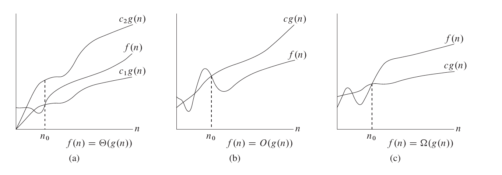

author: linehk

时间复杂度和空间复杂度是衡量一个算法效率的重要标准。

## 基本操作数

同一个算法在不同的计算机上运行的速度会有一定的差别，并且实际运行速度难以在理论上进行计算，实际去测量又比较麻烦，所以我们通常考虑的不是算法运行的实际用时，而是算法运行所需要进行的基本操作的数量。

在普通的计算机上，加减乘除、访问变量（基本数据类型的变量，下同）、给变量赋值等都可以看作基本操作。

对基本操作的计数或是估测可以作为评判算法用时的指标。

## 时间复杂度

衡量一个算法的快慢，一定要考虑数据规模的大小。所谓数据规模，一般指输入的数字个数、输入中给出的图的点数与边数等等。一般来说，数据规模越大，算法的用时就越长。而在算法竞赛中，我们衡量一个算法的效率时，最重要的不是看它在某个数据规模下的用时，而是看它的用时随数据规模而增长的趋势，即 **时间复杂度**。

考虑用时随数据规模变化的趋势的主要原因有以下几点：

1. 现代计算机每秒可以处理数亿乃至更多次基本运算，因此我们处理的数据规模通常很大。如果算法 A 在规模为 $n$ 的数据上用时为 $100n$ 而算法 B 在规模为 $n$ 的数据上用时为 $n^2$，在数据规模小于 $100$ 时算法 B 用时更短，但在一秒钟内算法 A 可以处理数百万规模的数据，而算法 B 只能处理数万规模的数据。在允许算法执行时间更久时，时间复杂度对可处理数据规模的影响就会更加明显，远大于同一数据规模下用时的影响。
2. 我们采用基本操作数来表示算法的用时，而不同的基本操作实际用时是不同的，例如加减法的用时远小于除法的用时。计算时间复杂度而忽略不同基本操作之间的区别以及一次基本操作与十次基本操作之间的区别，可以消除基本操作间用时不同的影响。

当然，算法的运行用时并非完全由输入规模决定，而是也与输入的内容相关。所以，时间复杂度又分为几种，例如：

1. 最坏时间复杂度，即每个输入规模下用时最长的输入对应的时间复杂度。在算法竞赛中，由于输入可以在给定的数据范围内任意给定，我们为保证算法能够通过某个数据范围内的任何数据，一般考虑最坏时间复杂度。
2. 平均（期望）时间复杂度，即每个输入规模下所有可能输入对应用时的平均值的复杂度（随机输入下期望用时的复杂度）。

所谓“用时随数据规模而增长的趋势”是一个模糊的概念，我们需要借助下文所介绍的 **渐进符号** 来形式化地表示时间复杂度。

## 渐进符号

简单来说，渐进符号忽略了一个函数中增长较慢的部分以及各项的系数（在时间复杂度相关分析中，系数一般被称作“常数”），而保留了可以用来表明该函数增长趋势的重要部分。

### 大 Θ 符号

对于函数 $f(n)$ 和 $g(n)$，$f(n)=\Theta(g(n))$，当且仅当 $\exists c_1,c_2,n_0>0$，使得 $\forall n \ge n_0, 0\le c_1\cdot g(n)\le f(n) \le c_2\cdot g(n)$。

也就是说，如果函数 $f(n)=\Theta(g(n))$，那么我们能找到两个正数 $c_1, c_2$ 使得 $f(n)$ 被 $c_1\cdot g(n)$ 和 $c_2\cdot g(n)$ 夹在中间。

例如，$3n^2+5n-3=\Theta(n^2)$,$n\sqrt n + n\log^5 n+m\log m+nm=\Theta(n\sqrt n+m\log m+nm)$。

### 大 O 符号

$\Theta$ 符号同时给了我们一个函数的上下界，如果只知道一个函数的渐进上界而不知道其渐进下界，可以使用 $O$ 符号。$f(n)=O(g(n))$，当且仅当 $\exists c,n_0$，使得 $\forall n \ge n_0,0\le f(n)\le c\cdot g(n)$。

研究时间复杂度时通常会使用 $O$ 符号，因为我们关注的通常是程序用时的上界，而不关心其用时的下界。

需要注意的是，这里的“上界”和“下界”是对于函数的变化趋势而言的，而不是对算法而言的。算法用时的上界对应的是“最坏时间复杂度”而非大 $O$ 记号。所以，使用 $\Theta$ 记号表示最坏时间复杂度是完全可行的，甚至可以说 $\Theta$ 比 $O$ 更加精确，而使用 $O$ 记号的主要原因，一是我们有时只能证明时间复杂度的上界而无法证明其下界（这种情况一般出现在较为复杂的算法以及复杂度分析），二是 $O$ 在电脑上输入更方便一些。

### 大 Ω 符号

同样的，我们使用 $\Omega$ 符号来描述一个函数的渐进下界。$f(n)=\Omega(g(n))$，当且仅当 $\exists c,n_0$，使得 $\forall n \ge n_0,0\le c\cdot g(n)\le f(n)$。

### 小 o 符号

如果说 $O$ 符号相当于小于等于号，那么 $o$ 符号就相当于小于号。

$f(n)=o(g(n))$，当且仅当对于任意给定的正数 $c$，$\exists n_0$，使得 $\forall n \ge n_0,0\le f(n)< c\cdot g(n)$。

### 小 ω 符号

如果说 $\Omega$ 符号相当于大于等于号，那么 $\omega$ 符号就相当于大于号。

$f(n)=\omega(g(n))$，当且仅当对于任意给定的正数 $c$，$\exists n_0$，使得 $\forall n \ge n_0,0\le c\cdot g(n)< f(n)$。



### 常见性质

- $f(n) = \Theta(g(n))\Leftrightarrow f(n)=O(g(n))\land f(n)=\Omega(g(n))$
- $f_1(n) + f_2(n) = O(\max(f_1(n), f_2(n)))$
- $f_1(n) \times f_2(n) = O(f_1(n) \times f_2(n))$
- $\forall a \neq 1, \log_a{n} = O(\log_2 n)$。由换底公式可以得知，任何对数函数无论底数为何，都具有相同的增长率，因此渐进时间复杂度中对数的底数一般省略不写。

## 简单的时间复杂度计算的例子

### for 循环

```cpp
// C++ Version
int n, m;
std::cin >> n >> m;
for (int i = 0; i < n; ++i) {
  for (int j = 0; j < n; ++j) {
    for (int k = 0; k < m; ++k) {
      std::cout << "hello world\n";
    }
  }
}
```

```python
# Python Version
n = int(input())
m = int(input())
for i in range(0, n):
    for j in range(0, n):
        for k in range(0, m):
            print("hello world")
```

如果以输入的数值 $n$ 和 $m$ 的大小作为数据规模，则上面这段代码的时间复杂度为 $\Theta(n^2m)$。

### DFS

在对一张 $n$ 个点 $m$ 条边的图进行 [DFS](../graph/dfs.md) 时，由于每个节点和每条边都只会被访问常数次，复杂度为 $\Theta(n+m)$。

## 哪些量是常量？

当我们要进行若干次操作时，如何判断这若干次操作是否影响时间复杂度呢？例如：

```cpp
// C++ Version
const int N = 100000;
for (int i = 0; i < N; ++i) {
  std::cout << "hello world\n";
}
```

```python
# Python Version
N = 100000
for i in range(0, N):
    print("hello world")
```

如果 $N$ 的大小不被看作输入规模，那么这段代码的时间复杂度就是 $O(1)$。

进行时间复杂度计算时，哪些变量被视作输入规模是很重要的，而所有和输入规模无关的量都被视作常量，计算复杂度时可当作 $1$ 来处理。

需要注意的是，在进行时间复杂度相关的理论性讨论时，“算法能够解决任何规模的问题”是一个基本假设（当然，在实际中，由于时间和存储空间有限，无法解决规模过大的问题）。因此，能在常量时间内解决数据规模有限的问题（例如，对于数据范围内的每个可能输入预先计算出答案）并不能使一个算法的时间复杂度变为 $O(1)$。

## 主定理 (Master Theorem)

我们可以使用 Master Theorem 来快速的求得关于递归算法的复杂度。
假设我们有递推关系式

$$
T(n) = a T\left(\frac{n}{b}\right)＋f(n)\qquad \forall n > b
$$

那么

$$
T(n) = \begin{cases}\Theta(n^{\log_b a}) & f(n) = O(n^{\log_b a-\epsilon}) \\ \Theta(f(n)) & f(n) = \Omega(n^{\log_b a+\epsilon}) \\ \Theta(n^{\log_b a}\log^{k+1} n) & f(n)=\Theta(n^{\log_b a}\log^k n),k\ge 0 \end{cases}
$$

## 均摊复杂度

算法往往是会对内存中的数据进行修改的，而同一个算法的多次执行，就会通过对数据的修改而互相影响。

例如快速排序中的“按大小分类”操作，单次执行的最坏时间复杂度，看似是 $O(n)$ 的。
但是由于快排的分治过程，先前的“分类”操作每次都减小了数组长度，所以实际的总复杂度 $O(n \log n)$，分摊在每一次“分类”操作上，是 $O(\log n)$。

多次操作的总复杂度除以操作次数，就是这种操作的 **均摊复杂度**。

## 势能分析

势能分析，是一种求均摊复杂度上界的方法。
求均摊复杂度，关键是表达出先前操作对当前操作的影响。势能分析用一个函数来表达此种影响。

定义“状态”$S$：即某一时刻的所有数据。*在快排的例子中，一个“状态”就是当前过程需要排序的下标区间*

定义“初始状态”$S_0$：即未进行任何操作时的状态。*在快排的例子中，“初始状态”就是整个数组*

假设存在从状态到数的函数 $F$，且对于任何状态 $S$，$F(S) \geq F(S_0)$，则有以下推论：

设 $S_1,S_2, \cdots ,S_m$ 为从 $S_0$ 开始连续做 $m$ 次操作所得的状态序列，$c_i$ 为第 $i$ 次操作的时间开销。

记 $p_i = c_i + F(S_i) - F(S_{i-1})$，则 $m$ 次操作的总时间花销为

$$
\sum_{i=1}^m p_i + F(S_0) - F(S_m)
$$

（正负相消，证明显然）

又因为 $F(S) \geq F(S_0)$，所以有

$$
\sum_{i=1}^m p_i \geq \sum_{i=1}^m c_i
$$

因此，若 $p_i = O(T(n))$，则 $O(T(n))$ 是均摊复杂度的一个上界。

势能分析使用中有很多技巧，案例在此不题。

## 空间复杂度

类似地，算法所使用的空间随输入规模变化的趋势可以用 **空间复杂度** 来衡量。

## 计算复杂性

本文内容主要是从算法分析的角度对复杂度进行了介绍，如果有兴趣的话可以在 [计算复杂性](../misc/cc-basic.md) 进行更深入的了解。
