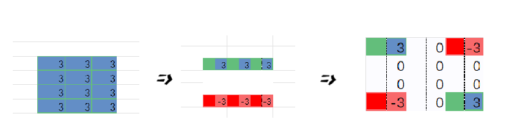

## 前置芝士（前置知识）
考虑三道单纯的模板题：

A：对于一个给定的序列a（可能非常长），反复求出其不同子序列的所有元素之和。注意：要求很多次，但不会更改序列。

B：对于一个给定的序列b（可能肥肠长），多次对其不同子序列的所有元素都加上或减去（稍加变换后亦可以考虑乘除）一个特定值，输出最终序列。

C：对于一个给定的序列c（可能比宇宙还长），多次对其不同子序列的所有元素加上或减去特定值，同时反复求出不同子序列的所有元素之和。

这三种情况在算法设计中非常有用。事实上，它们的解决方案与事件复杂度也有所相关。

A：前缀和，修改$O(n)$，查询$O(1)$

B：差分，修改$O(1)$，查询$O(n)$

C：[树状数组](../ds/fenwick.md)/[线段树](../ds/seg.md)，修改$O(n\log(n))$，查询$O(n\log(n))$

## 前缀和

### 定义

前缀和可以简单理解为「数列的前 $n$ 项的和」，是一种重要的**预处理方式**，能大大降低**查询**的时间复杂度。[^note1]

C++ 标准库中实现了前缀和函数 [`std::partial_sum`](https://zh.cppreference.com/w/cpp/algorithm/partial_sum)，定义于头文件 `<numeric>` 中。

### 例题

??? 例题
    有 $N$ 个的正整数放到数组 $A$ 里，现在要求一个新的数组 $B$，新数组的第 $i$ 个数 $B[i]$ 是原数组 $A$ 第 $0$ 到第 $i$ 个数的和。
    
    输入：
    
    ```text
    5
    1 2 3 4 5
    ```
    
    输出：
    
    ```text
    1 3 6 10 15
    ```

??? note "解题思路"
    递推：`B[0] = A[0]`，对于 $i \ge 1$ 则 `B[i] = B[i-1] + A[i]`。

??? note "参考代码"
    === "C++"
        ```cpp
        --8<-- "docs/basic/code/prefix-sum/prefix-sum_1.cpp"
        ```
    
    === "Python"
        ```python
        --8<-- "docs/basic/code/prefix-sum/prefix-sum_1.py"
        ```

### 二维/多维前缀和

多维前缀和的普通求解方法几乎都是基于容斥原理。

???+ note "示例：一维前缀和扩展到二维前缀和"
    比如我们有这样一个矩阵 $a$，可以视为二维数组：
    
    ```text
    1 2 4 3
    5 1 2 4
    6 3 5 9
    ```
    
    我们定义一个矩阵 $\textit{sum}$ 使得 $\textit{sum}_{x,y} = \sum\limits_{i=1}^x \sum\limits_{j=1}^y a_{i,j}$，  
    那么这个矩阵长这样：
    
    ```text
    1  3  7  10
    6  9  15 22
    12 18 29 45
    ```
    
    第一个问题就是递推求 $\textit{sum}$ 的过程，$\textit{sum}_{i,j} = \textit{sum}_{i - 1,j} + \textit{sum}_{i,j - 1} - \textit{sum}_{i - 1,j - 1} + a_{i,j}$。
    
    因为同时加了 $\textit{sum}_{i - 1,j}$ 和 $\textit{sum}_{i,j - 1}$，故重复了 $\textit{sum}_{i - 1,j - 1}$，减去。
    
    第二个问题就是如何应用，譬如求 $(x_1,y_1) - (x_2,y_2)$ 子矩阵的和。
    
    那么，根据类似的思考过程，易得答案为 $\textit{sum}_{x_2,y_2} - \textit{sum}_{x_1 - 1,y_2} - sum_{x_2,y_1 - 1} + sum_{x_1 - 1,y_1 - 1}$。

#### 例题

???+ note "[洛谷 P1387 最大正方形](https://www.luogu.com.cn/problem/P1387)"
    在一个 $n\times m$ 的只包含 $0$ 和 $1$ 的矩阵里找出一个不包含 $0$ 的最大正方形，输出边长。

??? note "参考代码"
    === "C++"
        ```cpp
        --8<-- "docs/basic/code/prefix-sum/prefix-sum_2.cpp"
        ```
    
    === "Python"
        ```python
        --8<-- "docs/basic/code/prefix-sum/prefix-sum_2.py"
        ```

### 基于 DP 计算高维前缀和

基于容斥原理来计算高维前缀和的方法，其优点在于形式较为简单，无需特别记忆，但当维数升高时，其复杂度较高。这里介绍一种基于 [DP](../dp/basic.md) 计算高维前缀和的方法。该方法即通常语境中所称的 **高维前缀和**（详见下文）。

### 树上前缀和

设 $\textit{sum}_i$ 表示结点 $i$ 到根节点的权值总和。  
然后：

-   若是点权，$x,y$ 路径上的和为 $\textit{sum}_x + \textit{sum}_y - \textit{sum}_\textit{lca} - \textit{sum}_{\textit{fa}_\textit{lca}}$。
-   若是边权，$x,y$ 路径上的和为 $\textit{sum}_x + \textit{sum}_y - 2\cdot\textit{sum}_{lca}$。

    LCA 的求法参见 [最近公共祖先](../graph/lca.md)。

## 差分

### 解释

差分是一种和前缀和相对的策略，可以当做是求和的逆运算。

这种策略的定义是令 $b_i=\begin{cases}a_i-a_{i-1}\,&i \in[2,n] \\ a_1\,&i=1\end{cases}$

有限微积分里通常定义$b_i = a_n-a_{n-1}$，为保持代码简洁常取$b_n=0$，并定义$b_n = a_n - a_{n-1}$

### 性质

-   $a_i$ 的值是 $b_i$ 的前缀和，即 $a_n=\sum\limits_{i=1}^nb_i$
-   计算 $a_i$ 的前缀和 $sum=\sum\limits_{i=1}^na_i=\sum\limits_{i=1}^n\sum\limits_{j=1}^{i}b_j=\sum\limits_{i=1}^n(n-i+1)b_i$

它可以维护多次对序列的一个区间加上一个数，并在最后询问某一位的数或是多次询问某一位的数。注意修改操作一定要在查询操作之前。

???+ note "示例"
    譬如使 $[l,r]$ 中的每个数加上一个 $k$，即
    
    $$
    b_l \leftarrow b_l + k,b_{r + 1} \leftarrow b_{r + 1} - k
    $$
    
    其中 $b_l+k=a_l+k-a_{l-1}$，$b_{r+1}-k=a_{r+1}-(a_r+k)$
    
    最后做一遍前缀和就好了。

C++ 标准库中实现了差分函数 [`std::adjacent_difference`](https://zh.cppreference.com/w/cpp/algorithm/adjacent_difference)，定义于头文件 `<numeric>` 中。

### 二维差分
我们已经有了二维前缀和，一定也会有**二维差分！**

对于二维前缀和的定义，已经给出

$$
\begin{array}{ll}
    sum[i][j] \\
    = sum[i-1][j] + sum[i][j-1] - sum[i-1][j-1]+a[i][j]
\end{array}
$$


整理变形得：
$$
\begin{array}{ll}
a[i][j] = \\
    +sum[i][j]\\
    -sum[i-1][j]\\
    - sum[i][j-1]\\
     + sum[i-1][j-1]
\end{array}
$$
于是得到了二维差分得递推式。

??? note "这是更新数组的方法"
    若需使得从$a[up][left]$到$a[down][right]$的所有值全部加上$\Delta a$，仅需：
    $$
    \begin{array}{ll}
        a[up][left] \gets a[up][left]+\Delta a \\
        a[up][right+1] \gets a[up][right+1]-\Delta a \\
        a[down+1][left] \gets a[down][right+1]-\Delta a \\ 
        a[down+1][right+1] \gets a[down+1][right+1]+\Delta a 
    \end{array}
    $$

[^note2]

### 二次（高阶）差分

考虑一道题，思考三秒钟，再看解析：[P4231 三步必杀](https://www.luogu.com.cn/problem/P4231)

???+ note "解析"
    *没有什么序列的加减法是一遍差分（或前缀和）解决不了的，如果有，那就**再差分一遍***

    这正好适用本题。一次“攻击”导致区间的伤害值全部增加，应当差分一遍，而伤害值是等差数列，故再次差分。

### 树上差分

树上差分可以理解为对树上的某一段路径进行差分操作，这里的路径可以类比一维数组的区间进行理解。例如在对树上的一些路径进行频繁操作，并且询问某条边或者某个点在经过操作后的值的时候，就可以运用树上差分思想了。

树上差分通常会结合 [树基础](../graph/tree-basic.md) 和 [最近公共祖先](../graph/lca.md) 来进行考察。树上差分又分为 **点差分** 与 **边差分**，在实现上会稍有不同。

#### 点差分

举例：对树上的一些路径 $\delta(s_1,t_1), \delta(s_2,t_2), \delta(s_3,t_3)\dots$ 进行访问，问一条路径 $\delta(s,t)$ 上的点被访问的次数。

对于一次 $\delta(s,t)$ 的访问，需要找到 $s$ 与 $t$ 的公共祖先，然后对这条路径上的点进行访问（点的权值加一），若采用 DFS 算法对每个点进行访问，由于有太多的路径需要访问，时间上承受不了。这里进行差分操作：

$$
\begin{aligned}
&d_s\leftarrow d_s+1\\
&d_{lca}\leftarrow d_{\textit{lca}}-1\\
&d_t\leftarrow d_t+1\\
&d_{f(\textit{lca})}\leftarrow d_{f(\textit{lca})}-1\\
\end{aligned}
$$

其中 $f(x)$ 表示 $x$ 的父亲节点，$d_i$ 为点权 $a_i$ 的差分数组。


可以认为公式中的前两条是对蓝色方框内的路径进行操作，后两条是对红色方框内的路径进行操作。不妨令 $\textit{lca}$ 左侧的直系子节点为 $\textit{left}$。那么有 $d_{\textit{lca}}-1=a_{\textit{lca}}-(a_{\textit{left}}+1)$，$d_{f(\textit{lca})}-1=a_{f(\textit{lca})}-(a_{\textit{lca}}+1)$。可以发现实际上点差分的操作和上文一维数组的差分操作是类似的。

#### 边差分

若是对路径中的边进行访问，就需要采用边差分策略了，使用以下公式：

$$
\begin{aligned}
&d_s\leftarrow d_s+1\\
&d_t\leftarrow d_t+1\\
&d_{\textit{lca}}\leftarrow d_{\textit{lca}}-2\\
\end{aligned}
$$


由于在边上直接进行差分比较困难，所以将本来应当累加到红色边上的值向下移动到附近的点里，那么操作起来也就方便了。对于公式，有了点差分的理解基础后也不难推导，同样是对两段区间进行差分。

### 例题

???+ note "[洛谷 3128 最大流](https://www.luogu.com.cn/problem/P3128)"
    FJ 给他的牛棚的 $N(2 \le N \le 50,000)$ 个隔间之间安装了 $N-1$ 根管道，隔间编号从 $1$ 到 $N$。所有隔间都被管道连通了。
    
    FJ 有 $K(1 \le K \le 100,000)$ 条运输牛奶的路线，第 $i$ 条路线从隔间 $s_i$ 运输到隔间 $t_i$。一条运输路线会给它的两个端点处的隔间以及中间途径的所有隔间带来一个单位的运输压力，你需要计算压力最大的隔间的压力是多少。

??? note "解题思路"
    需要统计每个点经过了多少次，那么就用树上差分将每一次的路径上的点加一，可以很快得到每个点经过的次数。这里采用倍增法计算 LCA，最后对 DFS 遍历整棵树，在回溯时对差分数组求和就能求得答案了。

??? note "参考代码"
    ```cpp
    --8<-- "docs/basic/code/prefix-sum/prefix-sum_3.cpp"
    ```
*** 

## 拓展 & 延申 & 探讨
### 关于高维前缀和与差分的更快求解方案与意义 & SOSDP
首先是高维前缀和与差分的几何意义，可以想到：

高维前缀和：对于一个$k$维矩形$a$，给定$m$次操作，每次操作输出$a_{e_{l,1},e_{l,2},...e_{l,k}}$到$a_{e_{r,1},e_{r,2},...e_{r,k}}$（即所有的$a_{e_1,e_2,...e_k}$满足$e_{l,i} < e_i < e_{i,r}(0<i\leq k)$）之和。

高维差分：对于一个$k$维矩形$a$，给定$m$次操作，每次操作将$a_{e_{l,1},e_{l,2},...e_{l,k}}$到$a_{e_{r,1},e_{r,2},...e_{r,k}}$（即所有的$a_{e_1,e_2,...e_k}$满足$e_{l,i} < e_i < e_{i,r}(0<i\leq k)$）的所有元素值增加或减去特定的值$\Delta a$，求最终的$a$。

而求高维前缀和与差分的最基本的思想，便是[容斥原理](../math/combinatorics/inclusion-exclusion-principle.md)。也就是：

设$S_i$为$sum_{e_1,e_2,...,e_i-1,...e_k}$
$$
\begin{aligned}
sum_{e_1,e_2,...,e_k} = a_{e_1,e_2,...,e_k}+
\left|\bigcup_{i=1}^kS_i\right|=
a_{e_1,e_2,...,e_k} + \sum_{m=0}^{n-1}(-1)^m\sum_{a_i<a_{i+1} }\left|\bigcap_{i=1}^mS_{a_i}\right|
\end{aligned}
$$
写成代码：
``` cpp
//返回原数组
std::map<std::vector<int>,int> mp,mp0;
int& get(std::vector<int> index){
    return mp[index];
}

//返回前缀和数组
int cal(std::vector<int> index)
{
    if (mp0.count(index))
        return mp0[index];

    for (int i = 0; i < index.size(); i++)
        if (index[i] == 0)
            return 0;

    int ans = 0, coef = 1;
    int k = index.size();
    int combinations = 1 << k;

    for (int mask = 1; mask < combinations; ++mask){
        std::vector<int> subIndex = index;
		for (int i = 0; i < k; ++i)
            if (mask & (1 << i))
                subIndex[i]--;
        ans += coef * cal(subIndex);
        coef *= -1;
    }

    return mp0[index] = ans + get(index);
}

```
有兴趣的同学可以用容斥原理计算一下**高维差分**。

可是，目前代码已经变得十分臃肿，解决的问题也缺乏实际意义。它的时间复杂度为$O(2^{kn})$，空间复杂度为$O(max(n,m))$，其中$m$为$get$的空间，在std::map中，它是$O(n^k)$。对于差分而言，每次都需要更改$2^k$节点，故修改时间复杂度为$O(2^k)$。

于是，有没有更简便的方法呢（不用**容斥原理**）？

**二次差分！**

*没有什么区间问题(主要☞只查询，或只修改，不然还是得用线段树或树状数组)是差分一次解决不了的，如果有，那就**再差分一遍***

如图所示（虽然有点丑，但足够说明问题），可以通过从x坐标与y坐标依次差分一次完成。于是就能变成仅需更改四个数字。同理，可以通过前缀和两次解决。

这种方法的优势在高维前缀和与差分中尤为重要。

实际意义：[^note4] [^note5]

对于所有的$i$,$0 \leq i \leq 2^n -1$，求解 $\displaystyle \sum\limits_{j \subset i} a_j$

显然，这类问题可以直接枚举子集求解，但复杂度为$O(n^3)$
。如果我们施展高维前缀和的话，复杂度可以到$O(2^n)$

设高维空间 $U$ 共有 $D$ 维，需要对 $f[\cdot]$ 求高维前缀和 $\text{sum}[\cdot]$。令 $\text{sum}[i][\text{state}]$ 表示同 $\text{state}$ 后 $D - i$ 维相同的所有点对于 $\text{state}$ 点高维前缀和的贡献。由定义可知 $\text{sum}[0][\text{state}] = f[\text{state}]$，以及 $\text{sum}[\text{state}] = \text{sum}[D][\text{state}]$。

其递推关系为 $\text{sum}[i][\text{state}] = \text{sum}[i - 1][\text{state}] + \text{sum}[i][\text{state}']$，其中 $\text{state}'$ 为第 $i$ 维恰好比 $\text{state}$ 少 $1$ 的点。该方法的复杂度为 $O(D \times |U|)$，其中 $|U|$ 为高维空间 $U$ 的大小。

一种实现的伪代码如下：

$$
\begin{array}{ll}
\textbf{for } state \\
\qquad sum[state] \gets f[state] \\
\textbf{for } i \gets 0 \textbf{ to } D \\
\qquad \textbf{for } state' \textbf{ in } \text{lexicographical order} \\
\qquad \qquad sum[state] \gets sum[state] + sum[state']
\end{array}
$$

若想了解高维前缀和（SOSDP）的更多相关信息，[点此前往。](https://www.cnblogs.com/Troverld/p/14601821.html)


上题其实有一个简单有趣的做法，值得[细细体会。](https://www.cnblogs.com/heyuhhh/p/11585358.html#:~:text=%EE%80%80%E4%BB%8A%E5%A4%A9%E4%B8%AD%E5%8D%88%E4%B8%8D%E7%9F%A5%E6%80%8E%E4%B9%88%E7%9A%84%E5%AF%B9%E8%BF%99%E4%B8%AA%E4%B8%9C%E8%A5%BF%E4%BA%A7%E7%94%9F%E4%BA%86%E5%85%B4%E8%B6%A3%EF%BC%8C%E6%84%9F%E8%A7%89%E5%BE%88%E7%A5%9E%E5%A5%87%EF%BC%8C%E7%BB%93%E6%9E%9C%E8%8A%B1%E4%BA%86%E4%B8%80%E4%B8%AA%E4%B8%AD%E5%8D%88%E5%A4%9A%E7%9A%84%E6%97%B6%E9%97%B4%E6%9D%A5%E7%9C%8BQAQ%EE%80%81。)
```cpp
for(int j = 0; j < n; j++) 
for(int i = 0; i < 1 << n; i++)
    if(i >> j & 1) f[i] += f[i ^ (1 << j)];
```

### 关于极特殊序列的前缀和与差分的实际意义以及关于非普通图形的前缀和与差分求解方法
这里推荐阅读一份[洛谷日报](https://www.luogu.com.cn/article/hgakmfz8)作为延申阅读

### 延申（Futher）：有限微积分
有限微积分是研究离散变化和连续变化之间关系的数学分支。差分是有限微积分的基本概念之一，通过计算函数在离散点上的变化量来近似其导数。在离散情况下，差分表示两个相邻数据点之间的差值，类似于连续函数中的导数。有限微积分主要研究如何利用差分方法解决离散系统中的问题，包括求解差分方程、离散积分和离散傅里叶变换。它在计算机科学、物理学、工程学等领域有广泛应用，特别是在数值分析和信号处理方面。推荐阅读《具体数学》或[洛谷日报](https://www.luogu.com.cn/article/e0cvjkua)。

## 习题

前缀和：

-   [洛谷 B3612【深进 1. 例 1】求区间和](https://www.luogu.com.cn/problem/B3612)
-   [洛谷 U69096 前缀和的逆](https://www.luogu.com.cn/problem/U69096)
-   [AtCoder joi2007ho\_a 最大の和](https://atcoder.jp/contests/joi2007ho/tasks/joi2007ho_a)
-   [「USACO16JAN」子共七 Subsequences Summing to Sevens](https://www.luogu.com.cn/problem/P3131)
-   [「USACO05JAN」Moo Volume S](https://www.luogu.com.cn/problem/P6067)

***

二维/多维前缀和：

-   [HDU 6514 Monitor](https://acm.hdu.edu.cn/showproblem.php?pid=6514)
-   [洛谷 P1387 最大正方形](https://www.luogu.com.cn/problem/P1387)
-   [「HNOI2003」激光炸弹](https://www.luogu.com.cn/problem/P2280)

***

基于 DP 计算高维前缀和：

-   [CF 165E Compatible Numbers](https://codeforces.com/contest/165/problem/E)
-   [CF 383E Vowels](https://codeforces.com/problemset/problem/383/E)
-   [ARC 100C Or Plus Max](https://atcoder.jp/contests/arc100/tasks/arc100_c)

***

树上前缀和：

-   [LOJ 10134.Dis](https://loj.ac/problem/10134)
-   [LOJ 2491. 求和](https://loj.ac/problem/2491)

***

差分：

-   [树状数组 3：区间修改，区间查询](https://loj.ac/problem/132)
-   [P3397 地毯](https://www.luogu.com.cn/problem/P3397)
-   [「Poetize6」IncDec Sequence](https://www.luogu.com.cn/problem/P4552)

***

树上差分：

-   [洛谷 3128 最大流](https://www.luogu.com.cn/problem/P3128)
-   [JLOI2014 松鼠的新家](https://loj.ac/problem/2236)
-   [NOIP2015 运输计划](http://uoj.ac/problem/150)
-   [NOIP2016 天天爱跑步](http://uoj.ac/problem/261)

***

## 参考资料与注释

[^note1]: 南海区青少年信息学奥林匹克内部训练教材]
[^note2]: [二维差分算法最细致解析](https://blog.csdn.net/Sommer001/article/details/121019319)
[^note3]: [【洛谷日报】差分与前缀和，但是加上了亿些拓展](https://www.luogu.com.cn/article/hgakmfz8)
[^note4]: [高维前缀和总结](https://www.cnblogs.com/heyuhhh/p/11585358.html#:~:text=%EE%80%80%E4%BB%8A%E5%A4%A9%E4%B8%AD%E5%8D%88%E4%B8%8D%E7%9F%A5%E6%80%8E%E4%B9%88%E7%9A%84%E5%AF%B9%E8%BF%99%E4%B8%AA%E4%B8%9C%E8%A5%BF%E4%BA%A7%E7%94%9F%E4%BA%86%E5%85%B4%E8%B6%A3%EF%BC%8C%E6%84%9F%E8%A7%89%E5%BE%88%E7%A5%9E%E5%A5%87%EF%BC%8C%E7%BB%93%E6%9E%9C%E8%8A%B1%E4%BA%86%E4%B8%80%E4%B8%AA%E4%B8%AD%E5%8D%88%E5%A4%9A%E7%9A%84%E6%97%B6%E9%97%B4%E6%9D%A5%E7%9C%8BQAQ%EE%80%81)
[^note5]: [SOSDP（子集DP）、高维前缀和、FMT（快速莫比乌斯变换）、FWT（快速沃尔什变换）学习笔记](https://www.cnblogs.com/Troverld/p/14601821.html)