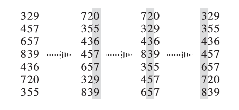

???+ warning "提醒"
    本页面要介绍的不是 [**计数排序**](./counting-sort.md)。

本页面将简要介绍基数排序。

## 定义

基数排序（英语：Radix sort）是一种非比较型的排序算法，最早用于解决卡片排序的问题。

## 过程

基数排序的工作原理是将待排序的元素拆分为 $k$ 个关键字（比较两个元素时，先比较第一关键字，如果相同再比较第二关键字……），然后先对第 $k$ 关键字进行稳定排序，再对第 $k-1$ 关键字进行稳定排序，再对第 $k-2$ 关键字进行稳定排序……最后对第一关键字进行稳定排序，这样就完成了对整个待排序序列的稳定排序。



基数排序需要借助一种 **稳定算法** 完成内层对关键字的排序。

通常而言，基数排序比基于比较的排序算法（比如快速排序）要快。但由于需要额外的内存空间，因此当内存空间稀缺时，原地置换算法（比如快速排序）或许是个更好的选择。[^ref1]

基数排序的正确性可以参考 [《算法导论（第三版）》第 8.3-3 题的解法](https://walkccc.github.io/CLRS/Chap08/8.3/#83-3) 或自行理解。

## 性质

### 稳定性

基数排序是一种稳定的排序算法。

### 时间复杂度

一般来说，如果每个关键字的值域都不大，就可以使用 [计数排序](./counting-sort.md) 作为内层排序，此时的复杂度为 $O(kn+\sum\limits_{i=1}^k w_i)$，其中 $w_i$ 为第 $i$ 关键字的值域大小。如果关键字值域很大，就可以直接使用基于比较的 $O(nk\log n)$ 排序而无需使用基数排序了。

### 空间复杂度

基数排序的空间复杂度为 $O(k+n)$。

## 算法实现

### 伪代码

$$
\begin{array}{ll}
1 & \textbf{Input. } \text{An array } A \text{ consisting of }n\text{ elements, where each element has }k\text{ keys.}\\
2 & \textbf{Output. } \text{Array }A\text{ will be sorted in nondecreasing order stably.} \\
3 & \textbf{Method. }  \\
4 & \textbf{for }i\gets k\textbf{ down to }1\\
5 & \qquad\text{sort }A\text{ into nondecreasing order by the }i\text{-th key stably}
\end{array}
$$

### C++

```cpp
const int N = 100010;
const int W = 100010;
const int K = 100;

int n, w[K], k, cnt[W];

struct Element {
  int key[K];

  bool operator<(const Element& y) const {
    // 两个元素的比较流程
    for (int i = 1; i <= k; ++i) {
      if (key[i] == y.key[i]) continue;
      return key[i] < y.key[i];
    }
    return false;
  }
} a[N], b[N];

void counting_sort(int p) {
  memset(cnt, 0, sizeof(cnt));
  for (int i = 1; i <= n; ++i) ++cnt[a[i].key[p]];
  for (int i = 1; i <= w[p]; ++i) cnt[i] += cnt[i - 1];
  // 为保证排序的稳定性，此处循环i应从n到1
  // 即当两元素关键字的值相同时，原先排在后面的元素在排序后仍应排在后面
  for (int i = n; i >= 1; --i) b[cnt[a[i].key[p]]--] = a[i];
  memcpy(a, b, sizeof(a));
}

void radix_sort() {
  for (int i = k; i >= 1; --i) {
    // 借助计数排序完成对关键字的排序
    counting_sort(i);
  }
}
```

实际上并非必须从后往前枚举才是稳定排序，只需对 `cnt` 数组进行等价于 `std::exclusive_scan` 的操作即可。

???+ note "例题 [洛谷 P1177 【模板】快速排序](https://www.luogu.com.cn/problem/P1177)"
    给出 $n$ 个正整数，从小到大输出。
    
    ```cpp
    #include <algorithm>
    #include <iostream>
    #include <utility>
    
    void radix_sort(int n, int a[]) {
      int *b = new int[n];  // 临时空间
      int *cnt = new int[1 << 8];
      int mask = (1 << 8) - 1;
      int *x = a, *y = b;
      for (int i = 0; i < 32; i += 8) {
        for (int j = 0; j != (1 << 8); ++j) cnt[j] = 0;
        for (int j = 0; j != n; ++j) ++cnt[x[j] >> i & mask];
        for (int sum = 0, j = 0; j != (1 << 8); ++j) {
          // 等价于 std::exclusive_scan(cnt, cnt + (1 << 8), cnt, 0);
          sum += cnt[j], cnt[j] = sum - cnt[j];
        }
        for (int j = 0; j != n; ++j) y[cnt[x[j] >> i & mask]++] = x[j];
        std::swap(x, y);
      }
      delete[] cnt;
      delete[] b;
    }
    
    int main() {
      std::ios::sync_with_stdio(false);
      std::cin.tie(0);
      int n;
      std::cin >> n;
      int *a = new int[n];
      for (int i = 0; i < n; ++i) std::cin >> a[i];
      radix_sort(n, a);
      for (int i = 0; i < n; ++i) std::cout << a[i] << ' ';
      delete[] a;
      return 0;
    }
    ```

## 参考资料与注释

[^ref1]: Thomas H. Cormen, Charles E. Leiserson, Ronald L. Rivest, and Clifford Stein.*Introduction to Algorithms*(3rd ed.). MIT Press and McGraw-Hill, 2009. ISBN 978-0-262-03384-8. "8.3 Radix sort", pp. 199.
