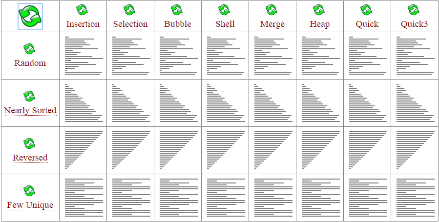

本页面将简要介绍排序算法。

## 简介

**排序算法**（英语：Sorting algorithm）是一种将一组特定的数据按某种顺序进行排列的算法。排序算法多种多样，性质也大多不同。

## 性质

### 稳定性

稳定性是指相等的元素经过排序之后相对顺序是否发生了改变。

拥有稳定性这一特性的算法会让原本有相等键值的纪录维持相对次序，即如果一个排序算法是稳定的，当有两个相等键值的纪录 $R$ 和 $S$，且在原本的列表中 $R$ 出现在 $S$ 之前，在排序过的列表中 $R$ 也将会是在 $S$ 之前。

基数排序、计数排序、插入排序、冒泡排序、归并排序是稳定排序。

选择排序、堆排序、快速排序不是稳定排序。

### 时间复杂度

主页面：[复杂度](./complexity.md)

时间复杂度用来衡量一个算法的运行时间和输入规模的关系，通常用 $O$ 表示。

简单计算复杂度的方法一般是统计“简单操作”的执行次数，有时候也可以直接数循环的层数来近似估计。

时间复杂度分为最优时间复杂度、平均时间复杂度和最坏时间复杂度。OI 竞赛中要考虑的一般是最坏时间复杂度，因为它代表的是算法运行水平的下界，在评测中不会出现更差的结果了。

基于比较的排序算法的时间复杂度下限是 $O(n\log n)$ 的。

当然也有不是 $O(n\log n)$ 的。例如，[计数排序](counting-sort.md) 的时间复杂度是 $O(n+w)$，其中 $w$ 代表输入数据的值域大小。

以下是几种排序算法的比较。

### 空间复杂度

与时间复杂度类似，空间复杂度用来描述算法空间消耗的规模。一般来说，空间复杂度越小，算法越好。

## 外部链接

- [排序算法 - 维基百科，自由的百科全书](https://zh.wikipedia.org/wiki/%E6%8E%92%E5%BA%8F%E7%AE%97%E6%B3%95)
