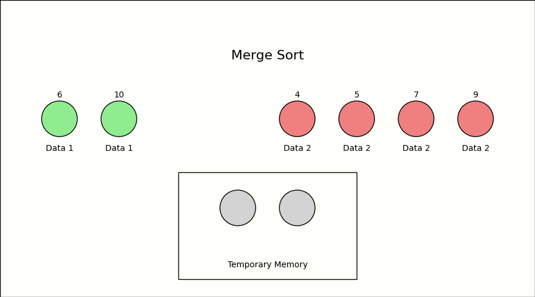

本页面将介绍 Tim 排序（Timsort），一种混合的、稳定的排序算法。

## 引入

Timsort 由 Python 核心开发者 Tim Peters 于 2002 年设计，并应用于 Python 语言，其巧妙结合了插入排序和归并排序的优点，针对数据集中的有序性进行了精确的优化，尤其适合处理包含大量部分有序子序列的数据集。自 Python 2.3 版本以来，Timsort 被选为 Python 标准库的默认排序算法，并被广泛应用于其他编程环境，例如在 Java SE 7 中被用于对非原始对象数组进行排序。

## 步骤

Timsort 的核心思想是通过识别和利用数据集中已有的有序性，提高排序效率，其主要包括以下步骤：

1.  **识别 Run**：扫描待排序数组，识别出已有的有序子序列（Run）。
2.  **扩展 Run**：如果识别的 Run 长度小于 `MIN_RUN`，则使用插入排序对其进行扩展。
3.  **归并 Run**：Timsort 维护一个特殊的栈，采用特定的归并策略将栈中已有的 Run 合并成更大的有序序列。

### 识别 Run

首先，Timsort 会从左向右扫描数组，识别出连续的有序序列，这些有序序列被称为 Run：

-   **升序 Run**：如果后一个元素大于等于前一个元素，则继续扩展 Run。
-   **降序 Run**：如果后一个元素小于前一个元素，则继续扩展 Run，随后将该 Run 反转为升序。

### 扩展 Run

为了提高小规模数据的排序效率，Timsort 引入了一个 Run 最小的长度 `MIN_RUN`。其值一般根据待排序数组的长度动态计算，通常为 $32$ 至 $64$ 之间。

-   如果识别的 Run 长度大于等于 `MIN_RUN`，则不需要额外操作，直接将 Run 压入栈中。
-   如果识别的 Run 长度小于 `MIN_RUN`，则使用二分插入排序将该 Run 的后续元素插入到 Run 中，直到 Run 的长度达到 `MIN_RUN`，然后将其压入栈中。

### 归并 Run

在 Timsort 中，归并排序是通过 **栈** 来管理和控制的。栈中保存了已经识别出的有序的 Run，并通过特定的归并规则控制栈中 Run 的合并，其目的是在合并时保持序列的平衡性和稳定性。

#### 归并规则

Timsort 是一种稳定的排序算法，即相同元素在排序后仍然保持原有的相对顺序。为确保这一点，Timsort 在归并时只会合并相邻的、连续的 Run，而不会直接合并非相邻的 Run。因为非相邻的 Run 之间可能存在相同的元素，直接合并很有可能会打乱它们的相对顺序。

同时，为了确保合并的平衡性，Timsort 引入了特定的归并规则。在每次合并操作之前，算法会检查栈顶的三个 Run X、Y 和 Z，以确保满足以下两个条件：

-   **条件一**：`len(Z) > len(Y) + len(X)`
-   **条件二**：`len(Y) > len(X)`

如果栈顶的三个 Run 不满足上述条件，Timsort 会将 Y 与 X 或 Z 中较小的一个进行合并，然后再次检查条件。一旦条件满足，则开始继续搜索新的 Run，将其添加到栈中并开始下一轮的归并。

#### 归并优化

为了在归并不同长度的 Run 时提高效率并减少空间开销，Timsort 在归并前会通过二分查找精确定位需要处理的元素范围，只对需要移动的部分进行归并，具体方式为：

1.  **确定插入点**：使用二分查找，找到第二个 Run 的第一个元素在第一个 Run 中的插入位置，以及第一个 Run 的最后一个元素在第二个 Run 中的插入位置。这样，可以缩小需要归并的范围，只对需要移动的元素进行处理。

2.  **临时缓冲区**：传统的原地合并算法效率太低，需要大量的元素移动。为了减少这种开销，Timsort 使用一个临时缓冲区，将长度较小的 Run 复制到缓冲区中，然后逐步将元素从缓冲区复制回原数组。

例如，假设存在两个 Run A 和 B，分别为：

-   Run A:$[1, 2, 3, 6, 10]$
-   Run B:$[4, 5, 7, 9, 12, 14, 17]$

通过二分查找，可以确定：

-   元素 $4$ 应插入到 Run A 的第四个位置。
-   元素 $10$ 应插入到 Run B 的第五个位置。

因此，Run A 的前 $3$ 个元素和 Run B 的后 $3$ 个元素已经在正确位置，无需处理。只需归并 Run A 的 $[6, 10]$ 和 Run B 的 $[4, 5, 7, 9]$，其归并过程如下图所示：

#### 加速模式

为进一步提升归并效率，Timsort 引入了 **加速模式（Galloping Mode）**。在标准的归并过程中，算法会逐一比较两个 Run 中的元素，将较小的元素放入结果数组。然而，如果一侧的 Run 中有大量连续元素比另一侧的当前元素要小，逐一比较会造成不必要的开销。

为了解决这一问题，Timsort 设定了一个阈值 `Min_Gallop`（默认值为 $7$）。当一侧 Run 中的元素连续比较胜利的次数达到 `Min_Gallop` 时，算法会进入加速模式，快速定位元素位置，其具体步骤如下：

1.  **指数查找**：从当前位置开始，算法以指数增长的步长 $(1, 2, 4, 8, \dots)$ 在一侧的 Run 中查找，直到找到一个区间，使得目标元素位于该区间内。
2.  **二分查找**：一旦确定了包含目标元素的区间，算法会在该区间内使用二分查找，精确定位目标元素的位置。

通过这种方式，Timsort 可以跳过大量不必要的比较，快速处理一侧 Run 中连续的、较小（或较大）的元素，将它们批量移动到合并结果中。

然而，加速模式并非在所有情况下都更高效。在某些数据分布下，加速模式可能导致更多的比较次数。为此，Timsort 采用了动态调整策略：

-   **阈值调整**：维护一个可变的 `Min_Gallop` 参数。当加速模式表现良好（即连续多次从同一 Run 中选取元素）时，`Min_Gallop` 减 $1$，鼓励继续使用加速模式；当加速模式效果不佳（频繁在两个 Run 之间切换）时，`Min_Gallop` 加 $1$，降低加速模式的使用频率。

通过动态调整 `Min_Gallop` 的值，算法能够根据实际数据情况，在普通归并模式和加速模式之间取得平衡。对于部分有序或高度有序的数据，加速模式可以显著提高效率，使 Timsort 的性能接近 $O(n)$；而对于随机数据，算法会逐渐倾向于使用普通归并，从而保证 $O(n \log n)$ 的时间复杂度。

## 复杂度

Timsort 的时间复杂度取决于数据的有序性：

-   **最优情况**：$O(n)$
    -   当数据已经有序或近似有序时，算法识别出的 Run 长度接近 $n$，归并次数减少，复杂度趋近于 $O(n)$。
-   **最坏情况**：$O(n \log n)$
    -   在数据完全无序的情况下，每一个 Run 的长度都接近 $1$，因此需要 $O(\log n)$ 次归并，每次归并的代价为 $O(n)$，总复杂度为 $O(n \log n)$。

**证明**：

-   **识别和扩展 Run**：
    -   识别 Run 需线性遍历一次数组，其复杂度为 $O(n)$。
    -   使用插入排序扩展 Run 也需线性遍历数组，其复杂度为 $O(n)$。

-   **归并 Run**：
    -   归并操作的总次数与 Run 的总数有关，最坏情况下 Run 的数量为 $n / \text{MIN\_RUN}$，由于 `MIN_RUN` 是常数，因此 Run 的数量可看作 $O(n)$。
    -   $O(n)$ 个 Run 需要进行的归并次数为 $O(\log n)$，每次归并操作的代价为 $O(n)$，因此归并操作的总复杂度为 $O(n \log n)$。

而对于空间复杂度，由于 Timsort 大致需要额外的 $O(n)$ 空间用于存储栈和临时缓冲区，因此总的空间复杂度为 $O(n)$。

## 实现

???+ note "伪代码实现"
    $$
    \begin{array}{ll}
    1 & nRemaining \gets \text{数组长度} \\
    2 & minRun \gets \text{选择合适的 MIN\_RUN 的值}(nRemaining) \\
    3 & startIndex \gets 0 \\
    4 & \textbf{while } nRemaining > 0 \ \textbf{do} \\
    5 & \qquad runLength \gets \text{识别 Run }(\text{array}, startIndex, nRemaining) \\
    6 & \qquad \textbf{if } runLength < minRun \ \textbf{then} \\
    7 & \qquad \qquad extendLength \gets \min(\text{minRun}, nRemaining) \\
    8 & \qquad \qquad \text{使用插入排序扩展区间 } [startIndex, startIndex + extendLength - 1]\\
    9 & \qquad \qquad runLength \gets extendLength \\
    10 & \qquad \textbf{end if} \\
    11 & \qquad \text{将 Run  } (startIndex, runLength) \text{ 压入栈中} \\
    12 & \qquad \textbf{调用 } \text{mergeCollapse(栈)} \ \text{检查并合并栈中的 Run } \\
    13 & \qquad startIndex \gets startIndex + runLength \ \text{更新起始位置} \\
    14 & \qquad nRemaining \gets nRemaining - runLength \ \text{更新剩余长度} \\
    15 & \textbf{end while} \\
    16 & \textbf{调用 } \text{mergeForceCollapse(栈)} \ \text{对栈中所有 Run 进行最终的合并} \\
    \end{array}
    $$

## 参考资料

1.  [Timsort](https://en.wikipedia.org/wiki/Timsort)
2.  [On the Worst-Case Complexity of TimSort](https://drops.dagstuhl.de/opus/volltexte/2018/9467/pdf/LIPIcs-ESA-2018-4.pdf)
3.  [Original Explanation by Tim Peters](https://bugs.python.org/file4451/timsort.txt)
4.  [Java 实现](https://web.archive.org/web/20150716000631/https://android.googlesource.com/platform/libcore/+/gingerbread/luni/src/main/java/java/util/TimSort.java)
5.  [C 语言实现](http://svn.python.org/projects/python/trunk/Objects/listobject.c)
