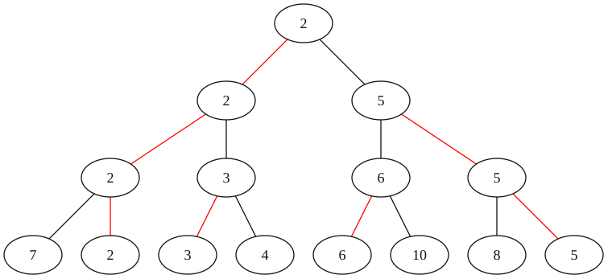
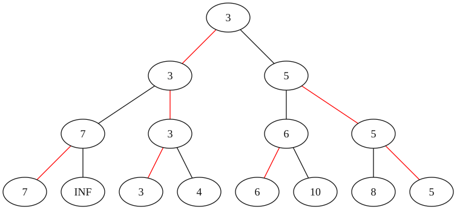

本页面将简要介绍锦标赛排序．

## 定义

锦标赛排序（英文：Tournament sort），又被称为树形选择排序，是 [选择排序](./selection-sort.md) 的优化版本，[堆排序](./heap-sort.md) 的一种变体（均采用完全二叉树）．它在选择排序的基础上使用优先队列查找下一个该选择的元素．

## 引入

锦标赛排序的名字来源于单败淘汰制的竞赛形式．在这种赛制中有许多选手参与比赛，他们两两比较，胜者进入下一轮比赛．这种淘汰方式能够决定最好的选手，但是在最后一轮比赛中被淘汰的选手不一定是第二好的——他可能不如先前被淘汰的选手．

## 过程

以 **最小锦标赛排序树** 为例：



待排序元素是叶子节点显示的元素．红色边显示的是每一轮比较中较小的元素的胜出路径．显然，完成一次「锦标赛」可以选出一组元素中最小的那一个．

每一轮对 $n$ 个元素进行比较后可以得到 $\left\lceil\dfrac{n}{2}\right\rceil$ 个「优胜者」，每一对中较小的元素进入下一轮比较．如果无法凑齐一对元素，那么这个元素直接进入下一轮的比较．



完成一次「锦标赛」后需要将被选出的元素去除．直接将其设置为 $\infty$（这个操作类似 [堆排序](./heap-sort.md)），然后再次举行「锦标赛」选出次小的元素．

之后一直重复这个操作，直至所有元素有序．

## 性质

### 稳定性

锦标赛排序是一种不稳定的排序算法．

### 时间复杂度

锦标赛排序的最优时间复杂度、平均时间复杂度和最坏时间复杂度均为 $O(n\log n)$．它用 $O(n)$ 的时间初始化「锦标赛」，然后用 $O(\log n)$ 的时间从 $n$ 个元素中选取一个元素．

### 空间复杂度

锦标赛排序的空间复杂度为 $O(n)$．

## 实现

=== "C++"
    ```cpp
    --8<-- "docs/basic/code/tournament-sort/tournament-sort_1.cpp:sort"
    ```

=== "Python"
    ```python
    --8<-- "docs/basic/code/tournament-sort/tournament-sort_1.py:sort"
    ```

## 外部链接

-   [Tournament sort - Wikipedia](https://en.wikipedia.org/wiki/Tournament_sort)
