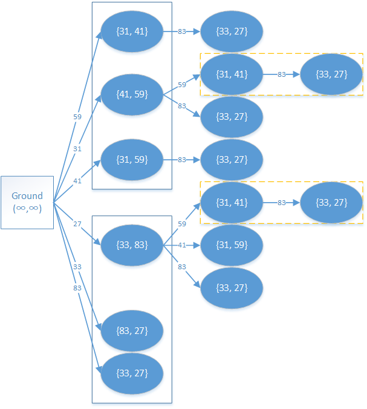

DAG 即 [有向无环图](../graph/dag.md)，一些实际问题中的二元关系都可使用 DAG 来建模。

## 例子

以这道题为例子，来分析一下 DAG 建模的过程。

???+note " 例题 [UVa 437 巴比伦塔 The Tower of Babylon](https://cn.vjudge.net/problem/UVA-437)"
    有 $n (n\leqslant 30)$ 种砖块，已知三条边长，每种都有无穷多个。要求选一些立方体摞成一根尽量高的柱子（每个砖块可以自行选择一条边作为高），使得每个砖块的底面长宽分别严格小于它下方砖块的底面长宽，求塔的最大高度。

### 建立 DAG

由于每个砖块的底面长宽分别严格小于它下方砖块的底面长宽，因此不难将这样一种关系作为建图的依据，而本题也就转化为最长路问题。

也就是说如果砖块 $j$ 能放在砖块 $i$ 上，那么 $i$ 和 $j$ 之间存在一条边 $(i, j)$，且边权就是砖块 $j$ 所选取的高。

本题的另一个问题在于每个砖块的高有三种选法，怎样建图更合适呢？

不妨将每个砖块拆解为三种堆叠方式，即将一个砖块分解为三个砖块，每一个拆解得到的砖块都选取不同的高。

初始的起点是大地，大地的底面是无穷大的，则大地可达任意砖块，当然我们写程序时不必特意写上无穷大。

假设有两个砖块，三条边分别为 $31, 41, 59$ 和 $33, 83, 27$，那么整张 DAG 应该如下图所示。

图中蓝实框所表示的是一个砖块拆解得到的一组砖块，之所以用 $\{\}$ 表示底面边长，是因为砖块一旦选取了高，底面边长就是无序的。

图中黄虚框表示的是重复计算部分，为下文做铺垫。

### 转移

题目要求的是塔的最大高度，已经转化为最长路问题，其起点上文已指出是大地，那么终点呢？

显然终点已经自然确定，那就是某砖块上不能再搭别的砖块的时候。

之前在图上标记的黄虚框表明有重复计算，下面我们开始考虑转移方程。

显然，砖块一旦选取了高，那么这块砖块上最大能放的高度是确定的。

某个砖块 $i$ 有三种堆叠方式分别记为 $0, 1, 2$，那么对于砖块 $i$ 和其堆叠方式 $r$ 来说则有如下转移方程

$d(i, r) = \max\left\{d(j, r') + h'\right\}$

其中 $j$ 是所有那些在砖块 $i$ 以 $r$ 方式堆叠时可放上的砖块，$r'$ 对应 $j$ 此时的摆放方式，也就确定了此时唯一的高度 $h'$。

在实际编写时，将所有 $d(i, r)$ 都初始化为 $-1$，表示未计算过。

在试图计算前，如果发现已经计算过，直接返回保存的值；否则就按步计算，并保存。

最终答案是所有 $d(i, r)$ 的最大值。

### 题解

```cpp
#include <cstring>
#include <iostream>
#define MAXN (30 + 5)
#define MAXV (500 + 5)
#define MAX(a, b) (((a) > (b)) ? (a) : (b))
int d[MAXN][3];
int x[MAXN], y[MAXN], z[MAXN];
int babylon_sub(int c, int rot, int n) {
  if (d[c][rot] != -1) {
    return d[c][rot];
  }
  d[c][rot] = 0;
  int base1, base2;
  if (rot == 0) {
    base1 = x[c];
    base2 = y[c];
  }
  if (rot == 1) {
    base1 = y[c];
    base2 = z[c];
  }
  if (rot == 2) {
    base1 = x[c];
    base2 = z[c];
  }
  for (int i = 0; i < n; i++) {
    if ((x[i] < base1 && y[i] < base2) || (y[i] < base1 && x[i] < base2))
      d[c][rot] = MAX(d[c][rot], babylon_sub(i, 0, n) + z[i]);
    if ((y[i] < base1 && z[i] < base2) || (z[i] < base1 && y[i] < base2))
      d[c][rot] = MAX(d[c][rot], babylon_sub(i, 1, n) + x[i]);
    if ((x[i] < base1 && z[i] < base2) || (z[i] < base1 && x[i] < base2))
      d[c][rot] = MAX(d[c][rot], babylon_sub(i, 2, n) + y[i]);
  }
  return d[c][rot];
}
int babylon(int n) {
  for (int i = 0; i < n; i++) {
    d[i][0] = -1;
    d[i][1] = -1;
    d[i][2] = -1;
  }
  int r = 0;
  for (int i = 0; i < n; i++) {
    r = MAX(r, babylon_sub(i, 0, n) + z[i]);
    r = MAX(r, babylon_sub(i, 1, n) + x[i]);
    r = MAX(r, babylon_sub(i, 2, n) + y[i]);
  }
  return r;
}
int main() {
  int t = 0;
  while (true) {
    int n;
    std::cin >> n;
    if (n == 0) break;
    t++;
    for (int i = 0; i < n; i++) {
      std::cin >> x[i] >> y[i] >> z[i];
    }
    std::cout << "Case " << t << ":"
              << " maximum height = " << babylon(n);
    std::cout << std::endl;
  }
  return 0;
}
```
