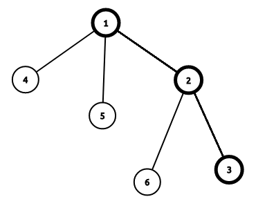

在学习本章前请确认你已经学习了 [矩阵](../math/matrix.md) [树链剖分](../graph/hld.md)。

动态 DP 问题是猫锟在 WC2018 讲的黑科技，一般用来解决树上的 DP 问题，同时支持点权（边权）修改操作。

在 NOIP2018D2T3 考察后风靡 OI 圈。

## 例子

以这道模板题为例子讲解一下动态 DP 的过程。

???+note " 例题 [洛谷 P4719 【模板】动态 DP](https://www.luogu.com.cn/problem/P4719) "
    给定一棵 $n$ 个点的树，点带点权。有 $m$ 次操作，每次操作给定 $x,y$ 表示修改点 $x$ 的权值为 $y$。你需要在每次操作之后求出这棵树的最大权独立集的权值大小。

### 广义矩阵乘法

定义广义矩阵乘法 $A\times B=C$ 为：

$$
C_{i,j}=\max_{k=1}^{n}(A_{i,k}+B_{k,j})
$$

相当于将普通的矩阵乘法中的乘变为加，加变为 $\max$ 操作。

同时广义矩阵乘法满足结合律，所以可以使用矩阵快速幂。

### 不带修改操作

令 $f_{i,0}$ 表示不选择 $i$ 的最大答案，$f_{i,1}$ 表示选择 $i$ 的最大答案。

则有 DP 方程：

$$
\begin{cases}f_{i,0}=\sum_{son}\max(f_{son,0},f_{son,1})\\f_{i,1}=w_i+\sum_{son}f_{son,0}\end{cases}
$$

答案就是 $\max(f_{root,0},f_{root,1})$.

### 带修改操作

首先将这棵树进行树链剖分，假设有这样一条重链：



设 $g_{i,0}$ 表示不选择 $i$ 且只允许选择 $i$ 的轻儿子所在子树的最大答案，$g_{i,1}$ 表示选择 $i$ 的最大答案，$son_i$ 表示 $i$ 的重儿子。

假设我们已知 $g_{i,0/1}$ 那么有 DP 方程：

$$
\begin{cases}f_{i,0}=g_{i,0}+\max(f_{son_i,0},f_{son_i,1})\\f_{i,1}=g_{i,1}+f_{son_i,0}\end{cases}
$$

答案是 $\max(f_{root,0},f_{root,1})$.

可以构造出矩阵：

$$
\begin{bmatrix}
g_{i,0} & g_{i,0}\\
g_{i,1} & -\infty
\end{bmatrix}\times 
\begin{bmatrix}
f_{son_i,0}\\f_{son_i,1}
\end{bmatrix}=
\begin{bmatrix}
f_{i,0}\\f_{i,1}
\end{bmatrix}
$$

注意，我们这里使用的是广义乘法规则。

可以发现，修改操作时只需要修改 $g_{i,1}$ 和每条往上的重链即可。

### 具体思路

1. DFS 预处理求出 $f_{i,0/1}$ 和 $g_{i,0/1}$.

2. 对这棵树进行树剖（注意，因为我们对一个点进行询问需要计算从该点到该点所在的重链末尾的区间矩阵乘，所以对于每一个点记录 $End_i$ 表示 $i$ 所在的重链末尾节点编号），每一条重链建立线段树，线段树维护 $g$ 矩阵和 $g$ 矩阵区间乘积。

3. 修改时首先修改 $g_{i,1}$ 和线段树中 $i$ 节点的矩阵，计算 $top_i$ 矩阵的变化量，修改到 $fa_{top_i}$ 矩阵。

4. 查询时就是 1 到其所在的重链末尾的区间乘，最后取一个 $\max$ 即可。

??? note "代码实现"
    ```c++
    #include <bits/stdc++.h>
    
    using namespace std;
    
    #define REP(i, a, b) for (int i = (a), _end_ = (b); i <= _end_; ++i)
    #define mem(a) memset((a), 0, sizeof(a))
    #define str(a) strlen(a)
    #define lson root << 1
    #define rson root << 1 | 1
    typedef long long LL;
    
    const int maxn = 500010;
    const int INF = 0x3f3f3f3f;
    
    int Begin[maxn], Next[maxn], To[maxn], e, n, m;
    int size[maxn], son[maxn], top[maxn], fa[maxn], dis[maxn], p[maxn], id[maxn],
        End[maxn];
    // p[i]表示i树剖后的编号，id[p[i]] = i
    int cnt, tot, a[maxn], f[maxn][2];
    
    struct matrix {
      int g[2][2];
      matrix() { memset(g, 0, sizeof(g)); }
      matrix operator*(const matrix &b) const  // 重载矩阵乘
      {
        matrix c;
        REP(i, 0, 1)
        REP(j, 0, 1) REP(k, 0, 1) c.g[i][j] = max(c.g[i][j], g[i][k] + b.g[k][j]);
        return c;
      }
    } Tree[maxn], g[maxn];  // Tree[]是建出来的线段树，g[]是维护的每个点的矩阵
    
    inline void PushUp(int root) { Tree[root] = Tree[lson] * Tree[rson]; }
    
    inline void Build(int root, int l, int r) {
      if (l == r) {
        Tree[root] = g[id[l]];
        return;
      }
      int Mid = l + r >> 1;
      Build(lson, l, Mid);
      Build(rson, Mid + 1, r);
      PushUp(root);
    }
    
    inline matrix Query(int root, int l, int r, int L, int R) {
      if (L <= l && r <= R) return Tree[root];
      int Mid = l + r >> 1;
      if (R <= Mid) return Query(lson, l, Mid, L, R);
      if (Mid < L) return Query(rson, Mid + 1, r, L, R);
      return Query(lson, l, Mid, L, R) * Query(rson, Mid + 1, r, L, R);
      // 注意查询操作的书写
    }
    
    inline void Modify(int root, int l, int r, int pos) {
      if (l == r) {
        Tree[root] = g[id[l]];
        return;
      }
      int Mid = l + r >> 1;
      if (pos <= Mid)
        Modify(lson, l, Mid, pos);
      else
        Modify(rson, Mid + 1, r, pos);
      PushUp(root);
    }
    
    inline void Update(int x, int val) {
      g[x].g[1][0] += val - a[x];
      a[x] = val;
      // 首先修改x的g矩阵
      while (x) {
        matrix last = Query(1, 1, n, p[top[x]], End[top[x]]);
        // 查询top[x]的原本g矩阵
        Modify(1, 1, n,
               p[x]);  // 进行修改(x点的g矩阵已经进行修改但线段树上的未进行修改)
        matrix now = Query(1, 1, n, p[top[x]], End[top[x]]);
        // 查询top[x]的新g矩阵
        x = fa[top[x]];
        g[x].g[0][0] +=
            max(now.g[0][0], now.g[1][0]) - max(last.g[0][0], last.g[1][0]);
        g[x].g[0][1] = g[x].g[0][0];
        g[x].g[1][0] += now.g[0][0] - last.g[0][0];
        // 根据变化量修改fa[top[x]]的g矩阵
      }
    }
    
    inline void add(int u, int v) {
      To[++e] = v;
      Next[e] = Begin[u];
      Begin[u] = e;
    }
    
    inline void DFS1(int u) {
      size[u] = 1;
      int Max = 0;
      f[u][1] = a[u];
      for (int i = Begin[u]; i; i = Next[i]) {
        int v = To[i];
        if (v == fa[u]) continue;
        dis[v] = dis[u] + 1;
        fa[v] = u;
        DFS1(v);
        size[u] += size[v];
        if (size[v] > Max) {
          Max = size[v];
          son[u] = v;
        }
        f[u][1] += f[v][0];
        f[u][0] += max(f[v][0], f[v][1]);
        // DFS1过程中同时求出f[i][0/1]
      }
    }
    
    inline void DFS2(int u, int t) {
      top[u] = t;
      p[u] = ++cnt;
      id[cnt] = u;
      End[t] = cnt;
      g[u].g[1][0] = a[u];
      g[u].g[1][1] = -INF;
      if (!son[u]) return;
      DFS2(son[u], t);
      for (int i = Begin[u]; i; i = Next[i]) {
        int v = To[i];
        if (v == fa[u] || v == son[u]) continue;
        DFS2(v, v);
        g[u].g[0][0] += max(f[v][0], f[v][1]);
        g[u].g[1][0] += f[v][0];
        // g矩阵根据f[i][0/1]求出
      }
      g[u].g[0][1] = g[u].g[0][0];
    }
    
    int main() {
    #ifndef ONLINE_JUDGE
      freopen("input.txt", "r", stdin);
      freopen("output.txt", "w", stdout);
    #endif
      scanf("%d%d", &n, &m);
      REP(i, 1, n) scanf("%d", &a[i]);
      REP(i, 1, n - 1) {
        int u, v;
        scanf("%d%d", &u, &v);
        add(u, v);
        add(v, u);
      }
      dis[1] = 1;
      DFS1(1);
      DFS2(1, 1);
      Build(1, 1, n);
      REP(i, 1, m) {
        int x, val;
        scanf("%d%d", &x, &val);
        Update(x, val);
        matrix ans = Query(1, 1, n, 1, End[1]);  // 查询1所在重链的矩阵乘
        printf("%d\n", max(ans.g[0][0], ans.g[1][0]));
      }
      return 0;
    }
    ```

## 习题

[SPOJ GSS3 - Can you answer these queries III](https://www.spoj.com/problems/GSS3/)

[「NOIP2018」保卫王国](https://loj.ac/p/2955)

[「SDOI2017」切树游戏](https://loj.ac/p/2269)
