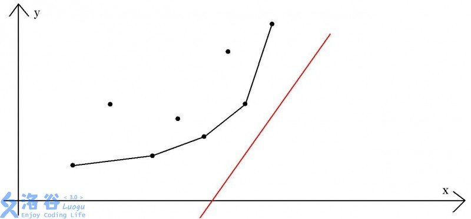

本章主要讲解动态规划的几种基础 ** 优化 ** 方法。

## 二进制优化解多重背包

??? note "例题 [经典问题 - 多重背包](https://oi-wiki.org/dp/backpack/#_3)"
    题目大意：有 $n$ 种物品，每种物品有 $a_i$ 件，购买一件这种物品的费用为 $c_i$，价值为 $v_i$。有一个容量为 $t$ 的背包，现在让你找到最优的一种方案，使得装入背包的物品的总价值最大。

考虑常规的动规方式，定义 $f_{i,j}$ 为当前考虑到第 $i$ 个物品，背包容量为 $j$ 所能获得的最大价值。

状态转移方程为， $f_{i,j}=\max\{f_{i-1,j},f_{i-1,j-c_i}+v_i\}$。

对于 ** 每件 ** 物品，都要这样循环一次，时间复杂度为 $t\times \sum_{i=1}^n a_i$，某些时候可能不可接受，需要优化。

考虑这样一种情况，如果我们有 $17$ 个硬币，要去买 $1$ 到 $17$ 元钱的物品，只需将这些硬币打包成 $1,2,4,8$ 和 $2$ 这样的几包。前面的 $4$ 包能保证覆盖 $1$ 到 $15$ 所有的情况，最后一包在之前的基础上再加上一个值，能保证实现支付的时候取整包，肯定能保证支付。这就是二进制优化的原理和基本思想。

用上述的方法，就可以把 $k$ 件相同的物品看作是 $O(log_2 k)$ 件物品了。优化后

代码实现：

```cpp
for(int i=1;i<=n;i++)
{
	scanf("%d",a+i);
	tot+=c[i]*a[i];
	for(int j=1;j<=a[i];j*=2)if(a[i]>=j)a[i]-=j,v[++cur]=c[i]*j;
	if(a[i])v[++cur]=c[i]*a[i];
}
for(int i=1;i<=cur;i++)for(int j=m;j>=v[i];j--)if(f[j-v[i]])f[j]=true;
```

## 几道练习题

[HDU 2844 Coins](http://acm.hdu.edu.cn/showproblem.php?pid=2844)

## 单调队列 & 单调栈优化

学习本节前，请务必先学习 [单调队列](https://oi-wiki.org/ds/monotonous-queue/)。

??? note "例题 [CF372C Watching Fireworks is Fun](http://codeforces.com/problemset/problem/372/C)"
    题目大意：城镇中有 $n$ 个位置，有 $m$ 个烟花要放。第 $i$ 个烟花放出的时间记为 $t_i$，放出的位置记为 $a_i$。如果烟花放出的时候，你处在位置 $x$，那么你将收获 $b_i-|a_i-x|$ 点快乐值。
初始你可在任意位置，你每个单位时间可以移动不大于 $d$ 个单位距离。现在你需要最大化你能获得的快乐值。

设 $f_{i,j}$ 表示在放第 $i$ 个烟花时，你的位置在 $j$ 所能获得的最大快乐值。

写出 ** 状态转移方程 ** ：$f_{i,j}=\max\{f_{i-1,k}+b_i-|a_i-j|\}$

这里的 $k$ 是有范围的，$j-(t_{i+1}-t_i)\times d\le k\le j+(t_{i+1}-t_i)\times d$。

我们尝试将状态转移方程进行变形：

由于 $\max$ 里出现了一个确定的常量 $b_i$，我们可以将它提到外面去。

$f_{i,j}=\max\{f_{i-1,k}+b_i+|a_i-j|\}=\max\{f_{i-1,k}-|a_i-j|\}+b_i$

如果确定了 $i$ 和 $j$ 的值，那么 $|a_i-j|$ 的值也是确定的，也可以将这一部分提到外面去。

最后，式子变成了这个样子：$f_{i,j}=\max\{f_{i-1,k}-|a_i-j|\}+b_i=\max\{f_{i-1,k}\}-|a_i-j|+b_i$

看到这一熟悉的形式，我们想到了什么？** 单调队列优化 **。由于最终式子中的 $\max$ 只和上一状态中连续的一段的最大值有关，所以我们在计算一个新的 $i$ 的状态值时候只需将原来的 $f_{i-1}$ 构造成一个单调队列，并维护单调队列，使得其能在均摊 $O(1)$ 的时间复杂度内计算出 $\max\{f_{i-1,k}\}$ 的值，从而根据公式计算出 $f_{i,j}$ 的值。

总的时间复杂度为 $O(n\times m)$。

讲完了，让我们归纳一下单调队列优化动态规划问题的基本形态：当前状态的所有值可以从上一个状态的某个连续的段的值得到，要对这个连续的段进行 RMQ 操作，相邻状态的段的左右区间满足非降的关系。

### 几道练习题：

[luogu P1886 滑动窗口](https://www.luogu.org/problemnew/show/P1886)

[luogu P2254 \[NOI2005\] 瑰丽华尔兹](https://www.luogu.org/problemnew/show/P2254)

[luogu P2569 \[SCOI2010\] 股票交易](https://www.luogu.org/problemnew/show/P2569)

## 斜率优化

??? note "例题 [luogu P3195 \[HNOI2008\] 玩具装箱 TOY](https://www.luogu.org/problemnew/show/P3195)"
    令 $f_i$ 表示前 $i$ 个物品，随意分组装在任意多个容器里所能得到的最小费用。

写出 ** 状态转移方程 ** ：$f_i=max\{f_j+(pre_i-pre_i+i-j-1-L)^2\}$ ，其中 $pre_i$ 表示前 $i$ 个数的前缀和。

换元试图简化状态转移方程式： 令 $s_i=pre_i+i,L'=L+1$，则 $f_i=f_j+(s_i-s_j-L')^2$，展开，移项得

$f_i=f_j+(s_i-s_j-L')^2$

$f_i+2\times s_i\times (s_j+L')=f_j+s_i^2+(s_j+L')^2$

我们观察到，式子的右端的所有项都只和 $i$ 有关或只和 $j$ 有关，式子左端的第一项是我们要求的目标值，式子左端的其余项都同时和 $i$ 和 $j$ 有关。我们将这个式子看作一条直线的函数解析式，形如 $b+k\times x=y$ ，和上式一一对应。我们发现如果我们要最小化 $f_i$ ，也就是说要最小化这个直线的截距，而对于每个确定的 $i$，这个直线的斜率 $s_i$ 都是确定的。



如图，我们将这个斜率固定的直线从下往上平移，直到有一个点在这条直线上，然后将新的点加入点集，这样肯定能保证所有的直线的斜率都是单调递升的（因为如果新的直线斜率小于斜率最大的直线，那么其一定不成被选择成为新的决策），所以我们相当于维护了一个下凸包。（如果求的是 $\max$ 那么就要维护一个 ** 上凸包 ** 。这种东西要具体情况具体分析，如果直线的斜率不满足单调性，那就要维护整个凸包 / 二分等奇技淫巧。）

可以用单调队列维护下凸包。

### 几道练习题：

[luogu P4072 \[SDOI2016\] 征途](https://www.luogu.org/problemnew/show/P4072)

[luogu P2120 \[ZJOI2007\] 仓库建设](https://www.luogu.org/problemnew/show/P2120)

[luogu P3628 \[APIO2010\] 特别行动队](https://www.luogu.org/problemnew/show/P3628)

[bzoj 4709 \[Jsoi2011\] 柠檬](https://www.lydsy.com/JudgeOnline/problem.php?id=4709)

[CF311B Cats Transport](http://codeforces.com/problemset/problem/311/B)

[luogu P4027 \[NOI2007\] 货币兑换](https://www.luogu.org/problemnew/show/P4027)

## 四边形不等式优化

??? note "例题 [luogu P1880 \[NOI1995\] 石子合并](https://www.luogu.org/problemnew/show/P1880)"
    题目大意：在一个环上有 $n$ 个数，进行 $n-1$ 次合并操作，每次操作将相邻的两堆合并成一堆，能获得新的一堆中的石子数量的和的得分。你需要最大化你的得分。

我们首先 ** 破环成链 ** ，然后进行动态规划。设 $f_{i,j}$ 表示从位置 $i$ 合并到位置 $j$ 所能得到的最大得分， $sum_i$ 为前 $i$ 堆石子数的前缀和。

写出 ** 状态转移方程 ** ： $f_{i,j}=\max\{f_{i,k}+f_{k+1,j}+(sum_j-sum_i)\}(i\le k\le j)$

考虑常规的转移方法，枚举 $i$、$j$ 和 $k$，时间复杂度为 $O(n^3)$。

### 什么是四边形不等式？

对于 $a<b\le c<d$，如果有$f_{a,c}+f_{b,d}\le f_{b,c}+f_{a,d}$，则称该数组满足四边形不等式，可以用通俗的方法表述为 “交叉小于包含”。

两个定理：

1. 四边形不等式能优化的状态转移方程能表示为 $f_{i,j}=\max\{f_{i,k}+f_{k+1,j}+cost(i,j)\}(i\le k\le j)$。如果 $cost$ 函数同时满足单调性和四边形不等式，那么数组 $f$ 也满足四边形不等式。

2. 定义 $idx_{i,j}$ 为在转移 $f_{i,j}$ 的过程中在 $k=idx_{i,j}$ 时取得最小值，那么有如下定理：

	如果 $f$ 数组满足四边形不等式，那么 $idx$ 函数满足单调性，即有 $idx_{i,j}\le idx_{i,j+1}\le idx_{i+1,j+1}$ 。

证明会和题目解法一起 $qwq$ 

### 回到题目

第一步：证明 $cost$ 满足四边形不等式

要证明，对于所有满足 $i<i+1\le j<j+1$ 的 $i,j$ ， 均有 $cost_{i,j}+cost_{i+1,j+1}\le cost_{i+1,j}+cost_{i,j+1}$。

移项得 $cost_{i,j}-cost_{i+1,j}\le cost_{i,j+1}-cost_{i+1,j+1}$

设 $F(j)=cost_{i,j}-cost{i+1,j}$ ，如果要使这个四边形不等式成立，那么就要证明 $F(j)$ 单调非降。

在本题中， $F(j)=(sum_j-sum_{i-1})-(sum_j-sum_i)=sum_i-sum_{i-1}=a_i$ ，与 $j$ 无关，自然一定满足四边形不等式。

证毕。

第二步：证明 $f$ 满足四边形不等式

同样的，应有如下结论：对于所有满足 $i<i+1\le j<j+1$ 的 $i,j$ ， 均有 $f_{i,j}+f_{i+1,j+1}\le f_{i+1,j}+f_{i,j+1}$

我们假设 $x=idx_{i+1,j},y=idx_{i,j+1}$。不妨设 $x<=y$。

将 $x,y$ 带入得，$f_{i,j}+f_{i+1,j+1}=f_{i,x}+f_{x+1,j}+cost_{i,j}+f_{i+1,y}+f_{y+1,j+1}+cost_{i+1,j+1}$

由于上一步已经证明出了$cost$满足四边形不等式，而该不等式的左边在上式出现过，将其替换得

$$
\begin{aligned}
&&f_{i,\,x}+f_{x+1,\,j}+cost_{i,\,j}+f_{i+1,\,y}+f_{y+1,\,j+1}+cost_{i+1,\,j+1}\\
&\le&f_{i,\,x}+f_{x+1,\,j+1}+cost_{i,\,j+1}+f_{i+1,\,y}+f_{y+1,\,j}+cost_{i+1,\,j}\\
\end{aligned}
$$

消去公共项可得 $f_{i,j}+f_{i+1,j+1}\le f_{i+1,j}+f_{i,j+1}$

证毕。

第三步：证明决策的单调性

现在我们已经证明了 $cost$ 和 $f$ 满足四边形不等式，要证明决策的单调性以证明优化的正确性。

即证 $idx_{i,j-1}\le idx_{i,j}\le idx_{i+1,j}$

我们只证明式子的前半部分，后半部分可以有类似的方法推出。

设 $y=idx_{i,j-1},x\le y$ ，因为 $x+1\le y+1\le j-1<j$，由四边形不等式可得，

$f_{x+1,j-1}+f_{y+1,j}\le f_{y+1,j-1}+f_{x+1,j}$

由于我们是令 $y=idx_{i,j-1},x\le y$ 时 $f_{i,j-1}$ 取得最小值，那么 $f_{i,j-1}(idx_{i,j-1}=x)$ 一定大于等于 $f_{i,j-1}(idx_{i,j-1}=y)$ ，所以对于 $f_{i,j-1}$ 可以取到最优值的 $y$ ，所有小于它的值，对于 $f_{i,j}$ 来说，都没有 $y$ 优，所以最优决策一定不是小于 $y$ 的，那么一定有 
$idx_{i,j-1}\le idx_{i,j}$ 

证毕。

### 说了这么多，怎么进行状态转移呢？

给出核心代码：

```cpp
for(int i=n;i>=1;i--)
{
	for(int j=i+1;j<=n;j++)
	{
		f[i][j]=inf;
		for(int k=s[i][j-1];k<=s[i+1][j];k++)
		{
			if(f[i][j]<f[i][k]+f[k+1][j]+sum[j]-sum[i-1])
			{
				f[i][j]=f[i][k]+f[k+1][j]+sum[j]-sum[i-1];
				idx[i][j]=k;
			}
		}
	}
}
```

注意：由于在计算 $f_{i,j}$ 的时候需要知道 $idx_{i,j-1}$ 和 $idx_{i+1,j}$ 的值，所以 $i$ 的循环逆序。

### 时间复杂度证明

计算 $f_{i,j}$ 时，我们要循环 $idx_{i+1,j}-idx_{i,j-1}$ 次，那么一共加起来会循环多少次呢？

因为 $\sum_{i=1}^{n-1}(idx_{i+1,i+1}-idx_{i,i})=idx_{n,n}-idx_{1,1}$ 很显然和 $n$ 同阶，那么它的 $n$ 倍就和 $n^2$ 同阶，时间复杂度是 $O(n^2)$。

### 一道练习题：

[luogu P4767 \[IOI2000\] 邮局](https://www.luogu.org/problemnew/show/P4767)

### 参考资料

[NOIAu 的 CSDN 博客](https://blog.csdn.net/noiau/article/details/72514812)
