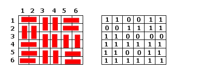

有些 [状压 DP](./state.md) 问题要求我们记录状态的连通性信息，这类问题一般被形象的称为插头 DP 或连通性状态压缩 DP，她们通常需要我们对状态的连通性进行编码，逐格讨论状态转移中连通性的变化。

## 骨牌覆盖与轮廓线 DP

温故而知新，在开始学习插头 DP 之前，不妨先让我们回顾一个经典问题。

??? note " 例题[「HDU 1400」Mondriaan’s Dream](https://vjudge.net/problem/HDU-1400)"
    题目大意：在  N×M 的棋盘内铺满 1×2 或 2×1 的多米诺骨牌，求方案数。

当 n 或 m 规模不大的时候，这类问题通常可以使用 [状压 DP](./state.md) 解决。逐行划分阶段，状态 dp[i][s]表示当前已考虑过前 i 行，且第 i 行的状态为 s 的方案数。这里的状态 s 的每一位可以表示这个这个位置是否已被上一行覆盖。



另一种划分阶段的方法是逐格 DP，或者称之为轮廓线 DP。dp[i][j][s]表示已经考虑到第 i 行第 j 列，且当前轮廓线上的状态为 s 的方案数。

虽然逐格 DP 中我们的 DP 状态增加了一个维度，但是转移的时间复杂度减少为 O(1)，所以时间复杂度未变。我们用 f0 表示当前阶段的状态，用 f1 表示下一阶段的状态，u = f0[s]表示当前枚举的函数值，那么有如下的状态转移方程：

```cpp

```
