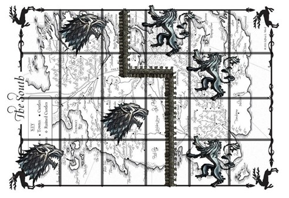

有些 [状压 DP](./state.md) 问题要求我们记录状态的连通性信息，这类问题一般被形象的称为插头 DP 或连通性状态压缩 DP。例如格点图的哈密顿路径计数，求棋盘的黑白染色方案满足相同颜色之间形成一个连通块的方案数，以及特定图的生成树计数等等。这些问题通常需要我们对状态的连通性进行编码，讨论状态转移过程中连通性的变化。

## 骨牌覆盖与轮廓线 DP

温故而知新，在开始学习插头 DP 之前，不妨先让我们回顾一个经典问题。

???+note " 例题 [「HDU 1400」Mondriaan’s Dream](https://vjudge.net/problem/HDU-1400)"
    题目大意：在 $N\times M$ 的棋盘内铺满 $1\times 2$ 或 $2\times 1$ 的多米诺骨牌，求方案数。

当 $n$ 或 $m$ 规模不大的时候，这类问题可以使用 [状压 DP](./state.md) 解决。逐行划分阶段，设 $dp(i,s)$ 表示当前已考虑过前 $i$ 行，且第 $i$ 行的状态为 $s$ 的方案数。这里的状态 $s$ 的每一位可以表示这个这个位置是否已被上一行覆盖。


另一种划分阶段的方法是逐格 DP，或者称之为轮廓线 DP。$dp(i,j,s)$ 表示已经考虑到第 $i$ 行第 $j$ 列，且当前轮廓线上的状态为 $s$ 的方案数。

虽然逐格 DP 中我们的状态增加了一个维度，但是转移的时间复杂度减少为 $O(1)$，所以时间复杂度未变。我们用 $f_0$ 表示当前阶段的状态，用 $f_1$ 表示下一阶段的状态，$u = f_0(s)$ 表示当前枚举的函数值，那么有如下的状态转移方程：

```cpp
if (s >> j & 1) {       // 如果已被覆盖
  f1[s ^ 1 << j] += u;  // 不放
} else {                // 如果未被覆盖
  if (j != m - 1 && (!(s >> j + 1 & 1))) f1[s ^ 1 << j + 1] += u;  // 横放
  f1[s ^ 1 << j] += u;                                             // 竖放
}
```

观察到这里不放和竖放的方程可以合并。

??? 例题代码
    ```cpp
    #include <bits/stdc++.h>
    using namespace std;
    const int N = 11;
    long long f[2][1 << N], *f0, *f1;
    int n, m;
    int main() {
      while (cin >> n >> m && n) {
        f0 = f[0];
        f1 = f[1];
        fill(f1, f1 + (1 << m), 0);
        f1[0] = 1;
        for (int i = 0; i < n; ++i) {
          for (int j = 0; j < m; ++j) {
            swap(f0, f1);
            fill(f1, f1 + (1 << m), 0);
    #define u f0[s]
            for (int s = 0; s < 1 << m; ++s)
              if (u) {
                if (j != m - 1 && (!(s >> j & 3))) f1[s ^ 1 << j + 1] += u;  // 横放
                f1[s ^ 1 << j] += u;  // 竖放或不放
              }
          }
        }
        cout << f1[0] << endl;
      }
    }
    ```

??? note " 习题 [「SRM 671. Div 1 900」BearDestroys](https://competitiveprogramming.info/topcoder/srm/round/16551/div/1)"
    题目大意：给定 $n\times m$ 的矩阵，每个格子有 `E` 或 `S`。
    对于一个矩阵，有一个计分方案。按照行优先的规则扫描每个格子，如果这个格子之前被骨牌占据，则 skip。
    否则尝试放多米诺骨牌。如果放骨牌的方向在矩阵外或被其他骨牌占据，则放置失败，切换另一种方案或 skip。
    如果是 `E` 则优先放一个 $1\times 2$ 的骨牌，
    如果是 `S` 则优先放一个 $2\times 1$ 的骨牌。
    一个矩阵的得分为最后放的骨牌数。
    问所有 $2^{nm}$ 种矩阵的得分的和。

### 术语

阶段：动态规划执行的顺序，后续阶段的结果只与前序阶段的结果有关（无后效性）。很多 DP 问题可以有多种划分阶段的方式。例如在背包问题中，我们通常既可以按照物品划分阶段，也可以按照背包容量划分阶段（外层循环先枚举什么）。而在多米诺骨牌问题中，我们可以按照行、列、格子以及对角线等特征划分阶段。

轮廓线：已决策状态和未决策状态的分界线。


插头：一个格子某个方向的插头存在，表示这个格子在这个方向与相邻格子相连。


## 路径模型

### 多条回路

???+note " 例题 [「HDU 1693」Eat the Trees](https://vjudge.net/problem/HDU-1693)"
    题目大意：求用若干条回路覆盖 $N\times M$ 棋盘的方案数，有些位置有障碍。

严格来说，多条回路问题并不属于插头 DP，因为我们只需要和上面的骨牌覆盖问题一样，记录插头是否存在，然后成对的合并和生成插头就可以了。

注意对于一个宽度为 $m$ 的棋盘，轮廓线的宽度为 $m+1$，因为包含 $m$ 个上插头，和 $1$ 个左插头。注意，当一行迭代完成之后，最右边的左插头通常是不合法的状态，同时我们需要补上下一行第一个左插头，这需要我们调整当前轮廓线的状态，通常是所有状态进行左移，我们把这个操作称为滚动 `roll()`。

??? 例题代码
    ```cpp
    #include <bits/stdc++.h>
    using namespace std;
    const int N = 11;
    long long f[2][1 << (N + 1)], *f0, *f1;
    int n, m;
    int main() {
      int T;
      cin >> T;
      for (int Case = 1; Case <= T; ++Case) {
        cin >> n >> m;
        f0 = f[0];
        f1 = f[1];
        fill(f1, f1 + (1 << m + 1), 0);
        f1[0] = 1;
        for (int i = 0; i < n; ++i) {
          for (int j = 0; j < m; ++j) {
            bool bad;
            cin >> bad;
            bad ^= 1;
            swap(f0, f1);
            fill(f1, f1 + (1 << m + 1), 0);
    #define u f0[s]
            for (int s = 0; s < 1 << m + 1; ++s)
              if (u) {
                bool lt = s >> j & 1, up = s >> j + 1 & 1;
                if (bad) {
                  if (!lt && !up) f1[s] += u;
                } else {
                  f1[s ^ 3 << j] += u;
                  if (lt != up) f1[s] += u;
                }
              }
          }
          swap(f0, f1);
          fill(f1, f1 + (1 << m + 1), 0);
          for (int s = 0; s < 1 << m; ++s) f1[s << 1] = u;
        }
        printf("Case %d: There are %lld ways to eat the trees.\n", Case, f1[0]);
      }
    }
    ```

??? note " 习题 [「ZJU 4231」The Hive II](https://vjudge.net/problem/ZOJ-3466)"
    题目大意：同上题，但格子变成了六边形。

### 一条回路

#### 例题「Andrew Stankevich Contest 16 - Problem F」Pipe Layout

???+note " 例题 [「Andrew Stankevich Contest 16 - Problem F」Pipe Layout](https://codeforces.com/gym/100220)"
    题目大意：求用一条回路覆盖 $N\times$ 棋盘的方案数。

在上面的状态表示中我们每合并一组连通的插头，就会生成一条独立的回路，因而在本题中，我们还需要区分插头之间的连通性（出现了！）。这需要我们对状态进行额外的编码。

#### 状态编码

通常的编码方案有括号表示和最小表示，这里着重介绍泛用性更好的最小表示。我们用长度 $m+1$ 的整形数组，记录轮廓线上每个插头的状态，$0$ 表示没有插头，并约定连通的插头用相同的数字进行标记。

那么下面两组编码方式表示的是相同的状态：

- `0 3 1 0 1 3`
- `0 1 2 0 2 1`

我们将相同的状态都映射成字典序最小表示，例如在上例中的 `0 1 2 0 2 1` 就是一组最小表示。

我们用 `b[]` 数组表示轮廓线上插头的状态。`bb[]` 表示在最小表示的编码的过程中，每个数字被映射到的最小数字。注意 $0$ 表示插头不存在，不能被映射成其他值。

??? note "代码实现"
    ```cpp
    int b[M + 1], bb[M + 1];
    int encode() {
      int s = 0;
      memset(bb, -1, sizeof(bb));
      int bn = 1;
      bb[0] = 0;
      for (int i = m; i >= 0; --i) {
    #define bi bb[b[i]]
        if (!~bi) bi = bn++;
        s <<= offset;
        s |= bi;
      }
      return s;
    }
    void decode(int s) {
      REP(i, m + 1) {
        b[i] = s & mask;
        s >>= offset;
      }
    }
    ```

我们注意到插头总是成对出现，成对消失的。因而 `0 1 2 0 1 2` 这样的状态是不合法的。合法的状态构成一组括号序列，实际中合法状态可能是非常稀疏的。

#### 手写哈希

在一些 [状压 DP](./state.md) 的问题中，合法的状态可能是稀疏的（例如本题），为了优化时空复杂度，我们可以使用哈希表存储合法的 DP 状态。对于 C++ 选手，我们可以使用 [std::unordered_map](http://www.cplusplus.com/reference/unordered_map/unordered_map/)，当然也可以直接手写，这样可以灵活的将状态转移函数也封装于其中。

???+note "代码实现"
    ```cpp
    const int MaxSZ = 16796, Prime = 9973;
    struct hashTable {
      int head[Prime], next[MaxSZ], sz;
      int state[MaxSZ];
      long long key[MaxSZ];
      inline void clear() {
        sz = 0;
        memset(head, -1, sizeof(head));
      }
      inline void push(int s) {
        int x = s % Prime;
        for (int i = head[x]; ~i; i = next[i]) {
          if (state[i] == s) {
            key[i] += d;
            return;
          }
        }
        state[sz] = s, key[sz] = d;
        next[sz] = head[x];
        head[x] = sz++;
      }
      void roll() { REP(i, sz) state[i] <<= offset; }
    } H[2], *H0, *H1;
    ```

上面的代码中：

- `MaxSZ` 表示合法状态的上界，可以估计，也可以预处理出较为精确的值。
- `Prime` 一个小于 `MaxSZ` 的大素数。
- `head[]` 表头节点的指针。
- `next[]` 后续状态的指针。
- `state[]` 节点的状态。
- `key[]` 节点的关键字，在本题中是方案数。
- `clear()` 初始化函数，和手写邻接表类似，我们只需要初始化表头节点的指针。
- `push()` 状态转移函数，其中 `d` 是一个全局变量（偷懒），表示每次状态转移所带来的增量。如果找到的话就 `+=`，否则就创建一个状态为 `s`，关键字为 `d` 的新节点。
- `roll()` 迭代完一整行之后，滚动轮廓线。

关于哈希表的复杂度分析，以及开哈希和闭哈希的不同，可以参见 [《算法导论》](https://oi-wiki.org/intro/resources/#_5) 中关于散列表的相关章节。

#### 状态转移讨论

???+note "代码实现"
    ```cpp
    REP(ii, H0->sz) {
      decode(H0->state[ii]);                  // 取出状态，并解码
      d = H0->key[ii];                        // 得到增量 delta
      int lt = b[j], up = b[j + 1];           // 左插头，上插头
      bool dn = i != n - 1, rt = j != m - 1;  // 下插头，右插头
      if (lt && up) {                         // 如果左、上均有插头
        if (lt == up) {                       // 来自同一个连通块
          if (i == n - 1 &&
              j == m - 1) {  // 只有在最后一个格子时，才能合并，封闭回路。
            push(j, 0, 0);
          }
        } else {  // 否则，必须合并这两个连通块，因为本题中需要回路覆盖
          REP(i, m + 1) if (b[i] == lt) b[i] = up;
          push(j, 0, 0);
        }
      } else if (lt || up) {  // 如果左、上之中有一个插头
        int t = lt | up;      // 得到这个插头
        if (dn) {             // 如果可以向下延伸
          push(j, t, 0);
        }
        if (rt) {  // 如果可以向右延伸
          push(j, 0, t);
        }
      } else {           // 如果左、上均没有插头
        if (dn && rt) {  // 生成一对新插头
          push(j, m, m);
        }
      }
    }
    ```

??? 例题代码
    ```cpp
    #include <bits/stdc++.h>
    using namespace std;
    #define REP(i, n) for (int i = 0; i < n; ++i)
    const int M = 10;
    const int offset = 3, mask = (1 << offset) - 1;
    int n, m;
    long long ans, d;
    const int MaxSZ = 16796, Prime = 9973;
    struct hashTable {
      int head[Prime], next[MaxSZ], sz;
      int state[MaxSZ];
      long long key[MaxSZ];
      inline void clear() {
        sz = 0;
        memset(head, -1, sizeof(head));
      }
      inline void push(int s) {
        int x = s % Prime;
        for (int i = head[x]; ~i; i = next[i]) {
          if (state[i] == s) {
            key[i] += d;
            return;
          }
        }
        state[sz] = s, key[sz] = d;
        next[sz] = head[x];
        head[x] = sz++;
      }
      void roll() { REP(i, sz) state[i] <<= offset; }
    } H[2], *H0, *H1;
    int b[M + 1], bb[M + 1];
    int encode() {
      int s = 0;
      memset(bb, -1, sizeof(bb));
      int bn = 1;
      bb[0] = 0;
      for (int i = m; i >= 0; --i) {
    #define bi bb[b[i]]
        if (!~bi) bi = bn++;
        s <<= offset;
        s |= bi;
      }
      return s;
    }
    void decode(int s) {
      REP(i, m + 1) {
        b[i] = s & mask;
        s >>= offset;
      }
    }
    void push(int j, int dn, int rt) {
      b[j] = dn;
      b[j + 1] = rt;
      H1->push(encode());
    }
    int main() {
    #ifdef ONLINE_JUDGE
      freopen("pipe.in", "r", stdin);
      freopen("pipe.out", "w", stdout);
    #endif
      cin >> n >> m;
      if (m > n) swap(n, m);
      H0 = H, H1 = H + 1;
      H1->clear();
      d = 1;
      H1->push(0);
      REP(i, n) {
        REP(j, m) {
          swap(H0, H1);
          H1->clear();
          REP(ii, H0->sz) {
            decode(H0->state[ii]);
            d = H0->key[ii];
            int lt = b[j], up = b[j + 1];
            bool dn = i != n - 1, rt = j != m - 1;
            if (lt && up) {
              if (lt == up) {
                if (i == n - 1 && j == m - 1) {
                  push(j, 0, 0);
                }
              } else {
                REP(i, m + 1) if (b[i] == lt) b[i] = up;
                push(j, 0, 0);
              }
            } else if (lt || up) {
              int t = lt | up;
              if (dn) {
                push(j, t, 0);
              }
              if (rt) {
                push(j, 0, t);
              }
            } else {
              if (dn && rt) {
                push(j, m, m);
              }
            }
          }
        }
        H1->roll();
      }
      assert(H1->sz <= 1);
      cout << (H1->sz == 1 ? H1->key[0] : 0) << endl;
    }
    ```

#### 习题

??? note " 习题 [「Ural 1519」Formula 1](https://acm.timus.ru/problem.aspx?space=1&num=1519)"
    题目大意：有障碍。

??? note " 习题 [「USACO 5.4.4」Betsy's Tours](http://oj.jzxx.net/problem.php?id=1695)"
    题目大意：一个 $N\times N$ 的方阵（$N\le 7$），求从左上角出发到左下角结束经过每个格子的路径总数。虽然是一条路径，但因为起点和终点固定，可以转化为一条回路问题。

??? note " 习题 [「POJ 1739」Tony's Tour](http://poj.org/problem?id=1739)"
    题目大意：著名的男人八题系列之一。解法同上。

??? note " 习题 [「USACO 6.1.1」Postal Vans](https://vjudge.net/problem/UVALive-2738)"
    题目大意：$n\le 1000,m=4$，每个回路需要统计两次（逆时针和顺时针），需要高精度。

??? note " 习题 [「ProjectEuler 393」Migrating ants](https://projecteuler.net/problem=393)"
    题目大意：对于每一个有 $m$ 条回路的方案，对答案的贡献是 $2^m$，求所有方案的贡献和。

### 一条路径

#### 例题「ZOJ 3213」Beautiful Meadow

???+note " 例题 [「ZOJ 3213」Beautiful Meadow](https://vjudge.net/problem/ZOJ-3213)"
    题目大意：一个 $N\times M$ 的方阵（$N,M\le 8$），每个格点有一个权值，求一段路径，最大化路径覆盖的格点的权值和。

本题是标准的一条路径问题，在一条路径问题中，编码的状态中还会存在不能配对的独立插头。需要在状态转移函数中，额外讨论独立插头的生成、合并与消失的情况。独立插头的生成和消失对应着路径的一端，因而这类事件不会发生超过两次（一次生成一次消失，或者两次生成一次合并），否则最终结果一定会出现多个连通块。

我们需要在状态中额外记录这类事件发生的总次数，可以将这个信息编码进状态里（注意，类似这样的额外信息在调整轮廓线的时候，不需要跟着滚动），当然也可以在 `hashTable` 数组的外面加维。下面的范例程序中我们选择后者。

#### 状态转移

???+note "代码实现"
    ```cpp
    REP(i, n) {
      REP(j, m) {
        checkMax(ans, A[i][j]);  // 需要单独处理一个格子的情况
        if (!A[i][j]) continue;  // 如果有障碍，则跳过，注意这时状态数组不需要滚动
        swap(H0, H1);
        REP(c, 3)
        H1[c].clear();  // c 表示生成和消失事件发生的总次数，最多不超过 2 次
        REP(c, 3) REP(ii, H0[c].sz) {
          decode(H0[c].state[ii]);
          d = H0[c].key[ii] + A[i][j];
          int lt = b[j], up = b[j + 1];
          bool dn = A[i + 1][j], rt = A[i][j + 1];
          if (lt && up) {
            if (lt == up) {  // 在一条路径问题中，我们不能合并相同的插头。
              // Cannot deploy here...
            } else {  // 有可能参与合并的两者中有独立插头，但是也可以用同样的代码片段处理
              REP(i, m + 1) if (b[i] == lt) b[i] = up;
              push(c, j, 0, 0);
            }
          } else if (lt || up) {
            int t = lt | up;
            if (dn) {
              push(c, j, t, 0);
            }
            if (rt) {
              push(c, j, 0, t);
            }
            // 一个插头消失的情况，如果是独立插头则意味着消失，如果是成对出现的插头则相当于生成了一个独立插头，
            // 无论哪一类事件都需要将 c + 1。
            if (c < 2) {
              push(c + 1, j, 0, 0);
            }
          } else {
            d -= A[i][j];
            H1[c].push(H0[c].state[ii]);
            d += A[i][j];    // 跳过插头生成，本题中不要求全部覆盖
            if (dn && rt) {  // 生成一对插头
              push(c, j, m, m);
            }
            if (c < 2) {  // 生成一个独立插头
              if (dn) {
                push(c + 1, j, m, 0);
              }
              if (rt) {
                push(c + 1, j, 0, m);
              }
            }
          }
        }
      }
      REP(c, 3) H1[c].roll();  // 一行结束，调整轮廓线
    }
    ```

??? 例题代码
    ```cpp
    #include <bits/stdc++.h>
    using namespace std;
    #define REP(i, n) for (int i = 0; i < n; ++i)
    template <class T>
    inline bool checkMax(T &a, const T b) {
      return a < b ? a = b, 1 : 0;
    }
    const int N = 8, M = 8;
    const int offset = 3, mask = (1 << offset) - 1;
    int A[N + 1][M + 1];
    int n, m;
    int ans, d;
    const int MaxSZ = 16796, Prime = 9973;
    struct hashTable {
      int head[Prime], next[MaxSZ], sz;
      int state[MaxSZ];
      int key[MaxSZ];
      inline void clear() {
        sz = 0;
        memset(head, -1, sizeof(head));
      }
      inline void push(int s) {
        int x = s % Prime;
        for (int i = head[x]; ~i; i = next[i]) {
          if (state[i] == s) {
            checkMax(key[i], d);
            return;
          }
        }
        state[sz] = s, key[sz] = d;
        next[sz] = head[x];
        head[x] = sz++;
      }
      void roll() { REP(i, sz) state[i] <<= offset; }
    } H[2][3], *H0, *H1;
    int b[M + 1], bb[M + 1];
    int encode() {
      int s = 0;
      memset(bb, -1, sizeof(bb));
      int bn = 1;
      bb[0] = 0;
      for (int i = m; i >= 0; --i) {
    #define bi bb[b[i]]
        if (!~bi) bi = bn++;
        s <<= offset;
        s |= bi;
      }
      return s;
    }
    void decode(int s) {
      REP(i, m + 1) {
        b[i] = s & mask;
        s >>= offset;
      }
    }
    void push(int c, int j, int dn, int rt) {
      b[j] = dn;
      b[j + 1] = rt;
      H1[c].push(encode());
    }
    void init() {
      cin >> n >> m;
      H0 = H[0], H1 = H[1];
      REP(c, 3) H1[c].clear();
      d = 0;
      H1[0].push(0);
      memset(A, 0, sizeof(A));
      REP(i, n) REP(j, m) cin >> A[i][j];
    }
    void solve() {
      ans = 0;
      REP(i, n) {
        REP(j, m) {
          checkMax(ans, A[i][j]);
          if (!A[i][j]) continue;
          swap(H0, H1);
          REP(c, 3) H1[c].clear();
          REP(c, 3) REP(ii, H0[c].sz) {
            decode(H0[c].state[ii]);
            d = H0[c].key[ii] + A[i][j];
            int lt = b[j], up = b[j + 1];
            bool dn = A[i + 1][j], rt = A[i][j + 1];
            if (lt && up) {
              if (lt == up) {
                // Cannot deploy here...
              } else {
                REP(i, m + 1) if (b[i] == lt) b[i] = up;
                push(c, j, 0, 0);
              }
            } else if (lt || up) {
              int t = lt | up;
              if (dn) {
                push(c, j, t, 0);
              }
              if (rt) {
                push(c, j, 0, t);
              }
              if (c < 2) {
                push(c + 1, j, 0, 0);
              }
            } else {
              d -= A[i][j];
              H1[c].push(H0[c].state[ii]);
              d += A[i][j];  // skip
              if (dn && rt) {
                push(c, j, m, m);
              }
              if (c < 2) {
                if (dn) {
                  push(c + 1, j, m, 0);
                }
                if (rt) {
                  push(c + 1, j, 0, m);
                }
              }
            }
          }
        }
        REP(c, 3) H1[c].roll();
      }
      REP(ii, H1[2].sz) checkMax(ans, H1[2].key[ii]);
      cout << ans << endl;
    }
    int main() {
    #ifndef ONLINE_JUDGE
      freopen("in.txt", "r", stdin);
    #endif
      int T;
      cin >> T;
      while (T--) {
        init();
        solve();
      }
    }
    ```

#### 习题

??? note " 习题 [「NOI 2010 Day2」旅行路线](https://www.luogu.com.cn/problem/P1933)"
    题目大意：$n\times m$ 的棋盘，棋盘的每个格子有一个 01 权值 T[x][y]，要求寻找一个路径覆盖，满足：
    
    - 第 i 个参观的格点 (x, y)，满足 T[x][y]= L[i]
    - 路径的一端在棋盘的边界上
    
    求可行的方案数 $\bmod 11192869$。

## 染色模型

除了路径模型之外，还有一类常见的模型，需要我们对棋盘进行染色，相邻的相同颜色节点被视为连通。在路径类问题中，状态转移的时候我们枚举当前路径的方向，而在染色类问题中，我们枚举当前节点染何种颜色。在染色模型中，状态中处在相同连通性的节点可能不止两个。但总体来说依然大同小异。我们不妨来看一个经典的例题。

### 例题「UVA 10572」Black & White

???+note " 例题 [「UVA 10572」Black & White](https://vjudge.net/problem/UVA-10572)"
    题目大意：在 $N\times M$ 的棋盘内对未染色的格点进行黑白染色，要求所有黑色区域和白色区域连通，且任意一个 $2\times 2$ 的子矩形内的颜色不能完全相同（例如下图中的情况非法），求合法的方案数，并构造一组合法的方案。
    
    

#### 状态编码

我们先考虑状态编码。不考虑连通性，那么就是 [SGU 197. Nice Patterns Strike Back](https://codeforces.com/problemsets/acmsguru/problem/99999/197)，不难用 [状压 DP](./state.md) 直接解决。现在我们需要在状态中同时体现颜色和连通性的信息，考察轮廓线上每个位置的状态，二进制的每 `Offset` 位描述轮廓线上的一个位置，因为只有黑白两种颜色，我们用最低位的奇偶性表示颜色，其余部分示连通性。

考虑第一行上面的节点，和第一列左侧节点，如果要避免特判的话，可以考虑引入第三种颜色区分它们，这里我们观察到这些边界状态的连通性信息一定为 0，所以不需要对第三种颜色再进行额外编码。

在路径问题中我们的轮廓线是由 $m$ 个上插头与 $1$ 个左插头组成的。本题中，由于我们还需要判断当前格点为右下角的 $2\times 2$ 子矩形是否合法，所以需要记录左上角格子的颜色，因此轮廓线的长度依然是 $m+1$。

这样的编码方案中依然保留了很多冗余信息，（连通的区域颜色一定相同，且左上角的格子只需要颜色信息不需要连通性），但是因为已经用了哈希表和最小表示，对时间复杂度的影响不大，为了降低编程压力，就不再细化了。

在最多情况下（例如第一行黑白相间），每个插头的连通性信息都不一样，因此我们需要 $4$ 位二进制位记录连通性，再加上颜色信息，本题的 `Offset` 为 $5$ 位。

???+note "代码实现"
    ```cpp
    const int Offset = 5, Mask = (1 << Offset) - 1;
    int c[N + 2];
    int b[N + 2], bb[N + 3];
    T_state encode() {
      T_state s = 0;
      memset(bb, -1, sizeof(bb));
      int bn = 1;
      bb[0] = 0;
      for (int i = m; i >= 0; --i) {
    #define bi bb[b[i]]
        if (!~bi) bi = bn++;
        s <<= Offset;
        s |= (bi << 1) | c[i];
      }
      return s;
    }
    void decode(T_state s) {
      REP(i, m + 1) {
        b[i] = s & Mask;
        c[i] = b[i] & 1;
        b[i] >>= 1;
        s >>= Offset;
      }
    }
    ```

#### 手写哈希

因为需要构造任意一组方案，这里的哈希表我们需要添加一组域 `pre[]` 来记录每个状态在上一阶段的任意一个前驱。

???+note "代码实现"
    ```cpp
    const int Prime = 9979, MaxSZ = 1 << 20;
    template <class T_state, class T_key>
    struct hashTable {
      int head[Prime];
      int next[MaxSZ], sz;
      T_state state[MaxSZ];
      T_key key[MaxSZ];
      int pre[MaxSZ];
      void clear() {
        sz = 0;
        memset(head, -1, sizeof(head));
      }
      void push(T_state s, T_key d, T_state u) {
        int x = s % Prime;
        for (int i = head[x]; ~i; i = next[i]) {
          if (state[i] == s) {
            key[i] += d;
            return;
          }
        }
        state[sz] = s, key[sz] = d, pre[sz] = u;
        next[sz] = head[x], head[x] = sz++;
      }
      void roll() { REP(ii, sz) state[ii] <<= Offset; }
    };
    hashTable<T_state, T_key> _H, H[N][N], *H0, *H1;
    ```

#### 方案构造

有了上面的信息，我们就可以容易的构造方案了。首先遍历当前哈希表中的状态，如果连通块数目不超过 $2$，那么统计进方案数。如果方案数不为 $0$，我们倒序用 `pre` 数组构造出方案，注意每一行的末尾因为我们执行了 `Roll()` 操作，颜色需要取 `c[j+1]`。

???+note "代码实现"
    ```cpp
    void print() {
      T_key z = 0;
      int u;
      REP(i, H1->sz) {
        decode(H1->state[i]);
        if (*max_element(b + 1, b + m + 1) <= 2) {
          z += H1->key[i];
          u = i;
        }
      }
      cout << z << endl;
      if (z) {
        DWN(i, n, 0) {
          B[i][m] = 0;
          DWN(j, m, 0) {
            decode(H[i][j].state[u]);
            int cc = j == m - 1 ? c[j + 1] : c[j];
            B[i][j] = cc ? 'o' : '#';
            u = H[i][j].pre[u];
          }
        }
        REP(i, n) puts(B[i]);
      }
      puts("");
    }
    ```

#### 状态转移

我们记：

- `cc` 当前正在染色的格子的颜色
- `lf` 左边格子的颜色
- `up` 上边格子的颜色
- `lu` 左上格子的颜色

我们用 $-1$ 表示颜色不存在。接下来讨论状态转移，一共有三种情况，合并，继承与生成：

???+note "状态转移-代码"
    ```cpp
    void trans(int i, int j, int u, int cc) {
      decode(H0->state[u]);
      int lf = j ? c[j - 1] : -1, lu = b[j] ? c[j] : -1,
          up = b[j + 1] ? c[j + 1] : -1;  // 没有颜色也是颜色的一种！
      if (lf == cc && up == cc) {         // 合并
        if (lu == cc) return;             // 2x2 子矩形相同的情况
        int lf_b = b[j - 1], up_b = b[j + 1];
        REP(i, m + 1) if (b[i] == up_b) { b[i] = lf_b; }
        b[j] = lf_b;
      } else if (lf == cc || up == cc) {  // 继承
        if (lf == cc)
          b[j] = b[j - 1];
        else
          b[j] = b[j + 1];
      } else {                                             // 生成
        if (i == n - 1 && j == m - 1 && lu == cc) return;  // 特判
        b[j] = m + 2;
      }
      c[j] = cc;
      if (!ok(i, j, cc)) return;  // 判断是否会因生成封闭的连通块导致不合法
      H1->push(encode(), H0->key[u], u);
    }
    ```

对于最后一种情况需要注意的是，如果已经生成了一个封闭的连通区域，那么我们不能再使用她的颜色染色，否则这种颜色会出现两个连通块。我们似乎需要额度记录这种事件，可以参考 [「ZOJ 3213」Beautiful Meadow](#zoj-3213beautiful-meadow) 中的做法，再开一维记录这个事件。不过利用本题的特殊性，我们也可以特判掉。

???+note "特判-代码"
    ```cpp
    bool ok(int i, int j, int cc) {
      if (cc == c[j + 1]) return true;
      int up = b[j + 1];
      if (!up) return true;
      int c1 = 0, c2 = 0;
      REP(i, m + 1) if (i != j + 1) {
        if (b[i] == b[j + 1]) {  // 连通性相同，颜色一定相同
          assert(c[i] == c[j + 1]);
        }
        if (c[i] == c[j + 1] && b[i] == b[j + 1]) ++c1;
        if (c[i] == c[j + 1]) ++c2;
      }
      if (!c1) {               // 如果会生成新的封闭连通块
        if (c2) return false;  // 如果轮廓线上还有相同的颜色
        if (i < n - 1 || j < m - 2) return false;
      }
      return true;
    }
    ```

进一步讨论连通块消失的情况。每当我们对一个格子进行染色后，如果没有其他格子与其上侧的格子连通，那么会形成一个封闭的连通块。这个事件仅在最后一行的最后两列时可以发生，否则后续为了不出现 $2\times 2$ 的同色连通块，这个颜色一定会再次出现，除了下面的情况：

    2 2
    o#
    #o

我们特判掉这种，这样在本题中，就可以偷懒不用记录之前是否已经生成了封闭的连通块了。

??? 例题代码
    ```cpp
    #include <bits/stdc++.h>
    using namespace std;
    #define REP(i, n) for (int i = 0; i < n; ++i)
    #define DWN(i, b, a) for (int i = b - 1; i >= a; --i)
    typedef long long T_state;
    typedef int T_key;
    const int N = 8;
    int n, m;
    char A[N + 1][N + 1], B[N + 1][N + 1];
    const int Offset = 5, Mask = (1 << Offset) - 1;
    int c[N + 2];
    int b[N + 2], bb[N + 3];
    T_state encode() {
      T_state s = 0;
      memset(bb, -1, sizeof(bb));
      int bn = 1;
      bb[0] = 0;
      for (int i = m; i >= 0; --i) {
    #define bi bb[b[i]]
        if (!~bi) bi = bn++;
        s <<= Offset;
        s |= (bi << 1) | c[i];
      }
      return s;
    }
    void decode(T_state s) {
      REP(i, m + 1) {
        b[i] = s & Mask;
        c[i] = b[i] & 1;
        b[i] >>= 1;
        s >>= Offset;
      }
    }
    const int Prime = 9979, MaxSZ = 1 << 20;
    template <class T_state, class T_key>
    struct hashTable {
      int head[Prime];
      int next[MaxSZ], sz;
      T_state state[MaxSZ];
      T_key key[MaxSZ];
      int pre[MaxSZ];
      void clear() {
        sz = 0;
        memset(head, -1, sizeof(head));
      }
      void push(T_state s, T_key d, T_state u) {
        int x = s % Prime;
        for (int i = head[x]; ~i; i = next[i]) {
          if (state[i] == s) {
            key[i] += d;
            return;
          }
        }
        state[sz] = s, key[sz] = d, pre[sz] = u;
        next[sz] = head[x], head[x] = sz++;
      }
      void roll() { REP(ii, sz) state[ii] <<= Offset; }
    };
    hashTable<T_state, T_key> _H, H[N][N], *H0, *H1;
    bool ok(int i, int j, int cc) {
      if (cc == c[j + 1]) return true;
      int up = b[j + 1];
      if (!up) return true;
      int c1 = 0, c2 = 0;
      REP(i, m + 1) if (i != j + 1) {
        if (b[i] == b[j + 1]) {
          assert(c[i] == c[j + 1]);
        }
        if (c[i] == c[j + 1] && b[i] == b[j + 1]) ++c1;
        if (c[i] == c[j + 1]) ++c2;
      }
      if (!c1) {               // 如果会生成新的封闭连通块
        if (c2) return false;  // 如果轮廓线上还有相同的颜色
        if (i < n - 1 || j < m - 2) return false;
      }
      return true;
    }
    void trans(int i, int j, int u, int cc) {
      decode(H0->state[u]);
      int lf = j ? c[j - 1] : -1, lu = b[j] ? c[j] : -1,
          up = b[j + 1] ? c[j + 1] : -1;
      if (lf == cc && up == cc) {
        if (lu == cc) return;
        int lf_b = b[j - 1], up_b = b[j + 1];
        REP(i, m + 1) if (b[i] == up_b) { b[i] = lf_b; }
        b[j] = lf_b;
      } else if (lf == cc || up == cc) {
        if (lf == cc)
          b[j] = b[j - 1];
        else
          b[j] = b[j + 1];
      } else {
        if (i == n - 1 && j == m - 1 && lu == cc) return;
        b[j] = m + 2;
      }
      c[j] = cc;
      if (!ok(i, j, cc)) return;
      H1->push(encode(), H0->key[u], u);
    }
    void init() {
      cin >> n >> m;
      REP(i, n) scanf("%s", A[i]);
    }
    void solve() {
      H1 = &_H, H1->clear(), H1->push(0, 1, 0);
      REP(i, n) {
        REP(j, m) {
          H0 = H1, H1 = &H[i][j], H1->clear();
          REP(u, H0->sz) {
            if (A[i][j] == '.' || A[i][j] == '#') trans(i, j, u, 0);
            if (A[i][j] == '.' || A[i][j] == 'o') trans(i, j, u, 1);
          }
        }
        H1->roll();
      }
    }
    void print() {
      T_key z = 0;
      int u;
      REP(i, H1->sz) {
        decode(H1->state[i]);
        if (*max_element(b + 1, b + m + 1) <= 2) {
          z += H1->key[i];
          u = i;
        }
      }
      cout << z << endl;
      if (z) {
        DWN(i, n, 0) {
          B[i][m] = 0;
          DWN(j, m, 0) {
            decode(H[i][j].state[u]);
            int cc = j == m - 1 ? c[j + 1] : c[j];
            B[i][j] = cc ? 'o' : '#';
            u = H[i][j].pre[u];
          }
        }
        REP(i, n) puts(B[i]);
      }
      puts("");
    }
    int main() {
    #ifndef ONLINE_JUDGE
      freopen("in.txt", "r", stdin);
    #endif
      int T;
      cin >> T;
      while (T--) {
        init();
        solve();
        print();
      }
    }
    ```

??? note " 习题 [「Topcoder SRM 312. Div1 Hard」CheapestIsland](https://competitiveprogramming.info/topcoder/srm/round/9992/div/1)"
    题目大意：给一个棋盘图，每个格子有权值，求权值之和最小的连通块。

??? note " 习题 [「JLOI 2009」神秘的生物](https://www.luogu.com.cn/problem/P3886)"
    题目大意：给一个棋盘图，每个格子有权值，求权值之和最大的连通块。

## 图论模型

???+note " 例题 [「NOI 2007 Day2」生成树计数](https://www.luogu.com.cn/problem/P2109)"
    题目大意：某类特殊图的生成树计数，每个节点恰好与其前 $k$ 个节点之间有边相连。

???+note " 例题 [「2015 ACM-ICPC Asia Shenyang Regional Contest - Problem E」Efficient Tree](https://vjudge.net/problem/HDU-5513)"
    题目大意：给出一个 $N\times M$ 的网格图，以及相邻四连通格子之间的边权。
    对于一颗生成树，每个节点的得分为 1+[有一条连向上的边]+[有一条连向左的边]。
    生成树的得分为所有节点的得分之积。
    
    要求：
    最小生成树的边权和
    所有最小生成树的得分之和。
    （$n\le 800,m\le 7$）

## 实战篇

### 例题「HDU 4113」Construct the Great Wall

???+note " 例题 [「HDU 4113」Construct the Great Wall](https://vjudge.net/problem/HDU-4113)"
    题目大意：在 $N\times M$ 的棋盘内构造一组回路，分割所有的 `x` 和 `o`。

有一类插头 DP 问题要求我们在棋盘上构造一组墙，以分割棋盘上的某些元素。不妨称之为修墙问题，这类问题既可视作染色模型，也可视作路径模型。


在本题中，如果视作染色模型的话，不仅需要额外讨论染色区域的周长，还要判断在角上触碰而导致不合法的情况（图 2）。另外与 [「UVA 10572」Black & White](https://vjudge.net/problem/UVA-10572) 不同的是，本题中要求围墙为简单多边形，因而对于下面的回字形的情况，在本题中是不合法的。

    3 3
    ooo
    oxo
    ooo

因而我们使用路径模型，转化为 [一条回路](#一条回路) 来处理。

我们沿着棋盘的交叉点进行 DP（因而长宽需要增加 $1$），每次转移时，需要保证所有的 `x` 在回路之外，`o` 在回路之内。因此我们还需要维护当前位置是否在回路内部。对于这个信息我们可以加维，也可以直接统计轮廓线上到这个位置之前出现下插头次数的奇偶性（射线法）。

??? 例题代码
    ```cpp
    #include <bits/stdc++.h>
    using namespace std;
    #define REP(i, n) for (int i = 0; i < n; ++i)
    template <class T>
    inline bool checkMin(T &a, const T b) {
      return b < a ? a = b, 1 : 0;
    }
    const int N = 10, M = N;
    const int offset = 3, mask = (1 << offset) - 1;
    int n, m;
    int d;
    const int INF = 0x3f3f3f3f;
    int b[M + 1], bb[M + 1];
    int encode() {
      int s = 0;
      memset(bb, -1, sizeof(bb));
      int bn = 1;
      bb[0] = 0;
      for (int i = m; i >= 0; --i) {
    #define bi bb[b[i]]
        if (!~bi) bi = bn++;
        s <<= offset;
        s |= bi;
      }
      return s;
    }
    void decode(int s) {
      REP(i, m + 1) {
        b[i] = s & mask;
        s >>= offset;
      }
    }
    const int MaxSZ = 16796, Prime = 9973;
    struct hashTable {
      int head[Prime], next[MaxSZ], sz;
      int state[MaxSZ];
      int key[MaxSZ];
      inline void clear() {
        sz = 0;
        memset(head, -1, sizeof(head));
      }
      inline void push(int s) {
        int x = s % Prime;
        for (int i = head[x]; ~i; i = next[i]) {
          if (state[i] == s) {
            checkMin(key[i], d);
            return;
          }
        }
        state[sz] = s, key[sz] = d;
        next[sz] = head[x];
        head[x] = sz++;
      }
      void roll() { REP(i, sz) state[i] <<= offset; }
    } H[2], *H0, *H1;
    char A[N + 1][M + 1];
    void push(int i, int j, int dn, int rt) {
      b[j] = dn;
      b[j + 1] = rt;
      if (A[i][j] != '.') {
        bool bad = A[i][j] == 'o';
        REP(jj, j + 1) if (b[jj]) bad ^= 1;
        if (bad) return;
      }
      H1->push(encode());
    }
    int solve() {
      cin >> n >> m;
      int ti, tj;
      REP(i, n) {
        scanf("%s", A[i]);
        REP(j, m) if (A[i][j] == 'o') ti = i, tj = j;
        A[i][m] = '.';
      }
      REP(j, m + 1) A[n][j] = '.';
      ++n, ++m, ++ti, ++tj;
      H0 = H, H1 = H + 1;
      H1->clear();
      d = 0;
      H1->push(0);
      int z = INF;
      REP(i, n) {
        REP(j, m) {
          swap(H0, H1);
          H1->clear();
          REP(ii, H0->sz) {
            decode(H0->state[ii]);
            d = H0->key[ii] + 1;
            int lt = b[j], up = b[j + 1];
            bool dn = i != n - 1, rt = j != m - 1;
            if (lt && up) {
              if (lt == up) {
                int cnt = 0;
                REP(i, m + 1) if (b[i])++ cnt;
                if (cnt == 2 && i == ti && j == tj) {
                  checkMin(z, d);
                }
              } else {
                REP(i, m + 1) if (b[i] == lt) b[i] = up;
                push(i, j, 0, 0);
              }
            } else if (lt || up) {
              int t = lt | up;
              if (dn) {
                push(i, j, t, 0);
              }
              if (rt) {
                push(i, j, 0, t);
              }
            } else {
              --d;
              push(i, j, 0, 0);
              ++d;
              if (dn && rt) {
                push(i, j, m, m);
              }
            }
          }
        }
        H1->roll();
      }
      if (z == INF) z = -1;
      return z;
    }
    int main() {
    #ifndef ONLINE_JUDGE
      freopen("in.txt", "r", stdin);
    #endif
      int T;
      cin >> T;
      for (int Case = 1; Case <= T; ++Case) {
        printf("Case #%d: %d\n", Case, solve());
      }
    }
    ```

??? note " 习题 [「HDU 4796」Winter's Coming](https://vjudge.net/problem/HDU-4796)"
    题目大意：在 $N\times M$ 的棋盘内对未染色的格点进行黑白灰染色，要求所有黑色区域和白色区域连通，且黑色区域与白色区域分别与棋盘的上下边界连通，且其中黑色区域与白色区域不能相邻。每个格子有对应的代价，求一组染色方案，最小化灰色区域的代价。
    
    

??? note " 习题 [「ZOJ 2125」Rocket Mania](https://vjudge.net/problem/ZOJ-2125)"


??? note " 习题 [「ZOJ 2126」Rocket Mania Plus](https://vjudge.net/problem/ZOJ-2126)"


??? note " 习题 [「World Finals 2009/2010 Harbin」Channel](https://vjudge.net/problem/UVALive-4789)"
    题目大意：。

??? note " 习题 [「HDU 3958」Tower Defence](https://vjudge.net/problem/HDU-3958)"
    题目大意：。

??? note " 习题 [「UVA 10531」Maze Statistics](https://vjudge.net/problem/UVA-10531)"
    题目大意：。

??? note " 习题 [「AIZU 2452」Pipeline Plans](https://vjudge.net/problem/Aizu-2452)"
    题目大意：。

??? note " 习题 [「SDOI 2014」电路板](https://www.luogu.com.cn/problem/P3314)"
    题目大意：。

??? note " 习题 [「SPOJ CAKE3」Delicious Cake](https://vjudge.net/problem/SPOJ-CAKE3)"
    题目大意：。

.

## 本章注记

插头 DP 问题通常编码难度较大，讨论复杂，因而属于 OI/ACM 中相对较为 [偏门的领域](https://github.com/OI-wiki/libs/blob/master/topic/7-%E7%8E%8B%E5%A4%A9%E6%87%BF-%E8%AE%BA%E5%81%8F%E9%A2%98%E7%9A%84%E5%8D%B1%E5%AE%B3.ppt)。这方面最为经典的资料，当属 2008 年 [陈丹琦](https://www.cs.princeton.edu/~danqic/) 的集训队论文——[基于连通性状态压缩的动态规划问题](https://github.com/AngelKitty/review_the_national_post-graduate_entrance_examination/tree/master/books_and_notes/professional_courses/data_structures_and_algorithms/sources/%E5%9B%BD%E5%AE%B6%E9%9B%86%E8%AE%AD%E9%98%9F%E8%AE%BA%E6%96%87/%E5%9B%BD%E5%AE%B6%E9%9B%86%E8%AE%AD%E9%98%9F2008%E8%AE%BA%E6%96%87%E9%9B%86/%E9%99%88%E4%B8%B9%E7%90%A6%E3%80%8A%E5%9F%BA%E4%BA%8E%E8%BF%9E%E9%80%9A%E6%80%A7%E7%8A%B6%E6%80%81%E5%8E%8B%E7%BC%A9%E7%9A%84%E5%8A%A8%E6%80%81%E8%A7%84%E5%88%92%E9%97%AE%E9%A2%98%E3%80%8B)。其次，HDU 的 notonlysuccess 2011 年曾经在博客中连续写过两篇由浅入深的专题，也是不可多得的好资料，不过现在需要在 Web Archive 里考古。

- [notonlysuccess，【专辑】插头 DP](https://web.archive.org/web/20110815044829/http://www.notonlysuccess.com/?p=625)
- [notonlysuccess，【完全版】插头 DP](https://web.archive.org/web/20111007185146/http://www.notonlysuccess.com/?p=931)

### 多米诺骨牌覆盖

[「HDU 1400」Mondriaan’s Dream](https://vjudge.net/problem/HDU-1400) 也出现在 [《算法竞赛入门经典训练指南》](https://oi-wiki.org/intro/resources/#_5) 中，并作为《轮廓线上的动态规划》一节的例题。[多米诺骨牌覆盖（Domino tiling）](https://en.wikipedia.org/wiki/Domino_tiling) 是一组非常经典的数学问题，稍微修改其数据范围就可以得到不同难度，需要应用不同的算法解决的子问题。

当限定 $m=2$ 时，多米诺骨牌覆盖等价于斐波那契数列。[《具体数学》](https://www.csie.ntu.edu.tw/~r97002/temp/Concrete%20Mathematics%202e.pdf) 中使用了该问题以引出斐波那契数列，并使用了多种方法得到其解析解。

当 $m\le 10,n\le 10^9$ 时，可以将转移方程预处理成矩阵形式，并使用 [矩阵乘法进行加速](http://www.matrix67.com/blog/archives/276)。


当 $n,m\le 100$，可以用 [FKT Algorithm](https://en.wikipedia.org/wiki/FKT_algorithm) 计算其所对应平面图的完美匹配数。

- [「51nod 1031」骨牌覆盖](http://www.51nod.com/Challenge/Problem.html#problemId=1031)
- [「51nod 1033」骨牌覆盖 V2](http://www.51nod.com/Challenge/Problem.html#problemId=1033)\|[「Vijos 1194」Domino](https://vijos.org/p/1194)
- [「51nod 1034」骨牌覆盖 V3](http://www.51nod.com/Challenge/Problem.html#problemId=1034)\|[「Ural 1594」Aztec Treasure](https://acm.timus.ru/problem.aspx?space=1&num=1594)
- [Wolfram MathWorld, Chebyshev Polynomial of the Second Kind](https://mathworld.wolfram.com/ChebyshevPolynomialoftheSecondKind.html)

### 一条路径

「一条路径」是 [哈密度路径（Hamiltonian Path）]((https://en.wikipedia.org/wiki/Hamiltonian_path)) 问题在 [格点图（Grid Graph）](https://mathworld.wolfram.com/GridGraph.html) 中的一种特殊情况。哈密顿路径的判定性问题是 [NP-complete](https://en.wikipedia.org/wiki/NP-completeness) 家族中的重要成员。Niconico 上有一个『フカシギの数え方』おねえさんといっしょ！みんなで数えてみよう（和大姐姐一起学习计算系列）的科普向视频，就使用这个问题作为例子，来说明 NPC 问题的计算时间如何随着问题的规模的线性增长而指数增长。


- [【动画】从方格这头走向那头有多少种走法呢～【结尾迷之感动】](https://www.bilibili.com/video/BV1Cx411D74e)\|[Youtube](https://www.youtube.com/watch?v=Q4gTV4r0zRs)
