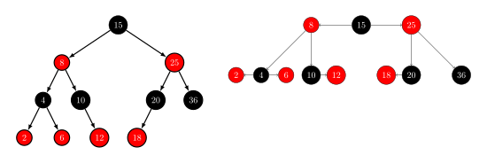

本页介绍2-3-4树。在计算机科学中，2–3–4树（也称为2–4树）是一种自平衡的树，所有的叶子节点都位于同一深度。2-3-4树是4阶B树，与一般的B树一样，2-3-4树可以实现在$O(\log n)$时间内进行搜索、插入和删除操作。

2-3-4树是对2-3树的概念扩展，包括了4节点的使用。

2–3–4树与红黑树是等价的。对于每个2–3–4树，恰好存在一个相同顺序的红黑树。此外，对2–3–4树进行插入和删除操作，导致节点扩展、分裂和合并的过程与红黑树中的颜色翻转和旋转等效。2–3–4树的操作中涉及大量特殊情况，在大多数编程语言中的实现可能会比较困难。而红黑树的实现较为简单，因此更常被使用。

## 定义

2-3-4树的节点分为三种，2节点，3节点和4节点，分别包含一个、两个或三个数据元素。

## 性质

- 每个节点（叶节点或内部节点）可以是2节点、3节点或4节点，分别包含一个、两个或三个数据元素。 
- 所有的叶子节点都处于同一深度（最底层）。
- 所有数据都有序存储。
- 在2-3-4树的最坏情况下高度是$\log N$，在最好的情况下高度是$1/2 \log N$(所有节点都是4节点)。

## 操作

由于 2-3-4 树上的元素是按一定顺序存储的，所以查找与二叉搜索树类似。插入和删除都会保持平衡性，即叶节点的深度相同。

### 插入

向2-3-4树中插入一个值，从根节点开始：

1. 如果当前节点是4节点：
   - 移除并保存中间的值，变成一个3节点。
   - 将剩余的3节点分成两个2节点（缺失的中间值在下一步处理）。
   - 如果这是根节点（没有父节点）：
     - 中间的值变成2节点成为新的根节点，树的高度增加1。向上进入新的根节点。
   - 否则，将中间的值上移到父节点中。向上进入父节点。
2. 找到包含要插入值的子节点的区间。
3. 如果那个子节点是叶节点，将值插入到子节点中并结束。
   - 否则，进入子节点并从重复步骤1。

可以看出，2-3-4树的插入只会发生在叶节点，而不会发生在内部节点。下面是2-3-4树插入值$25$的例子。

从根节点$(10,20)$开始，找到包括$25$的区间$(20,\infty)$，进入右子节点$(22,24,29)$。

节点$（22, 24, 29）$是一个4节点，因此中间元素$24$被上移到父节点中。

剩余的3节点$（22, 29）$被分割为两个2节点$（22）$和$（29）$，然后回到新的父节点$（10, 20, 24）$。区间$（24, \infty$）包含$25$，进入右子节点$（29）$。

节点$（29）$没有左侧子节点。（区间$（24, 29）$的子节点为空。）在此停止，并将值$25$插入到此节点中。

### 删除

从2-3-4树中删除一个元素需要根据待删除元素的位置分情况讨论。**删除操作只发生在叶节点上**。下面介绍从2–3–4树中删除一个元素的过程：

1. 查找需要删除某个元素的节点。
2. 如果节点是叶子节点（3节点或4节点），则从该节点中删除所需的值，并将数据元素减少1。
3. 如果节点不是叶子节点，则：
   - 查找该节点的后继节点。节点的后继是其中大于它的最小元素或小于它的最大元素。
   - 用后继节点交换当前节点，并在叶子中删除该节点。

但如果叶节点是一个2节点，删除该节点可能会导致下溢(underflow)。为了避免这种情况，我们在从上到下移动到要删除的节点的路径上遇到2节点时，会先执行以下调整操作，使找到的叶子节点不是2节点。这样，在之后的交换和删除后，不会出现一个空的叶节点。

#### Case 1

如果当前节点的兄弟节点之一是3节点或4节点，则将当前节点与那个兄弟节点一起进行以下旋转操作：

1. 选择一个与当前节点最接近的键值的兄弟节点。
2. 将该兄弟节点的键值上移到当前节点的父节点中，使父节点变成一个3节点。
3. 原来兄弟节点的孩子现在成为当前节点的孩子。

下图在2-3-4树中删除元素$10$。

#### Case 2

如果父节点是2节点并且兄弟节点也是2节点。在这种情况下，父节点是根节点。所以将这三个2节点合并成一个新的4节点，并缩短树的高度。（这个规则只会在父节点是根节点时触发，因为路径上的所有其他2节点都已经被修改，不再是2节点。这就是为什么在此处"缩短树"会保持平衡；这也是融合操作的重要假设。）

下图在2-3-4树中删除元素$50$。

#### Case 3

如果兄弟节点是2节点，但父节点是3节点或4节点：

1. 将相邻的兄弟节点和俯视两个兄弟节点的父键融合成一个4节点。
2. 将兄弟节点的子节点移到该节点。

下图在2-3-4树中删除元素$50$。

## 与红黑树的关系

2-3-4树和红黑树是同构的，下图是2-3-4树的2节点、3节点和4节点对应的红黑树节点。

下图是2-3-4树对应的红黑树。

## 参考资料

1. [2–3–4 tree - Wikipedia](https://en.wikipedia.org/wiki/2–3–4_tree)
1. [2-3-4 Trees | Algorithm Tutor](https://algorithmtutor.com/Data-Structures/Tree/2-3-4-Trees/)
1. [2-3-4 Tree - GeeksforGeeks](https://www.geeksforgeeks.org/2-3-4-tree/)

