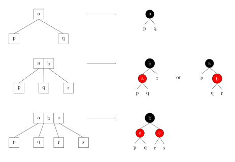

本页介绍 2-3-4 树。在计算机科学中，2–3–4 树（也称为 2–4 树）是一种自平衡的树，所有的叶子节点都位于同一深度。2-3-4 树是 4 阶 B 树，与一般的 B 树一样，2-3-4 树可以实现在 $O(\log n)$ 时间内进行搜索、插入和删除操作。

2-3-4 树是对 2-3 树的概念扩展，包括了 4 节点的使用。

2–3–4 树与红黑树是等价的。对于每个 2–3–4 树，恰好存在一个相同顺序的红黑树。此外，对 2–3–4 树进行插入和删除操作，导致节点扩展、分裂和合并的过程与红黑树中的颜色翻转和旋转等效。2–3–4 树的操作中涉及大量特殊情况，在大多数编程语言中的实现可能会比较困难。而红黑树的实现较为简单，因此更常被使用。

## 定义

2-3-4 树的节点分为三种，2 节点，3 节点和 4 节点，分别包含一个、两个或三个数据元素。

## 性质

-   每个节点（叶节点或内部节点）可以是 2 节点、3 节点或 4 节点，分别包含一个、两个或三个数据元素。
-   所有的叶子节点都处于同一深度（最底层）。
-   所有数据都有序存储。
-   在 2-3-4 树的最坏情况下高度是 $\log N$，在最好的情况下高度是 $1/2 \log N$（所有节点都是 4 节点）。

## 操作

由于 2-3-4 树上的元素是按一定顺序存储的，所以查找与二叉搜索树类似。插入和删除都会保持平衡性，即叶节点的深度相同。

### 插入

2-3-4 树的插入只会发生在叶节点，而不会发生在内部节点。在叶节点上插入一个值，会让 2 节点变成 3 节点，3 节点变成 4 节点，而 4 节点就没有空间了。为了解决这个问题，这里有两种思路。

-   自底向上，从 4 叶节点开始分裂（**上溢**），如果分裂后其父节点也是 4 节点，继续向上分裂，直到到达根节点。如果根节点也是 4 节点，分裂后树的高度 + 1。
-   自顶向下，从根节点到插入所在的叶节点路径上，遇到 4 节点就将其分裂。

本文采用自底向上，将插入操作分为两部分，首先根据搜索树的性质在叶节点的位置插入，形成暂时的 **5 节点**，然后根据插入节点及相关节点的状态进行平衡的维护。

下面是 2-3-4 树插入的例子。

首先插入值 $25$。从根节点 $(10,20)$ 开始查找，找到包括 $25$ 的区间 $(20,\infty)$，进入右子节点 $(22,24,29)$。

由于节点 $（22, 24, 29）$ 是一个 4 节点，先将 $25$ 插入形成暂时的 **5 节点**。

由于 $（22, 24, 25, 29）$ 超出了 4 节点，需要将第二个元素上溢。即将 $24$ 与父节点合并形成 $(10,20,24)$。

然后插入 $30$。

插入 $31$。形成 5 节点 $(25,29,30,31)$。

第二个元素 $29$ 上溢，发现父节点也形成 5 节点 $(10,20,24,29)$。

5 节点 $(10,20,24,29)$ 中第二个元素 $20$ 继续上溢，最终调整完成。

### 删除

从 2-3-4 树中删除一个元素需要根据待删除元素的位置分情况讨论。**删除操作只发生在叶节点上**。下面介绍从 2–3–4 树中删除一个元素的过程：

1.  查找需要删除某个元素的节点。
2.  如果节点是叶子节点（3 节点或 4 节点），则从该节点中删除所需的值，并将数据元素减少 1。
3.  如果节点不是叶子节点，则：
    -   查找该节点的后继节点。节点的后继是其中大于它的最小元素或小于它的最大元素。
    -   用后继节点交换当前节点，并在叶子中删除该节点。

但如果叶节点是一个 2 节点，删除该节点可能会导致下溢（underflow)。为了避免这种情况，我们在从上到下移动到要删除的节点的路径上遇到 2 节点时，会先执行以下调整操作，使找到的叶子节点不是 2 节点。这样，在之后的交换和删除后，不会出现一个空的叶节点。

#### Case 1

如果当前节点的兄弟节点之一是 3 节点或 4 节点，则将当前节点与那个兄弟节点一起进行以下旋转操作：

1.  选择一个与当前节点最接近的键值的兄弟节点。
2.  将该兄弟节点的键值上移到当前节点的父节点中，使父节点变成一个 3 节点。
3.  原来兄弟节点的孩子现在成为当前节点的孩子。

下图在 2-3-4 树中删除元素 $10$。

#### Case 2

如果父节点是 2 节点并且兄弟节点也是 2 节点。在这种情况下，父节点是根节点。所以将这三个 2 节点合并成一个新的 4 节点，并缩短树的高度。

下图在 2-3-4 树中删除元素 $50$。

#### Case 3

如果兄弟节点是 2 节点，但父节点是 3 节点或 4 节点：

1.  将相邻的兄弟节点和俯视两个兄弟节点的父键融合成一个 4 节点（下溢）。
2.  将兄弟节点的子节点移到该节点。

下图在 2-3-4 树中删除元素 $50$。

## 与红黑树的关系

2-3-4 树和红黑树是同构的，任意一棵红黑树都唯一对应一棵 2-3-4 树。在 2-3-4 树上的插入和删除操作导致节点的扩展、分裂和合并，相当于红黑树中的变色和旋转。下图是 2-3-4 树的 2 节点、3 节点和 4 节点对应的红黑树节点。注意到 2-3-4 树的 3 节点对应红黑树中红色节点左偏和右偏两种情况，所以一棵红黑树可能对应多棵 2-3-4 树。

下图是一棵红黑树和与之对应的 2-3-4 树。将红黑树中的红色节点上移到父节点的左右两侧，形成一个 B 树节点，就可以得到与之对应的 2-3-4 树。可以发现，红黑树的节点数等于 2-3-4 树的节点个数。

下面用上图对比红黑树和 2-3-4 树的插入和删除操作。

### 红黑树的插入

下面根据插入节点，父节点以及祖父节点的情况将插入分为以下 3 类情况，每类情况均包含 4 种。

-   插入节点的父节点是黑色，可以直接插入，无需调整。
-   插入节点的叔父节点但不为红色（不存在或者为黑色），需要进行变色 + 旋转（单旋或双旋）。
-   插入节点的叔父节点是红色，需要进行变色并将祖父节点上溢，递归处理。

#### Case 1

插入节点的父节点是黑色，可以直接插入，不需要进行调整。这种情况插入新节点后形成 2-3-4 树的 3 节点或 4 节点。如下图插入 $9、22、28、40$ 都属于这种情况。

#### Case 2

插入节点的父节点是红色，祖父节点是黑色，叔父节点不为红色（不存在或者为黑色）。这种情况插入后形成 2-3-4 树的 4 节点，但是违反红黑树的性质（出现两个连续红色节点）。按照父节点和祖父节点的位置可以分成 LL、RR、LR、RL 四种情况。其中 LL 和 RR 需要进行一次染色和单旋（左旋或右旋）。LR 和 RL 则需要进行染色和双旋。

如下图插入节点 $11、13、16、19$ 都属于这种情况。其中插入节点 $13$ 和 $16$ 为 RR 型和 LL 型，$11$ 和 $19$ 为 RL 型和 LR 型。

以插入节点 $13$ 举例，按照 2-3-4 树的插入方式中应将 $13$ 插入 $12$ 的右侧，但出现两个连续红色节点 $12$ 和 $13$，因此需要先将父节点 $12$ 染成黑色，将祖父节点 $10$ 染成红色并左旋祖父节点 $10$，调整后满足红黑树的性质。调整后的结果如下图所示。

#### Case 3

插入节点的父节点和叔父节点是红色，祖父节点是黑色。这种情况其实是形成了一个 2-3-4 树的 5 节点。需要将父节点和叔父节点染为黑色，将祖父节点染为红色并上溢到父节点，然后递归处理。如下图插入节点 1、3、5、7 都属于这种情况。

下图以插入节点 $1$ 为例，形成的 5 节点为 $(1,2,4,6)$。将父节点 $2$ 和叔父节点 $6$ 染为黑色，将祖父节点 $4$ 染为红色并上溢。可以发现节点 $4$ 上溢后仍需要按照 Case 3 处理，此处省略具体步骤。其他三种情况的调整方式与之类似。

### 红黑树的删除

红黑树内部节点的删除，会转换为其前驱或后继节点的删除。所以红黑树节点的删除，最终都会转换为 2-3-4 树中最后一行节点的删除（对应红黑树最后两行节点的删除）。

#### Case 1

待删除节点为红色，可以直接删除，因为删除最后一层的红色节点不会违反红黑树的性质。

#### Case 2

待删除的节点为黑色，需要进行调整才能满足红黑树的黑平衡。其中黑色节点可以分为以下三种情况。

#### Case 2.1

待删除的黑色节点有两个红色子节点的黑色节点（2-3-4 树的 4 节点）。删除该节点会转换为其前驱或后继节点的删除，所以此处不做考虑。

#### Case 2.2

待删除的黑色节点有一个红色子节点的黑色节点（2-3-4 树的 3 节点）。需要用唯一的红色子节点替代被删除的节点，并将该红色子节点染为黑色。如下图删除节点 $10$，需要用唯一的红色子节点 $12$ 替代，并将其染为黑色。

调整完的结果如下图所示。

#### Case 2.3

待删除的黑色节点为黑色叶节点（对应 2-3-4 树删除叶子 2 节点导致下溢的情况），需要进行调整，具体可以分为以下三种情况。

#### Case 2.3.1

待删除节点为根节点，当前只有一个节点，可以直接删除。

#### Case 2.3.2

待删除节点的兄弟节点为黑色。

-   兄弟节点有红色子节点（分为三种，有一个左红色子节点，或有一个右红色子节点，或两个红色子节点），需要借用兄弟节点的子节点进行调整。下图以删除节点 $36$，其有一个红色的左子节点 $18$ 为例，这种情况需要进行旋转和染色。观察到待删除节点的父节点、兄弟节点、兄弟节点的子节点的关系为 LL 型，只需要右旋一次，并将中间节点 $20$ 染为红色，两个子节点 $18$ 和 $25$ 染为黑色。

    

    下图是调整后的结果。其他两种情况，有一个红色的右子节点的情况需要进行双旋和染色，有两个红色的子节点的情况可以任选其中一个进行调整。

    

-   兄弟节点没有红色子节点，需要将兄弟节点染红，父节点染黑。如果父节点原来就为黑色，需要把父节点当作已被删除的节点处理，然后向上递归调整。

    如下图所示，待删除节点 $36$，其兄弟节点 $20$ 没有红色子节点，父节点 $25$ 为红色，需要将父节点下溢（对应 2-3-4 树中删除叶子 2 节点将父节点下溢的情况，在红黑树中无需操作）并染黑，将 $20$ 染红。

    

    下图是待删除节点的父节点原来就为黑色的情况。调整后由于父节点 $25$ 发生了下溢，需要把父节点 $25$ 当作一个删除的节点向上递归调整。

    

#### Case 2.3.3

待删除节点的兄弟节点为红色，需要转变为兄弟节点为黑色的情况进行处理。具体操作是将父节点旋转，将兄弟节点染黑，父节点染红，然后转换成待删除节点的兄弟节点为黑色的情况继续进行调整。如下图所示，待删除待删除节点 $36$，其兄弟节点 $15$ 为红色，根据位置关系可知需要将父节点右旋，并将父节点染红，兄弟节点染黑，转换成待删除节点的兄弟节点为黑色的情况。

## 参考资料

1.  [2–3–4 tree - Wikipedia](https://en.wikipedia.org/wiki/2–3–4_tree)
2.  [2-3-4 Trees | Algorithm Tutor](https://algorithmtutor.com/Data-Structures/Tree/2-3-4-Trees/)
3.  [2-3-4 Tree - GeeksforGeeks](https://www.geeksforgeeks.org/2-3-4-tree/)
