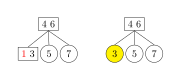
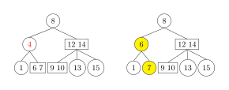
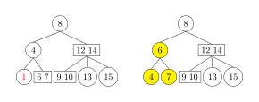
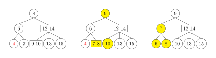
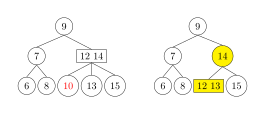
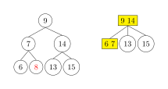
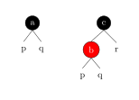
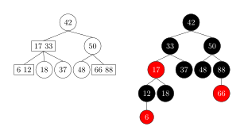

本页面介绍 2-3 树。2-3 树是一种多路搜索树，是绝对平衡的树，其所有叶节点都处于同一层级上。2-3 树是 3 阶 B 树。

## 定义

2-3 树中的每一个节点都有两个孩子（称为 2 节点，2-node）或三个孩子（称为 3 节点，3-node)。

-   2 节点，有一个数据元素和两个孩子。只能有两个孩子或没有孩子，不能出现只有一个孩子的情况。如果 2 节点有孩子，左子树包含的元素小于 $a$，右子树包含的元素大于 $a$。

    

-   3 节点，有两个数据元素和三个孩子。只能有三个孩子或没有孩子，不能出现有一个孩子或有两个孩子的情况。如果 3 节点有孩子，左子树包含小于较小元素的元素，右子树包含大于较大元素的元素，中间子树包含介于两元素之间的元素。

    

-   4 节点，有三个数据元素。只会在操作树时暂时创建，而不会永久存储在树上。

2-3 树的叶节点不含有子节点，有一个或两个数据元素。

树 $T$ 是一个 2-3 树，当且仅当以下表述之一成立：

1.  $T$ 是空树。
2.  $T$ 是一个 2 节点，并带有元素 $a$。如果 $T$ 有左孩子 $p$ 和右孩子 $q$，则：
    -   $p$ 和 $q$ 是相同高度的 2-3 树。
    -   $a$ 大于 $p$ 中的每个元素。
    -   $a$ 小于 $q$ 中的每个数据元素。
3.  $T$ 是一个 3 节点，并带有数据元素 $a$ 和 $b$，其中 $a$ 小于 $b$。如果 $T$ 有左孩子 $p$，中间孩子 $q$ 和右孩子 $r$，则：
    -   $p$、$q$ 和 $r$ 是相等高度的 2-3 树。
    -   $a$ 大于 $p$ 中的每个数据元素且小于 $q$ 中的每个数据元素。
    -   $b$ 大于 $q$ 中的每个数据元素且小于 $r$ 中的每个数据元素。

## 性质

-   所有内部节点都是 2 节点或 3 节点。
-   所有叶节点都在同一层级上。
-   树上的所有数据都是按顺序保存的（多路搜索树的性质）。

## 操作

### 查找

由于 2-3 树上的元素是按一定顺序存储的，所以 2-3 树的查找与二叉搜索树类似。下面在树 $T$ 中查找元素 $d$。

1.  如果 2–3 树 $T$ 为空，那么 $d$ 肯定不在 $T$ 中，查找结束。
2.  假设 $t$ 是 $T$ 的根节点。
3.  如果 $t$ 是一个叶子节点：
    -   如果 $d$ 不在节点 $t$ 中，那么 $d$ 肯定不在整个树 $T$ 中，查找结束。
    -   如果 $d$ 在节点 $t$ 中，那么 $d$ 在树 $T$ 中，查找成功结束。
4.  假设 $t$ 是一个 "2 节点"，具有左子节点 $p$ 和右子节点 $q$，$a$ 是节点 $t$ 中的数据元素。有以下三种情况：
    -   如果 $d$ 等于 $a$，那么找到 $d$ 在树 $T$ 中，查找成功结束。
    -   如果 $d$ 小于 $a$，将 $T$ 设为子树 $p$，并回到步骤 2 继续查找。
    -   如果 $d$ 大于 $a$，将 $T$ 设为子树 $q$，并回到步骤 2 继续查找。
5.  假设 $t$ 是一个 "3 节点"，具有左子节点 $p$、中间子节点 $q$ 和右子节点 $r$，$a$ 和 $b$ 是节点 $t$ 中的两个数据元素，满足 $a<b$。有以下四种情况：
    -   如果 $d$ 等于 $a$ 或 $b$，那么找到 $d$ 在树 $T$ 中，查找成功结束。
    -   如果 $d$ 小于 $a$，将 $T$ 设为子树 $p$，回到步骤 2 继续查找。
    -   如果 $d$ 在 $a$ 和 $b$ 之间，将 $T$ 设为子树 $q$，回到步骤 2 继续查找。
    -   如果 $d$ 大于 $b$，将 $T$ 设为子树 $r$，回到步骤 2 继续查找。

### 插入

插入节点需要维持树的平衡。

对于空树，直接插入一个 2 节点即可。此外，为了保持完美平衡性，向 2-3 树添加元素不会直接添加到空节点，而是先进行搜索，将待插入元素添加到最后搜索到的叶子节点，与它融合。

1.  如果插入 2 节点，则融合形成 3 节点。如下图插入元素 4。

    

2.  如果插入 3 节点，则先融合形成 4 节点，再拆解形成 2 个 2 节点。

    -   如果父节点为 2 节点，则中间元素上移与父节点融合形成 3 节点。如下图插入元素 10。

        

    -   如果父节点为 3 节点，则重复步骤 2。如下图插入元素 1。

        

通过上述深度增加的例子，可以看出 2-3 树和标准二叉树不同，标准的二叉树的的深度是由上到下的增加的，而 2-3 树的深度是由下至上的增加的。

## 删除

删除节点需要维持树的平衡。2-3 树的删除可以分为三种情况。

1.  待删除元素位于一个 3 节点的叶子节点上。只需要在该节点处删除该元素即可，不会影响到整棵树的其他节点结构。

2.  待删除的元素位于非叶子的分支节点。通常先按中序遍历后得到此元素的前驱或后继元素，让他们来补位，再删除用于补位的前驱或后继元素。如果我们要删除的分支节点是 2 节点，如上下图所示，待删除的元素是 4，前驱是 1，后继是 6，显然 $(6，7)$ 是 3 节点，只需要用 6 来补位即可。这里就不讲解删除的分支节点是 3 节点的情况了，与上述类似。

3\.  所删除的元素位于一个 2 节点上。如果删除一个 2 节点，很有可能造成 2-3 树平衡破坏的情况，因为对于每一个 2 节点，要么有两个子树要么没有，对于每一个 3 节点要么有三个子树要么没有，贸然删除一个 2 节点，很可能出现平衡遭到破坏，所以我们需要分情况讨论。

1.  此节点的父亲节点是 2 节点，兄弟节点是 3 节点。将父亲节点移动到当前位置，再将兄弟节点中最接近当前位置的元素移动到父亲节点中。如下图所示，待删除元素为 1。

    

2.  此节点的父亲节点是 2 节点，兄弟节点也是 2 节点。先通过移动兄弟节点中序遍历的直接后驱到兄弟节点，使兄弟节点变为 3 节点，再进行上述 3.1 的操作。如下图所示，待删除元素为 4，如果直接执行上述 3.1 的操作会造成没有右孩子，因此需要对整棵树变形。通过移动兄弟节点 7 中序遍历的直接后驱 8 到兄弟节点，让节点 7 变成 3 节点，再让比 8 大的 9 补充到 8 的位置，最后再执行上述 3.1 的操作。

    

3.  此节点的父亲节点是 3 节点。拆分父亲节点使其成为 2 节点，再将父亲节点中最接近删除元素的元素与中孩子合并，将合并后的节点作为当前节点。如下图所示，待删除元素为 10。

    

4.  当前 2-3 树是一个满二叉树。将 2-3 树的层数减少，并将兄弟节点合并到父亲节点中，同时将父亲节点的所有兄弟节点合并到父亲节点的父亲节点中，如果生成了 4 节点，再分解 4 节点即可。

    

### 并行操作（Parallel operations）

由于 2-3 树在结构上与红黑树相似，因此红黑树的并行算法也可以应用于 2-3 树。

## 2-3 树和左偏红黑树

2-3 树和左偏红黑树实质是等价的。2-3 树中一个节点可以存储 1 个元素或 2 个元素，而红黑树的一个节点只能存储一个元素。如下图所示，2-3 树的 2 节点对应一个黑色节点，3 节点对应一个红色节点和一个黑色节点（可以将 bc 视作平行）。

下图是一棵 2-3 树对应的左偏红黑树。

## 参考资料

1.  [2–3 tree](https://en.wikipedia.org/wiki/2%E2%80%933_tree)
2.  [17、2 - 3 树](https://www.cnblogs.com/lidong422339/p/17306209.html)
3.  [多路查找树 ---2-3 树和 2-3-4 树的深入理解](https://www.cnblogs.com/lishanlei/p/10707791.html)
