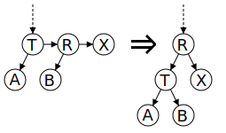

AA 树是一种用于高效存储和检索有序数据的平衡树形结构，Arne Andersson 教授于 1993 年在他的论文 "Balanced search trees made simple" 中介绍，设计的目的是减少红黑树考虑的不同情况。AA 树可以在 $O(\log N)$ 的时间内做查找，插入和删除。下面是一个 AA 树的例子。

AA 树是红黑树的一种变体，与红黑树不同，AA 树上的红色节点只能作为右子节点。这导致 AA 树模拟了 2-3 树而不是 2-3-4 树，从而极大地简化了维护操作。红黑树的维护算法需要考虑七种不同的情况来正确平衡树。

因为红色节点只能作为右子节点，AA 树只需要考虑两种情况。

## 定义

AA 树遵循与红黑树相同的规则，但添加了一条新规则，**即红色节点不能作为左孩子出现**。

1.  每个节点都可以是红色或黑色。
2.  根节点总是黑色。
3.  叶节点（NULL）总是黑色。
4.  红色节点的两个子节点必须都是黑色，即没有两个相邻的红色节点。
5.  从根节点到 NULL 节点的每条路径都有相同数量的黑色节点。
6.  红色节点只能作为右子节点。

## 平衡维护

AA 树的每个节点维护一个 **level** 字段，类似红黑树的每个节点维护一个 color 字段 ("RED" or "BLACK")。level 的规定满足以下 5 个条件：

1、每个叶节点的 level 是 1。

2、每个左孩子的 level 是其父节点的 level 减 1。

3、每个右孩子的 level 等于其父节点的 level 或等于其父节点的 level 减 1。

4、每个右孙子的 level 严格小于其祖父节点的 level。

5、每个 level 大于 1 的节点有两个孩子。

### 水平链接（Horizontal Link）

子节点的 level 等于父节点的 level 的链接被称为 **水平链接**，类似于红黑树中的红链接。允许单独的右水平链接，但不允许连续的右水平链接；不允许左水平链接。这些限制比红黑树的限制更加严格，因此 AA 树的平衡过程比红黑树的平衡过程在程序上要简单得多。

插入和删除操作可能会暂时导致 AA 树失去平衡（即违反 AA 树的不变性）。恢复平衡只需要两种不同的操作："**skew**"（斜化）和"**split**"（分裂）。"Skew"是将一个包含左水平链接的子树进行右旋转，以替换为一个包含右水平链接的子树。"Split"是进行左旋转并增加 level，以替换一个包含两个或更多连续的右水平链接的子树，使其变为一个包含两个较少连续的右水平链接的子树。保持平衡的插入和删除的实现通过依赖"skew"和"split"操作来仅在需要时修改树，而不是由调用者决定是否进行"skew"或"split"，从而变得更加简化。

### split（左旋）

出现连续向右的水平方向链（连续三个向右的孩子属于同一 level，节点 R 和节点 X 都是红色节点）。

此时向左旋转节点*T*，把小于等于此 level 的节点看做一个子树。

1.  子树的根的右孩子变为新的子树根；
2.  原来的子树根变为新子树根的左孩子；
3.  新的子树根 level+1。

???+ note "伪代码实现"
    $$
    \begin{array}{ll}
    1 & \textbf{function } \text{split}(\text{root}) \\
    2 & \qquad \textbf{if } \text{root}\rightarrow\text{right}\rightarrow\text{right}\rightarrow\text{level} == \text{root}\rightarrow\text{level} \\
    3 & \qquad\qquad \text{rotate\_left}(\text{root}) \\
    4 & \textbf{end function}
    \end{array}
    $$

### skew（右旋）

出现向左的水平方向链（连续两个向左的孩子属于同一 level）

向右旋转节点*T*，把小于等于此 level 的节点看做一个子树。

1.  子树的根的左孩子变为新的子树根；
2.  原来的子树根变为新子树根的右孩子。

???+ note "伪代码实现"
    $$
    \begin{array}{ll}
    1 & \textbf{function } \text{skew}(\text{root}) \\
    2 & \qquad \textbf{if } \text{root}\rightarrow\text{left}\rightarrow\text{level} == \text{root}\rightarrow\text{level} \\
    3 & \qquad\qquad \text{rotate\_right}(\text{root}) \\
    4 & \textbf{end function}
    \end{array}
    $$

## AA 树的操作

AA 树本身是一棵二叉搜索树，所以搜索操作与其他二叉搜索树相同。插入和删除操作与*AVL*树相同，首先在树中将 key 插入或删除，然后沿着搜索路径回退到根，并在此过程中重构树。

### 插入

???+ note "伪代码实现"
    $$
    \begin{array}{ll}
    1 & \textbf{function } \text{insert}(\text{root}, \text{add}) \\
    2 & \qquad \textbf{if } \text{root} == \text{NULL} \\
    3 & \qquad\qquad \text{root} \gets \text{add} \\
    4 & \qquad \textbf{else if } \text{add}\rightarrow\text{key} < \text{root}\rightarrow\text{key} \qquad //如果允许重复<= \\ 
    5 & \qquad\qquad \text{insert}(\text{root}\rightarrow\text{left}, \text{add}) \\
    6 & \qquad \textbf{else if } \text{add}\rightarrow\text{key} > \text{root}\rightarrow\text{key} \\
    7 & \qquad\qquad \text{insert}(\text{root}\rightarrow\text{right}, \text{add}) \\
    8 & \qquad \textbf{end if} \\
    9 & \qquad \text{//如果不允许重复，在每一level上进行skew和split} \\
    10 & \qquad \text{skew}(\text{root}); \\
    11 & \qquad \text{split}(\text{root}); \\
    12 & \textbf{end function}
    \end{array}
    $$

### 删除

删除过程与其他二叉平衡树类似，首先将内部节点的删除转换为叶子节点的删除。具体方法是将内部节点与它最接近的前驱或后继节点替换。由于 AA 树的所有 level 大于 1 的节点都有两个子节点，前驱或后继节点将位于 level 1，删除 level 1 的节点较为简单。

???+ note "伪代码实现"
    $$
    \begin{array}{ll}
    1 &  \text{//To rebalance the tree} \\
    2 &  \textbf{if} \ \text{root->left->level} < \text{root->level} -1 \ \textbf{or} \ \text{root->right->level} < \text{root->level} -1 \\
    3 &  \{ \\
    4 & \qquad \textbf{if} \ \text{root->right->level} > \text{--root->level} \\
    5 & \qquad \{ \\
    6 & \qquad\qquad \text{root->right->level} \gets \text{root->level} \\
    7 & \qquad \} \\
    8 & \qquad \text{skew}(\text{root}) \\
    9 & \qquad \text{skew}(\text{root->right}) \\
    10 & \qquad \text{skew}(\text{root->right->right}) \\
    11 & \qquad \text{split}(\text{root}) \\
    12 & \qquad \text{split}(\text{root->right}) \\
    13 &  \} \\
    \end{array}
    $$

## 性能

AA 树的性能与红黑树的性能相当。尽管 AA 树进行的旋转操作比红黑树多，但 AA 树的算法更简单，最终导致相近的性能。红黑树的性能在各种情况下更加一致，而 AA 树往往更扁平，这使 AA 树有稍快的搜索速度。

## 参考资料

1.  [AA tree - Wikipedia](https://en.wikipedia.org/wiki/AA_tree)
2.  [Introduction to AA trees](https://iq.opengenus.org/aa-trees/)
