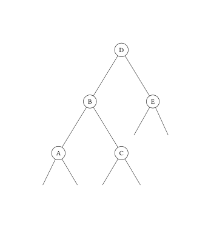
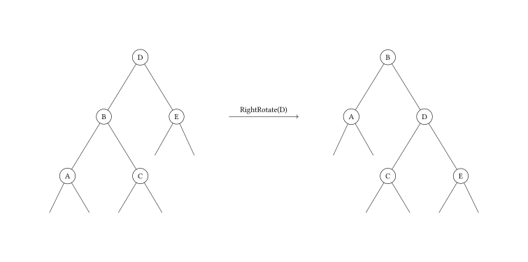
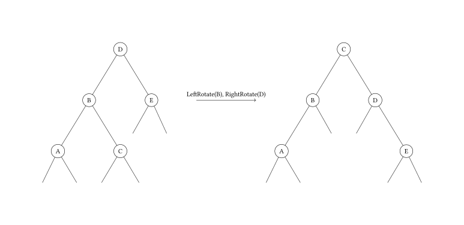

AVL 树，是一种平衡的二叉搜索树．由于各种算法教材上对 AVL 的介绍十分冗长，造成了很多人对 AVL 树复杂、不实用的印象．但实际上，AVL 树的原理简单，实现也并不复杂．

## 性质

1.  空二叉树是一个 AVL 树
2.  如果 T 是一棵 AVL 树，那么其左右子树也是 AVL 树，并且 $|h(ls) - h(rs)| \leq 1$，h 是其左右子树的高度
3.  树高为 $O(\log n)$

平衡因子：右子树高度 - 左子树高度

???+ note "树高的证明"
    设 $f_n$ 为高度为 $n$ 的 AVL 树所包含的最少节点数，则有
    
    $$
    f_n=
    \begin{cases}
    1&(n=1)\\
    2&(n=2)\\
    f_{n-1}+f_{n-2}+1& (n>2)
    \end{cases}
    $$
    
    根据常系数非齐次线性差分方程的解法，$\{f_n+1\}$ 是一个斐波那契数列．这里 $f_n$ 的通项为：
    
    $$
    f_n=\frac{5+2\sqrt{5}}{5}\left(\frac{1+\sqrt{5}}{2}\right)^n+\frac{5-2\sqrt{5}}{5}\left(\frac{1-\sqrt{5}}{2}\right)^n-1
    $$
    
    斐波那契数列以指数的速度增长，对于树高 $n$ 有：
    
    $$
    n<\log_{\frac{1+\sqrt{5}}{2}} (f_n+1)<\frac{3}{2}\log_2 (f_n+1)
    $$
    
    因此 AVL 树的高度为 $O(\log f_n)$，这里的 $f_n$ 为结点数．

## 过程

### 插入结点

与 BST（二叉搜索树）中类似，先进行一次失败的查找来确定插入的位置，插入节点后根据平衡因子来决定是否需要调整．

### 删除结点

删除和 BST 类似，将结点与后继交换后再删除．

删除会导致树高以及平衡因子变化，这时需要沿着被删除结点到根的路径来调整这种变化．

### 平衡的维护

插入或删除节点后，可能会造成 AVL 树的性质 2 被破坏．因此，需要沿着从被插入/删除的节点到根的路径对树进行维护．如果对于某一个节点，性质 2 不再满足，由于我们只插入/删除了一个节点，对树高的影响不超过 1，因此该节点的平衡因子的绝对值至多为 2．由于对称性，我们在此只讨论左子树的高度比右子树大 2 的情况，即下图中 $h(B)-h(E)=2$．此时，还需要根据 $h(A)$ 和 $h(C)$ 的大小关系分两种情况讨论．需要注意的是，由于我们是自底向上维护平衡的，因此对节点 D 的所有后代来说，性质 2 仍然是被满足的．



#### 情况一：A 点树高不小于 C 点树高

设 $h(E)=x$，则有

$$
\begin{cases}
    h(B)=x+2\\
    h(A)=x+1\\
    x\leq h(C)\leq x+1
\end{cases}
$$

其中 $h(C)\geq x$ 是由于节点 B 满足性质 2，因此 $h(C)$ 和 $h(A)$ 的差不会超过 1．此时我们对节点 D 进行一次右旋操作（旋转操作与其它类型的平衡二叉搜索树相同），如下图所示．



显然节点 A、C、E 的高度不发生变化，并且有

$$
\begin{cases}
    0\leq h(C)-h(E)\leq 1\\
    x+1\leq h'(D)=\max(h(C),h(E))+1=h(C)+1\leq x+2\\
    0\leq h'(D)-h(A)\leq 1
\end{cases}
$$

因此旋转后的节点 B 和 D 也满足性质 2．

#### 情况二：A 点树高小于 C 点树高

设 $h(E)=x$，则与刚才同理，有

$$
\begin{cases}
    h(B)=x+2\\
    h(C)=x+1\\
    h(A)=x
\end{cases}
$$

此时我们先对节点 B 进行一次左旋操作，再对节点 D 进行一次右旋操作，如下图所示．



显然节点 A、E 的高度不发生变化，并且 B 的新右儿子和 D 的新左儿子分别为 C 原来的左右儿子，则有

$$
\begin{cases}
    x-1\leq h'(rs_B),h'(ls_D)\leq x\\
    0\leq h(A)-h'(rs_B)\leq 1\\
    0\leq h(E)-h'(ls_D)\leq 1\\
    h'(B)=\max(h(A),h'(rs_B))+1=x+1\\
    h'(D)=\max(h(E),h'(ls_D))+1=x+1\\
    h'(B)-h'(D)=0
\end{cases}
$$

因此旋转后的节点 B、C、D 也满足性质 2．

???+ note "维护平衡操作：伪代码"
    $$
    \begin{array}{ll}
    1 &  \textbf{function } \mathrm{MaintainBalance}(p) \\
    2 &  \qquad l \gets ls_p, r \gets rs_p \\
    3 &  \qquad \textbf{if } h(l)-h(r)=2 \\
    4 &  \qquad\qquad \textbf{if } h(ls_l) \ge h(rs_l) \\
    5 &  \qquad\qquad\qquad \mathrm{RightRotate}(p) \\
    6 &  \qquad\qquad \textbf{else} \\
    7 &  \qquad\qquad\qquad \mathrm{LeftRotate}(l) \\
    8 &  \qquad\qquad\qquad \mathrm{RightRotate}(p) \\
    9 &  \qquad \textbf{else if } h(l)-h(r)=-2 \\
    10 &  \qquad\qquad \textbf{if } h(ls_r) \le h(rs_r) \\
    11 &  \qquad\qquad\qquad \mathrm{LeftRotate}(p) \\
    12 &  \qquad\qquad \textbf{else} \\
    13 &  \qquad\qquad\qquad \mathrm{RightRotate}(r) \\
    14 &  \qquad\qquad\qquad \mathrm{LeftRotate}(p) \\
    \end{array}
    $$

与其他平衡二叉搜索树相同，AVL 树中节点的高度、子树大小等信息需要在旋转时进行维护．

## 其他操作

AVL 树的其他操作（Predecessor、Successor、Select、Rank 等）与普通的二叉搜索树相同．

## 参考代码

下面是 AVL 树做 [洛谷 P3369【模板】普通平衡树](https://www.luogu.com.cn/problem/P3369) 完整的代码：

??? note "[洛谷 P3369【模板】普通平衡树](https://www.luogu.com.cn/problem/P3369)"
    ```cpp
    ```

\#include \<bits/stdc++.h>
using namespace std;

using i64 = long long;
using u64 = unsigned long long;
using u32 = unsigned;

using i128 = \_\_int128;
using u128 = unsigned \_\_int128;

mt19937\_64 mrand((u64)random\_device{}() << 32 ^ random\_device{}() ^
chrono::high\_resolution\_clock::now().time\_since\_epoch().count());
template<class T = i64,class T2>T rnd(T l,T2 r){
return uniform\_int\_distribution<T>(l,r)(mrand);}

struct node{int key = 0,sz = 0,s\[2] = {},f = 0,d = 0;//为了把左旋和右旋写得对称一点，我们把 l 和 r 改成 s\[0] 和 s\[1]
bool operator < (const node &oth) const {return key < oth.key;}
}a\[200010];

int mknew(int key){
static int top = 0;
a\[++top] = {key,1,{},0,1};
return top;
}

bool isr(int x){return x == a\[a\[x].f].s\[1];}

int head;

void setf(int x,bool id,int f){
a\[f].s\[id] = x;
if (x) a\[x].f = f;
}

void update(int x){
if (!x) return ;
a\[x].sz = a\[a\[x].s\[0]].sz + 1 + a\[a\[x].s\[1]].sz;
a\[x].d = max(a\[a\[x].s\[0]].d,a\[a\[x].s\[1]].d) + 1;
}

void rot(int x){
/\*
g                g
/\\/  
/\\/  
f        ->      x
/\       <-/  
/\\/  
x     b          l     f
/\\/\\/\\/  
l   r                  r   b
/\\/\\/\\/  
\*/
int f = a\[x].f,b = isr(x),c = isr(f);
if (f == head) a\[x].f = 0,head = x;
else setf(x,c,a\[f].f);
setf(a\[x].s\[!b],b,f);
setf(f,!b,x);
update(f);
update(x);
}

void upd(int x){//自底向上递归更新路径信息
for (;x;x = a\[x].f)
update(x);
}

void balance(int x){//更新路径信息并平衡
upd(x);

    for (;x;x = a[x].f){
      if (a[a[x].s[0]].d - a[a[x].s[1]].d > 1){
        if (a[a[a[x].s[0]].s[0]].d >= a[a[a[x].s[0]].s[1]].d)
          rot(x = a[x].s[0]);
        else
          rot(x = a[a[x].s[0]].s[1]),rot(x);
      }else if (a[a[x].s[1]].d - a[a[x].s[0]].d > 1){
        if (a[a[a[x].s[1]].s[0]].d >= a[a[a[x].s[1]].s[1]].d)
          rot(x = a[x].s[1]);
        else
          rot(x = a[a[x].s[1]].s[1]),rot(x);
      }
    }

}

void insert(int x){
int nd = mknew(x);

    if (!head){//空树
      head = nd;
      return ;
    }

    x = head;
    bool to;

    for (;;){
      to = (a[nd] < a[x]?0:1);
      
      if (!a[x].s[to])
        break;
      
      x = a[x].s[to];
    }

    a[x].s[to] = nd;
    a[nd].f = x;
    x = nd;//插入到树中

    balance(x);

}

void erase(int x){
int nd = head;

    for (;nd;){
      if (a[nd].key == x)
        break;
      
      if (a[nd].key < x)
        nd = a[nd].s[1];
      else
        nd = a[nd].s[0];
    }

    if (!a[nd].s[0])//被删除的是根节点且根节点没有右儿子
      if (nd == head)
        nd = head = a[nd].s[1],a[a[nd].s[1]].f = 0;
      else
        setf(a[nd].s[1],isr(nd),a[nd].f),nd = a[nd].f;
    else{//其他情况
      int x = a[nd].s[0];
      
      for (;a[x].s[1];x = a[x].s[1]);
      
      swap(a[x].key,a[nd].key);
      
      nd = a[x].f;//从这里开始维护平衡
      setf(a[x].s[0],isr(x),a[x].f);
    }

    balance(nd);

}
//平衡树常识啦！
int Rank(int x){
int ans = 1,nd = head;

    for (;nd;)
      if (a[nd].key < x)
        ans += a[a[nd].s[0]].sz + 1,nd = a[nd].s[1];
      else
        nd = a[nd].s[0];

    return ans;

}

int kth(int x){
int nd = head;

    for (;nd;)
      if (a[a[nd].s[0]].sz < x){
        x -= a[a[nd].s[0]].sz + 1;
        
        if (!x)
          return a[nd].key;
        
        nd = a[nd].s[1];
      }else
        nd = a[nd].s[0];

    abort();

}

int Prev(int x){
return kth(Rank(x) - 1);
}

int Next(int x){
int nd = head,ans = 0;

    for (;nd;)
      if (a[nd].key <= x)
        nd = a[nd].s[1];
      else
        ans = a[nd].key,nd = a[nd].s[0];

    return ans;

}

int main (){ios::sync\_with\_stdio(0);
cin.tie(0),cout.tie(0);

    int n;
    cin >> n;

    for (;n--;){
      int op,x;
      cin >> op >> x;
      
      switch (op){
      case 1:
        insert(x);
        break;
      case 2:
        erase(x);
        break;
      case 3:
        cout << Rank(x) << '\n';
        break;
      case 4:
        cout << kth(x) << '\n';
        break;
      case 5:
        cout << Prev(x) << '\n';
        break;
      case 6:
        cout << Next(x) << '\n';
        break;
      }
    }

}
\`\`\`

下面的代码是用 AVL 树实现的 `Map`，即有序不可重映射：

??? note "参考代码"
    ```cpp
    --8<-- "docs/ds/code/avl-tree/AvlTreeMap.hpp"
    ```

## 其他资料

在 [AVL Tree Visualization](https://www.cs.usfca.edu/~galles/visualization/AVLtree.html) 可以观察 AVL 树维护平衡的过程．

[维基百科 -- AVL 树](https://en.wikipedia.org/wiki/AVL_tree)
