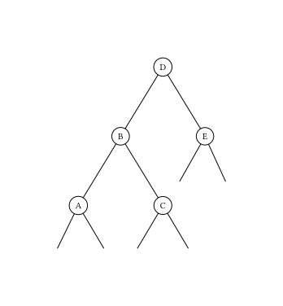

AVL 树，是一种平衡的二叉搜索树。由于各种算法教材上对 AVL 的介绍十分冗长，造成了很多人对 AVL 树复杂、不实用的印象。但实际上，AVL 树的原理简单，实现也并不复杂。

## 性质

1.  空二叉树是一个 AVL 树
2.  如果 T 是一棵 AVL 树，那么其左右子树也是 AVL 树，并且 $|h(ls) - h(rs)| \leq 1$，h 是其左右子树的高度
3.  树高为 $O(\log n)$

定义 AVL 树上一个节点的 **平衡因子** 为其右子树高度减去其左子树高度。

???+ note "树高的证明"
    设 $f_n$ 为高度为 $n$ 的 AVL 树所包含的最少节点数，则有
    
    $$
    f_n=
    \begin{cases}
    1&(n=1)\\
    2&(n=2)\\
    f_{n-1}+f_{n-2}+1& (n>2)
    \end{cases}
    $$
    
    根据常系数非齐次线性差分方程的解法，$\{f_n+1\}$ 是一个斐波那契数列。这里 $f_n$ 的通项为：
    
    $$
    f_n=\frac{5+2\sqrt{5}}{5}\left(\frac{1+\sqrt{5}}{2}\right)^n+\frac{5-2\sqrt{5}}{5}\left(\frac{1-\sqrt{5}}{2}\right)^n-1
    $$
    
    斐波那契数列以指数的速度增长，对于树高 $n$ 有：
    
    $$
    n<\log_{\frac{1+\sqrt{5}}{2}} (f_n+1)<\frac{3}{2}\log_2 (f_n+1)
    $$
    
    因此 AVL 树的高度为 $O(\log f_n)$，这里的 $f_n$ 为结点数。

## 过程

### 平衡的维护

维护平衡是 AVL 树的核心操作，其通过旋转操作来完成。

插入或删除节点后，可能会造成 AVL 树中某棵子树的性质 2 被破坏（称之为该子树 **失衡**）。因此，需要沿着从被插入/删除的节点到根的路径对树进行维护。如果对于某一个节点，性质 2 不再满足，由于我们只插入/删除了一个节点，对树高的影响不超过 1，因此该节点的平衡因子的绝对值至多为 2。由于对称性，我们在此只讨论左子树的高度比右子树大 2 的情况，即下图中 $h(B)-h(E)=2$。此时，还需要根据 $h(A)$ 和 $h(C)$ 的大小关系分两种情况讨论。需要注意的是，由于我们是自底向上维护平衡的，因此对节点 D 的所有后代来说，性质 2 仍然是被满足的。



#### $h(A)\geq h(C)$

设 $h(E)=x$，则有

$$
\begin{cases}
    h(B)=x+2\\
    h(A)=x+1\\
    x\leq h(C)\leq x+1
\end{cases}
$$

其中 $h(C)\geq x$ 是由于节点 B 满足性质 2，因此 $h(C)$ 和 $h(A)$ 的差不会超过 1。此时我们对节点 D 进行一次右旋操作（旋转操作与其它类型的平衡二叉搜索树相同），如下图所示。


显然节点 A、C、E 的高度不发生变化，并且有

$$
\begin{cases}
    0\leq h(C)-h(E)\leq 1\\
    x+1\leq h'(D)=\max(h(C),h(E))+1=h(C)+1\leq x+2\\
    0\leq h'(D)-h(A)\leq 1
\end{cases}
$$

因此旋转后的节点 B 和 D 也满足性质 2。

#### $h(A)<h(C)$

设 $h(E)=x$，则与刚才同理，有

$$
\begin{cases}
    h(B)=x+2\\
    h(C)=x+1\\
    h(A)=x
\end{cases}
$$

此时我们先对节点 B 进行一次左旋操作，再对节点 D 进行一次右旋操作，如下图所示。


显然节点 A、E 的高度不发生变化，并且 B 的新右儿子和 D 的新左儿子分别为 C 原来的左右儿子，则有

$$
\begin{cases}
    x-1\leq h'(rs_B),h'(ls_D)\leq x\\
    0\leq h(A)-h'(rs_B)\leq 1\\
    0\leq h(E)-h'(ls_D)\leq 1\\
    h'(B)=\max(h(A),h'(rs_B))+1=x+1\\
    h'(D)=\max(h(E),h'(ls_D))+1=x+1\\
    h'(B)-h'(D)=0
\end{cases}
$$

因此旋转后的节点 B、C、D 也满足性质 2。

???+ note "维护平衡操作：伪代码"
    $$
    \begin{array}{ll}
    1 &  \textbf{function } \mathrm{MaintainBalance}(p) \\
    2 &  \qquad l \gets ls_p, r \gets rs_p \\
    3 &  \qquad \textbf{if } h(l)-h(r)=2 \\
    4 &  \qquad\qquad \textbf{if } h(ls_l) \ge h(rs_l) \\
    5 &  \qquad\qquad\qquad \mathrm{RightRotate}(p) \\
    6 &  \qquad\qquad \textbf{else} \\
    7 &  \qquad\qquad\qquad \mathrm{LeftRotate}(l) \\
    8 &  \qquad\qquad\qquad \mathrm{RightRotate}(p) \\
    9 &  \qquad \textbf{else if } h(l)-h(r)=-2 \\
    10 &  \qquad\qquad \textbf{if } h(ls_r) \le h(rs_r) \\
    11 &  \qquad\qquad\qquad \mathrm{LeftRotate}(p) \\
    12 &  \qquad\qquad \textbf{else} \\
    13 &  \qquad\qquad\qquad \mathrm{RightRotate}(r) \\
    14 &  \qquad\qquad\qquad \mathrm{LeftRotate}(p) \\
    \end{array}
    $$

与其他平衡二叉搜索树相同，AVL 树中节点的高度、子树大小等信息需要在旋转时进行维护。

### 插入节点

与 BST（二叉搜索树）中类似，先进行一次失败的查找来确定插入的位置，插入节点后根据平衡因子来决定是否需要调整。

插入一个新的节点后，由于可能导致子树高度的增加，从新节点的祖父节点开始上溯，可能同时有多个节点失衡。然而，在通过旋转使其恢复平衡之后，由于子树高度的复原，更高的节点也必然会恢复平衡，相当于 **最多做**  $O(1)$ **次旋转操作即可恢复整棵 AVL 树的平衡**。

### 删除节点

删除和 BST 类似，将结点与后继交换后再删除。

删除操作可能减少被删除节点所在子树的高度，从而导致平衡因子发生变化。若发生节点的失衡，在通过旋转恢复平衡之后，由于子树高度未必会复原，更高的节点可能会发生新的失衡。因此，删除操作之后的平衡调整需要一路上溯到根节点，相当于 **最多做**  $O(\log n)$ **次旋转操作才能恢复整棵 AVL 树的平衡**。

### 其他操作

AVL 树的其他操作（Predecessor、Successor、Select、Rank 等）与普通的二叉搜索树相同。

## 参考代码

这里给出一种 OI 风格的 AVL 树实现，仅包含恢复平衡、插入和删除三种操作：

??? note "参考代码"
    ```cpp
    int root, tot, fa[N], ch[N][2], val[N], h[N];
    
    void push_up(int x) { h[x] = max(h[ch[x][0]], h[ch[x][1]]) + 1; }  // 维护树高
    
    bool get_which(int x) { return x == ch[fa[x]][1]; }  // lc -> 0, rc -> 1
    
    // 旋转函数，与通常的 splay 等平衡树的实现类似
    void rotate(int x)  // x is lc -> right, x is rc -> left
    {
      int f = fa[x], gf = fa[f];
      bool which = get_which(x);
      ch[f][which] = ch[x][which ^ 1];  // 将 x 的左子树挂到 f 的右子树，或对称
      if (ch[x][which ^ 1]) fa[ch[x][which ^ 1]] = f;
      ch[x][which ^ 1] = f;
      fa[f] = x;
      fa[x] = gf;                          // 更新父亲
      if (gf) ch[gf][f == ch[gf][1]] = x;  // 更新祖父的儿子
      push_up(f);
      push_up(x);            // 更新高度
      if (!fa[x]) root = x;  // 需要更新根节点
    }  // 将 x 转到其父的位置
    
    void balance_ins(int x)  // 在插入后维护平衡
    {
      while (x) {
        if (h[ch[x][0]] - h[ch[x][1]] > 1)  // 失衡，且左子树更高
        {
          if (h[ch[ch[x][0]][1]] > h[ch[ch[x][0]][0]])  // 左子树的右子树更高
            rotate(ch[ch[x][0]][1]);                    // 旋转更高的子树
          rotate(ch[x][0]);
          break;  // 维护结束
        } else if (h[ch[x][1]] - h[ch[x][0]] > 1) {
          if (h[ch[ch[x][1]][0]] > h[ch[ch[x][1]][1]])  // 右子树的左子树更高
            rotate(ch[ch[x][1]][0]);
          rotate(ch[x][1]);
          break;
        }
        push_up(x);
        x = fa[x];
      }
    }
    
    void balance_del(int x)  // 在删除后维护平衡。区别在于，要一路维护平衡到根
    {
      while (x) {
        if (h[ch[x][0]] - h[ch[x][1]] > 1)  // 失衡，且左子树更高
        {
          if (h[ch[ch[x][0]][1]] > h[ch[ch[x][0]][0]])  // 左子树的右子树更高
            rotate(ch[ch[x][0]][1]);
          rotate(ch[x][0]);
        } else if (h[ch[x][1]] - h[ch[x][0]] > 1) {
          if (h[ch[ch[x][1]][0]] > h[ch[ch[x][1]][1]])  // 右子树的左子树更高
            rotate(ch[ch[x][1]][0]);
          rotate(ch[x][1]);
        }
        push_up(x);
        x = fa[x];
      }
    }
    
    void insert(int k)  // 插入操作
    {
      if (!root)  // 树为空
      {
        val[++tot] = k;
        root = tot;
        push_up(root);
        return;
      }
      int cur = root, f = 0;
      while (1) {
        f = cur;
        cur = ch[cur][val[cur] < k];  // 如果当前值 < k，则查找右子树
        if (!cur)                     // 空节点
        {
          val[++tot] = k;
          fa[tot] = f;
          ch[f][val[f] < k] = tot;
          push_up(tot);
          push_up(f);
          balance_ins(f);  // 维护平衡
          break;
        }
      }
    }
    
    int pre(int x)  // 求前驱
    {
      int cur = ch[x][0];
      if (!cur) return cur;
      while (ch[cur][1]) cur = ch[cur][1];
      return cur;
    }
    
    void del(int k) {
      int cur = root, f = 0;
      while (cur && val[cur] != k)  // 查找目标节点
      {
        f = cur;
        cur = ch[cur][k > val[cur]];
      }
      if (!cur) return;              // 未找到，直接返回
      if (ch[cur][0] && ch[cur][1])  // 如果有两个子节点
      {
        int pred = pre(cur);   // 找到前驱
        val[cur] = val[pred];  // 交换
        cur = pred;            // 转换为删除前驱
      }
      int child = ch[cur][0] ? ch[cur][0] : ch[cur][1];  // 至多只有一个子节点
      if (child) fa[child] = fa[cur];
      if (fa[cur])
        ch[fa[cur]][get_which(cur)] = child;
      else
        root = child;        // 如果是根节点，直接更新
      balance_del(fa[cur]);  // 维护平衡
    }
    ```

下面的代码是用 AVL 树实现的 `Map`，即有序不可重映射：

??? note "参考代码"
    ```cpp
    --8<-- "docs/ds/code/avl-tree/AvlTreeMap.hpp"
    ```

## 其他资料

在 [AVL Tree Visualization](https://www.cs.usfca.edu/~galles/visualization/AVLtree.html) 可以观察 AVL 树维护平衡的过程。

[维基百科 -- AVL 树](https://en.wikipedia.org/wiki/AVL_tree)
