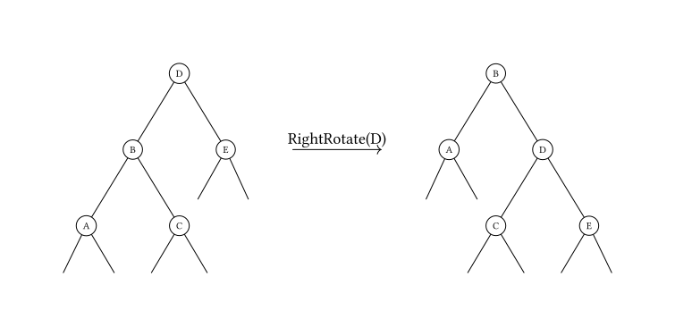

AVL 树，是一种平衡的二叉搜索树．由于各种算法教材上对 AVL 的介绍十分冗长，造成了很多人对 AVL 树复杂、不实用的印象．但实际上，AVL 树的原理简单，实现也并不复杂．

## 定义

对于每个 AVL 树的节点 $x$，我们定义其高度函数 $h$ 为：

$$
h(x) =
\begin{cases}
0, & \text{if }x = \perp, \\
\max{(h(x.\mathrm{left}), h(x.\mathrm{right}))} + 1, & \text{otherwise}.
\end{cases}
$$

节点的平衡因子（balance factor）为 $\operatorname{BF}(x) = h(x.\mathrm{right}) - h(x.\mathrm{left})$．

当我们说一个 AVL 树的高度时通常指其 **根节点** 的高度．

一些地方将单个节点的 AVL 树的高度定义为 $0$，并不会影响平衡因子的判断．

## 性质

1.  空二叉树是一个 AVL 树
2.  如果 $x$ 是一个 AVL 树的根节点，那么其左右子树也是 AVL 树，并且满足 $|\operatorname{BF}(x)| \leq 1$
3.  一个包含 $n$ 个节点的 AVL 树的根节点 $x$ 满足 $h(x) = O(\log n)$

???+ note "树高的证明"
    设 $f_n$ 为高度为 $n$ 的 AVL 树所包含的最少节点数，则有
    
    $$
    f_n=
    \begin{cases}
    1&(n=1)\\
    2&(n=2)\\
    f_{n-1}+f_{n-2}+1& (n>2)
    \end{cases}
    $$
    
    根据常系数非齐次线性差分方程的解法，$\{f_n+1\}$ 是一个斐波那契数列．这里 $f_n$ 的通项为：
    
    $$
    f_n=\frac{5+2\sqrt{5}}{5}\left(\frac{1+\sqrt{5}}{2}\right)^n+\frac{5-2\sqrt{5}}{5}\left(\frac{1-\sqrt{5}}{2}\right)^n-1
    $$
    
    斐波那契数列以指数的速度增长，对于树高 $n$ 有：
    
    $$
    n<\log_{\frac{1+\sqrt{5}}{2}} (f_n+1)<\frac{3}{2}\log_2 (f_n+1)
    $$
    
    因此 AVL 树的高度为 $O(\log f_n)$，这里的 $f_n$ 为结点数．

## 旋转

作为基本操作，我们给出旋转的伪代码，其中 $\operatorname{\mathsf{Propagate}}$ 用来向子节点传播「懒惰标记」（与我们熟知的线段树一样），而 $\operatorname{\mathsf{Update}}$ 用来在结构变化时更新子树大小，树高等信息．

$$
\begin{array}{ll}
  & \textbf{Algorithm }\operatorname{\mathsf{RotateLeft}}(x)\text{:} \\
  & \textbf{Input}\text{: BST node }x\text{.} \\
  & \textbf{Output}\text{: BST node }y\text{.} \\
  & \textbf{Require}\text{: }x.\mathrm{right} \neq \perp\text{.} \\
1 & y \gets x.\mathrm{right} \\
2 & \operatorname{\mathsf{Propagate}}(y) \\
3 & x.\mathrm{right} \gets y.\mathrm{left} \\
4 & y.\mathrm{left} \gets x \\
5 & \operatorname{\mathsf{Update}}(x) \\
6 & \operatorname{\mathsf{Update}}(y) \\
7 & \textbf{return }y
\end{array}
$$

这里给出向左旋转的伪代码，向右旋转的伪代码是对称的．

## 过程

### 插入结点

与二叉搜索树（binary search tree，BST）中类似，先进行一次失败的查找来确定插入的位置，插入节点后根据平衡因子来决定是否需要调整．

### 删除结点

删除和 BST 类似，将结点与后继交换后再删除．

删除会导致树高以及平衡因子变化，这时需要沿着被删除结点到根的路径来调整这种变化．

### 平衡的维护

插入或删除节点后，可能会造成 AVL 树的性质 2 被破坏．因此，需要沿着从被插入/删除的节点到根的路径对树进行维护．如果对于某一个节点，性质 2 不再满足，由于我们只插入/删除了一个节点，对树高的影响不超过 1，因此该节点的平衡因子的绝对值至多为 2．由于对称性，我们在此只讨论左子树的高度比右子树大 2 的情况，即下图中 $h(B)-h(E)=2$．此时，还需要根据 $h(A)$ 和 $h(C)$ 的大小关系分两种情况讨论．需要注意的是，由于我们是自底向上维护平衡的，因此对节点 D 的所有后代来说，性质 2 仍然是被满足的．


#### 情况一：A 点树高不小于 C 点树高

设 $h(E)=x$，则有

$$
\begin{cases}
    h(B)=x+2\\
    h(A)=x+1\\
    x\leq h(C)\leq x+1
\end{cases}
$$

其中 $h(C)\geq x$ 是由于节点 B 满足性质 2，因此 $h(C)$ 和 $h(A)$ 的差不会超过 1．此时我们对节点 D 进行一次右旋操作（旋转操作与其它类型的平衡二叉搜索树相同），如下图所示．



显然节点 A、C、E 的高度不发生变化，并且有

$$
\begin{cases}
    0\leq h(C)-h(E)\leq 1\\
    x+1\leq h'(D)=\max(h(C),h(E))+1=h(C)+1\leq x+2\\
    0\leq h'(D)-h(A)\leq 1
\end{cases}
$$

因此旋转后的节点 B 和 D 也满足性质 2．

#### 情况二：A 点树高小于 C 点树高

设 $h(E)=x$，则与刚才同理，有

$$
\begin{cases}
    h(B)=x+2\\
    h(C)=x+1\\
    h(A)=x
\end{cases}
$$

此时我们先对节点 B 进行一次左旋操作，再对节点 D 进行一次右旋操作，如下图所示．


显然节点 A、E 的高度不发生变化，并且 B 的新右儿子和 D 的新左儿子分别为 C 原来的左右儿子，则有

$$
\begin{cases}
    x-1\leq h'(rs_B),h'(ls_D)\leq x\\
    0\leq h(A)-h'(rs_B)\leq 1\\
    0\leq h(E)-h'(ls_D)\leq 1\\
    h'(B)=\max(h(A),h'(rs_B))+1=x+1\\
    h'(D)=\max(h(E),h'(ls_D))+1=x+1\\
    h'(B)-h'(D)=0
\end{cases}
$$

因此旋转后的节点 B、C、D 也满足性质 2．

???+ note "平衡操作：伪代码"
    $$
    \begin{array}{ll}
    & \textbf{Algorithm }\operatorname{\mathsf{Balance}}(x)\text{:} \\
    & \textbf{Input}\text{: BST node } x \text{ with }x.\mathrm{left} \text{ and }x.\mathrm{right} \text{ are AVL trees.} \\
    & \textbf{Output}\text{: AVL tree node.} \\
    & \textbf{Require}\text{: } |\operatorname{BF}(x)| \leq 2 \text{. Caller should make sure that }\operatorname{\mathsf{Propagate}}(x) \text{ is called.} \\
    1 & \textbf{if } |\operatorname{BF}(x)| \leq 1 \textbf{ then} \\
    2 & \qquad \textbf{return }x \texttt{ /* }x\texttt{ is already an AVL tree */}\\
    3 & \textbf{end if} \\
    4 & \textbf{if }h(x.\mathrm{left}) > h(x.\mathrm{right}) \textbf{ then} \\
    5 & \qquad y \gets x.\mathrm{left} \\
    6 & \qquad \textbf{if } h(y.\mathrm{left}) < h(y.\mathrm{right}) \textbf{ then} \\
    7 & \qquad \qquad \operatorname{\mathsf{Propagate}}(y) \\
    8 & \qquad \qquad x.\mathrm{left} \gets \operatorname{\mathsf{RotateLeft}}(y) \\
    9 & \qquad \qquad \operatorname{\mathsf{Update}}(x) \\
    10 & \qquad \textbf{end if} \\
    11 & \qquad \textbf{return} \operatorname{\mathsf{RotateRight}}(x) \texttt{ /* Symmetric to } \operatorname{\mathsf{RotateLeft}} \texttt{.*/} \\
    12 & \textbf{else} \\
    13 & \qquad \texttt{/* Symmetric to the case that } h(y.\mathrm{left}) < h(y.\mathrm{right}) \texttt{.*/} \\
    14 & \textbf{end if}
    \end{array}
    $$

与其他平衡二叉搜索树相同，AVL 树中节点的高度、子树大小等信息需要在旋转时进行维护．

## 其他操作

AVL 树的其他操作（Predecessor、Successor、Select、Rank 等）与普通的二叉搜索树相同．

考虑记 $s(x)$ 为 AVL 树 $x$ 的大小（即节点数），我们有 $s(\perp) = 0, s(x) = s(x.\mathrm{left}) + 1 + s(x.\mathrm{right})$．

### 合并两个 AVL 树

合并两个 AVL 树 $x, y$ 在这里简单理解为将 $x$ 的中序遍历结果与 $y$ 的中序遍历结果进行拼接得到的 AVL 树．考虑沿着树较高的 AVL 树向子节点遍历，必然会有一时刻两个 AVL 树的高度之差小于等于 $1$，此时我们考虑从较高的树中抽取最左/最右的节点作为新的根节点，而两个 AVL 树作为其左右孩子，此时新的根节点树高最多只会变化 $1$，我们的 $\operatorname{\mathsf{Balance}}$ 函数可以处理．

$$
\begin{array}{ll}
  & \textbf{Algorithm }\operatorname{\mathsf{JoinRight}}(x, y)\text{:} \\
  & \textbf{Input}\text{: AVL tree node } x, y \text{.} \\
  & \textbf{Output}\text{: AVL tree node.} \\
  & \textbf{Require}\text{: } h(x) \geq h(y), x \neq \perp \text{.} \\
1 & \operatorname{\mathsf{Propagate}}(x) \\
2 & \textbf{if } h(x) - h(y) \leq 1 \textbf{ then} \\
3 & \qquad e \gets \text{the rightmost node in }x\text{.} \\
4 & \qquad r \gets \text{the new AVL tree root after the extraction of }e \text{ from }x\text{.} \\
5 & \qquad e.\mathrm{left} \gets r \\
6 & \qquad e.\mathrm{right} \gets y \\
7 & \qquad \operatorname{\mathsf{Update}}(e) \\
8 & \qquad \textbf{return }e \\
9 & \textbf{else} \\
10 & \qquad x.\mathrm{right} \gets \operatorname{\mathsf{JoinRight}}(x.\mathrm{right}, y) \\
11 & \qquad \operatorname{\mathsf{Update}}(x) \\
12 & \qquad \textbf{return }\operatorname{\mathsf{Balance}}(x) \\
13 & \textbf{end if}
\end{array}
$$

通用的 $\operatorname{\mathsf{Join}}$ 函数只是简单的使用上面实现的函数，$\operatorname{\mathsf{JoinLeft}}$ 与 $\operatorname{\mathsf{JoinRight}}$ 类似，我们省略细节．

$$
\begin{array}{ll}
  & \textbf{Algorithm }\operatorname{\mathsf{Join}}(x, y)\text{:} \\
  & \textbf{Input}\text{: AVL tree node } x, y \text{.} \\
  & \textbf{Output}\text{: AVL tree node.} \\
1 & \textbf{if }x = \perp \textbf{ then return }y \textbf{ end if} \\
2 & \textbf{if }y = \perp \textbf{ then return }x \textbf{ end if} \\
3 & \textbf{if } h(x) \geq h(y) \textbf{ then } \\
4 & \qquad \textbf{return }\operatorname{\mathsf{JoinRight}}(x, y) \\
5 & \textbf{else} \\
6 & \qquad \textbf{return }\operatorname{\mathsf{JoinLeft}}(x, y) \texttt{ /* Similar to } \operatorname{\mathsf{JoinRight}} \texttt{.*/} \\
7 & \textbf{end if}
\end{array}
$$

其时间复杂度显然为 $O(\log(\max(s(x), s(y))))$．

### 分裂

我们简单介绍按照大小分裂一个 AVL 树为两个 AVL 树，按照权值分裂的函数是类似的．在给出分裂的过程前，我们需要先给出一个辅助函数，其是我们前面介绍的合并函数的一个简单变体，因为此时我们不再需要从高的树当中抽取节点，而是有本来已经存在的节点作为新的根．

$$
\begin{array}{ll}
  & \textbf{Algorithm }\operatorname{\mathsf{JoinRight}}'(x, m, y)\text{:} \\
  & \textbf{Input}\text{: AVL tree node } x, m, y \text{.} \\
  & \textbf{Output}\text{: AVL tree node.} \\
  & \textbf{Require}\text{: } h(x) \geq h(y), x \neq \perp , m \text{ is a single node.} \\
1 & \operatorname{\mathsf{Propagate}}(x) \\
2 & \textbf{if } h(x) - h(y) \leq 1 \textbf{ then} \\
3 & \qquad m.\mathrm{left} \gets x \\
4 & \qquad m.\mathrm{right} \gets y \\
5 & \qquad \operatorname{\mathsf{Update}}(m) \\
6 & \qquad \textbf{return }m \\
7 & \textbf{else} \\
8 & \qquad x.\mathrm{right} \gets \operatorname{\mathsf{JoinRight}}'(x.\mathrm{right}, y) \\
9 & \qquad \operatorname{\mathsf{Update}}(x) \\
10 & \qquad \textbf{return }\operatorname{\mathsf{Balance}}(x) \\
11 & \textbf{end if}
\end{array}
$$

那么 $\operatorname{\mathsf{Join}}'$ 函数只是

$$
\begin{array}{ll}
  & \textbf{Algorithm }\operatorname{\mathsf{Join}}'(x, m, y)\text{:} \\
  & \textbf{Input}\text{: AVL tree node } x, m, y \text{.} \\
  & \textbf{Output}\text{: AVL tree node.} \\
  & \textbf{Require}\text{: } m \text{ is a single node.} \\
1 & \textbf{if }x = \perp \textbf{ then return }\operatorname{\mathsf{Join}}(m, y) \textbf{ end if} \\
2 & \textbf{if }y = \perp \textbf{ then return }\operatorname{\mathsf{Join}}(x, m) \textbf{ end if} \\
3 & \textbf{if }h(x) \geq h(y) \textbf{ then} \\
4 & \qquad \textbf{return }\operatorname{\mathsf{JoinRight}}'(x, m, y) \\
5 & \textbf{else} \\
6 & \qquad \textbf{return }\operatorname{\mathsf{JoinLeft}}'(x, m, y) \texttt{ /* Similar to } \operatorname{\mathsf{JoinRight}}' \texttt{.*/} \\
7 & \textbf{end if}
\end{array}
$$

然后考虑按照大小分裂一个 AVL 树为两部分，前一部分包含恰好 $k$ 个节点，这一部分与 Treap 类似，但是我们不能直接连接子树，而需要使用上面的 $\operatorname{\mathsf{Join}}'$ 函数，否则 AVL 树的性质则不能满足．

$$
\begin{array}{ll}
  & \textbf{Algorithm }\operatorname{\mathsf{Split}}(x, k)\text{:} \\
  & \textbf{Input}\text{: AVL tree node } x， k \in \mathbb{N} \text{.} \\
  & \textbf{Output}\text{: AVL tree node } a, b \text{ with } s(a) = k, s(b) = s(x) - k \text{.} \\
  & \textbf{Require}\text{: } k \leq s(x) \text{.} \\
1 & \textbf{if }x = \perp \textbf{ then return } \begin{bmatrix}\perp & \perp\end{bmatrix} \textbf{ end if} \\
2 & \operatorname{\mathsf{Propagate}}(x) \\
3 & \textbf{if }s(x.\mathrm{left}) < k \textbf{ then} \\
4 & \qquad \begin{bmatrix}y & z\end{bmatrix} \gets \operatorname{\mathsf{Split}}(x.\mathrm{right}, k - s(x.\mathrm{left}) - 1) \\
5 & \qquad \ell \gets x.\mathrm{left} \\
6 & \qquad x.\mathrm{left} \gets \perp \\
7 & \qquad x.\mathrm{right} \gets \perp \\
8 & \qquad \operatorname{\mathsf{Update}}(x) \\
9 & \qquad \textbf{return }\begin{bmatrix}\operatorname{\mathsf{Join}}'(\ell, x, y) & z \end{bmatrix} \\
10 & \textbf{else} \\
11 & \qquad \begin{bmatrix}y & z\end{bmatrix} \gets \operatorname{\mathsf{Split}}(x.\mathrm{left}, k) \\
12 & \qquad r \gets x.\mathrm{right} \\
13 & \qquad x.\mathrm{left} \gets \perp \\
14 & \qquad x.\mathrm{right} \gets \perp \\
15 & \qquad \operatorname{\mathsf{Update}}(x) \\
16 & \qquad \textbf{return }\begin{bmatrix}y & \operatorname{\mathsf{Join}}'(z, x, r) \end{bmatrix} \\
17 & \textbf{end if}
\end{array}
$$

注意 $\operatorname{\mathsf{Join}}'$ 的时间为 $O(|h(x) - h(y)|)$．

$\operatorname{\mathsf{Split}}$ 函数的时间复杂度也是 $O(\log(s(x)))$．

## 参考代码

下面的代码是用 AVL 树实现的 `Map`，即有序不可重映射：

??? note "参考代码"
    ```cpp
    --8<-- "docs/ds/code/avl-tree/AvlTreeMap.hpp"
    ```

## 其他资料

在 [AVL Tree Visualization](https://www.cs.usfca.edu/~galles/visualization/AVLtree.html) 可以观察 AVL 树维护平衡的过程．

[维基百科 -- AVL 树](https://en.wikipedia.org/wiki/AVL_tree)
