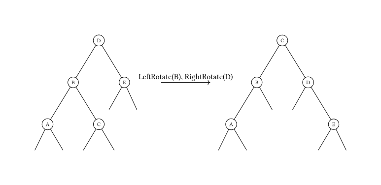

AVL 树，是一种平衡的二叉搜索树。由于各种算法教材上对 AVL 的介绍十分冗长，造成了很多人对 AVL 树复杂、不实用的印象。但实际上，AVL 树的原理简单，实现也并不复杂。

## 性质

1.  空二叉树是一个 AVL 树
2.  如果 T 是一棵 AVL 树，那么其左右子树也是 AVL 树，并且 $|h(ls) - h(rs)| \leqslant 1$，h 是其左右子树的高度
3.  树高为 $O(\log n)$

平衡因子：右子树高度 - 左子树高度

???+ note "树高的证明"
    设 $f_n$ 为高度为 $n$ 的 AVL 树所包含的最少节点数，则有
    
    $$
    f_n=
    \begin{cases}
    1&(n=1)\\
    2&(n=2)\\
    f_{n-1}+f_{n-2}+1& (n>2)
    \end{cases}
    $$
    
    根据常系数非齐次线性差分方程的解法，$\{f_n+1\}$ 是一个斐波那契数列。这里 $f_n$ 的通项为：
    
    $$
    f_n=\frac{5+2\sqrt{5}}{5}\left(\frac{1+\sqrt{5}}{2}\right)^n+\frac{5-2\sqrt{5}}{5}\left(\frac{1-\sqrt{5}}{2}\right)^n-1
    $$
    
    斐波那契数列以指数的速度增长，对于树高 $n$ 有：
    
    $$
    n<\log_{\frac{1+\sqrt{5}}{2}} (f_n+1)<\frac{3}{2}\log_2 (f_n+1)
    $$
    
    因此 AVL 树的高度为 $O(\log f_n)$，这里的 $f_n$ 为结点数。

## 过程

### 插入结点

与 BST（二叉搜索树）中类似，先进行一次失败的查找来确定插入的位置，插入节点后根据平衡因子来决定是否需要调整。

### 删除结点

删除和 BST 类似，将结点与后继交换后再删除。

删除会导致树高以及平衡因子变化，这时需要沿着被删除结点到根的路径来调整这种变化。

### 平衡的维护

插入或删除节点后，可能会造成 AVL 树的性质 2 被破坏。因此，需要沿着从被插入/删除的节点到根的路径对树进行维护。如果对于某一个节点，性质 2 不再满足，由于我们只插入/删除了一个节点，对树高的影响不超过 1，因此该节点的平衡因子的绝对值至多为 2。由于对称性，我们在此只讨论左子树的高度比右子树大 2 的情况，即下图中 $h(B)-h(E)=2$。此时，还需要根据 $h(A)$ 和 $h(C)$ 的大小关系分两种情况讨论。需要注意的是，由于我们是自底向上维护平衡的，因此对节点 D 的所有后代来说，性质 2 仍然是被满足的。


#### $h(A)\geqslant h(C)$

设 $h(E)=x$，则有

$$
\begin{cases}
    h(B)=x+2\\
    h(A)=x+1\\
    x\leqslant h(C)\leqslant x+1
\end{cases}
$$

其中 $h(C)\geqslant x$ 是由于节点 B 满足性质 2，因此 $h(C)$ 和 $h(A)$ 的差不会超过 1。此时我们对节点 D 进行一次右旋操作（旋转操作与其它类型的平衡二叉搜索树相同），如下图所示。


显然节点 A、C、E 的高度不发生变化，并且有

$$
\begin{cases}
    0\leqslant h(C)-h(E)\leqslant 1\\
    x+1\leqslant h'(D)=\max(h(C),h(E))+1=h(C)+1\leqslant x+2\\
    0\leqslant h'(D)-h(A)\leqslant 1
\end{cases}
$$

因此旋转后的节点 B 和 D 也满足性质 2。

#### $h(A)<h(C)$

设 $h(E)=x$，则与刚才同理，有

$$
\begin{cases}
    h(B)=x+2\\
    h(C)=x+1\\
    h(A)=x
\end{cases}
$$

此时我们先对节点 B 进行一次左旋操作，再对节点 D 进行一次右旋操作，如下图所示。



显然节点 A、E 的高度不发生变化，并且 B 的新右儿子和 D 的新左儿子分别为 C 原来的左右儿子，则有

$$
\begin{cases}
    x-1\leqslant h'(rs_B),h'(ls_D)\leqslant x\\
    0\leqslant h(A)-h'(rs_B)\leqslant 1\\
    0\leqslant h(E)-h'(ls_D)\leqslant 1\\
    h'(B)=\max(h(A),h'(rs_B))+1=x+1\\
    h'(D)=\max(h(E),h'(ls_D))+1=x+1\\
    h'(B)-h'(D)=0
\end{cases}
$$

因此旋转后的节点 B、C、D 也满足性质 2。

???+ note "维护平衡操作：伪代码"
    $$
    \begin{array}{ll}
    1 &  \textbf{function } \mathrm{MaintainBalance}(p) \\
    2 &  \qquad l \gets ls_p, r \gets rs_p \\
    3 &  \qquad \textbf{if } h(l)-h(r)=2 \\
    4 &  \qquad\qquad \textbf{if } h(ls_l) \geqslant h(rs_l) \\
    5 &  \qquad\qquad\qquad \mathrm{RightRotate}(p) \\
    6 &  \qquad\qquad \textbf{else} \\
    7 &  \qquad\qquad\qquad \mathrm{LeftRotate}(l) \\
    8 &  \qquad\qquad\qquad \mathrm{RightRotate}(p) \\
    9 &  \qquad \textbf{else if } h(l)-h(r)=-2 \\
    10 &  \qquad\qquad \textbf{if } h(ls_r) \leqslant h(rs_r) \\
    11 &  \qquad\qquad\qquad \mathrm{LeftRotate}(p) \\
    12 &  \qquad\qquad \textbf{else} \\
    13 &  \qquad\qquad\qquad \mathrm{RightRotate}(r) \\
    14 &  \qquad\qquad\qquad \mathrm{LeftRotate}(p) \\
    \end{array}
    $$

与其他平衡二叉搜索树相同，AVL 树中节点的高度、子树大小等信息需要在旋转时进行维护。

## 其他操作

AVL 树的其他操作（Predecessor、Successor、Select、Rank 等）与普通的二叉搜索树相同。

## 参考代码

下面的代码是用 AVL 树实现的 `Map`，即有序不可重映射：

??? note "参考代码"
    ```cpp
    --8<-- "docs/ds/code/avl-tree/AvlTreeMap.hpp"
    ```

## 其他资料

在 [AVL Tree Visualization](https://www.cs.usfca.edu/~galles/visualization/AVLtree.html) 可以观察 AVL 树维护平衡的过程。

[维基百科 -- AVL 树](https://en.wikipedia.org/wiki/AVL_tree)
