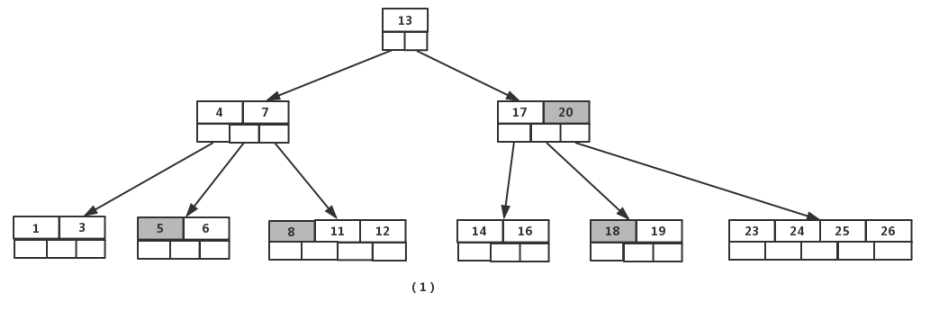
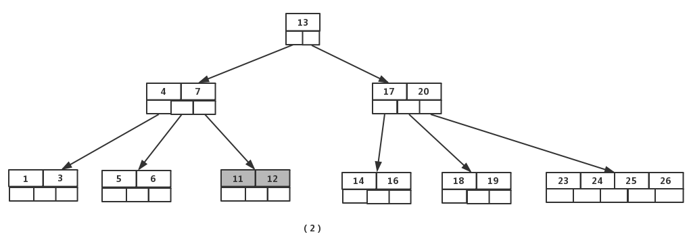
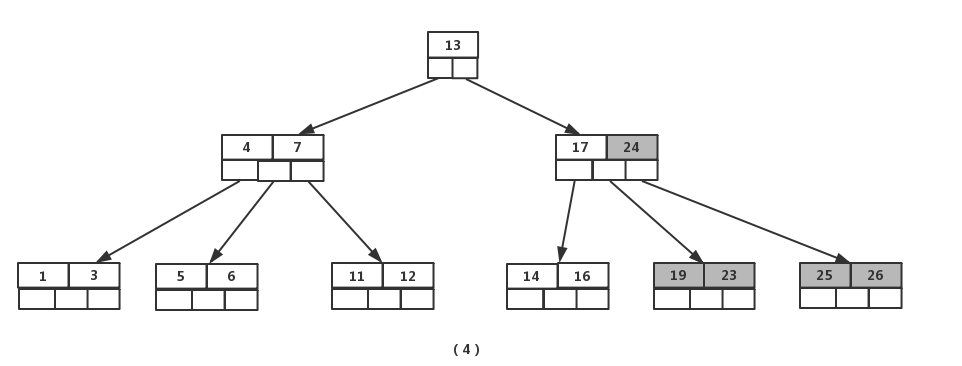
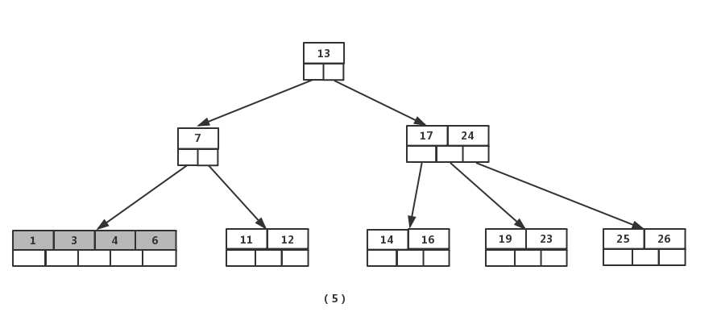

author: Persdre

## B-树简介

在计算机科学中，B-树（B-tree）是一种自平衡的树，能够保持数据有序。这种数据结构能够让查找数据、顺序访问、插入数据及删除的动作，都在对数时间内完成。

在 B-树 中，有两种节点：
1. 内部节点（internal node）：存储了数据以及指向其子节点的指针。
2. 叶子节点（leaf node）：与内部节点不同的是，叶子节点只存储数据，并没有子节点。

我们已经介绍过 [AVL树](docs/ds/avl.md)。它属于二叉树，即每个节点最多只能拥有两个子节点。而 B-树（B-tree) 的每个节点
可以拥有两个以上的子节点。因此 B-树 是一种多路搜索树。

首先我们介绍一下一棵 m 阶的 B-树 的特性。m 表示这个树的每一个节点最多可以拥有的子节点个数。一棵 m 阶的 B-树 满足的性质如下：

1. 每个节点最多有 m 个子节点。
2. 每一个非叶子节点（除根节点）最少有 ⌈m/2⌉ 个子节点。
3. 如果根节点不是叶子节点，那么它至少有两个子节点。
4. 有 k 个子节点的非叶子节点拥有 k − 1 个键，且升序排列，满足 k[i] < k[i+1]。
5. 每个节点至多包含 2k - 1 个键。
6. 所有的叶子节点都在同一层。

一个简单的图例如下：


## 基本操作

与 [二叉搜索树](docs/ds/bst.md) 类似，B-树 的基本操作有查找，遍历，插入，删除。

### 查找

B-树 中的节点包含有多个键。假设需要查找的是 k，那么从根节点开始，从上到下递归的遍历树。在每一层上，搜索的范围被减小到包含了搜索值的子树中。
子树值的范围被它的父节点的键确定。因为是从根节点开始的二分法查找，所以

查找一个键的代码如下：

```cpp
BTreeNode *BTreeNode::search(int k) 
{ 
 // 找到第一个大于等于待查找键 k 的键
 int i = 0; 
 while (i < n && k > keys[i]) 
  i++; 

 // 如果找到的第一个键等于 k , 返回节点指针 
 if (keys[i] == k) 
  return this; 

 // 如果没有找到键 k 且当前节点为叶子节点则返回NULL
 if (leaf == true) 
  return NULL; 

 // 递归
 return C[i]->search(k); 
}
```

### 遍历

B-树的中序遍历与二叉搜索树的中序遍历也很相似，我们从最左边的孩子节点开始，递归地打印最左边的孩子节点，然后对剩余的孩子和键重复相同的过程。
最后，递归打印最右边的孩子节点。

遍历的代码如下：

```cpp
BTreeNode *BTreeNode::search(int k) 
{ 
void BTreeNode::traverse() 
{ 
 // 有 n 个键和 n+1 个孩子  
 // 遍历 n 个键和前 n 个孩子
 int i; 
 for (i = 0; i < n; i++) 
 { 
  // 如果当前节点不是叶子节点, 在打印 key[i] 之前, 
  // 先遍历以 C[i] 为根的子树. 
  if (leaf == false) 
   C[i]->traverse(); 
  cout << " " << keys[i]; 
 } 

 // 打印以最后一个孩子为根的子树
 if (leaf == false) 
  C[i]->traverse(); 
}
}
```

### 插入

为了方便表述，定义 `insert(o,v)` 为在以 $o$ 为根节点的 B-树 中插入一个值为 $v$ 的新节点。

一个新插入的 $v$ 总是被插入到叶子节点。与二叉搜索树的插入操作类似，我们从根节点开始，向下遍历直到叶子节点，将值为 $v$ 的新节点插入到相应的叶子节点。
与二叉搜索树不同的是，我们通过最小度定义了一个节点可以包含键的个数的一个取值范围，所以在插入一个新节点时，就需要确认插入这个叶子节点之后
它的父节点是否超出该节点本身最大可容纳的节点个数。

针对一棵高度为 h 的 m 阶 B-树，插入一个元素时，首先我们要验证该元素在B树中是否存在，如果不存在，我们就要在叶子节点中插入该新的元素，此时分3种情况：
1. 如果叶子节点空间足够，即该节点的关键字数小于 m-1，则直接插入在叶子节点的左边或右边；
2. 如果空间满了以致没有足够的空间去添加新的元素，即该节点的关键字数已经有了 m 个，则需要将该节点进行“分裂”，将一半数量的关键字元素分裂到新的其相邻右节点中，中间关键字元素上移到父节点中，而且当节点中关键元素向右移动了，相关的指针也需要向右移。
    1. 从该节点的原有元素和新的元素中选择出中位数
    2. 小于这一中位数的元素放入左边节点，大于这一中位数的元素放入右边节点，中位数作为分隔值。
    3. 分隔值被插入到父节点中，这可能会造成父节点分裂，分裂父节点时可能又会使它的父节点分裂，以此类推。如果没有父节点（这一节点是根节点），就创建一个新的根节点（增加了树的高度）。

如果分裂一直上升到根节点，那么一个新的根节点会被创建，它有一个分隔值和两个子节点。

这就是根节点并不像内部节点一样有最少子节点数量限制的原因。每个节点中元素的最大数量是 U-1。当一个节点分裂时，一个元素被移动到它的父节点，但是一个新的元素增加了进来。所以最大的元素数量 U-1 必须能够被分成两个合法的节点。
如果 U-1 是奇数，那么 U=2L ，总共有 2L-1 个元素，一个新的节点有 L-1 个元素，另外一个有 L 个元素，都是合法的节点。如果 U-1 是偶数，那么 U=2L-1,总共有 2L-2 个元素。 一半是 L-1，正好是节点允许的最小元素数量。

插入的代码如下：

```cpp
void BTree::insert(int k) 
{ 
 // 如果树为空树
 if (root == NULL) 
 { 
  // 为根节点分配空间
  root = new BTreeNode(t, true); 
  root->keys[0] = k; //插入节点 k 
  root->n = 1; // 更新根节点的关键字的个数为 1
 } 
 else  
 { 
  // 当根节点已满，则对B-树进行生长操作 
  if (root->n == 2*t-1) 
  { 
   // 为新的根节点分配空间
   BTreeNode *s = new BTreeNode(t, false); 

   // 将旧的根节点作为新的根节点的孩子
   s->C[0] = root; 

   // 将旧的根节点分裂为两个，并将一个关键字上移到新的根节点 
   s->splitChild(0, root); 

   // 新的根节点有两个孩子节点
   //确定哪一个孩子将拥有新插入的关键字
   int i = 0; 
   if (s->keys[0] < k) 
    i++; 
   s->C[i]->insertNonFull(k); 

   // 新的根节点更新为 s
   root = s; 
  } 
  else //根节点未满，调用insertNonFull()函数进行插入
   root->insertNonFull(k); 
 } 
} 

// 将关键字 k 插入到一个未满的节点中
void BTreeNode::insertNonFull(int k) 
{ 
 // 初始化 i 为节点中的最后一个关键字的位置
 int i = n-1; 

 // 如果当前节点是叶子节点
 if (leaf == true) 
 { 
  // 下面的循环做两件事：
  // a) 找到新插入的关键字位置并插入
  // b) 移动所有大于关键字 k 的向后移动一个位置
  while (i >= 0 && keys[i] > k) 
  { 
   keys[i+1] = keys[i]; 
   i--; 
  } 

  // 插入新的关键字，节点包含的关键字个数加 1 
  keys[i+1] = k; 
  n = n+1; 
 } 
 else 
 { 
  //找到第一个大于关键字 k 的关键字 keys[i] 的孩子节点
  while (i >= 0 && keys[i] > k) 
   i--; 

  // 检查孩子节点是否已满
  if (C[i+1]->n == 2*t-1) 
  { 
   // 如果已满，则进行分裂操作
   splitChild(i+1, C[i+1]); 

   // 分裂后，C[i] 中间的关键字上移到父节点，
   // C[i] 分裂称为两个孩子节点
   // 找到新插入关键字应该插入的节点位置
   if (keys[i+1] < k) 
    i++; 
  } 
  C[i+1]->insertNonFull(k); 
 } 
} 

// 节点 y 已满，则分裂节点 y 
void BTreeNode::splitChild(int i, BTreeNode *y) 
{ 
 // 创建一个新的节点存储 t - 1 个关键字
 BTreeNode *z = new BTreeNode(y->t, y->leaf); 
 z->n = t - 1; 

 //将节点 y 的后 t -1 个关键字拷贝到 z 中
 for (int j = 0; j < t-1; j++) 
  z->keys[j] = y->keys[j+t]; 

 // 如果 y 不是叶子节点，拷贝 y 的后 t 个孩子节点到 z中
 if (y->leaf == false) 
 { 
  for (int j = 0; j < t; j++) 
   z->C[j] = y->C[j+t];  
 } 

 //将 y 所包含的关键字的个数设置为 t -1
 //因为已满则为2t -1 ，节点 z 中包含 t - 1 个
 //一个关键字需要上移 
 //所以 y 中包含的关键字变为 2t-1 - (t-1) -1 
 y->n = t - 1; 

 // 给当前节点的指针分配新的空间，
 //因为有新的关键字加入，父节点将多一个孩子。
 for (int j = n; j >= i+1; j--) 
  C[j+1] = C[j]; 

 // 当前节点的下一个孩子设置为z 
 C[i+1] = z; 

 //将所有父节点中比上移的关键字大的关键字后移
 //找到上移节点的关键字的位置
 for (int j = n-1; j >= i; j--) 
  keys[j+1] = keys[j]; 

 // 拷贝 y 的中间关键字到其父节点中
 keys[i] = y->keys[t-1]; 

 //当前节点包含的关键字个数加 1 
 n = n + 1; 
}
```

### 删除

B-树 的删除操作相比于插入操作更为复杂，因为删除之后经常需要重新排列节点。

与 B-树 的插入操作类似，我们必须确保删除操作不违背 B-树 的特性。正如插入操作中每一个节点所包含的键的个数不能超过 2k - 1 一样，删除操作要保证每一个节点包含的键的个数不少于 k - 1 个（除根节点允许包含比 k - 1 少的关键字的个数）。

有两种常用的删除策略：

1. 定位并删除元素，然后调整树使它满足约束条件。
2. 从上到下处理这棵树，在进入一个节点之前，调整树使得之后一旦遇到了要删除的键，它可以被直接删除而不需要再进行调整。

我们介绍使用第一种策略的删除。

首先，我们查找 B-树 中需删除的元素，如果该元素在 B-树 中存在，则将该元素在其节点中进行删除；删除该元素后，首先判断该元素是否有左右孩子节点，
如果有，则上移孩子节点中的某相近元素（"左孩子最右边的节点"或"右孩子最左边的节点"）到父节点中，然后是移动之后的情况；如果没有，直接删除。

1. 某节点中元素数目小于（m/2）- 1,（m/2）向上取整，则需要看其某相邻兄弟节点是否丰满。
2. 如果丰满（节点中元素个数大于（m/2）- 1），则向父节点借一个元素来满足条件。
3. 如果其相邻兄弟都不丰满，即其节点数目等于（m/2）- 1，则该节点与其相邻的某一兄弟节点进行"合并"成一个节点。

我们接下来用一个5阶 B-树 为例，详细讲解删除的操作。



如图所示，我们接下来要依次删除8，20，18，5。

首先我们要删除元素8。我们查找到元素8在叶子节点中，删除8后叶子节点的元素个数为2，符合 B-树 的规则。然后我们需要把元素11和12都向前移动一位。完成后，
这个 B-树 长这样。



下一步，删除20，因为20没有在叶子节点中，而是在中间节点中找到，我们可以发现他的继承者是23（字母升序的下个元素），然后我们将23上移到20的位置，然后将孩子节点中的23进行删除。
删除后检查一下，该孩子节点中元素个数大于2，无需进行合并操作。

所以这一步之后，这个 B-树 长这样。


下一步我们删除18，18在叶子节点中，但是该节点中元素数目为2，删除导致只有1个元素，已经小于最小元素数目2。
而由前面我们已经知道：如果其某个相邻兄弟节点中比较丰满（元素个数大于ceil(5/2)-1=2），则可以向父节点借一个元素，然后将最丰满的相邻兄弟节点中上移最后或最前一个元素到父节点中。
在这个实例中，右相邻兄弟节点中比较丰满（3个元素大于2），所以先向父节点借一个元素23下移到该叶子节点中，代替原来19的位置。19前移。
然后24在相邻右兄弟节点中，需要上移到父节点中。最后在相邻右兄弟节点中删除24，后面的元素前移。

这一步之后，B-树 如下图所示。



最后一步我们需要删除5，但是删除后会导致很多问题。因为5所在的节点数目刚好达标也就是刚好满足最小元素个数2（ceil(5/2)-1=2）。
而相邻的兄弟节点也是同样的情况，删除一个元素都不能满足条件，所以需要该节点与某相邻兄弟节点进行合并操作；首先移动父节点中的元素（该元素在两个需要合并的两个节点元素之间）下移到其子节点中。
然后将这两个节点进行合并成一个节点。所以在该实例中，我们首先将父节点中的元素4下移到已经删除5而只有6的节点中，然后将含有4和6的节点和含有1，3的相邻兄弟节点进行合并成一个节点。

这一步之后，B-树 如下图所示。



但是这里我们观察到父节点只包含了一个元素7，这就没有没达标（因为非根节点包括叶子节点的元素数量K必须满足于2=<K<=4，而此处的K=1）。
如果这个问题节点的相邻兄弟比较丰满，则可以向父节点借一个元素。而此时兄弟节点元素刚好为2，刚刚满足，只能进行合并，而根节点中的唯一元素13下移到子节点。
这样，树的高度减少一层。

所以最终的效果如下图。


删除的伪代码如下：

```text
1. B-Tree-Delete-Key(x, k) 
2. 	if not leaf[x] then 
3.		y ← Preceding-Child(x) 
4.		z ← Successor-Child(x) 
5.		if n[y] > t − 1 then 
6.			k' ← Find-Predecessor-Key(k, x) 
7.			Move-Key(k', y, x) 
8.			Move-Key(k, x, z) 
9.			B-Tree-Delete-Key(k, z) 
10.		else if n[z] > t − 1 then 
11.			k' ← Find-Successor-Key(k, x) 
12.			Move-Key(k', z, x) 
13.			Move-Key(k, x, y) 
14.			B-Tree-Delete-Key(k, y) 
15.		else 
16.			Move-Key(k, x, y) 
17.			Merge-Nodes(y, z) 
18.			B-Tree-Delete-Key(k, y) 
19.		else (leaf node) 
20.		 y ← Preceding-Child(x) 
21.		 z ← Successor-Child(x) 
22.		 w ← root(x) 
23.		 v ← RootKey(x) 
24.			if n[x] > t − 1 then Remove-Key(k, x) 
25.			else if n[y] > t − 1 then 
26.				k' ← Find-Predecessor-Key(w, v) 
27.				Move-Key(k', y,w) 
28.				k' ← Find-Successor-Key(w, v) 
29.				Move-Key(k',w, x) 
30.				B-Tree-Delete-Key(k, x) 
31.			else if n[w] > t − 1 then 
32.				k' ← Find-Successor-Key(w, v) 
33.				Move-Key(k', z,w) 
34.				k' ← Find-Predecessor-Key(w, v) 
35.				Move-Key(k',w, x) 
36.				B-Tree-Delete-Key(k, x) 
37.			else 
38.				s ← Find-Sibling(w) 
39.				w' ← root(w) 
40.					if n[w'] = t − 1 then 
41.						Merge-Nodes(w',w) 
42.						Merge-Nodes(w, s) 
43.						B-Tree-Delete-Key(k, x)
44.					else
45.						Move-Key(v,w, x)
46.						B-Tree-Delete-Key(k, x)
```

## B-树 优势

我们之前已经介绍过二叉查找树。但是这类型数据结构的问题在于，由于每个节点只能容纳一个数据，导致树的高度很高，逻辑上挨着的节点数据可能离的很远。

考虑在磁盘中存储数据的情况，与内存相比，读写磁盘有以下不同点：

1. 读写磁盘的速度相比内存读写慢很多。
2. 因为上面的原因，因此每次读写磁盘的单位要比读写内存的最小单位大很多。

因为读写磁盘的这个特点，因此对应的数据结构应该尽量的满足"局部性原理"："当一个数据被用到时，其附近的数据也通常会马上被使用"，为了满足局部性原理，
所以我们应该将逻辑上相邻的数据在物理上也尽量存储在一起。这样才能减少读写磁盘的数量。

所以，对比起一个节点只能存储一个数据的BST类数据结构来，要求这种数据结构在形状上更"胖"、更加"扁平"，即：每个节点能容纳更多的数据，
这样就能降低树的高度，同时让逻辑上相邻的数据都能尽量存储在物理上也相邻的硬盘空间上，减少磁盘读写。

## 参考资料
[B-树详解](https://www.cnblogs.com/lwhkdash/p/5313877.html)
[B树、B+树索引算法原理（上）](https://www.codedump.info/post/20200609-btree-1/)
[B树，B+树详解](https://www.cnblogs.com/lianzhilei/p/11250589.html)
