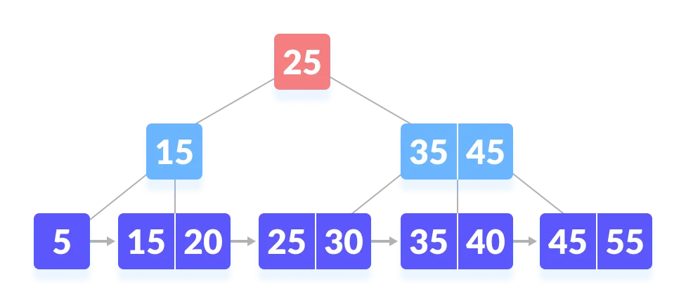
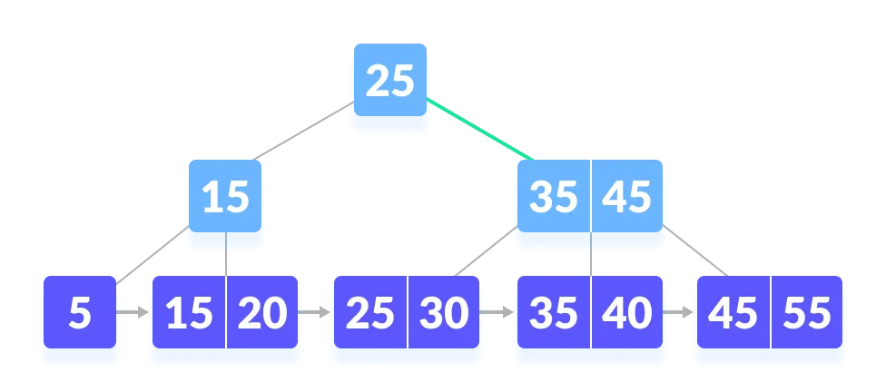
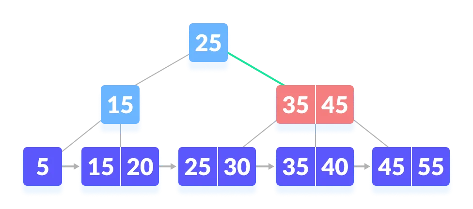
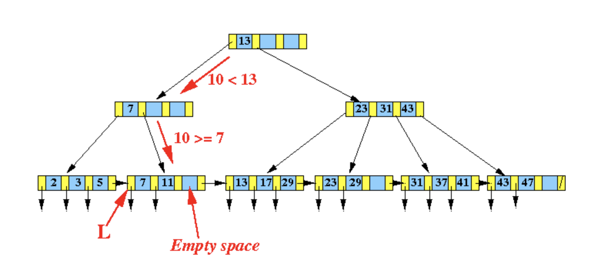
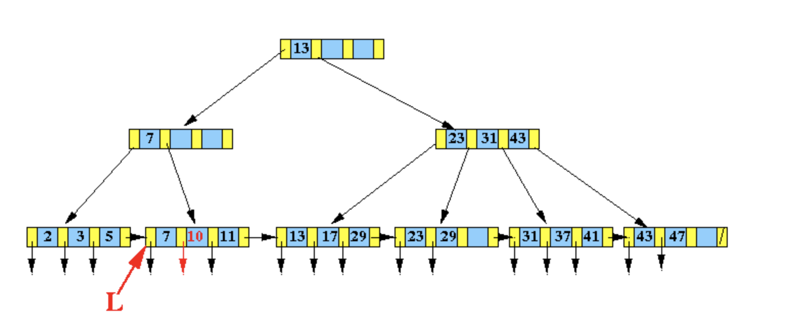
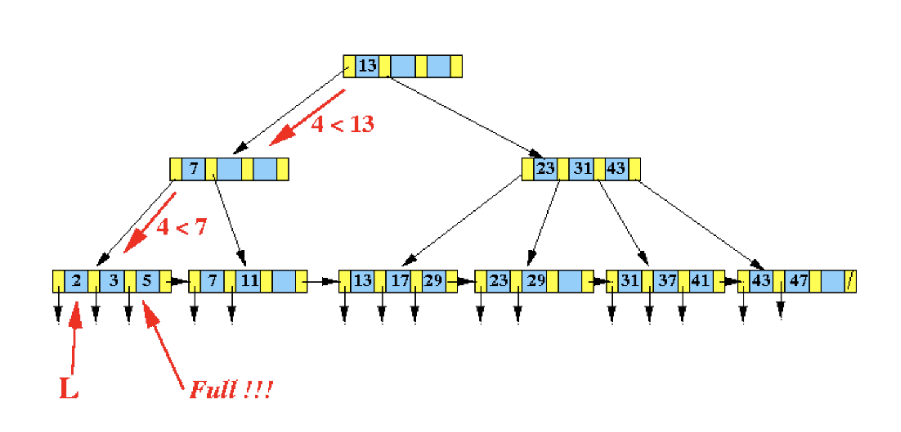

author: Persdre

## 引入

B+ 树是 [B 树](./b-tree.md) 的一个升级，它比 B 树更适合实际应用中操作系统的文件索引和数据库索引。目前现代关系型数据库最广泛的支持索引结构就是 B+ 树。

B+ 树是一种多叉排序树，即每个节点通常有多个孩子。一棵 B+ 树包含根节点、内部节点和叶子节点。根节点可能是一个叶子节点，也可能是一个包含两个或两个以上孩子节点的节点。

B+ 树的特点是能够保持数据稳定有序，其插入与修改拥有较稳定的对数时间复杂度。B+ 树元素自底向上插入，这与二叉树恰好相反。

首先介绍一棵 $m$ 阶 B+ 树的特性。$m$ 表示这个树的每一个节点最多可以拥有的子节点个数。一棵 $m$ 阶的 B+ 树和 B 树的差异在于：

1.  有 $n$ 棵子树的节点中含有 $n-1$ 个关键字（即将区间分为 $n$ 个子区间，每个子区间对应一棵子树）。
2.  所有叶子节点中包含了全部关键字的信息，及指向含这些关键字记录的指针，且叶子节点本身依关键字的大小自小而大顺序链接。
3.  所有的非叶子节点可以看成是索引部分，节点中仅含有其子树（根节点）中的最大（或最小）关键字。
4.  除根节点外，其他所有节点中所含关键字的个数最少有 $\lceil \dfrac{m}{2} \rceil$（注意：B 树中除根以外的所有非叶子节点至少有 $\lceil \dfrac{m}{2} \rceil$ 棵子树）。

同时，B+ 树为了方便范围查询，叶子节点之间还用指针串联起来。

以下是一棵 B+ 树的典型结构：


## B+ 树相比于 B 树的优势

由于索引节点上只有索引而没有数据，所以索引节点上能存储比 B 树更多的索引，这样树的高度就会更矮。树的高度越矮，磁盘寻道的次数就会越少。

因为数据都集中在叶子节点，而所有叶子节点的高度相同，那么可以在叶子节点中增加前后指针，指向同一个父节点的相邻兄弟节点，这样可以更好地支持查询一个值的前驱或后继，使连续访问更容易实现。

比如这样的 SQL 语句：`select * from tbl where t > 10`，如果使用 B+ 树存储数据的话，可以首先定位到数据为 10 的节点，再沿着它的 `next` 指针一路找到所有在该叶子节点右边的叶子节点，返回这些节点包含的数据。

而如果使用 B 树结构，由于数据既可以存储在内部节点也可以存储在叶子节点，连续访问的实现会更加繁琐（需要在树的内部结构中进行移动）。

## 过程

与 [B 树](./b-tree.md) 类似，B+ 树的基本操作有查找，遍历，插入，删除。

### 查找

B+ 树的查找过程和 B 树类似。假设需要查找的键值是 $k$，那么从根节点开始，从上到下递归地遍历树。在每一层上，搜索的范围被减小到包含搜索值的子树中。

一个实例：在如下这棵 B+ 树上查找 45。


先和根节点比较



因为根节点的键值比 45 要小，所以去往根节点的右子树查找



因为 45 比 35 大，所以要与右边的索引相比



右侧的索引也为 45，所以要去往该节点的右子树继续查找


然后就可以找到 45

需要注意的是，在查找时，若非叶子节点上的关键字等于给定值，并不终止，而是继续向下直到叶子节点。因此，在 B+ 树中，不管查找成功与否，每次查找都是走了一条从根到叶子节点的路径。其余同 B 树的查找类似。

查找一个键的代码如下：

???+ note "实现"
    ```cpp
    T find(V key) {
      int i = 0;
      while (i < this.number) {
        if (key.compareTo((V)this.keys[i]) <= 0) break;
        i++;
      }
      if (this.number == i) return null;
      return this.childs[i].find(key);
    }
    ```

### 遍历

B+ 树只在叶子节点的层级上就可以实现整棵树的遍历。从根节点出发一路搜索到最左端的叶子节点之后即可根据指针遍历。

### 插入

B+ 树的插入算法与 B 树的相近：

1.  若为空树，创建一个叶子节点，然后将记录插入其中，此时这个叶子节点也是根节点，插入操作结束。
2.  针对叶子类型节点：根据关键字找到叶子节点，向这个叶子节点插入记录。插入后，若当前节点关键字的个数小于 $m$，则插入结束。否则将这个叶子节点分裂成左右两个叶子节点，左叶子节点包含前 $m/2$ 个记录，右节点包含剩下的记录，将第 $m/2+1$ 个记录的关键字进位到父节点中（父节点一定是索引类型节点），进位到父节点的关键字左孩子指针向左节点，右孩子指针向右节点。将当前节点的指针指向父节点，然后执行第 3 步。
3.  针对索引类型节点（内部节点）：若当前节点关键字的个数小于等于 $m-1$，则插入结束。否则，将这个索引类型节点分裂成两个索引节点，左索引节点包含前 $(m-1)/2$ 个 key，右节点包含 $m-(m-1)/2$ 个 key，将第 $m/2$ 个关键字进位到父节点中，进位到父节点的关键字左孩子指向左节点，进位到父节点的关键字右孩子指向右节点。将当前节点的指针指向父节点，然后重复这一步。

比如在下图的 B+ 树中，插入新的数据 10：



由于插入节点 $[7,11]$ 在插入之后并没有溢出，所以可以直接变成 $[7,10,11]$。



而如下图的 B+ 树中，插入数据 4：



由于所在节点 $[2,3,5]$ 在插入之后数据溢出，因此需要分裂为两个新的节点，同时调整父节点的索引数据：


$[2,3,4,5]$ 分裂成了 $[2,3]$ 和 $[4,5]$，因此需要在这两个节点之间新增一个索引值，这个值应该满足：

1.  大于左子树的最大值；
2.  小于等于右子树的最小值。

综上，需要在父节点中新增索引 4 和两个指向新节点的指针。

更多的例子可以参考演示网站 [BPlustree](https://www.cs.usfca.edu/~galles/visualization/BPlusTree.html)

插入一个键的代码如下：

???+ note "实现"
    ```cpp
    void BPTree::insert(int x) {
      if (root == NULL) {
        root = new Node;
        root->key[0] = x;
        root->IS_LEAF = true;
        root->size = 1;
        root->parent = NULL;
      } else {
        Node* cursor = root;
        Node* parent;
    
        while (cursor->IS_LEAF == false) {
          parent = cursor;
          for (int i = 0; i < cursor->size; i++) {
            if (x < cursor->key[i]) {
              cursor = cursor->ptr[i];
              break;
            }
    
            if (i == cursor->size - 1) {
              cursor = cursor->ptr[i + 1];
              break;
            }
          }
        }
        if (cursor->size < MAX) {
          insertVal(x, cursor);
          cursor->parent = parent;
          cursor->ptr[cursor->size] = cursor->ptr[cursor->size - 1];
          cursor->ptr[cursor->size - 1] = NULL;
        } else
          split(x, parent, cursor);
      }
    }
    
    void BPTree::split(int x, Node* parent, Node* cursor) {
      Node* LLeaf = new Node;
      Node* RLeaf = new Node;
      insertVal(x, cursor);
      LLeaf->IS_LEAF = RLeaf->IS_LEAF = true;
      LLeaf->size = (MAX + 1) / 2;
      RLeaf->size = (MAX + 1) - (MAX + 1) / 2;
      for (int i = 0; i < MAX + 1; i++) LLeaf->ptr[i] = cursor->ptr[i];
      LLeaf->ptr[LLeaf->size] = RLeaf;
      RLeaf->ptr[RLeaf->size] = LLeaf->ptr[MAX];
      LLeaf->ptr[MAX] = NULL;
      for (int i = 0; i < LLeaf->size; i++) {
        LLeaf->key[i] = cursor->key[i];
      }
      for (int i = 0, j = LLeaf->size; i < RLeaf->size; i++, j++) {
        RLeaf->key[i] = cursor->key[j];
      }
      if (cursor == root) {
        Node* newRoot = new Node;
        newRoot->key[0] = RLeaf->key[0];
        newRoot->ptr[0] = LLeaf;
        newRoot->ptr[1] = RLeaf;
        newRoot->IS_LEAF = false;
        newRoot->size = 1;
        root = newRoot;
        LLeaf->parent = RLeaf->parent = newRoot;
      } else {
        insertInternal(RLeaf->key[0], parent, LLeaf, RLeaf);
      }
    }
    
    void BPTree::insertInternal(int x, Node* cursor, Node* LLeaf, Node* RRLeaf) {
      if (cursor->size < MAX) {
        auto i = insertVal(x, cursor);
        for (int j = cursor->size; j > i + 1; j--) {
          cursor->ptr[j] = cursor->ptr[j - 1];
        }
        cursor->ptr[i] = LLeaf;
        cursor->ptr[i + 1] = RRLeaf;
      }
    
      else {
        Node* newLchild = new Node;
        Node* newRchild = new Node;
        Node* virtualPtr[MAX + 2];
        for (int i = 0; i < MAX + 1; i++) {
          virtualPtr[i] = cursor->ptr[i];
        }
        int i = insertVal(x, cursor);
        for (int j = MAX + 2; j > i + 1; j--) {
          virtualPtr[j] = virtualPtr[j - 1];
        }
        virtualPtr[i] = LLeaf;
        virtualPtr[i + 1] = RRLeaf;
        newLchild->IS_LEAF = newRchild->IS_LEAF = false;
        // 这里和叶子节点有区别
        newLchild->size = (MAX + 1) / 2;
        newRchild->size = MAX - (MAX + 1) / 2;
        for (int i = 0; i < newLchild->size; i++) {
          newLchild->key[i] = cursor->key[i];
        }
        for (int i = 0, j = newLchild->size + 1; i < newRchild->size; i++, j++) {
          newRchild->key[i] = cursor->key[j];
        }
        for (int i = 0; i < LLeaf->size + 1; i++) {
          newLchild->ptr[i] = virtualPtr[i];
        }
        for (int i = 0, j = LLeaf->size + 1; i < RRLeaf->size + 1; i++, j++) {
          newRchild->ptr[i] = virtualPtr[j];
        }
        if (cursor == root) {
          Node* newRoot = new Node;
          newRoot->key[0] = cursor->key[newLchild->size];
          newRoot->ptr[0] = newLchild;
          newRoot->ptr[1] = newRchild;
          newRoot->IS_LEAF = false;
          newRoot->size = 1;
          root = newRoot;
          newLchild->parent = newRchild->parent = newRoot;
        } else {
          insertInternal(cursor->key[newLchild->size], cursor->parent, newLchild,
                         newRchild);
        }
      }
    }
    
    ```

### 删除

B+ 树的删除也仅在叶子节点中进行，当叶子节点中的最大关键字被删除时，其在非叶子节点中的值可以作为一个分界关键字存在。若因删除而使节点中关键字的个数少于 $\lceil \dfrac{m}{2} \rceil$ 时，其和兄弟节点的合并过程亦和 B 树类似。

具体步骤如下：

1.  首先查询到键值所在的叶子节点，删除该叶子节点的数据。
2.  如果删除叶子节点之后的数据数量，满足 B+ 树的平衡条件，则直接返回。
3.  否则，就需要做平衡操作：如果该叶子节点的左右兄弟节点的数据量可以借用，就借用过来满足平衡条件。否则，就与相邻的兄弟节点合并成一个新的子节点了。

在上面平衡操作中，如果是进行了合并操作，就需要向上修正父节点的指针：删除被合并节点的键值以及指针。

由于做了删除操作，可能父节点也会不平衡，那么就按照前面的步骤也对父节点进行重新平衡操作，这样一直到某个节点平衡为止。

可以参考 [B 树](./b-tree.md) 中的删除章节。

??? note "实现"
    ```c++
    // Deletion operation on a B+ tree in C++
    #include <climits>
    #include <fstream>
    #include <iostream>
    #include <sstream>
    using namespace std;
    int MAX = 3;
    
    class BPTree;
    
    class Node {
      bool IS_LEAF;
      int *key, size;
      Node **ptr;
      friend class BPTree;
    
     public:
      Node();
    };
    
    class BPTree {
      Node *root;
      void insertInternal(int, Node *, Node *);
      void removeInternal(int, Node *, Node *);
      Node *findParent(Node *, Node *);
    
     public:
      BPTree();
      void search(int);
      void insert(int);
      void remove(int);
      void display(Node *);
      Node *getRoot();
    };
    
    Node::Node() {
      key = new int[MAX];
      ptr = new Node *[MAX + 1];
    }
    
    BPTree::BPTree() { root = NULL; }
    
    void BPTree::insert(int x) {
      if (root == NULL) {
        root = new Node;
        root->key[0] = x;
        root->IS_LEAF = true;
        root->size = 1;
      } else {
        Node *cursor = root;
        Node *parent;
        while (cursor->IS_LEAF == false) {
          parent = cursor;
          for (int i = 0; i < cursor->size; i++) {
            if (x < cursor->key[i]) {
              cursor = cursor->ptr[i];
              break;
            }
            if (i == cursor->size - 1) {
              cursor = cursor->ptr[i + 1];
              break;
            }
          }
        }
        if (cursor->size < MAX) {
          int i = 0;
          while (x > cursor->key[i] && i < cursor->size) i++;
          for (int j = cursor->size; j > i; j--) {
            cursor->key[j] = cursor->key[j - 1];
          }
          cursor->key[i] = x;
          cursor->size++;
          cursor->ptr[cursor->size] = cursor->ptr[cursor->size - 1];
          cursor->ptr[cursor->size - 1] = NULL;
        } else {
          Node *newLeaf = new Node;
          int virtualNode[MAX + 1];
          for (int i = 0; i < MAX; i++) {
            virtualNode[i] = cursor->key[i];
          }
          int i = 0, j;
          while (x > virtualNode[i] && i < MAX) i++;
          for (int j = MAX + 1; j > i; j--) {
            virtualNode[j] = virtualNode[j - 1];
          }
          virtualNode[i] = x;
          newLeaf->IS_LEAF = true;
          cursor->size = (MAX + 1) / 2;
          newLeaf->size = MAX + 1 - (MAX + 1) / 2;
          cursor->ptr[cursor->size] = newLeaf;
          newLeaf->ptr[newLeaf->size] = cursor->ptr[MAX];
          cursor->ptr[MAX] = NULL;
          for (i = 0; i < cursor->size; i++) {
            cursor->key[i] = virtualNode[i];
          }
          for (i = 0, j = cursor->size; i < newLeaf->size; i++, j++) {
            newLeaf->key[i] = virtualNode[j];
          }
          if (cursor == root) {
            Node *newRoot = new Node;
            newRoot->key[0] = newLeaf->key[0];
            newRoot->ptr[0] = cursor;
            newRoot->ptr[1] = newLeaf;
            newRoot->IS_LEAF = false;
            newRoot->size = 1;
            root = newRoot;
          } else {
            insertInternal(newLeaf->key[0], parent, newLeaf);
          }
        }
      }
    }
    
    void BPTree::insertInternal(int x, Node *cursor, Node *child) {
      if (cursor->size < MAX) {
        int i = 0;
        while (x > cursor->key[i] && i < cursor->size) i++;
        for (int j = cursor->size; j > i; j--) {
          cursor->key[j] = cursor->key[j - 1];
        }
        for (int j = cursor->size + 1; j > i + 1; j--) {
          cursor->ptr[j] = cursor->ptr[j - 1];
        }
        cursor->key[i] = x;
        cursor->size++;
        cursor->ptr[i + 1] = child;
      } else {
        Node *newInternal = new Node;
        int virtualKey[MAX + 1];
        Node *virtualPtr[MAX + 2];
        for (int i = 0; i < MAX; i++) {
          virtualKey[i] = cursor->key[i];
        }
        for (int i = 0; i < MAX + 1; i++) {
          virtualPtr[i] = cursor->ptr[i];
        }
        int i = 0, j;
        while (x > virtualKey[i] && i < MAX) i++;
        for (int j = MAX + 1; j > i; j--) {
          virtualKey[j] = virtualKey[j - 1];
        }
        virtualKey[i] = x;
        for (int j = MAX + 2; j > i + 1; j--) {
          virtualPtr[j] = virtualPtr[j - 1];
        }
        virtualPtr[i + 1] = child;
        newInternal->IS_LEAF = false;
        cursor->size = (MAX + 1) / 2;
        newInternal->size = MAX - (MAX + 1) / 2;
        for (i = 0, j = cursor->size + 1; i < newInternal->size; i++, j++) {
          newInternal->key[i] = virtualKey[j];
        }
        for (i = 0, j = cursor->size + 1; i < newInternal->size + 1; i++, j++) {
          newInternal->ptr[i] = virtualPtr[j];
        }
        if (cursor == root) {
          Node *newRoot = new Node;
          newRoot->key[0] = cursor->key[cursor->size];
          newRoot->ptr[0] = cursor;
          newRoot->ptr[1] = newInternal;
          newRoot->IS_LEAF = false;
          newRoot->size = 1;
          root = newRoot;
        } else {
          insertInternal(cursor->key[cursor->size], findParent(root, cursor),
                         newInternal);
        }
      }
    }
    
    Node *BPTree::findParent(Node *cursor, Node *child) {
      Node *parent;
      if (cursor->IS_LEAF || (cursor->ptr[0])->IS_LEAF) {
        return NULL;
      }
      for (int i = 0; i < cursor->size + 1; i++) {
        if (cursor->ptr[i] == child) {
          parent = cursor;
          return parent;
        } else {
          parent = findParent(cursor->ptr[i], child);
          if (parent != NULL) return parent;
        }
      }
      return parent;
    }
    
    void BPTree::remove(int x) {
      if (root == NULL) {
        cout << "Tree empty\n";
      } else {
        Node *cursor = root;
        Node *parent;
        int leftSibling, rightSibling;
        while (cursor->IS_LEAF == false) {
          for (int i = 0; i < cursor->size; i++) {
            parent = cursor;
            leftSibling = i - 1;
            rightSibling = i + 1;
            if (x < cursor->key[i]) {
              cursor = cursor->ptr[i];
              break;
            }
            if (i == cursor->size - 1) {
              leftSibling = i;
              rightSibling = i + 2;
              cursor = cursor->ptr[i + 1];
              break;
            }
          }
        }
        bool found = false;
        int pos;
        for (pos = 0; pos < cursor->size; pos++) {
          if (cursor->key[pos] == x) {
            found = true;
            break;
          }
        }
        if (!found) {
          cout << "Not found\n";
          return;
        }
        for (int i = pos; i < cursor->size; i++) {
          cursor->key[i] = cursor->key[i + 1];
        }
        cursor->size--;
        if (cursor == root) {
          for (int i = 0; i < MAX + 1; i++) {
            cursor->ptr[i] = NULL;
          }
          if (cursor->size == 0) {
            cout << "Tree died\n";
            delete[] cursor->key;
            delete[] cursor->ptr;
            delete cursor;
            root = NULL;
          }
          return;
        }
        cursor->ptr[cursor->size] = cursor->ptr[cursor->size + 1];
        cursor->ptr[cursor->size + 1] = NULL;
        if (cursor->size >= (MAX + 1) / 2) {
          return;
        }
        if (leftSibling >= 0) {
          Node *leftNode = parent->ptr[leftSibling];
          if (leftNode->size >= (MAX + 1) / 2 + 1) {
            for (int i = cursor->size; i > 0; i--) {
              cursor->key[i] = cursor->key[i - 1];
            }
            cursor->size++;
            cursor->ptr[cursor->size] = cursor->ptr[cursor->size - 1];
            cursor->ptr[cursor->size - 1] = NULL;
            cursor->key[0] = leftNode->key[leftNode->size - 1];
            leftNode->size--;
            leftNode->ptr[leftNode->size] = cursor;
            leftNode->ptr[leftNode->size + 1] = NULL;
            parent->key[leftSibling] = cursor->key[0];
            return;
          }
        }
        if (rightSibling <= parent->size) {
          Node *rightNode = parent->ptr[rightSibling];
          if (rightNode->size >= (MAX + 1) / 2 + 1) {
            cursor->size++;
            cursor->ptr[cursor->size] = cursor->ptr[cursor->size - 1];
            cursor->ptr[cursor->size - 1] = NULL;
            cursor->key[cursor->size - 1] = rightNode->key[0];
            rightNode->size--;
            rightNode->ptr[rightNode->size] = rightNode->ptr[rightNode->size + 1];
            rightNode->ptr[rightNode->size + 1] = NULL;
            for (int i = 0; i < rightNode->size; i++) {
              rightNode->key[i] = rightNode->key[i + 1];
            }
            parent->key[rightSibling - 1] = rightNode->key[0];
            return;
          }
        }
        if (leftSibling >= 0) {
          Node *leftNode = parent->ptr[leftSibling];
          for (int i = leftNode->size, j = 0; j < cursor->size; i++, j++) {
            leftNode->key[i] = cursor->key[j];
          }
          leftNode->ptr[leftNode->size] = NULL;
          leftNode->size += cursor->size;
          leftNode->ptr[leftNode->size] = cursor->ptr[cursor->size];
          removeInternal(parent->key[leftSibling], parent, cursor);
          delete[] cursor->key;
          delete[] cursor->ptr;
          delete cursor;
        } else if (rightSibling <= parent->size) {
          Node *rightNode = parent->ptr[rightSibling];
          for (int i = cursor->size, j = 0; j < rightNode->size; i++, j++) {
            cursor->key[i] = rightNode->key[j];
          }
          cursor->ptr[cursor->size] = NULL;
          cursor->size += rightNode->size;
          cursor->ptr[cursor->size] = rightNode->ptr[rightNode->size];
          cout << "Merging two leaf nodes\n";
          removeInternal(parent->key[rightSibling - 1], parent, rightNode);
          delete[] rightNode->key;
          delete[] rightNode->ptr;
          delete rightNode;
        }
      }
    }
    
    void BPTree::removeInternal(int x, Node *cursor, Node *child) {
      if (cursor == root) {
        if (cursor->size == 1) {
          if (cursor->ptr[1] == child) {
            delete[] child->key;
            delete[] child->ptr;
            delete child;
            root = cursor->ptr[0];
            delete[] cursor->key;
            delete[] cursor->ptr;
            delete cursor;
            cout << "Changed root node\n";
            return;
          } else if (cursor->ptr[0] == child) {
            delete[] child->key;
            delete[] child->ptr;
            delete child;
            root = cursor->ptr[1];
            delete[] cursor->key;
            delete[] cursor->ptr;
            delete cursor;
            cout << "Changed root node\n";
            return;
          }
        }
      }
      int pos;
      for (pos = 0; pos < cursor->size; pos++) {
        if (cursor->key[pos] == x) {
          break;
        }
      }
      for (int i = pos; i < cursor->size; i++) {
        cursor->key[i] = cursor->key[i + 1];
      }
      for (pos = 0; pos < cursor->size + 1; pos++) {
        if (cursor->ptr[pos] == child) {
          break;
        }
      }
      for (int i = pos; i < cursor->size + 1; i++) {
        cursor->ptr[i] = cursor->ptr[i + 1];
      }
      cursor->size--;
      if (cursor->size >= (MAX + 1) / 2 - 1) {
        return;
      }
      if (cursor == root) return;
      Node *parent = findParent(root, cursor);
      int leftSibling, rightSibling;
      for (pos = 0; pos < parent->size + 1; pos++) {
        if (parent->ptr[pos] == cursor) {
          leftSibling = pos - 1;
          rightSibling = pos + 1;
          break;
        }
      }
      if (leftSibling >= 0) {
        Node *leftNode = parent->ptr[leftSibling];
        if (leftNode->size >= (MAX + 1) / 2) {
          for (int i = cursor->size; i > 0; i--) {
            cursor->key[i] = cursor->key[i - 1];
          }
          cursor->key[0] = parent->key[leftSibling];
          parent->key[leftSibling] = leftNode->key[leftNode->size - 1];
          for (int i = cursor->size + 1; i > 0; i--) {
            cursor->ptr[i] = cursor->ptr[i - 1];
          }
          cursor->ptr[0] = leftNode->ptr[leftNode->size];
          cursor->size++;
          leftNode->size--;
          return;
        }
      }
      if (rightSibling <= parent->size) {
        Node *rightNode = parent->ptr[rightSibling];
        if (rightNode->size >= (MAX + 1) / 2) {
          cursor->key[cursor->size] = parent->key[pos];
          parent->key[pos] = rightNode->key[0];
          for (int i = 0; i < rightNode->size - 1; i++) {
            rightNode->key[i] = rightNode->key[i + 1];
          }
          cursor->ptr[cursor->size + 1] = rightNode->ptr[0];
          for (int i = 0; i < rightNode->size; ++i) {
            rightNode->ptr[i] = rightNode->ptr[i + 1];
          }
          cursor->size++;
          rightNode->size--;
          return;
        }
      }
      if (leftSibling >= 0) {
        Node *leftNode = parent->ptr[leftSibling];
        leftNode->key[leftNode->size] = parent->key[leftSibling];
        for (int i = leftNode->size + 1, j = 0; j < cursor->size; j++) {
          leftNode->key[i] = cursor->key[j];
        }
        for (int i = leftNode->size + 1, j = 0; j < cursor->size + 1; j++) {
          leftNode->ptr[i] = cursor->ptr[j];
          cursor->ptr[j] = NULL;
        }
        leftNode->size += cursor->size + 1;
        cursor->size = 0;
        removeInternal(parent->key[leftSibling], parent, cursor);
      } else if (rightSibling <= parent->size) {
        Node *rightNode = parent->ptr[rightSibling];
        cursor->key[cursor->size] = parent->key[rightSibling - 1];
        for (int i = cursor->size + 1, j = 0; j < rightNode->size; j++) {
          cursor->key[i] = rightNode->key[j];
        }
        for (int i = cursor->size + 1, j = 0; j < rightNode->size + 1; j++) {
          cursor->ptr[i] = rightNode->ptr[j];
          rightNode->ptr[j] = NULL;
        }
        cursor->size += rightNode->size + 1;
        rightNode->size = 0;
        removeInternal(parent->key[rightSibling - 1], parent, rightNode);
      }
    }
    
    void BPTree::display(Node *cursor) {
      if (cursor != NULL) {
        for (int i = 0; i < cursor->size; i++) {
          cout << cursor->key[i] << " ";
        }
        cout << "\n";
        if (cursor->IS_LEAF != true) {
          for (int i = 0; i < cursor->size + 1; i++) {
            display(cursor->ptr[i]);
          }
        }
      }
    }
    
    Node *BPTree::getRoot() { return root; }
    
    int main() {
      BPTree node;
      node.insert(5);
      node.insert(15);
      node.insert(25);
      node.insert(35);
      node.insert(45);
    
      node.display(node.getRoot());
    
      node.remove(15);
    
      node.display(node.getRoot());
    }
    ```

## 参考资料

-   [B+ tree wikipedia](https://en.wikipedia.org/wiki/B%2B_tree)
-   [B 树、B+ 树索引算法原理（下）](https://www.codedump.info/post/20200615-btree-2/)
-   [B+ 树详解 + 代码实现（插入篇）](https://www.cnblogs.com/JayL-zxl/p/14304178.html)
-   [Deletion from a B+ Tree](https://www.programiz.com/dsa/deletion-from-a-b-plus-tree)
