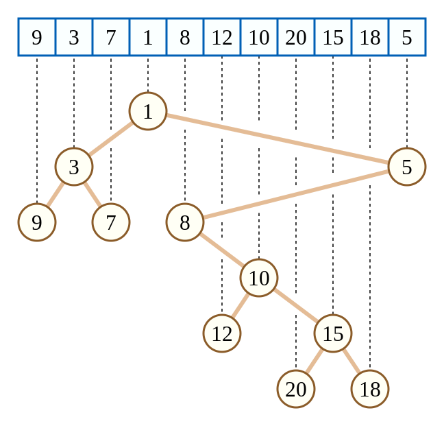
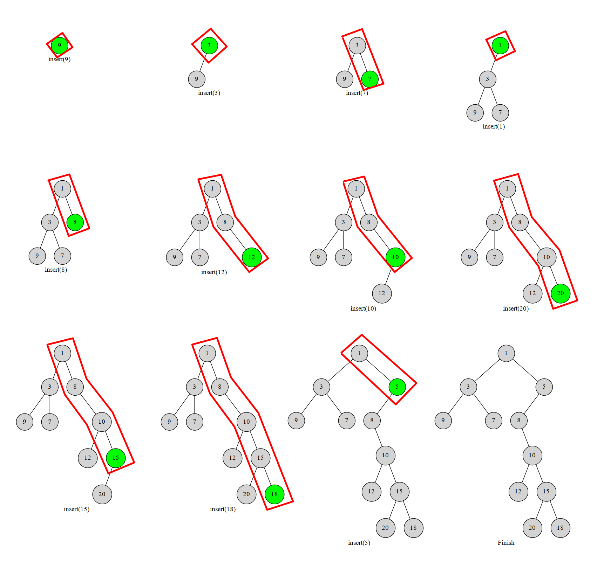

本文介绍一种不太常用，但是与大家熟知的平衡树与堆密切相关的数据结构——笛卡尔树。

笛卡尔树是一种二叉树，每一个结点由一个键值二元组 $(k,w)$ 构成。要求 $k$ 满足二叉搜索树的性质，而 $w$ 满足堆的性质。一个有趣的事实是，如果笛卡尔树的 $k,w$ 键值确定，且 $k$ 互不相同，$w$ 互不相同，那么这个笛卡尔树的结构是唯一的。上图：



（图源自维基百科）

上面这棵笛卡尔树相当于把数组元素值当作键值 $w$，而把数组下标当作键值 $k$。显然可以发现，这棵树的键值 $f$ 满足二叉搜索树的性质，而键值 $w$ 满足小根堆的性质。

其实图中的笛卡尔树是一种特殊的情况，因为二元组的键值 $k$ 恰好对应数组下标，这种特殊的笛卡尔树有一个性质，就是一棵子树内的下标是连续的一个区间（这样才能满足二叉搜索树的性质）。更一般的情况则是任意二元组构建的笛卡尔树。

## 构建

既然笛卡尔树有具有两种不同结构的性质，那么就有两种构建方法。其中一种的复杂度是 $O(n)$，另一种是 $O(n\log_2n)$。

### 栈构建

我们考虑将元素按照键值 $k$ 排序。然后一个一个插入到当前的笛卡尔树中。那么每次我们插入的元素必然在这个树的右链（右链：即从根结点一直往右子树走，经过的结点形成的链）的末端。于是我们执行这样一个过程，从下往上比较右链结点与当前结点 $u$ 的 $w$，如果找到了一个右链上的结点 $x$ 满足 $x_w<u_w$，就把 $u$ 接到 x 的右儿子上，而 x 原本的右子树就变成 u 的左子树。

具体不解释，我们直接上图。图中红色框框部分就是我们始终维护的右链：



显然每个数最多进出右链一次（或者说每个点在右链中存在的是一段连续的时间）。这个过程我们可以用栈维护，栈中维护当前笛卡尔树的右链上的结点。一个点不在右链上了就把它弹掉。这样每个点最多进出一次，复杂度 $O(n)$。

## 另一种构建

还有一种构建方式与之对应（这是我自己 YY 的）。我们按照 $w$ 排序，始终维护堆的结构。这样插入一个结点，相当于添加一个叶子结点。于是我们像平衡树那样插入就行了。这样每一次插入的复杂度是 $O(\log_2n)$ 的，因此总复杂度是 $O(n\log_2n)$ 的。

## 笛卡尔树与 Treap

谈到笛卡尔树，很容易让人想到一种家喻户晓的结构——Treap。没错，Treap 是笛卡尔树的一种，只不过 w 的值完全随机。Treap 也有线性的构建算法，如果提前将元素排好序，显然可以使用上述单调栈算法完成构建过程，只不过很少会这么用。

## 例题

HDU 1506 最大子矩形

> 题目大意：n 个位置，每个位置上的高度是 $h_i$，求最大子矩阵。举一个例子，如下图：
>
> 
>
> 阴影部分就是图中的最大子矩阵。

这道题你可 DP，可单调栈，但你万万没想到的是它也可以笛卡尔树！具体地，我们把下标作为键值 $k$，$h_i$ 作为键值 $w$ 满足小根堆性质，构建一棵 $(i,h_i)$ 的笛卡尔树。

这样我们枚举每个结点 $u$，把 $u_w$（即结点 u 的高度键值 $h$）作为最大子矩阵的高度。由于我们建立的笛卡尔树满足小根堆性质，因此 $u$ 的子树内的结点的高度都大于等于 $u$。而我们又知道 $u$ 子树内的下标是一段连续的区间。于是我们只需要知道子树内的下标最小值和最大值即可，换言之，就是 $u$ 子树内的左链和右链末端的结点的下标键值。我们对每个点这样求，最后取面积最大值即可。显然这个可以一次 DFS 完成，因此复杂度仍是 $O(n)$ 的。

```cpp
#include <iostream>
#include <cstdio>
#include <cstring>
#include <algorithm>
using namespace std;
typedef long long ll;
const int N=100000+10,INF=0x3f3f3f3f;
 
struct node {
    int idx,val,par,ch[2];
    friend bool operator<(node a, node b){
        return a.idx < b.idx;
    }
    void init(int _idx,int _val,int _par){
        idx=_idx,val=_val,par=_par,ch[0]=ch[1]=0;
    }
} tree[N];
 
int root,top,stk[N];
ll ans;
int cartesian_build(int n){
    for(int i=1;i<=n;i++){
        int k=i-1;
        while(tree[k].val>tree[i].val)k=tree[k].par;
        tree[i].ch[0]=tree[k].ch[1];
        tree[k].ch[1]=i;
        tree[i].par=k;
        tree[tree[i].ch[0]].par=i;
    }
    return tree[0].ch[1];
}
int dfs(int x) {
    if(!x)return 0;
    int sz=dfs(tree[x].ch[0]);
    sz+=dfs(tree[x].ch[1]);
    ans=max(ans,(ll)(sz+1)*tree[x].val);
    return sz+1;
}
int main()
{
    int n, hi;
    while(scanf("%d",&n),n){
        tree[0].init(0,0,0);
        for(int i=1;i<=n;i++){
            scanf("%d", &hi);
            tree[i].init(i,hi,0);
        }
        root=cartesian_build(n);
        ans=0;
        dfs(root);
        printf("%lld\n", ans);
    }
    return 0;
}
```

## 参考资料

[维基百科 - 笛卡尔树](https://zh.wikipedia.org/wiki/%E7%AC%9B%E5%8D%A1%E5%B0%94%E6%A0%91)

