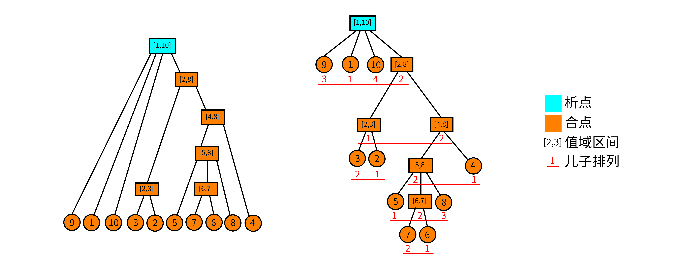
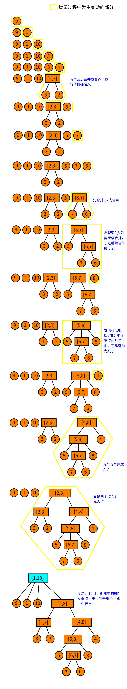

解释一下本文可能用到的符号：$\wedge$ 逻辑与，$\vee$ 逻辑或。

## 关于段的问题

我们由一个小清新的问题引入：

> 对于一个 $1-n$ 的排列，我们称一个值域连续的区间为段。问一个排列的段的个数。比如，$\{5 ,3 ,4, 1 ,2\}$ 的段有：$[1,1],[2,2],[3,3],[4,4],[5,5],[2,3],[4,5],[1,3],[2,5],[1,5]$。

看到这个东西，感觉要维护区间的值域集合，复杂度好像挺不友好的。线段树可以查询某个区间是否为段，但不太能统计段的个数。

这里我们引入这个神奇的数据结构——析合树！

## 连续段

在介绍析合树之前，我们先做一些前提条件的限定。鉴于 LCA 的课件中给出的定义不易理解，为方便读者理解，这里给出一些不太严谨（但更容易理解）的定义。

### 排列与连续段

**排列**：定义一个 $n$ 阶排列 $P$ 是一个大小为 $n$ 的序列，使得 $P_i$ 取遍 $1,2,\cdots,n$。说得形式化一点，$n$ 阶排列 $P$ 是一个有序集合满足：

1. $|P|=n$.
2. $\forall i,P_i\in[1,n]$.
3.  $\nexists i,j\in[1,n],P_i=P_j$.

    **连续段**：对于排列 $P$，定义连续段 $(P,[l,r])$ 表示一个区间 $[l,r]$，要求 $P_{l\sim r}$ 值域是连续的。说得更形式化一点，对于排列 $P$，连续段表示一个区间 $[l,r]$ 满足：

$$
(\nexists\ x,z\in[l,r],y\notin[l,r],\ P_x<P_y<P_z)
$$

特别地，当 $l>r$ 时，我们认为这是一个空的连续段，记作 $(P,\varnothing)$。

我们称排列 $P$ 的所有连续段的集合为 $I_P$，并且我们认为 $(P,\varnothing)\in I_P$。

### 连续段的运算

连续段是依赖区间和值域定义的，于是我们可以定义连续段的交并差的运算。

定义 $A=(P,[a,b]),B=(P,[x,y])$，且 $A,B\in I_P$。于是连续段的关系和运算可以表示为：

1. $A\subseteq B\Leftrightarrow x\le a\wedge b\le y$.
2. $A=B\Leftrightarrow a=x\wedge b=y$.
3. $A\cap B=(P,[\max(a,x),\min(b,y)])$.
4. $A\cup B=(P,[\min(a,x),\max(b,y)])$.
5. $A\setminus B=(P,\{i|i\in[a,b]\wedge i\notin[x,y]\})$.

其实这些运算就是普通的集合交并差放在区间上而已。

### 连续段的性质

连续段的一些显而易见的性质。我们定义 $A,B\in I_P,A \cap B \neq \varnothing,A \notin B,B \notin A$，那么有 $A\cup B,A\cap B,A\setminus B,B\setminus A\in I_P$。

证明？证明的本质就是集合的交并差的运算。

## 析合树

好的，现在讲到重点了。你可能已经猜到了，析合树正是由连续段组成的一棵树。但是要知道一个排列可能有多达 $O(n^2)$ 个连续段，因此我们就要抽出其中更基本的连续段组成析合树。

### 本原段

其实这个定义全称叫作 **本原连续段**。但笔者认为本原段更为简洁。

对于排列 $P$，我们认为一个本原段 $M$ 表示在集合 $I_P$ 中，不存在与之相交且不包含的连续段。形式化地定义，我们认为 $X\in I_P$ 且满足 $\forall A\in I_P,\ X\cap A= (P,\varnothing)\vee X\subseteq A\vee A\subseteq X$。

所有本原段的集合为 $M_P$. 显而易见，$(P,\varnothing)\in M_P$。

显然，本原段之间只有相离或者包含关系。并且你发现 **一个连续段可以由几个互不相交的本原段构成**。最大的本原段就是整个排列本身，它包含了其他所有本原段，因此我们认为本原段可以构成一个树形结构，我们称这个结构为 **析合树**。更严格地说，排列 $P$ 的析合树由排列 $P$ 的 **所有本原段** 组成。

前面干讲这么多的定义，不来点图怎么行。考虑排列 $P=\{9,1,10,3,2,5,7,6,8,4\}$. 它的本原段构成的析合树如下：



在图中我们没有标明本原段。而图中 **每个结点都代表一个本原段**。我们只标明了每个本原段的值域。举个例子，结点 $[5,8]$ 代表的本原段就是 $(P,[6,9])=\{5,7,6,8\}$。于是这里就有一个问题：**什么是析点合点？**

### 析点与合点

这里我们直接给出定义，稍候再来讨论它的正确性。

1. **值域区间**：对于一个结点 $u$，用 $[u_l,u_r]$ 表示该结点的值域区间。
2. **儿子序列**：对于析合树上的一个结点 $u$，假设它的儿子结点是一个 **有序** 序列，该序列是以值域区间为元素的（单个的数 $x$ 可以理解为 $[x,x]$ 的区间）。我们把这个序列称为儿子序列。记作 $S_u$。
3. **儿子排列**：对于一个儿子序列 $S_u$，把它的元素离散化成正整数后形成的排列称为儿子排列。举个例子，对于结点 $[5,8]$，它的儿子序列为 $\{[5,5],[6,7],[8,8]\}$，那么把区间排序标个号，则它的儿子排列就为 $\{1,2,3\}$；类似的，结点 $[4,8]$ 的儿子排列为 $\{2,1\}$。结点 $u$ 的儿子排列记为 $P_u$。
4. **合点**：我们认为，儿子排列为顺序或者逆序的点为合点。形式化地说，满足 $P_u=\{1,2,\cdots,|S_u|\}$ 或者 $P_u=\{|S_u|,|S_u-1|,\cdots,1\}$ 的点称为合点。**叶子结点没有儿子排列，我们也认为它是合点**。
5. **析点**：不是合点的就是析点。

从图中可以看到，只有 $[1,10]$ 不是合点。因为 $[1,10]$ 的儿子排列是 $\{3,1,4,2\}$。

### 析点与合点的性质

析点与合点的命名来源于他们的性质。首先我们有一个非常显然的性质：对于析合树中任何的结点 $u$，其儿子序列区间的并集就是结点 $u$ 的值域区间。即 $\bigcup_{i=1}^{|S_u|}S_u[i]=[u_l,u_r]$。

对于一个合点 $u$：其儿子序列的任意 **子区间** 都构成一个 **连续段**。形式化地说，$\forall S_u[l\sim r]$，有 $\bigcup_{i=l}^rS_u[i]\in I_P$。

对于一个析点 $u$：其儿子序列的任意 **长度大于 1（这里的长度是指儿子序列中的元素数，不是下标区间的长度）** 的子区间都 **不** 构成一个 **连续段**。形式化地说，$\forall S_u[l\sim r],l<r$，有 $\bigcup_{i=l}^rS_u[i]\notin I_P$。

合点的性质不难证明。因为合点的儿子排列要么是顺序，要么是倒序，而值域区间也是首位相接，因此只要是连续的一段子序列（区间）都是一个连续段。

对于析点的性质可能很多读者就不太能理解了：为什么 **任意** 长度大于 $1$ 的子区间都不构成连续段？

使用反证法。假设对于一个点 $u$，它的儿子序列中有一个 **最长的** 区间 $S_u[l\sim r]$ 构成了连续段。那么这个 $A=\bigcup_{i=l}^rS_u[i]\in I_P$，也就意味着 $A$ 是一个本原段！（因为 $A$ 是儿子序列中最长的，因此找不到一个与它相交又不包含的连续段）于是你就没有使用所有的本原段构成这个析合树。矛盾。

### 析合树的构造

前面讲了这么多零零散散的东西，现在就来具体地讲如何构造析合树。LCA 大佬的线性构造算法我是没看懂的，今天就讲一下比较好懂的 $O(n\log n)$ 的算法。

#### 增量法

我们考虑增量法。用一个栈维护前 $i-1$ 个元素构成的析合森林。在这里我需要 **着重强调**，析合森林的意思是，在任何时侯，栈中结点要么是析点要么是合点。现在考虑当前结点 $P_i$。

1. 我们先判断它能否成为栈顶结点的儿子，如果能就变成栈顶的儿子，然后把栈顶取出，作为当前结点。重复上述过程直到栈空或者不能成为栈顶结点的儿子。
2. 如果不能成为栈顶的儿子，就看能不能把栈顶的若干个连续的结点都合并成一个结点（判断能否合并的方法在后面），把合并后的点，作为当前结点。
3. 重复上述过程直到不能进行为止。然后结束此次增量，直接把当前结点压栈。

接下来我们仔细解释一下。

#### 具体的策略

我们认为，如果当前点能够成为栈顶结点的儿子，那么栈顶结点是一个合点。如果是析点，那么你合并后这个析点就存在一个子连续段，不满足析点的性质。因此一定是合点。

如果无法成为栈顶结点的儿子，那么我们就看栈顶连续的若干个点能否与当前点一起合并。设 $l$ 为当前点所在区间的左端点。我们计算 $L_i$ 表示右端点下标为 $i$ 的连续段中，左端点 $< l$ 的最大值。当前结点为 $P_i$，栈顶结点记为 $t$。

1. 如果 $L_i$ 不存在，那么显然当前结点无法合并；
2. 如果 $t_l=L_i$，那么这就是两个结点合并，合并后就是一个 **合点**；
3. 否则在栈中一定存在一个点 $t'$ 的左端点 ${t'}_l=L_i$，那么一定可以从当前结点合并到 $t’$ 形成一个 **析点**；

#### 判断能否合并

最后，我们考虑如何处理 $L_i$。事实上，一个连续段 $(P,[l,r])$ 等价于区间极差与区间长度 -1 相等。即

$$
\max_{l\le i\le r}P_i-\min_{l\le i\le r}P_i=r-l
$$

而且由于 P 是一个排列，因此对于任意的区间 $[l,r]$ 都有

$$
\max_{l\le i\le r}P_i-\min_{l\le i\le r}P_i\ge r-l
$$

于是我们就维护 $\max_{l\le i\le r}P_i-\min_{l\le i\le r}P_i-(r-l)$，那么要找到一个连续段相当于查询一个最小值！

有了上述思路，不难想到这样的算法。对于增量过程中的当前的 $i$，我们维护一个数组 $Q$ 表示区间 $[j,i]$ 的极差减长度。即

$$
Q_j=\max_{j\le k\le i}P_k-\min_{j\le k\le i}P_k-(i-j),\ \ 0<j<i
$$

现在我们想知道在 $1\sim i-1$ 中是否存在一个最小的 $j$ 使得 $Q_j=0$。这等价于求 $Q_{1\sim i-1}$ 的最小值。求得最小的 $j$ 就是 $L_i$。如果没有，那么 $L_i=i$。

但是当第 $i$ 次增量结束时，我们需要快速把 $Q$ 数组更新到 i+1 的情况。原本的区间从 $[j,i]$ 变成 $[j,i+1]$，如果 $P_{i+1}>\max$ 或者 $P_{i+1}<\min$ 都会造成 $Q_j$ 发生变化。如何变化？如果 $P_{i+1}>\max$，相当于我们把 $Q_j$ 先减掉 $\max$ 再加上 $P_{i+1}$ 就完成了 $Q_j$ 的更新；$P_{i+1}<\min$ 同理，相当于 $Q_j=Q_j+\min-P_{i+1}$.

那么如果对于一个区间 $[x,y]$，满足 $P_{x\sim i},P_{x+1\sim i},P_{x+2\sim i},\cdots,P_{y\sim i}$ 的区间 $\max$ 都相同呢？你已经发现了，那么相当于我们在做一个区间加的操作；同理，当 $P_{x\sim i},P_{x+1\sim i},\cdots,P_{y\sim i}$ 的区间 $\min$ 都想同时也是一个区间加的操作。同时，$\max$ 和 $\min$ 的更新是相互独立的，因此可以各自更新。

因此我们对 $Q$ 的维护可以这样描述：

1. 找到最大的 $j$ 使得 $P_{j}>P_{i+1}$，那么显然，$P_{j+1\sim i}$ 这一段数全部小于 $P_{i+1}$，于是就需要更新 $Q_{j+1\sim i}$ 的最大值。由于 $P_{i},\max(P_i,P_{i-1}),\max(P_i,P_{i-1},P_{i-2}),\cdots,\max(P_i,P_{i-1},\cdots,P_{j+1})$ 是（非严格）单调递增的，因此可以每一段相同的 $\max$ 做相同的更新，即区间加操作。
2. 更新 $\min$ 同理。
3. 把每一个 $Q_j$ 都减 $1$。因为区间长度加 $1$。
4. 查询 $L_i$：即查询 $Q$ 的最小值的所在的 **下标**。

没错，我们可以使用线段树维护 $Q$！现在还有一个问题：怎么找到相同的一段使得他们的 $\max/\min$ 都相同？使用单调栈维护！维护两个单调栈分别表示 $\max/\min$。那么显然，栈中以相邻两个元素为端点的区间的 $\max/\min$ 是相同的，于是在维护单调栈的时侯顺便更新线段树即可。

具体的维护方法见代码。

讲这么多干巴巴的想必小伙伴也听得云里雾里的，那么我们就先上图吧。长图警告！



### 实现

最后放一个实现的代码供参考。代码转自 [大米饼的博客](https://www.cnblogs.com/Paul-Guderian/p/11020708.html)，被我加了一些注释。

```cpp
#include <bits/stdc++.h>
#define rg register
using namespace std;
const int N = 200010;

int n, m, a[N], st1[N], st2[N], tp1, tp2, rt;
int L[N], R[N], M[N], id[N], cnt, typ[N], bin[20], st[N], tp;
//本篇代码原题应为 CERC2017 Intrinsic Interval
// a数组即为原题中对应的排列
// st1和st2分别两个单调栈，tp1、tp2为对应的栈顶，rt为析合树的根
// L、R数组表示该析合树节点的左右端点，M数组的作用在析合树构造时有提到
// id存储的是排列中某一位置对应的节点编号，typ用于标记析点还是合点
// st为存储析合树节点编号的栈，tp为其栈顶
struct RMQ {  // 预处理 RMQ（Max & Min）
  int lg[N], mn[N][17], mx[N][17];
  void chkmn(int& x, int y) {
    if (x > y) x = y;
  }
  void chkmx(int& x, int y) {
    if (x < y) x = y;
  }
  void build() {
    for (int i = bin[0] = 1; i < 20; ++i) bin[i] = bin[i - 1] << 1;
    for (int i = 2; i <= n; ++i) lg[i] = lg[i >> 1] + 1;
    for (int i = 1; i <= n; ++i) mn[i][0] = mx[i][0] = a[i];
    for (int i = 1; i < 17; ++i)
      for (int j = 1; j + bin[i] - 1 <= n; ++j)
        mn[j][i] = min(mn[j][i - 1], mn[j + bin[i - 1]][i - 1]),
        mx[j][i] = max(mx[j][i - 1], mx[j + bin[i - 1]][i - 1]);
  }
  int ask_mn(int l, int r) {
    int t = lg[r - l + 1];
    return min(mn[l][t], mn[r - bin[t] + 1][t]);
  }
  int ask_mx(int l, int r) {
    int t = lg[r - l + 1];
    return max(mx[l][t], mx[r - bin[t] + 1][t]);
  }
} D;
// 维护 L_i

struct SEG {  // 线段树
#define ls (k << 1)
#define rs (k << 1 | 1)
  int mn[N << 1], ly[N << 1];  // 区间加；区间最小值
  void pushup(int k) { mn[k] = min(mn[ls], mn[rs]); }
  void mfy(int k, int v) { mn[k] += v, ly[k] += v; }
  void pushdown(int k) {
    if (ly[k]) mfy(ls, ly[k]), mfy(rs, ly[k]), ly[k] = 0;
  }
  void update(int k, int l, int r, int x, int y, int v) {
    if (l == x && r == y) {
      mfy(k, v);
      return;
    }
    pushdown(k);
    int mid = (l + r) >> 1;
    if (y <= mid)
      update(ls, l, mid, x, y, v);
    else if (x > mid)
      update(rs, mid + 1, r, x, y, v);
    else
      update(ls, l, mid, x, mid, v), update(rs, mid + 1, r, mid + 1, y, v);
    pushup(k);
  }
  int query(int k, int l, int r) {  // 询问 0 的位置
    if (l == r) return l;
    pushdown(k);
    int mid = (l + r) >> 1;
    if (!mn[ls])
      return query(ls, l, mid);
    else
      return query(rs, mid + 1, r);
    // 如果不存在 0 的位置就会自动返回当前你查询的位置
  }
} T;

int o = 1, hd[N], dep[N], fa[N][18];
struct Edge {
  int v, nt;
} E[N << 1];
void add(int u, int v) {  // 树结构加边
  E[o] = (Edge){v, hd[u]};
  hd[u] = o++;
}
void dfs(int u) {
  for (int i = 1; bin[i] <= dep[u]; ++i) fa[u][i] = fa[fa[u][i - 1]][i - 1];
  for (int i = hd[u]; i; i = E[i].nt) {
    int v = E[i].v;
    dep[v] = dep[u] + 1;
    fa[v][0] = u;
    dfs(v);
  }
}
int go(int u, int d) {
  for (int i = 0; i < 18 && d; ++i)
    if (bin[i] & d) d ^= bin[i], u = fa[u][i];
  return u;
}
int lca(int u, int v) {
  if (dep[u] < dep[v]) swap(u, v);
  u = go(u, dep[u] - dep[v]);
  if (u == v) return u;
  for (int i = 17; ~i; --i)
    if (fa[u][i] != fa[v][i]) u = fa[u][i], v = fa[v][i];
  return fa[u][0];
}

// 判断当前区间是否为连续段
bool judge(int l, int r) { return D.ask_mx(l, r) - D.ask_mn(l, r) == r - l; }

// 建树
void build() {
  for (int i = 1; i <= n; ++i) {
    // 单调栈
    // 在区间 [st1[tp1-1]+1,st1[tp1]] 的最小值就是 a[st1[tp1]]
    // 现在把它出栈，意味着要把多减掉的 Min 加回来。
    // 线段树的叶结点位置 j 维护的是从 j 到当前的 i 的
    // Max{j,i}-Min{j,i}-(i-j)
    // 区间加只是一个 Tag。
    // 维护单调栈的目的是辅助线段树从 i-1 更新到 i。
    // 更新到 i 后，只需要查询全局最小值即可知道是否有解

    while (tp1 && a[i] <= a[st1[tp1]])  // 单调递增的栈，维护 Min
      T.update(1, 1, n, st1[tp1 - 1] + 1, st1[tp1], a[st1[tp1]]), tp1--;
    while (tp2 && a[i] >= a[st2[tp2]])
      T.update(1, 1, n, st2[tp2 - 1] + 1, st2[tp2], -a[st2[tp2]]), tp2--;

    T.update(1, 1, n, st1[tp1] + 1, i, -a[i]);
    st1[++tp1] = i;
    T.update(1, 1, n, st2[tp2] + 1, i, a[i]);
    st2[++tp2] = i;

    id[i] = ++cnt;
    L[cnt] = R[cnt] = i;  // 这里的 L,R 是指节点所对应区间的左右端点
    int le = T.query(1, 1, n), now = cnt;
    while (tp && L[st[tp]] >= le) {
      if (typ[st[tp]] && judge(M[st[tp]], i)) {
        // 判断是否能成为儿子，如果能就做
        R[st[tp]] = i, M[st[tp]] = L[now], add(st[tp], now), now = st[tp--];
      } else if (judge(L[st[tp]], i)) {
        typ[++cnt] = 1;  // 合点一定是被这样建出来的
        L[cnt] = L[st[tp]], R[cnt] = i, M[cnt] = L[now];
        // 这里M数组是记录节点最右面的儿子的左端点，用于上方能否成为儿子的判断
        add(cnt, st[tp--]), add(cnt, now);
        now = cnt;
      } else {
        add(++cnt, now);  // 新建一个结点，把 now 添加为儿子
        // 如果从当前结点开始不能构成连续段，就合并。
        // 直到找到一个结点能构成连续段。而且我们一定能找到这样
        // 一个结点。
        do
          add(cnt, st[tp--]);
        while (tp && !judge(L[st[tp]], i));
        L[cnt] = L[st[tp]], R[cnt] = i, add(cnt, st[tp--]);
        now = cnt;
      }
    }
    st[++tp] = now;  // 增量结束，把当前点压栈

    T.update(1, 1, n, 1, i, -1);  // 因为区间右端点向后移动一格，因此整体 -1
  }

  rt = st[1];  // 栈中最后剩下的点是根结点
}
void query(int l, int r) {
  int x = id[l], y = id[r];
  int z = lca(x, y);
  if (typ[z] & 1)
    l = L[go(x, dep[x] - dep[z] - 1)], r = R[go(y, dep[y] - dep[z] - 1)];
  // 合点这里特判的原因是因为这个合点不一定是最小的包含l，r的连续段.
  // 因为合点所代表的区间的子区间也都是连续段，而我们只需要其中的一段就够了。
  else
    l = L[z], r = R[z];
  printf("%d %d\n", l, r);
}  // 分 lca 为析或和，这里把叶子看成析的

int main() {
  scanf("%d", &n);
  for (int i = 1; i <= n; ++i) scanf("%d", &a[i]);
  D.build();
  build();
  dfs(rt);
  scanf("%d", &m);
  for (int i = 1; i <= m; ++i) {
    int x, y;
    scanf("%d%d", &x, &y);
    query(x, y);
  }
  return 0;
}
// 20190612
// 析合树
```

## 参考文献

刘承奥。简单的连续段数据结构。WC2019 营员交流。

[大米饼的博客 -【学习笔记】析合树](https://www.cnblogs.com/Paul-Guderian/p/11020708.html)
