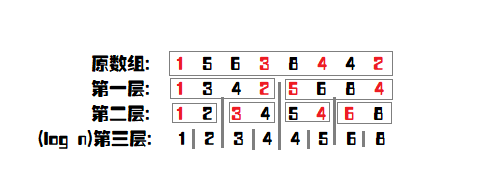
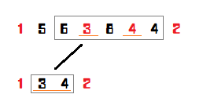

author: Xarfa

划分树是一种来解决区间第 $K$ 大的一种数据结构，其常数、理解难度都要比主席树低很多。同时，划分树紧贴“第 $K$ 大”，所以是一种基于排序的一种数据结构。

**建议先学完 [主席树](../persistent-seg/#主席树) 再看划分树哦**

## 建树

划分树的建树比较简单，但是相对于其他树来说比较复杂。

如图，每一层都有一个看似无序的数组。其实，每一个被红色标记的数字都是 **要分配到左儿子的**。而分配的规则是什么？就是与 **这一层的中位数** 做比较，如果小于等于中位数，则分到左边，否则分到右边。但是这里要注意一下：并不是严格的 **小于等于就分到左边，否则分到右边**。因为中位数可能有相同，而且与 $N$ 的奇偶有一定关系。下面的代码展示会有一个巧妙的运用，大家可以参照代码。

我们不可能每一次都对每一层排序，这样子不说常数，就算是理论复杂度也过不去。我们想，找中位数，一次排序就够了。为什么？比如，我们求 $l,r$ 的中位数，其实就是在排完序过后的 `num[mid]`。

两个关键数组：

tree[log(N),N]&#x3A;也就是树，要存下所有的值，空间复杂度 $O(n\log n)$。
toleft[log(N),n]&#x3A;也就是每一层 1~i 进入左儿子的数量，这里需要理解一下，这是一个前缀和。

```pascal
procedure Build(left,right,deep:longint); // left,right 表示区间左右端点,deep是第几层
var
  i,mid,same,ls,rs,flag:longint; // 其中 flag 是用来平衡左右两边的数量的
begin
  if left=right then exit; // 到底层了
  mid:=(left+right) >> 1;
  same:=mid-left+1;
  for i:=left to right do 
    if tree[deep,i]<num[mid] then
      dec(same);

  ls:=left; // 分配到左儿子的第一个指针
  rs:=mid+1; // 分配到右儿子的第一个指针
  for i:=left to right do
  begin
    flag:=0;
    if (tree[deep,i]<num[mid])or((tree[deep,i]=num[mid])and(same>0)) then // 分配到左边的条件
    begin
      flag:=1; tree[deep+1,ls]:=tree[deep,i]; inc(ls);
      if tree[deep,i]=num[mid] then // 平衡左右个数
        dec(same);
    end
    else
    begin
      tree[deep+1,rs]:=tree[deep,i]; inc(rs);
    end;
    toleft[deep,i]:=toleft[deep,i-1]+flag;
  end;
  Build(left,mid,deep+1); // 继续
  Build(mid+1,right,deep+1);
end;
```

## 查询

那我们先扯一下主席树的内容。在用主席树求区间第 $K$ 小的时候，我们以 $K$ 为基准，向左就向左，向右要减去向左的值，在划分树中也是这样子的。

查询难理解的，在于 **区间缩小** 这种东西。下图，我查询的是 $3$ 到 $7$, 那么下一层我就只需要查询 $2$ 到 $3$ 了。当然，我们定义 $[\text{left},\text{right}]$ 为缩小后的区间（目标区间），$[l,r]$ 还是我所在节点的区间。那为什么要标出目标区间呢？因为那是 **判定答案在左边还是右边的基准**。



```pascal
function Query(left,right,k,l,r,deep:longint):longint;
var
  mid,x,y,cnt,rx,ry:longint;
begin
  if left=right then // 写成 l=r 也无妨,因为目标区间也一定有答案
    exit(tree[deep,left]);
  mid:=(l+r) >> 1;
  x:=toleft[deep,left-1]-toleft[deep,l-1]; // l 到 left 的去左儿子的个数
  y:=toleft[deep,right]-toleft[deep,l-1]; // l 到 right 的去左儿子的个数
  ry:=right-l-y; rx:=left-l-x; // ry 是 l 到 right 去右儿子的个数,rx 则是 l 到 left 去右儿子的个数
  cnt:=y-x; // left 到 right 左儿子的个数
  if cnt>=k then // 主席树常识啦
    Query:=Query(l+x,l+y-1,k,l,mid,deep+1) // l+x 就是缩小左边界,l+y-1 就是缩小右区间。对于上图来说,就是把节点 1 和 2 放弃了。
  else
    Query:=Query(mid+rx+1,mid+ry+1,k-cnt,mid+1,r,deep+1); // 同样是缩小区间,只不过变成了右边而已。注意要将 k 减去 cnt。
end;
```

## 理论复杂度和亲测结果

时间复杂度 : 一次查询只需要 $O(\log n)$，$m$ 次询问，就是 $O(m\log n)$。

空间复杂度 : 只需要存储 $O(n\log n)$ 个数字。

亲测结果：主席树 :$1482 \text{ms}$、划分树 :$889 \text{ms}$。（非递归，常数比较小）

## 划分树的应用

例题：[Luogu P3157\[CQOI2011\]动态逆序对](https://www.luogu.com.cn/problem/P3157)

> 题意简述：给定一个 $n$ 个元素的排列（$n\leq 10^5$），有 m 次询问（$m\leq 5\times 10^4$），每次删去排列中的一个数，求删去这个数之后排列的逆序对个数。

这题可以使用 CDQ 在 $\Theta(n\log^2n)$ 的时间及 $\Theta(n)$ 的空间内解决，并且 CDQ 的常数也很优秀。

如果这道题改为强制在线，则一般使用树状数组 + 主席树的树套树解法解决，时间复杂度为 $\Theta(n\log^2n)$，空间复杂度为 $\Theta(n\log^2n)$，常数略大，同样可以过此题。

而使用划分树的话就可以在 $\Theta(n\log^2n)$ 的时间及 $\Theta(n\log n)$ 的空间内在线解决本题，同时常数也比树套树解法少很多。（大致与 CDQ 相当。）

**注意：为了编程实现方便，本文依照位置的中间值将大数组划分为两个小数组，即下文中的划分树相当于是归并排序的过程，而非快速排序的过程。最顶层的大数组为有序数组，最底层为原数组。**

对于每一个划分树中的节点，我们称他为右节点当且仅当他在下一层会被划分到右孩子，即原数组中位置比较靠后的那些数，相似的可以定义左节点。如果在建树的过程中将最顶层排为有序的，类似于归并排序求逆序对，可以发现一个数组的逆序对个数就是在每个左节点之前的右节点的个树和。

再考虑删除操作。删除一个左节点会将整个数组的逆序对减少在他之前右结点的个数，而删除一个右节点会减少在他之后的左节点个数。那么可以考虑每次动态维护“每一个左节点之前的右结点个数”和“每一个右节点之后的左节点个数”。这可以使用树状数组简单维护。

需要注意的是，在使用树状数组维护时只能计算在划分树中同一块内的贡献，而不能跳出块。对于树状数组来说有一个较为巧妙的处理方式。

考虑划分树上每一块的下标范围肯定为 $[c\times 2^k+1,(c+1)\times 2^k]$ 的形式，列举如下（由于代码中不会涉及到划分树最底层的处理，因此只枚举到倒数第二层）：

    [0001 0010] [0011 0100] [0101 0110] [0111 1000] [1001 1010] [1011 1100] [1101 1110] [1111 10000]  lev=1
    [0001 0010 0011 0100]   [0101 0110 0111 1000]   [1001 1010 1011 1100]   [1101 1110 1111 10000]    lev=2
    [0001 0010 0011 0100 0101 0110 0111 1000]       [1001 1010 1011 1100 1101 1110 1111 10000]        lev=3
    [0001 0010 0011 0100 0101 0110 0111 1000 1001 1010 1011 1100 1101 1110 1111 10000]                lev=4

回忆一下树状数组的原理，在向上跳的时候，我们每次 `x += lowbit(x)`。如果在向上跳的时候可以保证不跳出块，就可以保证只会影响到块内元素的值。向上查询也类似。

而如果要在向上跳的同时保证不跳出块，只需要保证在跳的时候满足 $lowbit(x)<2^{lev}$ 即可。

而向下跳则是完全不同的处理方式。每一块的下标如果使用 0-index 表示的话，即为 $[c\times 2^k,(c+1)\times 2^k)$ 的形式。那么，只需将某一个下标的值右位移 k，即可得出它在哪一块中。在向下跳的时候时刻判断是否跳出块即可。

需要注意的是，按这一方法实现的树状数组会访问到的最大下标是距离 n 最近的 2 的整次幂，因此数组下标不能开 n。

由于需要在 $\log n$ 层修改，在第 $k$ 层修改的时间复杂度为 $\Theta(k)$，最终时间复杂度即为 $\Theta(n\log n+m\log^2n)$。

附代码：

```cpp
--8<-- "docs/ds/code/dividing/dividing_1.cpp"
```

## 后记

参考博文 :[传送门](https://blog.csdn.net/littlewhite520/article/details/70250722)。
