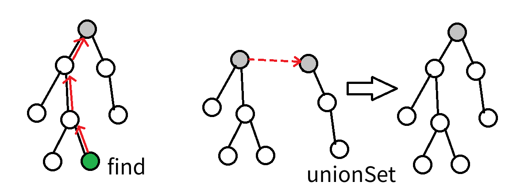
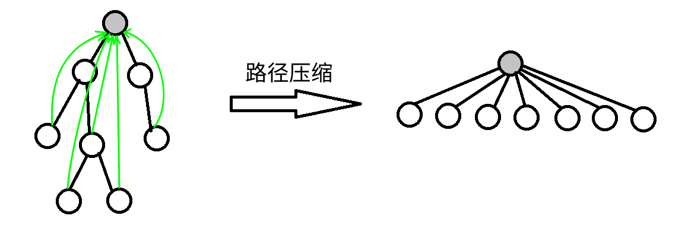

并查集是一种树形的数据结构，顾名思义，它用于处理一些不交集的 **合并** 及 **查询** 问题。
它支持两种操作：

-   查找（Find）：确定某个元素处于哪个子集；

-   合并（Union）：将两个子集合并成一个集合。

*也就是说，不支持集合的分离、删除。  

## 初始化

```cpp
void makeSet(int size) {
  for (int i = 0; i < size; i++)
    fa[i] = i;  // i就在它本身的集合里
  return;
}
```

## 查找

!!! 举个例子  
几个家族进行宴会，但是家族普遍长寿，所以人数众多。由于长时间的分离以及年龄的增长，这些人逐渐忘掉了自己的亲人，只记得自己的爸爸是谁了，而最长者（称为「祖先」）的父亲已经去世，他只知道自己是祖先。为了确定自己是哪个家族，他们想出了一个办法，只要问自己的爸爸是不是祖先，一层一层的向上问，直到问到祖先。如果要判断两人是否在同一家族，只要看两人的祖先是不是同一人就可以了。

在这样的思想下，并查集的查找算法诞生了。

此处给出一种 C++ 的参考实现：

```cpp
int fa[MAXN];  //记录某个人的爸爸是谁，特别规定，祖先的爸爸是他自己
int find(int x) {
  //寻找x的祖先
  if (fa[x] == x)  //如果x是祖先则返回
    return x;
  else
    return find(fa[x]);  //如果不是则x的爸爸问x的爷爷
}
```

显然这样最终会返回 $x$ 的祖先。

### 路径压缩

这样的确可以达成目的，但是显然效率实在太低。为什么呢？因为我们使用了太多没用的信息，我的祖先是谁与我父亲是谁没什么关系，这样一层一层找太浪费时间，不如我直接当祖先的儿子，问一次就可以出结果了。甚至祖先是谁都无所谓，只要这个人可以代表我们家族就能得到想要的效果。 **把在路径上的每个节点都直接连接到根上** ，这就是路径压缩。

此处给出一种 C++ 的参考实现：

```cpp
int find(int x) {
  if (x != fa[x])  // x不是自身的父亲，即x不是该集合的代表
    fa[x] = find(fa[x]);  //查找x的祖先直到找到代表,于是顺手路径压缩
  return fa[x];
}
```

不太懂的话我们就上两张图吧





## 合并

宴会上，一个家族的祖先突然对另一个家族说：我们两个家族交情这么好，不如合成一家好了。另一个家族也欣然接受了。  
我们之前说过，并不在意祖先究竟是谁，所以只要其中一个祖先变成另一个祖先的儿子就可以了。

此处给出一种 C++ 的参考实现：

```cpp
void unionSet(int x, int y) {
  // x与y所在家族合并
  x = find(x);
  y = find(y);
  if (x == y)  //原本就在一个家族里就不管了
    return;
  fa[x] = y;  //把x的祖先变成y的祖先的儿子
}
```

### 启发式合并（按秩合并）

一个祖先突然抖了个机灵：「你们家族人比较少，搬家到我们家族里比较方便，我们要是搬过去的话太费事了。」

由于需要我们支持的只有集合的合并、查询操作，当我们需要将两个集合合二为一时，无论将哪一个集合连接到另一个集合的下面，都能得到正确的结果。但不同的连接方法存在时间复杂度的差异。具体来说，如果我们将一棵点数与深度都较小的集合树连接到一棵更大的集合树下，显然相比于另一种连接方案，其期望复杂度更优（也会带来更优的最坏复杂度）。

当然，我们不总能遇到恰好如上所述的集合————点数与深度都更小。鉴于点数与深度这两个特征都很容易维护，我们常常从中择一，作为估价函数。而无论选择哪一个，时间复杂度都为 $\Theta (m\alpha(m,n))$，具体的证明可参见 References 中引用的论文。

在算法竞赛的实际代码中，即便不使用启发式合并，代码也往往能够在规定时间内完成任务。在 Tarjan 的论文[1]中，证明了不使用启发式合并、只使用路径压缩的最坏时间复杂度是 $\Theta (m \log n)$。在姚期智的论文[2]中，证明了不使用启发式合并、只使用路径压缩，在平均情况下，时间复杂度依然是 $\Theta (m\alpha(m,n))$。

此处给出一种 C++ 的参考实现，其选择深度作为估价函数：

```cpp
int size[N];  //记录子树的大小
void unionSet(int x, int y) {
  int xx = find(x), yy = find(y);
  if (xx == yy) return;
  if (size[xx] > size[yy])  //保证小的合到大的里
    swap(xx, yy);
  fa[xx] = yy;
  size[yy] += size[xx];
}
```

## 时间复杂度及空间复杂度

### 时间复杂度

同时使用路径压缩和启发式合并之后，并查集的每个操作平均时间仅为 $O(\alpha(n))$ ，其中 $\alpha$ 为[阿克曼函数](https://en.wikipedia.org/wiki/Ackermann_function)的反函数，其增长极其缓慢，也就是说其单次操作的平均运行时间可以认为是一个很小的常数。

### 空间复杂度

显然为 $O(n)$ 。

## 带权并查集

我们还可以在并查集的边上定义某种权值、以及这种权值在路径压缩时产生的运算，从而解决更多的问题。比如对于经典的「NOI2011」食物链，我们可以在边权上维护模 3 意义下的加法群。

## 经典题目

[「NOI2015」程序自动分析](https://www.lydsy.com/JudgeOnline/problem.php?id=4195)

[「JSOI2008」星球大战](https://www.lydsy.com/JudgeOnline/problem.php?id=1015)

[「NOI2001」食物链](http://poj.org/problem?id=1182)

[「NOI2002」银河英雄传说](https://www.luogu.org/problemnew/show/P1196)

## 其他应用

[最小生成树算法](/graph/mst)中的 Kruskal 是基于并查集的算法。

## References

- [1]Tarjan, R. E., & Van Leeuwen, J. (1984). Worst-case analysis of set union algorithms. Journal of the ACM (JACM), 31(2), 245-281.    [ResearchGate PDF](https://www.researchgate.net/profile/Jan_Van_Leeuwen2/publication/220430653_Worst-case_Analysis_of_Set_Union_Algorithms/links/0a85e53cd28bfdf5eb000000/Worst-case-Analysis-of-Set-Union-Algorithms.pdf)
- [2]Yao, A. C. (1985). On the expected performance of path compression algorithms. [SIAM Journal on Computing, 14(1), 129-133.](https://epubs.siam.org/doi/abs/10.1137/0214010?journalCode=smjcat)     
- [3][知乎回答：是否在并查集中真的有二分路径压缩优化？](https://www.zhihu.com/question/28410263/answer/40966441)     
