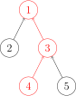
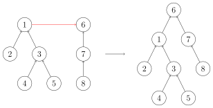

author: HeRaNO, JuicyMio, Xeonacid, sailordiary, ouuan


## 引入

并查集是一种用于管理元素所属集合的数据结构，实现为一个森林，其中每棵树表示一个集合，树中的节点表示对应集合中的元素。

顾名思义，并查集支持两种操作：

-   合并（Union）：合并两个元素所属集合（合并对应的树）
-   查询（Find）：查询某个元素所属集合（查询对应的树的根节点），这可以用于判断两个元素是否属于同一集合

并查集在经过修改后可以支持单个元素的删除、移动；使用动态开点线段树还可以实现可持久化并查集。

??? warning
    并查集无法以较低复杂度实现集合的分离。

## 初始化

初始时，每个元素都位于一个单独的集合，表示为一棵只有根节点的树。方便起见，我们将根节点的父亲设为自己。

???+ note "实现"
    === "C++"
        ```cpp
        struct dsu {
          vector<size_t> pa;
        
          explicit dsu(size_t size) : pa(size) { iota(pa.begin(), pa.end(), 0); }
        };
        ```
    
    === "Python"
        ```python
        class Dsu:
            def __init__(self, size):
                self.pa = list(range(size))
        ```

## 查询

我们需要沿着树向上移动，直至找到根节点。



???+ note "实现"
    === "C++"
        ```cpp
        size_t dsu::find(size_t x) { return pa[x] == x ? x : find(pa[x]); }
        ```
    
    === "Python"
        ```python
        def find(self, x):
            return x if self.pa[x] == x else self.find(self.pa[x])
        ```

### 路径压缩

查询过程中经过的每个元素都属于该集合，我们可以将其直接连到根节点以加快后续查询。


???+ note "实现"
    === "C++"
        ```cpp
        size_t dsu::find(size_t x) { return pa[x] == x ? x : pa[x] = find(pa[x]); }
        ```
    
    === "Python"
        ```python
        def find(self, x):
            if self.pa[x] != x:
                self.pa[x] = self.find(self.pa[x])
            return self.pa[x]
        ```

## 合并

要合并两棵树，我们只需要将一棵树的根节点连到另一棵树的根节点。



???+ note "实现"
    === "C++"
        ```cpp
        void dsu::unite(size_t x, size_t y) { pa[find(x)] = find(y); }
        ```
    
    === "Python"
        ```python
        def union(self, x, y):
            self.pa[self.find(x)] = self.find(y)
        ```

### 启发式合并

合并时，选择哪棵树的根节点作为新树的根节点会影响未来操作的复杂度。我们可以将节点较少或深度较小的树连到另一棵，以免发生退化。

??? note "具体复杂度讨论"
    由于需要我们支持的只有集合的合并、查询操作，当我们需要将两个集合合二为一时，无论将哪一个集合连接到另一个集合的下面，都能得到正确的结果。但不同的连接方法存在时间复杂度的差异。具体来说，如果我们将一棵点数与深度都较小的集合树连接到一棵更大的集合树下，显然相比于另一种连接方案，接下来执行查找操作的用时更小（也会带来更优的最坏时间复杂度）。
    
    当然，我们不总能遇到恰好如上所述的集合——点数与深度都更小。鉴于点数与深度这两个特征都很容易维护，我们常常从中择一，作为估价函数。而无论选择哪一个，时间复杂度都为 $O (m\alpha(m,n))$，具体的证明可参见 References 中引用的论文。
    
    在算法竞赛的实际代码中，即便不使用启发式合并，代码也往往能够在规定时间内完成任务。在 Tarjan 的论文[^tarjan1984worst]中，证明了不使用启发式合并、只使用路径压缩的最坏时间复杂度是 $O (m \log n)$。在姚期智的论文[^yao1985expected]中，证明了不使用启发式合并、只使用路径压缩，在平均情况下，时间复杂度依然是 $O (m\alpha(m,n))$。
    
    如果只使用启发式合并，而不使用路径压缩，时间复杂度为 $O(m\log n)$。由于路径压缩单次合并可能造成大量修改，有时路径压缩并不适合使用。例如，在可持久化并查集、线段树分治 + 并查集中，一般使用只启发式合并的并查集。

按节点数合并的参考实现：

???+ note "实现"
    === "C++"
        ```cpp
        struct dsu {
          vector<size_t> pa, size;
        
          explicit dsu(size_t size_) : pa(size_), size(size_, 1) {
            iota(pa.begin(), pa.end(), 0);
          }
        
          void unite(size_t x, size_t y) {
            x = find(x), y = find(y);
            if (x == y) return;
            if (size[x] < size[y]) swap(x, y);
            pa[y] = x;
            size[x] += size[y];
          }
        };
        ```
    
    === "Python"
        ```python
        class Dsu:
            def __init__(self, size):
                self.pa = list(range(size))
                self.size = [1] * size
        
            def union(self, x, y):
                x, y = self.find(x), self.find(y)
                if x == y:
                    return
                if self.size[x] < self.size[y]:
                    x, y = y, x
                self.pa[y] = x
                self.size[x] += self.size[y]
        ```

## 删除

要删除一个叶子节点，我们可以将其父亲设为自己。为了保证要删除的元素都是叶子，我们可以预先为每个节点制作副本，并将其副本作为父亲。

???+ note "实现"
    === "C++"
        ```cpp
        struct dsu {
          vector<size_t> pa, size;
        
          explicit dsu(size_t size_) : pa(size_ * 2), size(size_ * 2, 1) {
            iota(pa.begin(), pa.begin() + size_, size_);
            iota(pa.begin() + size_, pa.end(), size_);
          }
        
          void erase(size_t x) {
            --size[find(x)];
            pa[x] = x;
          }
        };
        ```
    
    === "Python"
        ```python
        class Dsu:
            def __init__(self, size):
                self.pa = list(range(size, size * 2)) * 2
                self.size = [1] * size * 2
        
            def erase(self, x):
                self.size[self.find(x)] -= 1
                self.pa[x] = x
        ```

## 移动

与删除类似，通过以副本作为父亲，保证要移动的元素都是叶子。

???+ note "实现"
    === "C++"
        ```cpp
        void dsu::move(size_t x, size_t y) {
          auto fx = find(x), fy = find(y);
          if (fx == fy) return;
          pa[x] = fy;
          --size[fx], ++size[fy];
        }
        ```
    
    === "Python"
        ```python
        def move(self, x, y):
            fx, fy = self.find(x), self.find(y)
            if fx == fy:
                return
            self.pa[x] = fy
            self.size[fx] -= 1
            self.size[fy] += 1
        ```

## 复杂度

### 时间复杂度

同时使用路径压缩和启发式合并之后，并查集的每个操作平均时间仅为 $O(\alpha(n))$，其中 $\alpha$ 为阿克曼函数的反函数，其增长极其缓慢，也就是说其单次操作的平均运行时间可以认为是一个很小的常数。

[Ackermann 函数](https://en.wikipedia.org/wiki/Ackermann_function)  $A(m, n)$ 的定义是这样的：

$A(m, n) = \begin{cases}n+1&\text{if }m=0\\A(m-1,1)&\text{if }m>0\text{ and }n=0\\A(m-1,A(m,n-1))&\text{otherwise}\end{cases}$

而反 Ackermann 函数 $\alpha(n)$ 的定义是阿克曼函数的反函数，即为最大的整数 $m$ 使得 $A(m, m) \leqslant n$。

时间复杂度的证明 [在这个页面中](./dsu-complexity.md)。

### 空间复杂度

显然为 $O(n)$。

## 带权并查集

我们还可以在并查集的边上定义某种权值、以及这种权值在路径压缩时产生的运算，从而解决更多的问题。比如对于经典的「NOI2001」食物链，我们可以在边权上维护模 3 意义下的加法群。接下来以该题为例介绍带权并查集。

???+ note "[P2024 [NOI2001] 食物链](https://www.luogu.com.cn/problem/P2024)"
    动物王国中有三类动物 $A,B,C$，这三类动物的食物链构成了有趣的环形。$A$ 吃 $B$，$B$ 吃 $C$，$C$ 吃 $A$。
    
    现有 $N$ 个动物，以 $1 \sim N$ 编号。每个动物都是 $A,B,C$ 中的一种，但是我们并不知道它到底是哪一种。
    
    有人用两种说法对这 $N$ 个动物所构成的食物链关系进行描述：
    
    - 第一种说法是 `1 X Y`，表示 $X$ 和 $Y$ 是同类。
    - 第二种说法是 `2 X Y`，表示 $X$ 吃 $Y$。
    
    此人对 $N$ 个动物，用上述两种说法，一句接一句地说出 $K$ 句话，这 $K$ 句话有的是真的，有的是假的。当一句话满足下列三条之一时，这句话就是假话，否则就是真话。
    
    - 当前的话与前面的某些真的话冲突，就是假话；
    - 当前的话中 $X$ 或 $Y$ 比 $N$ 大，就是假话；
    - 当前的话表示 $X$ 吃 $X$，就是假话。
    
    你的任务是根据给定的 $N$ 和 $K$ 句话，输出假话的总数。

用节点 $x$ 表示编号为 $x$ 的动物。本题想要维护的是每个节点 $x$ 的权值 $w_x \in \{0, 1, 2\}$，这里用 $0$ 表示 $A$，用 $1$ 表示 $B$，用 $2$ 表示 $C$。然而直接维护 $w$ 非常困难，其他不说，本题根本就没有断言某个节点具体的权值，自己设定一个类别则又会在合并信息上带来麻烦。

注意到题目给出的实际上是两个点权的差分，这里 $X$ 吃 $Y$ 等价于 $w_Y - w_X \equiv 1 \pmod{3}$，因此对于并查集来说，可以转而去维护 **点权的差分**。具体而言，对于一个节点 $x$ 和它的父节点 $\operatorname{pa}(x)$，定义 $\Delta w_x = w_{\operatorname{pa}(x)} - w_x$。使用这一定义，接下来对原先并查集的每个操作一一改造来维护 $\Delta w_x$。

### 初始化

初始化后 $\operatorname{pa}(x) = x$，因此根据定义即得 $\Delta w_x = 0$。

???+ note "实现"
    === "C++"
        ```cpp
		template<class Ty>
        struct dsu {
          vector<size_t> pa;
		  vector<Ty> dw;
        
          explicit dsu(size_t size) : pa(size), dw(size) { iota(pa.begin(), pa.end(), 0); }
        };
        ```
    
    === "Python"
        ```python
        class Dsu:
            def __init__(self, size):
                self.pa = list(range(size))
				self.dw = [0] * size
        ```

### 查询

在路径压缩之前，设 $x$ 所在的树的根节点为 $r$，从 $x$ 到 $r$ 的路径记为 $x \to v_1 \to \dots \to v_k \to r$，那么在路径压缩后，$\operatorname{pa}'(x) = r$，$x$ 和 $r$ 的点权的差分：

$$
\begin{aligned}
\Delta w_x' &= w_r - w_x \\
&= (w_r - w_{v_k}) + (w_{v_k} - w_{v_{k-1}}) + \dots + (w_{v_2} - w_{v_1}) + (w_{v_1} - w_x) \\
&= \Delta w_x + \sum_{i = 1}^{k} \Delta w_{v_i} \\
&= \Delta w_x + \Delta w_{\operatorname{pa}(x)}'
\end{aligned}
$$

也就是树上前缀和。将前缀和的计算方法照搬即可。注意要在压缩前存好 $\operatorname{pa}(x)$ 因为路径压缩后就变了。

???+ note "实现"
    === "C++"
        ```cpp
        size_t dsu::find(size_t x) {
		  if(pa[x] == x) {
			return x;
		  }
		  size_t oldpa = pa[x];
		  pa[x] = find(pa[x]);
		  dw[x] += dw[oldpa];
		  return pa[x];
		}
        ```
    
    === "Python"
        ```python
        def find(self, x):
            if self.pa[x] != x:
			    oldpa = self.pa[x]
                self.pa[x] = self.find(self.pa[x])
				self.dw[x] += self.dw[oldpa]
            return self.pa[x]
        ```

## 合并

对于合并而言，有一点小问题：我们希望在 $x$ 和 $y$ 之间连边，但普通的并查集是将 $\operatorname{root}(x)$ 和 $\operatorname{root}(y)$ 连边。如果不想算太多东西，这里可以使用换根技巧：在路径压缩后，由于 $\operatorname{pa}(x) = \operatorname{root}(x)$，因此可以直接将 $x$ 换到根上，此时：

$$
\begin{aligned} \\
\Delta w_{\operatorname{pa}(x)}' &= w_x - w_{\operatorname{pa}(x)} = -\Delta w_x \\
\Delta w_{x}' &= 0 \\
\operatorname{pa}'(\operatorname{pa}(x)) &= x \\
\operatorname{pa}'(x) &= x \\
\end{aligned}
$$

其它点权的差分与父节点都不变。换完根后再将 $x$ 和 $y$ 连边，可以减少错误的发生。

???+ note "实现"
    === "C++"
        ```cpp
        void dsu::unite(size_t x, size_t y, const Ty &deltaw) {
		  // 路径压缩
		  size_t pa_x = find(x);
		  find(y);
		  // 换根到 x
		  dw[pa_x] = -dw[x];
		  pa[pa_x] = x;
		  // x 连边到 y
		  pa[x] = y;
		  dw[x] = deltaw;
		}
        ```
    
    === "Python"
        ```python
        def union(self, x, y, deltaw):
		    # 路径压缩
		    pa_x = self.find(x)
			self.find(y)
			# 换根到 x
			dw[pa_x] = -dw[x]
			pa[pa_x] = x
			# x 连边到 y
            self.pa[x] = y
			self.dw[x] = deltaw
        ```

## 例题

???+ note "[UVa11987 Almost Union-Find](https://onlinejudge.org/index.php?option=com_onlinejudge&Itemid=8&category=229&page=show_problem&problem=3138)"
    实现类似并查集的数据结构，支持以下操作：
    
    1.  合并两个元素所属集合
    2.  移动单个元素
    3.  查询某个元素所属集合的大小及元素和
    
    ??? note "参考代码"
        === "C++"
            ```cpp
            --8<-- "docs/ds/code/dsu/dsu_1.cpp"
            ```
        
        === "Python"
            ```python
            --8<-- "docs/ds/code/dsu/dsu_1.py"
            ```

## 习题

[「NOI2015」程序自动分析](https://uoj.ac/problem/127)

[「JSOI2008」星球大战](https://www.luogu.com.cn/problem/P1197)

[「NOI2001」食物链](https://www.luogu.com.cn/problem/P2024)

[「NOI2002」银河英雄传说](https://www.luogu.com.cn/problem/P1196)

## 其他应用

[最小生成树算法](../graph/mst.md) 中的 Kruskal 和 [最近公共祖先](../graph/lca.md) 中的 Tarjan 算法是基于并查集的算法。

相关专题见 [并查集应用](../topic/dsu-app.md)。

## 参考资料与拓展阅读

1.  [知乎回答：是否在并查集中真的有二分路径压缩优化？](https://www.zhihu.com/question/28410263/answer/40966441)
2.  Gabow, H. N., & Tarjan, R. E. (1985). A Linear-Time Algorithm for a Special Case of Disjoint Set Union. JOURNAL OF COMPUTER AND SYSTEM SCIENCES, 30, 209-221.[PDF](https://dl.acm.org/doi/pdf/10.1145/800061.808753)

[^tarjan1984worst]: Tarjan, R. E., & Van Leeuwen, J. (1984). Worst-case analysis of set union algorithms. Journal of the ACM (JACM), 31(2), 245-281.[ResearchGate PDF](https://www.researchgate.net/profile/Jan_Van_Leeuwen2/publication/220430653_Worst-case_Analysis_of_Set_Union_Algorithms/links/0a85e53cd28bfdf5eb000000/Worst-case-Analysis-of-Set-Union-Algorithms.pdf)

[^yao1985expected]: Yao, A. C. (1985). On the expected performance of path compression algorithms.[SIAM Journal on Computing, 14(1), 129-133.](https://epubs.siam.org/doi/abs/10.1137/0214010?journalCode=smjcat)
