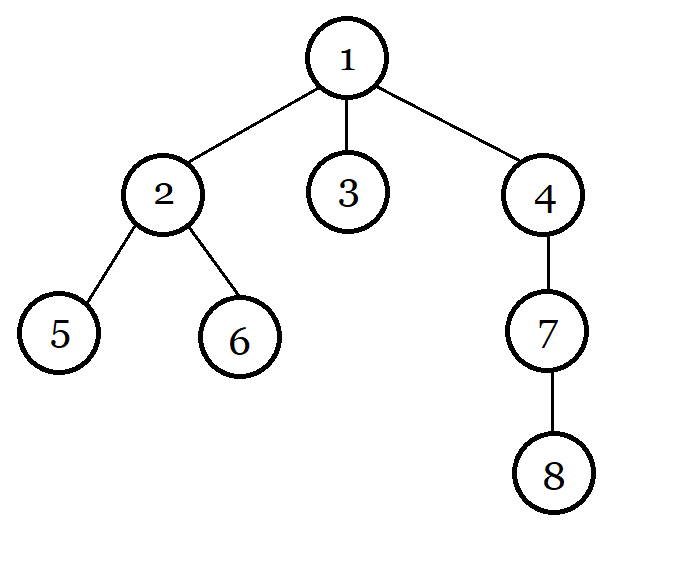
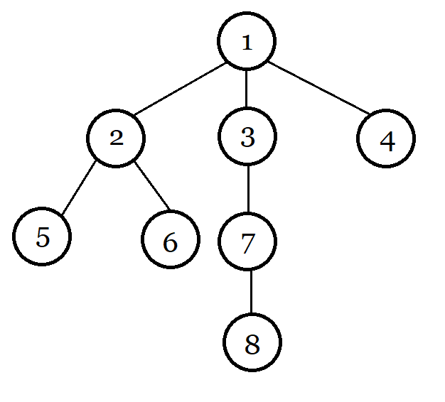

一般提到动态树，我们会不约而同的想到 `LCT` ，这算是比较通用，实用，能力较为广泛的一种写法了。当然，掌握 `LCT` 就需要熟悉掌握 `Splay` 和各种操作和知识。 `ETT` （中文常用称呼：欧拉游览树）是一种及其睿智且暴力，可以用暴力数据结构维护的一种除了能胜任普通动态树的 `Link & Cut` 操作还可以支持换子树操作（此操作 `LCT` 无法完成）的动态树。

大家对这括号序很熟悉吧，如：

其括号序为： `1 2 5 5 6 6 2 3 3 4 7 8 8 7 4 1` 。

括号序其实是一个父亲包含儿子的一种树的顺序。

然后我们看一下，如果把 `4` 的子树移给 `3` 会怎样？如图：

原图括号序： `1 2 5 5 6 6 2 3 3 4 7 8 8 7 4 1` 

后者括号序： `1 2 5 5 6 6 2 3 7 8 8 7 3 4 4 1` 

可以发现， `7 7 8 8` 平移到了 `3` 的后面，而 `4` 合拢。这就是所谓换子树操作（同样可以用于 `Link & Cut` 操作）。现在只需要一个数据结构可以做到区间平移且维护一些值，众大佬肯定会说用 `Splay` ，其确实效率很高，不过这里用块状链表维护会简单很多，对于一些数据低于 $2 \times 10^5$ 的题目都可以码得很快。

那怎么维护点到根的信息呢？

其实仔细想想， `DFS` 序也可以达到平移的效果，那么为什么需要括号序？其实，假如你要查询图中 `1` 到 `8` 的和，那么你从括号序中 `1` 到 `8` （第一个出现的）中出现两次的数的贡献抹去。如果维护的是 $\operatorname{xor}$ ，那么直接 $\operatorname{xor}$ 两次即可。如果维护的是 $\operatorname{sum}$ ，那么第一个出现的数字的贡献为正，第二个为负，然后用块状链表维护区间和即可。

用块状链表后除了单点修改是 $O(1)$ 外其他都是 $O(n^{\frac{1}{2}})$ 的。

 `ETT` 不支持换根操作。对于链（区间）修改，分为两种情况，一是贡献相同（如 $\operatorname{xor}$ ) 是可以的，二是贡献不同（如 $\operatorname{sum}$ ) 是不行的。现在的主流做法毕竟是 `LCT` ，所以这些操作比较多，在避开这种操作的情况下运用这种做法还是不错的。

注：标准的 ETT（用欧拉回路而不是 dfs 括号序实现）是支持换根操作的，但是实现较为复杂。
