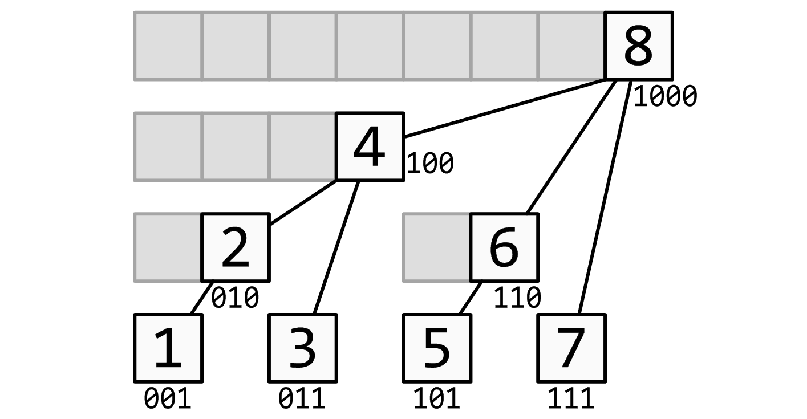

author: HeRaNO, Zhoier, Ir1d, Xeonacid, wangdehu, ouuan, ranwen, ananbaobeichicun, Ycrpro

## 简介

树状数组和下面的线段树可是亲兄弟了，但他俩毕竟还有一些区别：  
树状数组能有的操作，线段树一定有；  
线段树有的操作，树状数组不一定有。

这么看来选择线段树不就 **「得天下了」** ？

事实上，树状数组的代码要比线段树短得多，思维也更清晰，在解决一些单点修改的问题时，树状数组是不二之选。

* * *

## 原理

如果要具体了解树状数组的工作原理，请看下面这张图：



这个结构的思想和线段树有些类似：用一个大节点表示一些小节点的信息，进行查询的时候只需要查询一些大节点而不是更多的小节点。

最下面的八个方块就代表存入 $a$ 中的八个数，现在都是十进制。

他们上面的参差不齐的剩下的方块就代表 $a$ 的上级—— $c$ 数组。

很显然看出：  
 $c[2]$ 管理的是 $a[1]$ & $a[2]$ ；  
 $c[4]$ 管理的是 $a[1]$ & $a[2]$ & $a[3]$ & $a[4]$ ；  
 $c[6]$ 管理的是 $a[5]$ & $a[6]$ ； $c[8]$ 则管理全部 $8$ 个数。

所以，如果你要算区间和的话，比如说要算 $a[51]$ ~ $a[91]$ 的区间和，暴力算当然可以，那上百万的数，那就 RE 喽。

那么这种类似于跳一跳的连续跳到中心点而分值不断变大的原理是一样的（倍增）。

你从 $91$ 开始往前跳，发现 $c[n]$ （ $n$ 我也不确定是多少，算起来太麻烦，就意思一下）只管 $a[91]$ 这个点，那么你就会找 $a[90]$ ，发现 $c[n - 1]$ 管的是 $a[90]$ & $a[89]$ ；那么你就会直接跳到 $a[88]$ ， $c[n - 2]$ 就会管 $a[81]$ ~ $a[88]$ 这些数，下次查询从 $a[80]$ 往前找，以此类推。

* * *

## 用法及操作

那么问题来了，你是怎么知道 $c$ 管的 $a$ 的个数分别是多少呢？你那个 $1$ 个， $2$ 个， $8$ 个……是怎么来的呢？
这时，我们引入一个函数—— `lowbit` ：

```cpp
int lowbit(int x) {
  //算出x二进制的从右往左出现第一个1以及这个1之后的那些0组成数的二进制对应的十进制的数
  return x & -x;
}
```

 `lowbit` 的意思注释说明了，咱们就用这个说法来证明一下 $a[88]$ ：  
 $88_{(10)}=1011000_{(2)}$   
发现第一个 $1$ 以及他后面的 $0$ 组成的二进制是 $1000$   
 $1000_{(2)} = 8_{(10)}$   
 $1000$ 对应的十进制是 $8$ ，所以 $c$ 一共管理 $8$ 个 $a$ 。

这就是 `lowbit` 的用处，仅此而已（但也相当有用）。

 **你可能又问了：x & -x 是什么意思啊？** 

>  $-x$ 代表 $x$ 的负数，计算机中负数使用对应的正数的补码来表示。

例如 :  
 $x =88_{(10)}=1011000_{(2)}$ ；  
 $-x = -88_{(10)} = (0100111_{(2)} + 1_{(2)}) =101000_{(2)}$ ；  
 $x\ \& \ (-x) = 1000_{(2)} = 8_{(10)}$ 。

神奇吧，我也觉得神奇！

那么对于 **单点修改** 就更轻松了：

```cpp
void add(int x, int k) {
  while (x <= n) {  //不能越界
    c[x] = c[x] + k;
    x = x + lowbit(x);
  }
}
```

每次只要在他的上级那里更新就行，自己就可以不用管了。

```cpp
int getsum(int x) {  // a[1]……a[x]的和
  int ans = 0;
  while (x >= 1) {
    ans = ans + c[x];
    x = x - lowbit(x);
  }
  return ans;
}
```

## 区间加 & 区间求和

若维护序列 $a$ 的差分数组 $b$ ，此时我们对 $a$ 的一个前缀 $r$ 求和，即 $\sum_{i=1}^{r} a_i$ ，由差分数组定义得 $a_i=\sum_{j=1}^i b_j$ 

进行推导

$$
\sum_{i=1}^{r} a_i\\=\sum_{i=1}^r\sum_{j=1}^i b_j\\=\sum_{i=1}^r b_i\times(r-i+1)
\\=\sum_{i=1}^r b_i\times (r+1)-\sum_{i=1}^r b_i\times i
$$

区间和可以用两个前缀和相减得到，因此只需要用两个树状数组分别维护 $\sum b_i$ 和 $\sum i \times b_i$ ，就能实现区间求和。

代码如下

```cpp
int t1[MAXN], t2[MAXN], n;

inline int lowbit(int x) { return x & (-x); }

void add(int k, int v) {
  int v1 = k * v;
  while (k <= n) {
    t1[k] += v, t2[k] += v1;
    k += lowbit(k);
  }
}

int getsum(int *t, int k) {
  int ret = 0;
  while (k) {
    ret += t[k];
    k -= lowbit(k);
  }
  return ret;
}

void add1(int l, int r, int v) {
  add(l, v), add(r + 1, -v);  //将区间加差分为两个前缀加
}

long long getsum1(int l, int r) {
  return (r + 1ll) * getsum(t1, r) - 1ll * l * getsum(t1, l - 1) -
         (getsum(t2, r) - getsum(t2, l - 1));
}
```

## Tricks

 $O(n)$ 建树：

每一个节点的值是由所有与自己直接相连的儿子的值求和得到的。因此可以倒着考虑贡献，即每次确定完儿子的值后，用自己的值更新自己的直接父亲。

```cpp
// O(n)建树
void init() {
  for (int i = 1; i <= n; ++i) {
    t[i] += a[i];
    int j = i + lowbit(i);
    if (j <= n) t[j] += t[i];
  }
}
```

 $O(\log n)$ 查询第 $k$ 小/大元素。在此处只讨论第 $k$ 小，第 $k$ 大问题可以通过简单计算转化为第 $k$ 小问题。

参考 "可持久化线段树" 章节中，关于求区间第 $k$ 小的思想。将所有数字看成一个可重集合，即定义数组 $a$ 表示值为 $i$ 的元素在整个序列重出现了 $a_i$ 次。找第 $k$ 大就是找到最小的 $x$ 恰好满足 $\sum_{i=1}^{x}a_i \geq k$ 

因此可以想到算法：如果已经找到 $x$ 满足 $\sum_{i=1}^{x}a_i \le k$ ，考虑能不能让 $x$ 继续增加，使其仍然满足这个条件。找到最大的 $x$ 后， $x+1$ 就是所要的值。
在树状数组中，节点是根据 2 的幂划分的，每次可以扩大 2 的幂的长度。令 $sum$ 表示当前的 $x$ 所代表的前缀和，有如下算法找到最大的 $x$ ：

1.  求出 $depth=\left \lfloor log_2n \right \rfloor$ 
2.  计算 $t=\sum_{i=x+1}^{x+2^{depth}}a_i$ 
3.  如果 $sum+t \le k$ ，则此时扩展成功，将 $2^{depth}$ 累加到 $x$ 上；否则扩展失败，对 $x$ 不进行操作
4.  将 $depth$ 减 1，回到步骤 2，直至 $depth$ 为 0

```cpp
//权值树状数组查询第k小
int kth(int k) {
  int cnt = 0, ret = 0;
  for (int i = log2(n); ~i; --i) {      // i与上文depth含义相同
    ret += 1 << i;                      //尝试扩展
    if (ret >= n || cnt + t[ret] >= k)  //如果扩展失败
      ret -= 1 << i;
    else
      cnt += t[ret];  //扩展成功后 要更新之前求和的值
  }
  return ret + 1;
}
```

时间戳优化：

对付多组数据很常见的技巧。如果每次输入新数据时，都暴力清空树状数组，就可能会造成超时。因此使用 $tag$ 标记，存储当前节点上次使用时间（即最近一次是被第几组数据使用）。每次操作时判断这个位置 $tag$ 中的时间和当前时间是否相同，就可以判断这个位置应该是 0 还是数组内的值。

```cpp
//时间戳优化
int tag[MAXN], t[MAXN], Tag;
void reset() { ++Tag; }
void add(int k, int v) {
  while (k <= n) {
    if (tag[k] != Tag) t[k] = 0;
    t[k] += v, tag[k] = Tag;
    k += lowbit(k);
  }
}
int getsum(int k) {
  int ret = 0;
  while (k) {
    if (tag[k] == Tag) ret += t[k];
    k -= lowbit(k);
  }
  return ret;
}
```

## 例题

-    [树状数组 1：单点修改，区间查询](https://loj.ac/problem/130) 
-    [树状数组 2：区间修改，单点查询](https://loj.ac/problem/131) 
-    [树状数组 3：区间修改，区间查询](https://loj.ac/problem/132) 
-    [二维树状数组 1：单点修改，区间查询](https://loj.ac/problem/133) 
-    [二维树状数组 3：区间修改，区间查询](https://loj.ac/problem/135) 
