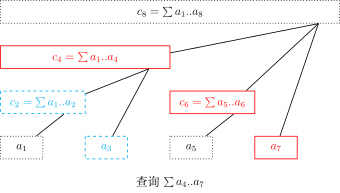

author: HeRaNO, Zhoier, Ir1d, Xeonacid, wangdehu, ouuan, ranwen, ananbaobeichicun, Ycrpro

## 引入

树状数组和线段树具有相似的功能，但他俩毕竟还有一些区别：树状数组能有的操作，线段树一定有；线段树有的操作，树状数组不一定有。树状数组只能处理具有逆运算的运算，例如加、减、异或运算，不能处理类似于求最大值、最小值的运算（实际上使用两个树状数组可以用于处理最大、小值的问题，见 [Efficient Range Minimum Queries using Binary Indexed Trees](http://history.ioinformatics.org/oi/files/volume9.pdf#page=41)）。但是树状数组的代码要比线段树短，思维更清晰，速度也更快，在解决一些单点修改的问题时，树状数组是不二之选。

树状数组主要用于处理：**单点修改区间查询** 的问题。使用差分数组和辅助数组可以将树状数组应用于 **区间修改单点查询** 和 **区间修改区间查询** 的问题。

本文主要介绍树状数组在 **单点修改区间查询** 问题中的应用。

## 树状数组的单点修改区间查询

### 过程

下面这张图展示了树状数组的工作原理：


这个结构和 [线段树](./seg.md) 有些类似：用一个大节点表示一些小节点的信息，进行查询的时候只需要查询一些大节点而不是所有的小节点。

最下面的八个方块就代表原始数据数组 $a$。他们上面的参差不齐的方块（与最上面的八个方块是同一个数组）代表数组 $a$ 的上级——$c$ 数组。$c$ 数组用来管理原始数据数组 $a$ 某一区间的和。

例如，从图中可以看出：  
$c_{2}$ 管理的是 $a_{1}$，$a_{2}$；  
$c_{4}$ 管理的是 $a_{1}$，$a_{2}$，$a_{3}$，$a_{4}$；  
$c_{6}$ 管理的是 $a_{5}$，$a_{6}$；  
$c_{7}$ 管理的是 $a_{7}$；  
$c_{8}$ 则管理全部 $8$ 个数。

如果要计算数组 $a$ 的区间和，比如说要算区间和 $\sum a_{4}...a_{7}$，可以先计算得到 $\sum a_{1}...a_{3}$ 再计算得到 $\sum a_{1}...a_{7}$，将后者减去前者得到 $\sum a_{4}...a_{7}$。在计算 $\sum a_{1}...a_{3}$ 和 $\sum a_{1}...a_{7}$ 时可以采用类似倍增的思想。  
例如，计算 $\sum a_{1}...a_{7}$ 的过程如下：  
从 $c_{7}$ 开始往前跳，发现 $c_{7}$ 只管理 $a_{7}$ 这个元素；那么你就会找 $c_{6}$，发现 $c_{6}$ 管理的是 $a_{5}$，$a_{6}$ 这两个元素；那么你就会直接跳到 $c_{4}$，发现 $c_{4}$ 就管理的是 $a_{1}，a_{2}，a_{3}，a_{4}$ 这些元素，至此已经到达元素 $a_{1}$，说明此时已经得到目标值 $\sum a_{1}...a_{7}$。  
计算 $\sum a_{1}...a_{3}$ 的过程之类似；



### 实现

那么问题来了，怎么知道 $c_{x}$ 管理的数组 $a$ 中的哪个区间呢？  
从上图中可以看出，若 $x\%(2^{n})==0$，$n$ 取最大整数值，那么 $c_{x}$ 管理的区间长度为 $2^{n}$。而 $n$ 恰好为 $x (x>=1)$ 二进制表示时最低位第一个 `1` 的右边 `0` 的个数。

例如：$x=6$ 时，$6_{(10)}=0110_{(2)}$，最低位 `1` 的右边 `0` 的个数为 $n=1$。因此 $c_{6}$ 管理的区间长度为 $2^{1}=2$，那么 $c_{x}$ 管理的区间即为：$a_{5}，a_{6}$。

为了便于计算 $x (x>=1)$ 对应的 $2^{n}$，引入一个函数——`lowbit(int)`：

???+note "实现"
    === "C++"
    
        ```cpp
        int lowbit(int x) {
          // x 的二进制表示中，最低位的 1 的位置。
          // lowbit(0b01011000) == 0b00001000
          //          ~~~~^~~~
          // lowbit(0b01110010) == 0b00000010
          //          ~~~~~~^~
          return x & -x;
        }
        ```
    
    === "Python"
    
        ```python
        def lowbit(x):
            """
            x 的二进制表示中，最低位的 1 的位置。
            lowbit(0b01011000) == 0b00001000
                    ~~~~~^~~
            lowbit(0b01110010) == 0b00000010
                    ~~~~~~~^~
            """
            return x & -x
        ```

注释说明了 `lowbit` 的意思，对于 $x=88$，$88_{(10)}=01011000_{(2)}$   
$x$ 二进制最低位第一个 `1` 以及后面的 `0` 组成的二进制是 `1000`，说明，所以 $c_{88}$ 一共管理 $2^{3}=8$ 个 $a$ 数组中的元素。事实上，$c_{i}$ 管理的区间就是 $[i-\operatorname{lowbit}(i)+1, i]$。

在常见的计算机中，有符号数采用补码表示。在补码表示下，数 `x` 的相反数 `-x = ~x + 1`。

使用 lowbit 函数，我们可以实现很多操作，例如单点修改，将 $a_{x}$ 加上 $k$，只需要更新 $a_{x}$ 的所有上级：

???+note "实现"
    === "C++"
    
        ```cpp
        void add(int x, int k) {
          while (x <= n) {  // 不能越界
            c[x] = c[x] + k;
            x = x + lowbit(x);
          }
        }
        ```
    
    === "Python"
    
        ```python
        def add(x, k):
            while x <= n: # 不能越界
                c[x] = c[x] + k
                x = x + lowbit(x)
        ```

前缀求和：

???+note "实现"
    === "C++"
    
        ```cpp
        int getsum(int x) {  // a[1]..a[x]的和
          int ans = 0;
          while (x >= 1) {
            ans = ans + c[x];
            x = x - lowbit(x);
          }
          return ans;
        }
        ```
    
    === "Python"
    
        ```python
        def getsum(x): # a[1]..a[x]的和
            ans = 0
            while x >= 1:
                ans = ans + c[x]
                x = x - lowbit(x)
            return ans
        ```

## 区间加 & 区间求和

若维护序列 $a$ 的差分数组 $b$，此时我们对 $a$ 的一个前缀 $r$ 求和，即 $\sum_{i=1}^{r} a_i$，由差分数组定义得 $a_i=\sum_{j=1}^i b_j$

进行推导

???+note "证明"
    $$
    \begin{aligned}
    &\sum_{i=1}^{r} a_i\\=&\sum_{i=1}^r\sum_{j=1}^i b_j\\=&\sum_{i=1}^r b_i\times(r-i+1)
    \\=&\sum_{i=1}^r b_i\times (r+1)-\sum_{i=1}^r b_i\times i
    \end{aligned}
    $$

区间和可以用两个前缀和相减得到，因此只需要用两个树状数组分别维护 $\sum b_i$ 和 $\sum i \times b_i$，就能实现区间求和。

代码如下

???+note "实现"
    === "C++"
    
        ```cpp
        int t1[MAXN], t2[MAXN], n;
    
        inline int lowbit(int x) { return x & (-x); }
    
        void add(int k, int v) {
          int v1 = k * v;
          while (k <= n) {
            t1[k] += v, t2[k] += v1;
            k += lowbit(k);
          }
        }
    
        int getsum(int *t, int k) {
          int ret = 0;
          while (k) {
            ret += t[k];
            k -= lowbit(k);
          }
          return ret;
        }
    
        void add1(int l, int r, int v) {
          add(l, v), add(r + 1, -v);  // 将区间加差分为两个前缀加
        }
    
        long long getsum1(int l, int r) {
          return (r + 1ll) * getsum(t1, r) - 1ll * l * getsum(t1, l - 1) -
                (getsum(t2, r) - getsum(t2, l - 1));
        }
        ```
    
    === "Python"
    
        ```python
        t1 = [0] * MAXN, t2 = [0] * MAXN; n = 0
    
        def lowbit(x):
            return x & (-x)
    
        def add(k, v):
            v1 = k * v
            while k <= n:
                t1[k] = t1[k] + v; t2[k] = t2[k] + v1
                k = k + lowbit(k)
    
        def getsum(t, k):
            ret = 0
            while k:
                ret = ret + t[k]
                k = k - lowbit(k)
            return ret
    
        def add1(l, r, v):
            add(l, v)
            add(r + 1, -v)
    
        def getsum1(l, r):
            return (r) * getsum(t1, r) - l * getsum(t1, l - 1) - \
                  (getsum(t2, r) - getsum(t2, l - 1))
        ```

## Tricks

### $O(n)$ 建树

方法一：

每一个节点的值是由所有与自己直接相连的儿子的值求和得到的。因此可以倒着考虑贡献，即每次确定完儿子的值后，用自己的值更新自己的直接父亲。

???+note "实现"
    === "C++"
    
        ```cpp
        // O(n) 建树
        void init() {
          for (int i = 1; i <= n; ++i) {
            t[i] += a[i];
            int j = i + lowbit(i);
            if (j <= n) t[j] += t[i];
          }
        }
        ```
    
    === "Python"
    
        ```python
        def init():
            for i in range(1, n + 1):
                t[i] = t[i] + a[i]
                j = i + lowbit(i)
                if j <= n:
                    t[j] = t[j] + t[i]
        ```

方法二：

前面讲到 $c_i$ 表示的区间是 $[i-\operatorname{lowbit}(i)+1, i]$，那么我们可以先预处理一个 $sum$ 前缀和数组，再计算 $c$ 数组。

???+note "实现"
    === "C++"
    
        ```cpp
        void init() {
          for (int i = 1; i <= n; ++i) {
            t[i] = sum[i] - sum[i - lowbit(i)];
          }
        }
        ```
    
    === "Python"
    
        ```python
        def init():
            for i in range(1, n + 1):
                t[i] = sum[i] - sum[i-lowbit(i)]
        ```

### $O(\log n)$ 查询第 $k$ 小/大元素

#### 过程

在此处只讨论第 $k$ 小，第 $k$ 大问题可以通过简单计算转化为第 $k$ 小问题。

参考「可持久化线段树」章节中，关于求区间第 $k$ 小的思想。将所有数字看成一个可重集合，即定义数组 $a$ 表示值为 $i$ 的元素在整个序列中出现了 $a_i$ 次。找第 $k$ 小就是找到最小的 $x$ 恰好满足 $\sum_{i=1}^{x}a_i \geq k$

因此可以想到算法：如果已经找到 $x$ 满足 $\sum_{i=1}^{x}a_i < k$，考虑能不能让 $x$ 继续增加，使其仍然满足这个条件。找到最大的 $x$ 后，$x+1$ 就是所要的值。
在树状数组中，节点是根据 2 的幂划分的，每次可以扩大 2 的幂的长度。令 $sum$ 表示当前的 $x$ 所代表的前缀和，有如下算法找到最大的 $x$：

1. 求出 $depth=\left \lfloor \log_2n \right \rfloor$
2. 计算 $t=\sum_{i=x+1}^{x+2^{depth}}a_i$
3. 如果 $sum+t < k$，则此时扩展成功，将 $2^{depth}$ 累加到 $x$ 上；否则扩展失败，对 $x$ 不进行操作
4. 将 $depth$ 减 1，回到步骤 2，直至 $depth$ 为 0

#### 实现

=== "C++"

    ```cpp
    // 权值树状数组查询第k小
    int kth(int k) {
      int cnt = 0, ret = 0;
      for (int i = log2(n); ~i; --i) {      // i 与上文 depth 含义相同
        ret += 1 << i;                      // 尝试扩展
        if (ret >= n || cnt + t[ret] >= k)  // 如果扩展失败
          ret -= 1 << i;
        else
          cnt += t[ret];  // 扩展成功后 要更新之前求和的值
      }
      return ret + 1;
    }
    ```

=== "Python"

    ```python
    # 权值树状数组查询第 k 小
    def kth(k):
        cnt = 0; ret = 0
        i = log2(n) # i 与上文 depth 含义相同
        while ~i:
            ret = ret + (1 << i) # 尝试扩展
            if ret >= n or cnt + t[ret] >= k: # 如果扩展失败
                ret = ret - (1 << i)
            else:
                cnt = cnt + t[ret] # 扩展成功后 要更新之前求和的值
        return ret + 1
    ```

### 时间戳优化

#### 过程

对付多组数据很常见的技巧。如果每次输入新数据时，都暴力清空树状数组，就可能会造成超时。因此使用 $tag$ 标记，存储当前节点上次使用时间（即最近一次是被第几组数据使用）。每次操作时判断这个位置 $tag$ 中的时间和当前时间是否相同，就可以判断这个位置应该是 0 还是数组内的值。

#### 实现

=== "C++"

    ```cpp
    // 时间戳优化
    int tag[MAXN], t[MAXN], Tag;

    void reset() { ++Tag; }

    void add(int k, int v) {
      while (k <= n) {
        if (tag[k] != Tag) t[k] = 0;
        t[k] += v, tag[k] = Tag;
        k += lowbit(k);
      }
    }

    int getsum(int k) {
      int ret = 0;
      while (k) {
        if (tag[k] == Tag) ret += t[k];
        k -= lowbit(k);
      }
      return ret;
    }
    ```

=== "Python"

    ```python
    # 时间戳优化
    tag = [0] * MAXN; t = [0] * MAXN; Tag = 0
    def reset():
        Tag = Tag + 1
    def add(k, v):
        while k <= n:
            if tag[k] != Tag:
                t[k] = 0
            t[k] = t[k] + v
            tag[k] = Tag
            k = k + lowbit(k)
    def getsum(k):
        ret = 0
        while k:
            if tag[k] == Tag:
                ret = ret + t[k]
            k = k - lowbit(k)
        return ret
    ```

## 例题

- [树状数组 1：单点修改，区间查询](https://loj.ac/problem/130)
- [树状数组 2：区间修改，单点查询](https://loj.ac/problem/131)
- [树状数组 3：区间修改，区间查询](https://loj.ac/problem/132)
- [二维树状数组 1：单点修改，区间查询](https://loj.ac/problem/133)
- [二维树状数组 3：区间修改，区间查询](https://loj.ac/problem/135)
