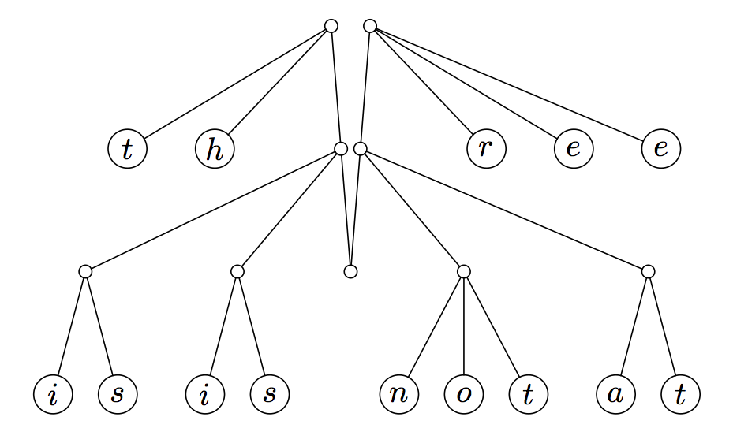

author: isdanni

???+ warning "注意"
    此章是选读内容，在阅读前请确定你对函数式编程（Functional Programming）有一定了解。

## 简介

**手指树**（Finger Tree）是一种 **纯函数式** 数据结构，由 Ralf Hinze 和 Ross Paterson 提出。

## 为什么需要手指树

在函数式编程中，列表是十分常见的数据类型。对于基于序列的操作，包括在两端添加和删除元素（双端队列操作），在任意节点插入、连接、删除，查找某个满足要求的元素，将序列拆分为子序列，几乎所有的函数型语言都支持。但是对于高效的更多操作，这些语言很难做到。即使有相对应的实现，通常也都非常复杂，实际很难使用。

而指状树提供了一种纯函数式的序列数据结构，它可以在均摊常量时间（amortized constant time）内完成访问，添加到序列的前端和末尾等操作，以及在对数时间（logarithmic time）内完成串联和随机访问。除了良好的渐近运行时边界外，手指树还非常灵活：当与元素上的幺半群标记（[monoidal tag](https://en.wikipedia.org/wiki/Monoidal_category)）结合时，指状树可用于实现高效的随机访问序列、有序序列、间隔树和优先级队列。

## 基本结构

手指树在树的「手指」（叶子）的地方存储数据，访问时间为分摊常量。手指是一个可以访问部分数据结构的点。在命令式语言（imperative language）中，这被称做指针。在手指树中，「手指」是指向序列末端或叶节点的结构。手指树还在每个内部节点中存储对其后代应用一些关联操作的结果。存储在内部节点中的数据可用于提供除树类数据结构之外的功能。

1.  手指树的深度由下到上计算。
2.  手指树的第一级，即树的叶节点，仅包含值，深度为 $0$。第二级为深度 $1$。第三级为深度 $2$，依此类推。
3.  离根越近，节点指向的原始树（在它是手指树之前的树）的子树越深。这样，沿着树向下工作就是从叶子到树的根，这与典型的树数据结构相反。为了获得这种的结构，我们必须确保原始树具有统一的深度。在声明节点对象时，必须通过子节点的类型进行参数化。深度为 $1$ 及以上的脊椎上的节点指向树，通过这种参数化，它们可以由嵌套节点表示。

### 将一棵树变成手指树

???+ note "注释"
    **2-3 树** 是一种树状数据结构，其中每个带有子节点（内部节点）的节点具有两个子节点（$2$ 节点）和一个数据元素或三个子节点（$3$ 节点）和两个数据元素。2-3 树是 $3$ 阶 B 树。树外部的节点（叶节点）没有子节点和一两个数据元素。

我们将从平衡 2-3 树开始这个过程。为了使手指树正常工作，所有的叶节点需要是水平的。如下图所示（图片取自手指树论文）：


手指是「一种结构，可以有效地访问靠近特定位置的树的节点。」要制作手指树，我们需要将手指放在树的左右两端，取树的最左边和最右边的内部节点并将它们拉起来，使树的其余部分悬在它们之间，这为我们提供了对序列末尾的均摊常量访问时间。



这种新的数据结构被称为手指树。手指树由沿其树脊（棕色线）分布的几层（下方蓝色框）组成：


```haskell
data FingerTree a = Empty
                  | Single a
                  | Deep (Digit a) (FingerTree (Node a)) (Digit a)

data Digit a = One a | Two a a | Three a a a | Four a a a a
data Node a = Node2 a a | Node3 a a a
```

示例中的数字是带有字母的节点。每个列表由树脊上每个节点的前缀或后缀划分。在转换后的 2-3 树中，顶层的数字列表似乎可以有两个或三个长度，而较低级别的长度只有一或两个。为了使手指树的某些应用程序能够如此高效地运行，手指树允许在每个级别上有 $1$ 到 $4$ 个子树。手指树的数字可以转换成一个列表，如：

```haskell
type Digit a = One a | Two a a | Three a a a | Four a a a a
```

顶层具有类型 $a$ 的元素，下一层具有类型节点 $a$ 的元素，因为树脊和叶子之间的节点，这通常意味着树的第 $n$ 层具有元素类型为 $Node^{n}$ $a$，或 2-3 个深度为 $n$ 的树。这意味着 $n$ 个元素的序列由深度为 `Θ(log n)` 的树表示。距离最近端 $d$ 的元素存储在树中 `Θ(log d)` 深度处。

### 双向队列操作

指状树也可以制作高效的双向队列。无论结构是否持久，所有操作都需要 `Θ(1)` 时间。它可以被看作是的隐式双端队列的扩展[^okasaki1999purely]：

1.  用 2-3 个节点替换对提供了足够的灵活性来支持有效的串联。（为了保持恒定时间的双端队列操作，必须将 Digit 扩展为四。）
2.  用幺半群（monoid）注释内部节点允许有效的分裂。

```haskell
data ImplicitDeque a = Empty
                     | Single a
                     | Deep (Digit a) (ImplicitDeque (a, a)) (Digit a)

data Digit a = One a | Two a a | Three a a a
```

## 时间复杂度

手指树提供了对树的「手指」（叶子）的分摊常量时间访问，这是存储数据的地方，以及在较小部分的大小中连接和拆分对数时间。它还在每个内部节点中存储对其后代应用一些关联操作的结果。存储在内部节点中的「摘要」数据可用于提供除树之外的数据结构的功能。

| 操作                            | 手指树                    | 注释 2-3 树 (annotated 2-3 tree) | 列表（list）             | 向量（vector） |
| ----------------------------- | ---------------------- | ----------------------------- | -------------------- | ---------- |
| `const`,`snoc`                | $O(1)$                 | $O(\log n)$                   | $O(1)$/$O(n)$        | $O(n)$     |
| `viewl`,`viewr`               | $O(1)$                 | $O(\log n)$                   | $O(1)$/$O(n)$        | $O(1)$     |
| `measure`/`length`            | $O(1)$                 | $O(1)$                        | $O(n)$               | $O(1)$     |
| `append`                      | $O(\log \min(l1, l2))$ | $O(\log n)$                   | $O(n)$               | $O(m+n)$   |
| `split`                       | $O(\log \min(n, l-n))$ | $O(\log n)$                   | $O(n)$               | $O(1)$     |
| `replicate`                   | $O(\log n)$            | $O(\log n)$                   | $O(n)$               | $O(n)$     |
| `fromList`,`toList`,`reverse` | $O(l)$/$O(l)$/$O(l)$   | $O(l)$                        | $O(1)$/$O(1)$/$O(n)$ | $O(n)$     |
| `index`                       | $O(\log \min(n, l-n))$ | $O(\log n)$                   | $O(n)$               | $O(1)$     |

## 应用

指状树可用于建造其他树。例如，优先级队列可以通过树中子节点的最小优先级标记内部节点来实现，或者索引列表/数组可以通过节点的子节点中叶子的计数来标记节点来实现。其他应用包括随机访问序列（如下所述）、有序序列和区间树。

手指树可以提供平均 $O(1)$ 的推、反转、弹出，$O(\log n)$ 追加和拆分；并且可以适应索引或排序序列。和所有函数式数据结构一样，它本质上是持久的；也就是说，始终保留旧版本的树。

对于代码实现，Haskell 核心库中的有限序列 `Seq` 的实现使用了 2-3 手指树（[Data.Sequence](https://hackage.haskell.org/package/containers-0.6.5.1/docs/Data-Sequence.html)），OCaml 中 `BatFingerTree` 模块的 [实现](https://ocaml-batteries-team.github.io/batteries-included/hdoc2/BatFingerTree.html) 也使用了通用手指树数据结构。手指树可以使用或不使用惰性求值来实现，但惰性允许更简单的实现。

## 参考资料与拓展阅读

1.  Ralf Hinze and Ross Paterson, "[Finger trees: a simple general-purpose data structure](http://www.staff.city.ac.uk/~ross/papers/FingerTree.html)", Journal of Functional Programming 16:2 (2006) pp 197-217.
2.  [Finger Tree - Wikipedia](https://en.wikipedia.org/wiki/Finger_tree)

[^okasaki1999purely]: [Purely Functional Data Structures](https://www.cambridge.org/us/academic/subjects/computer-science/programming-languages-and-applied-logic/purely-functional-data-structures), Chris Okasaki (1999)
