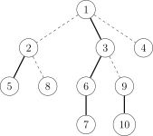
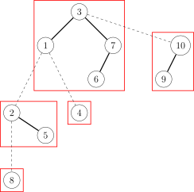

## 引入

前置知识：[树链剖分](../graph/hld.md)

由于树链剖分的时间复杂度为 $O(n\log^2 n)$，而我们熟知的 LCT 虽然时间复杂度为 $O(n\log n)$，但常数较大，可能比树链剖分还慢。那么有什么既是 $O(n\log n)$ 的，常数又相对较小的方法呢？这个时候全局平衡二叉树就出现了。

全局平衡二叉树实际上是一颗二叉树森林，其中的每颗二叉树维护一条重链。但是这个森林里的二叉树又互有联系，其中每个二叉树的根连向这个重链链头的父亲，就像 LCT 中一样。但全局平衡二叉树是静态树，区别于 LCT，建成后树的形态不变。

全局平衡二叉树是一种可以处理树上链修改/查询的数据结构，可以做到：

-   $O(\log n)$ 一条链整体修改。
-   $O(\log n)$ 一条链整体查询。
-   $O(\log n)$ 求最近公共祖先，子树修改，子树查询等，这些复杂度和重链剖分是一样的。

## 主要性质

1.  全局平衡二叉树由很多棵二叉树通过轻边连起来组成，每一棵二叉树维护了原树的一条重链，其中序遍历的顺序就是这条重链深度单调递增的顺序。每个节点都仅出现在一棵二叉树中。
2.  边分为重边和轻边，重边是包含在二叉树中的边，维护的时候就像正常维护二叉树一样，记录左右儿子和父节点。轻边从一颗二叉树的根节点指向它所对应的重链顶端节点的父节点。轻边维护的时候 "认父不认子"，即只能从子节点访问到父节点，不能反过来。注意，全局平衡二叉树中的边和原树中的边没有对应关系。
3.  算上重边和轻边，全局平衡二叉树的高度是 $O(\log n)$ 级别的。这条是保证全局平衡二叉树时间复杂度的性质。

下面是一个全局平衡二叉树建树的例子。第一张图是原树，以节点 1 为根节点。实线是重边。



第二张图是建出来的全局平衡二叉树，其中虚线是轻边，实线是重边，每一棵二叉树用红圈表示。



## 建树

首先是像普通重链剖分一样，一次 DFS 求出每个节点的重儿子。然后从根开始，找到根节点所在的重链，对于这些点的轻儿子递归建树，并连上轻边。然后我们需要给重链上的点建一棵二叉树。我们先把重链上的点存到数组里，求出每个点轻儿子的子树大小之和加一（即该点本身所贡献的 size）。然后我们按照这个求出这条重链的加权中点，把它作为二叉树的根，两边递归建树，并连上重边。

代码如下：

???+ note "实现"
    ```c++
    std::vector<int> G[N];
    int n, fa[N], son[N], sz[N];
    
    void dfsS(int u) {
      sz[u] = 1;
      for (int v : G[u]) {
        dfsS(v);
        sz[u] += sz[v];
        if (sz[v] > sz[son[u]]) son[u] = v;
      }
    }
    
    int b[N], bs[N], l[N], r[N], f[N], ss[N];
    
    // 给b中[bl,br)内的点建二叉树，返回二叉树的根
    int cbuild(int bl, int br) {
      int x = bl, y = br;
      while (y - x > 1) {
        int mid = (x + y) >> 1;
        if (2 * (bs[mid] - bs[bl]) <= bs[br] - bs[bl])
          x = mid;
        else
          y = mid;
      }
      // 二分求出按bs加权的中点
      y = b[x];
      ss[y] = br - bl;  // ss：二叉树中重子树的大小
      if (bl < x) {
        l[y] = cbuild(bl, x);
        f[l[y]] = y;
      }
      if (x + 1 < br) {
        r[y] = cbuild(x + 1, br);
        f[r[y]] = y;
      }
      return y;
    }
    
    int build(int x) {
      int y = x;
      do
        for (int v : G[y])
          if (v != son[y])
            f[build(v)] =
                y;  // 递归建树并连轻边，注意要从二叉树的根连边，不是从儿子连边
      while (y = son[y]);
      y = 0;
      do {
        b[y++] = x;                              // 存放重链中的点
        bs[y] = bs[y - 1] + sz[x] - sz[son[x]];  // bs：轻儿子size和+1，求前缀和
      } while (x = son[x]);
      return cbuild(0, y);
    }
    ```

由代码可以看出建树的时间复杂度是 $O(n\log n)$。接下来我们可以证明树高是 $O(\log n)$ 的：考虑从任意一个点跳父节点到根。跳轻边就相当于在原树中跳到另一条重链，由重链剖分的性质可得跳轻边最多 $O(\log n)$ 条；因为建二叉树的时候根节点找的是算轻儿子的加权中点，那么跳一次重边算上轻儿子的 size 至少翻倍，所以跳重边最多也是 $O(\log n)$ 条。整体树高就是 $O(\log n)$ 的。

## 查询

以上就是关于全局平衡二叉树的部分。剩下关于链修改和链查询的操作方法相对简单，只需要从要操作的点出发，一直跳跃到根节点。要操作某个点所在的重链上比它深度小的所有点，本质上等同于在这条重链的二叉树中操作目标节点左侧的所有节点。这些操作可以分解成一系列子树操作，与普通二叉树的维护方法类似，其中涉及到维护子树和以及打子树标记。在这一过程中，使用的是标记永久化。也可以用 pushdown 来打标记，用 pushup 维护子树和，不过这种方式可能相对复杂，因为通常情况下，处理二叉树是自上而下进行操作，但在这里，需要首先确定跳跃路径，然后再从上到下进行 pushdown，可能导致常数较大。

代码如下：

???+ note "实现"
    ```c++
    // a：子树加标记
    // s：子树和（不算加标记的）
    int a[N], s[N];
    
    void add(int x) {
      bool t = true;
      int z = 0;
      while (x) {
        s[x] += z;
        if (t) {
          a[x]++;
          if (r[x]) a[r[x]]--;
          z += 1 + ss[l[x]];
          s[x] -= ss[r[x]];
        }
        t = (x != l[f[x]]);
        if (t && x != r[f[x]]) z = 0;  // 跳过轻边要清空
        x = f[x];
      }
    }
    
    int query(int x) {
      int ret = 0;
      bool t = true;
      int z = 0;
      while (x) {
        if (t) {
          ret += s[x] - s[r[x]];
          ret -= 1ll * ss[r[x]] * a[r[x]];
          z += 1 + ss[l[x]];
        }
        ret += 1ll * z * a[x];
        t = (x != l[f[x]]);
        if (t && x != r[f[x]]) z = 0;  // 跳过轻边要清空
        x = f[x];
      }
      return ret;
    }
    ```

此外，对于子树操作，就是要考虑轻儿子的，需要再维护一个包括轻儿子的子树和、子树标记，可以去做 "[P3384【模板】轻重链剖分](https://www.luogu.com.cn/problem/P3384)"。

## 例题

??? note "[P4751【模板】"动态 DP"& 动态树分治（加强版）](https://www.luogu.com.cn/problem/P4751)"
    ```c++
    #include <algorithm>
    #include <cstdio>
    #include <cstring>
    #define MAXN 1000000
    #define MAXM 3000000
    #define INF 0x3FFFFFFF
    using namespace std;
    
    struct edge {
      int to;
      edge *nxt;
    } edges[MAXN * 2 + 5];
    
    edge *ncnt = &edges[0], *Adj[MAXN + 5];
    int n, m;
    
    struct Matrix {
      int M[2][2];
    
      Matrix operator*(const Matrix &B) {
        static Matrix ret;
        for (int i = 0; i < 2; i++)
          for (int j = 0; j < 2; j++) {
            ret.M[i][j] = -INF;
            for (int k = 0; k < 2; k++)
              ret.M[i][j] = max(ret.M[i][j], M[i][k] + B.M[k][j]);
          }
        return ret;
      }
    } matr1[MAXN + 5], matr2[MAXN + 5];  // 每个点维护两个矩阵
    
    int root;
    int w[MAXN + 5], dep[MAXN + 5], son[MAXN + 5], siz[MAXN + 5], lsiz[MAXN + 5];
    int g[MAXN + 5][2], f[MAXN + 5][2], trfa[MAXN + 5], bstch[MAXN + 5][2];
    int stk[MAXN + 5], tp;
    bool vis[MAXN + 5];
    
    void AddEdge(int u, int v) {
      edge *p = ++ncnt;
      p->to = v;
      p->nxt = Adj[u];
      Adj[u] = p;
    
      edge *q = ++ncnt;
      q->to = u;
      q->nxt = Adj[v];
      Adj[v] = q;
    }
    
    void DFS(int u, int fa) {
      siz[u] = 1;
      for (edge *p = Adj[u]; p != NULL; p = p->nxt) {
        int v = p->to;
        if (v == fa) continue;
        dep[v] = dep[u] + 1;
        DFS(v, u);
        siz[u] += siz[v];
        if (!son[u] || siz[son[u]] < siz[v]) son[u] = v;
      }
      lsiz[u] = siz[u] - siz[son[u]];  // 轻儿子的siz和+1
    }
    
    void DFS2(int u, int fa) {
      f[u][1] = w[u], f[u][0] = 0;
      g[u][1] = w[u], g[u][0] = 0;
      if (son[u]) {
        DFS2(son[u], u);
        f[u][0] += max(f[son[u]][0], f[son[u]][1]);
        f[u][1] += f[son[u]][0];
      }
      for (edge *p = Adj[u]; p != NULL; p = p->nxt) {
        int v = p->to;
        if (v == fa || v == son[u]) continue;
        DFS2(v, u);
        f[u][0] += max(f[v][0], f[v][1]);  // f[][]就是正常的DP数组
        f[u][1] += f[v][0];
        g[u][0] += max(f[v][0], f[v][1]);  // g[][]数组只统计了自己和轻儿子的信息
        g[u][1] += f[v][0];
      }
    }
    
    void PushUp(int u) {
      matr2[u] = matr1[u];  // matr1是单点加上轻儿子的信息，matr2是区间信息
      if (bstch[u][0]) matr2[u] = matr2[bstch[u][0]] * matr2[u];
      // 注意转移的方向，但是如果我们的矩乘定义不同，可能方向也会不同
      if (bstch[u][1]) matr2[u] = matr2[u] * matr2[bstch[u][1]];
    }
    
    int getmx2(int u) { return max(matr2[u].M[0][0], matr2[u].M[0][1]); }
    
    int getmx1(int u) { return max(getmx2(u), matr2[u].M[1][0]); }
    
    int SBuild(int l, int r) {
      if (l > r) return 0;
      int tot = 0;
      for (int i = l; i <= r; i++) tot += lsiz[stk[i]];
      for (int i = l, sumn = lsiz[stk[l]]; i <= r; i++, sumn += lsiz[stk[i]])
        if (sumn * 2 >= tot)  // 是重心了
        {
          int lch = SBuild(l, i - 1), rch = SBuild(i + 1, r);
          bstch[stk[i]][0] = lch;
          bstch[stk[i]][1] = rch;
          trfa[lch] = trfa[rch] = stk[i];
          PushUp(stk[i]);  // 将区间的信息统计上来
          return stk[i];
        }
      return 0;
    }
    
    int Build(int u) {
      for (int pos = u; pos; pos = son[pos]) vis[pos] = true;
      for (int pos = u; pos; pos = son[pos])
        for (edge *p = Adj[pos]; p != NULL; p = p->nxt)
          if (!vis[p->to])  // 是轻儿子
          {
            int v = p->to, ret = Build(v);
            trfa[ret] = pos;  // 轻儿子的treefa[]接上来
          }
      tp = 0;
      for (int pos = u; pos; pos = son[pos]) stk[++tp] = pos;  // 把重链取出来
      int ret = SBuild(1, tp);  // 对重链进行单独的SBuild(我猜是Special Build?)
      return ret;               // 返回当前重链的二叉树的根
    }
    
    void Modify(int u, int val) {
      matr1[u].M[1][0] += val - w[u];
      w[u] = val;
      for (int pos = u; pos; pos = trfa[pos])
        if (trfa[pos] && bstch[trfa[pos]][0] != pos && bstch[trfa[pos]][1] != pos) {
          matr1[trfa[pos]].M[0][0] -= getmx1(pos);
          matr1[trfa[pos]].M[0][1] = matr1[trfa[pos]].M[0][0];
          matr1[trfa[pos]].M[1][0] -= getmx2(pos);
          PushUp(pos);
          matr1[trfa[pos]].M[0][0] += getmx1(pos);
          matr1[trfa[pos]].M[0][1] = matr1[trfa[pos]].M[0][0];
          matr1[trfa[pos]].M[1][0] += getmx2(pos);
        } else
          PushUp(pos);
    }
    
    int read() {
      int ret = 0, f = 1;
      char c = 0;
      while (c < '0' || c > '9') {
        c = getchar();
        if (c == '-') f = -f;
      }
      ret = 10 * ret + c - '0';
      while (true) {
        c = getchar();
        if (c < '0' || c > '9') break;
        ret = 10 * ret + c - '0';
      }
      return ret * f;
    }
    
    void print(int x) {
      if (x == 0) return;
      print(x / 10);
      putchar(x % 10 + '0');
    }
    
    int main() {
      scanf("%d %d", &n, &m);
      for (int i = 1; i <= n; i++) w[i] = read();
      int u, v;
      for (int i = 1; i < n; i++) {
        u = read(), v = read();
        AddEdge(u, v);
      }
      DFS(1, -1);
      // 求重儿子
      DFS2(1, -1);
      // 求初始的DP值，也可以在Build()里面求，但是这样写就和树剖的写法统一了
      for (int i = 1; i <= n; i++) {
        matr1[i].M[0][0] = matr1[i].M[0][1] = g[i][0];
        matr1[i].M[1][0] = g[i][1], matr1[i].M[1][1] = -INF;  // 初始化矩阵
      }
      root = Build(1);  // root即为根节点所在重链的重心
      int lastans = 0;
      for (int i = 1; i <= m; i++) {
        u = read(), v = read();
        u ^= lastans;  // 强制在线
        Modify(u, v);
        lastans = getmx1(root);  // 直接取值
        if (lastans == 0)
          putchar('0');
        else
          print(lastans);
        putchar('\n');
      }
      return 0;
    }
    ```

## 参考

[P4211 \[LNOI2014\] LCA | 全局平衡二叉树](https://www.luogu.com.cn/blog/nederland/globalbst)
