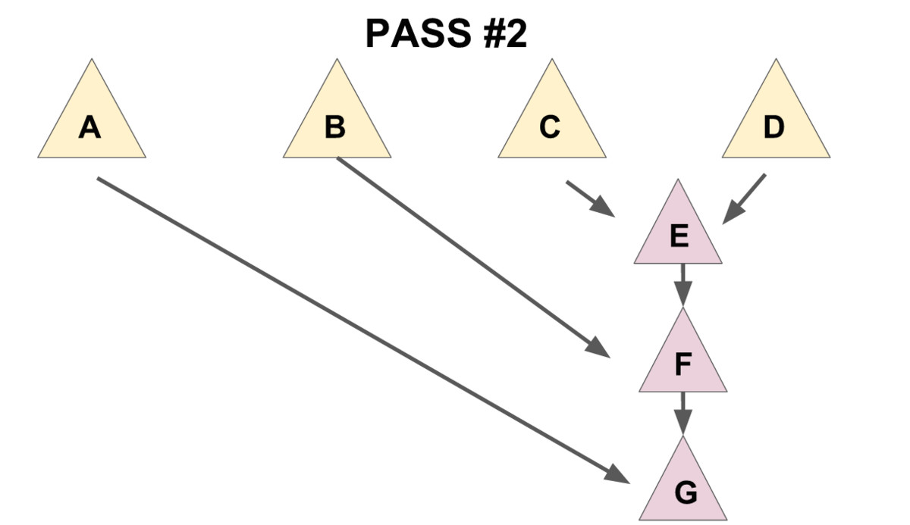

### 简介

&emsp;&emsp;配对堆是一个支持插入，查询/删除最小值，合并，修改元素等操作的数据结构，也就是俗称的可并堆。  
&emsp;&emsp;配对堆在OI界十分的冷门，但其实跑得比较快，也很好写，但不能可持久化，因为配对堆复杂度是势能分析出来的均摊复杂度。  

### 定义

&emsp;&emsp;这里给出一个较为简单的定义，严谨的定义可以查阅参考文献[4]。  
 &emsp;&emsp;配对堆是一棵带权多叉树（如下图），其权值满足堆性质（即每个节点的权值都小于他的所有儿子）。  
  

 &emsp;&emsp;通常我们使用左儿子右兄弟表示法储存一个配对堆(如下图)，从下文可以看出这种方式可以方便配对堆的实现。  

  

### 各项操作的实现

#### 存储结构定	义

&emsp;&emsp;就是普通的带权多叉树的表示方式。  

```cpp
struct Node
{
	T v; //T为权值类型
	Node *ch,*xd; //ch为该节点儿子的指针，xd为该节点兄弟的指针。
    			 //若该节点没有儿子/兄弟则指针指向虚拟空节点。
};

```

#### 查询最小值

&emsp;&emsp;从配对堆的定义可看出，配对堆的根节点的权值一定最小，所以我们直接返回根节点就行了。

#### 合并

&emsp;&emsp;配对堆的合并操作极为简单，直接把根节点权值较大的那个配对堆设成另一个的儿子就好了。（如下图）  
   
&emsp;&emsp;复杂度的话，操作本身显然是$ O(1)$ 的，考虑到对势能的影响后还是均摊$ O(1)$

```cpp
Node* merge(Node* a,Node* b)
{
     // 若有一个为空则直接返回另一个
	if (a==node) return b;  
	if (b==node) return a;
	if (a->v>b->v) swap(a,b); //swap后a为权值小的堆，b为权值大的堆
    //将b设为a的儿子
	b->xd=a->ch; 
	a->ch=b;
	return a;
}
```

#### 插入

&emsp;&emsp;合并都有了，插入就直接把新元素视为一个新的配对堆和原堆合并就行啦。

#### 删除最小值

&emsp;&emsp;到这里我们会发现，前面的几个操作都十分偷懒，几乎完全没有对数据结构进行维护，所以删除最小值是配对堆最重要的（也是最复杂）的一个操作。  
&emsp;&emsp;考虑我们拿掉根节点之后会发生什么，根节点原来的所有儿子构成了一片森林，所以我们要把他们合并起来。  
&emsp;&emsp;一个很自然的想法是使用merge函数把儿子们一个一个并在一起，这样做的话正确性是显然的，但是会导致复杂度退化到$ O(n)$。为了保证删除操作的均摊复杂度为$ O(\log n)$，我们需要：把儿子们两两配成一对，先用merge操作把被配成同一对的2个儿子合并到一起(见下图1)，再按上述方法将新产生的堆暴力合并在一起（见下图2）。

	

&emsp;&emsp;先实现一个辅助函数~~（实际上是主要函数）~~``merges``，作用是合并一个节点的所有兄弟。  

##### 递归版本的merges（推荐）

&emsp;&emsp;实现上，推荐使用这种好写的递归式实现。

```cpp
Node* merges(Node* x) 
{
	if (x==node || x->xd==node) return x; //如果该树为空或他没有兄弟（即他的父亲的儿子数小于2），就直接return。
	Node* a=x->xd,*b=a->xd; //a：x的一个兄弟，b：x的另一个兄弟
	x->xd=a->xd=node; //拆散
	return merge(merge(x,a),merges(b)); //核心部分
}

```

&emsp;&emsp;最后一句话是该函数的核心，这句话分三部分：  

1. ``merge(x,a)``“配对”了x和a。  
2. ``merges(b)``递归合并b和他的兄弟们。  
3. 将上面2个操作产生的2个新树合并。  

##### 迭代版本的merges

&emsp;&emsp;迭代版本不仅不好写，而且实现不优越的话还不一定比递归版快（下面这个就是不优越的实现，跑的不比上面的递归版本快），所以更推荐写递归版。

```cpp
Node *merges(Node *x)
{
	Node* t=x; x=x->xd;
	t->xd=node;
	while(x->xd!=node) {
		Node* a=x->xd,*b=a->xd;
		x->xd=a->xd=node;
		t=merge(t,merge(x,a));
		x=b;
	}
	return merge(t,x);
}

```

&emsp;&emsp; 然后``delete-min``操作就显然了。（因为这个封装实在没啥用，实际在实现时中一般不显式写出这个函数）  

```cpp
Node* delete_min(Node* x)
{
    return merges(x->ch);
}
```

#### 减小一个元素的值

&emsp;&emsp;要实现这个操作，需要给节点添加一个father指针，会使实现变得相对复杂。  
&emsp;&emsp;首先节点的定义修改为：

```cpp
struct Node
{
	T v; 
	Node *ch,*xd; 
    Node *fa; //新增：fa指针，指向该节点的父亲，若该节点为根节点则指向虚拟空节点
};

```

&emsp;&emsp;merge操作修改为：

```cpp
Node* merge(Node* a,Node* b)
{
	if (a==node) return b;  
	if (b==node) return a;
	if (a->v>b->v) swap(a,b);
	a->fa=node; b->fa=node; //新增：维护fa指针
	b->xd=a->ch; 
	a->ch->fa=b; //新增：维护fa指针
	a->ch=b;
	return a;
}
```

&emsp;&emsp;merges操作修改为:

```cpp
Node* merges(Node* x) 
{
	x->fa=node; //新增：维护fa指针
	if (x==node || x->xd==node) return x; 
	Node* a=x->xd,*b=a->xd; 
	x->xd=a->xd=node; 
	a->fa=node; //新增：维护fa指针
	return merge(merge(x,a),merges(b)); 
}
```

&emsp;&emsp;现在我们来考虑如何实现decrease-key操作。
&emsp;&emsp;首先我们发现，当我们对节点x进行dec-key操作后，以x为根的子树仍然满足配对堆性质，但x的父亲和x之间可能不再满足堆性质。
&emsp;&emsp;因此我们可以把整棵以x为根的子树剖出来，这样现在两棵树都符合配对堆性质了，再把他们merge起来就做完了。
&emsp;&emsp;这个操作本身复杂度显然为 $O(1)$，但会破坏原有的势能分析过程，因此均摊复杂度难以证明（目前学术界还无法给出复杂度的精确值），通常可以简单的认为复杂度为 $o(\log n)$（注意这里为小o）。

```cpp
//root为堆的根，x为要操作的节点，v为新的权值，调用时需保证x->v<=v
//返回值为新的根节点
Node* decrease-key(Node* root,Node* x,LL v) 
{
	x->v=v; //修改权值
	if (x->fa==node) return x; //如果x为根，就不用接下去的步骤了。
	//把x从fa的子节点中剖出去，这里要分x的位置讨论一下。
	if (x->fa->ch==x) x->fa->ch=x->xd; 
	else x->fa->xd=x->xd;
	x->xd->fa=x->fa; 
	x->xd=node; x->fa=node;
	return merge(root,x); //合并root和x。
}

```

### 复杂度分析

&emsp;&emsp;见[配对堆的论文](http://www.cs.cmu.edu/~sleator/papers/pairing-heaps.pdf)。

### 参考文献

1. [HOOCCOOH的题解](https://hooccooh.blog.luogu.org/solution-p3377)
2. 集训队论文《黄源河--左偏树的特点及其应用》
3. [《配对堆中文版》](https://wenku.baidu.com/view/f2527bc2bb4cf7ec4afed06d.html)
4. [维基百科pairing heap词条](https://en.wikipedia.org/wiki/Pairing_heap)
5. https://blog.csdn.net/luofeixiongsix/article/details/50640668
6. https://brilliant.org/wiki/pairing-heap/  （注：本条目所有图片均来自这里）
