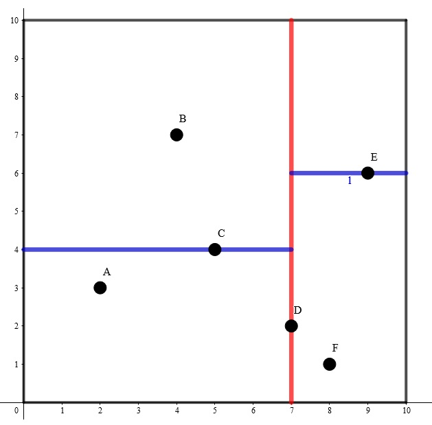
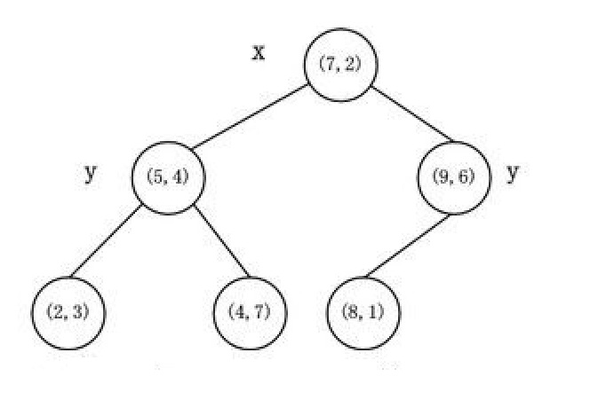

author: hsfzLZH1, Ir1d

k-D Tree(KDT , k-Dimension Tree) 是一种可以 **高效处理 $k$ 维空间信息** 的数据结构。

在结点数 $n$ 远大于 $2^k$ 时，应用 k-D Tree 的时间效率很好。

在算法竞赛的题目中，一般有 $k=2$。在本页面分析时间复杂度时，将认为 $k$ 是常数。

## 建树

k-D Tree 具有二叉搜索树的形态，二叉搜索树上的每个结点都对应 $k$ 维空间内的一个点。其每个子树中的点都在一个 $k$ 维的超长方体内，这个超长方体内的所有点也都在这个子树中。

假设我们已经知道了 $k$ 维空间内的 $n$ 个不同的点的坐标，要将其构建成一棵 k-D Tree，步骤如下：

1. 若当前超长方体中只有一个点，返回这个点。

2. 选择一个维度，将当前超长方体按照这个维度分成两个超长方体。

3. 选择切割点：在选择的维度上选择一个点，这一维度上的值小于这个点的归入一个超长方体（左子树），其余的归入另一个超长方体（右子树）。

4. 将选择的点作为这棵子树的根节点，递归对分出的两个超长方体构建左右子树，维护子树的信息。

为了方便理解，我们举一个 $k=2$ 时的例子。



其构建出 k-D Tree 的形态可能是这样的：



其中树上每个结点上的坐标是选择的分割点的坐标，非叶子结点旁的 $x$ 或 $y$ 是选择的切割维度。

这样的复杂度无法保证。对于 $2,3$ 两步，我们提出两个优化：

1. 选择的维度要满足其内部点的分布的差异度最大，即每次选择的切割维度是方差最大的维度。

2. 每次在维度上选择切割点时选择该维度上的 **中位数**，这样可以保证每次分成的左右子树大小尽量相等。

可以发现，使用优化 $2$ 后，构建出的 k-D Tree 的树高最多为 $O(\log n)$。

现在，构建 k-D Tree 时间复杂度的瓶颈在于快速选出一个维度上的中位数，并将在该维度上的值小于该中位数的置于中位数的左边，其余置于右边。如果每次都使用 `sort` 函数对该维度进行排序，时间复杂度是 $O(n\log^2 n)$ 的。事实上，单次找出 $n$ 个元素中的中位数并将中位数置于排序后正确的位置的复杂度可以达到 $O(n)$。

我们来回顾一下快速排序的思想。每次我们选出一个数，将小于该数的置于该数的左边，大于该数的置于该数的右边，保证该数在排好序后正确的位置上，然后递归排序左侧和右侧的值。这样的期望复杂度是 $O(n\log n)$ 的。但是由于 k-D Tree 只要求要中位数在排序后正确的位置上，所以我们只需要递归排序包含中位数的 **一侧**。可以证明，这样的期望复杂度是 $O(n)$ 的。在 `algorithm` 库中，有一个实现相同功能的函数 `nth_element()`，要找到 `s[l]` 和 `s[r]` 之间的值按照排序规则 `cmp` 排序后在 `s[mid]` 位置上的值，并保证 `s[mid]` 左边的值小于 `s[mid]`，右边的值大于 `s[mid]`，只需写 `nth_element(s+l,s+mid,s+r+1,cmp)`。

借助这种思想，构建 k-D Tree 时间复杂度是 $O(n\log n)$ 的。

## 插入/删除

如果维护的这个 $k$ 维点集是可变的，即可能会插入或删除一些点，此时 k-D Tree 的平衡性无法保证。由于 k-D Tree 的构造，不能支持旋转，类似与 FHQ Treap 的随机优先级也不能保证其复杂度，可以保证平衡性的手段只有类似于 [替罪羊树](./sgt.md) 的重构思想。

我们引入一个重构常数 $\alpha$，对于 k-D Tree 上的一个结点 $x$，若其有一个子树的结点数在以 $x$ 为根的子树的结点数中的占比大于 $\alpha$，则认为以 $x$ 为根的子树是不平衡的，需要重构。重构时，先遍历子树求出一个序列，然后用以上描述的方法建出一棵 k-D Tree，代替原来不平衡的子树。

在插入一个 $k$ 维点时，先根据记录的分割维度和分割点判断应该继续插入到左子树还是右子树，如果到达了空结点，新建一个结点代替这个空结点。成功插入结点后回溯插入的过程，维护结点的信息，如果发现当前的子树不平衡，则重构当前子树。

如果还有删除操作，则使用 **惰性删除**，即删除一个结点时打上删除标记，而保留其在 k-D Tree 上的位置。如果这样写，当未删除的结点数在以 $x$ 为根的子树中的占比小于 $\alpha$ 时，同样认为这个子树是不平衡的，需要重构。

类似于替罪羊树，带重构的 k-D Tree 的树高仍然是 $O(\log n)$ 的。

## 邻域查询

???+note " 例题[luogu P1429 平面最近点对（加强版）](https://www.luogu.com.cn/problem/P1429)"
    给定平面上的 $n$ 个点 $(x_i,y_i)$，找出平面上最近两个点对之间的 [欧几里得距离](../geometry/distance.md#欧氏距离)。
    
    $2\le n\le 200000 , 0\le x_i,y_i\le 10^9$

首先建出关于这 $n$ 个点的 2-D Tree。

枚举每个结点，对于每个结点找到不等于该结点且距离最小的点，即可求出答案。每次暴力遍历 2-D Tree 上的每个结点的时间复杂度是 $O(n)$ 的，需要剪枝。我们可以维护一个子树中的所有结点在每一维上的坐标的最小值和最大值。假设当前已经找到的最近点对的距离是 $ans$，如果查询点到子树内所有点都包含在内的长方形的 **最近** 距离大于等于 $ans$，则在这个子树内一定没有答案，搜索时不进入这个子树。

此外，还可以使用一种启发式搜索的方法，即若一个结点的两个子树都有可能包含答案，先在与查询点距离最近的一个子树中搜索答案。可以认为，**查询点到子树对应的长方形的最近距离就是此题的估价函数**。

**注意：虽然以上使用的种种优化，但是使用 k-D Tree 单次查询最近点的时间复杂度最坏还是 $O(n)$ 的，但不失为一种优秀的骗分算法，使用时请注意。在这里对邻域查询的讲解仅限于加强对 k-D Tree 结构的认识。**

??? "参考代码"
    ```cpp
    --8<-- "docs/ds/code/kdt/kdt_1.cpp"
    ```

???+note " 例题[「CQOI2016」K 远点对](https://loj.ac/problem/2043)"
    给定平面上的 $n$ 个点 $(x_i,y_i)$，求欧几里得距离下的第 $k$ 远无序点对之间的距离。
    
    $n\le 100000 , 1\le k\le 100 , 0\le x_i,y_i<2^{31}$

和上一道例题类似，从最近点对变成了 $k$ 远点对，估价函数改成了查询点到子树对应的长方形区域的最远距离。用一个小根堆来维护当前找到的前 $k$ 远点对之间的距离，如果当前找到的点对距离大于堆顶，则弹出堆顶并插入这个距离，同样的，使用堆顶的距离来剪枝。

由于题目中强调的是无序点对，即交换前后两点的顺序后仍是相同的点对，则每个有序点对会被计算两次，那么读入的 $k$ 要乘以 $2$。

??? "参考代码"
    ```cpp
    --8<-- "docs/ds/code/kdt/kdt_2.cpp"
    ```

## 高维空间上的操作

???+note " 例题[luogu P4148 简单题](https://www.luogu.com.cn/problem/P4148)"
    在一个初始值全为 $0$ 的 $n\times n$ 的二维矩阵上，进行 $q$ 次操作，每次操作为以下两种之一：
    
    1. `1 x y A`：将坐标 $(x,y)$ 上的数加上 $A$。
    2. `2 x1 y1 x2 y2`：输出以 $(x1,y1)$ 为左下角，$(x2,y2)$ 为右上角的矩形内（包括矩形边界）的数字和。
    
    强制在线。内存限制 `20M`。保证答案及所有过程量在 `int` 范围内。
    
    $1\le n\le 500000 , 1\le q\le 200000$

20M 的空间卡掉了所有树套树，强制在线卡掉了 CDQ 分治，只能使用 k-D Tree。

构建 2-D Tree，支持两种操作：添加一个 $2$ 维点；查询矩形区域内的所有点的权值和。可以使用 **带重构** 的 k-D Tree 实现。

在查询矩形区域内的所有点的权值和时，仍然需要记录子树内每一维度上的坐标的最大值和最小值。如果当前子树对应的矩形与所求矩形没有交点，则不继续搜索其子树；如果当前子树对应的矩形完全包含在所求矩形内，返回当前子树内所有点的权值和；否则，判断当前点是否在所求矩形内，更新答案并递归在左右子树中查找答案。

已经证明，如果在 $2-D$ 树上进行矩阵查询操作，已经被完全覆盖的子树不会继续查询，则单次查询时间复杂度是最优 $O(\log n)$，最坏 $O(\sqrt n)$ 的。将结论扩展到 $k$ 维的情况，则最坏时间复杂度是 $O(n^{1-\frac 1 k})$ 的。

??? "参考代码"
    ```cpp
    --8<-- "docs/ds/code/kdt/kdt_3.cpp"
    ```

## 习题

[「SDOI2010」捉迷藏](https://www.luogu.com.cn/problem/P2479)

[「Violet」天使玩偶/SJY 摆棋子](https://www.luogu.com.cn/problem/P4169)

[「国家集训队」JZPFAR](https://www.luogu.com.cn/problem/P2093)

[「BOI2007」Mokia 摩基亚](https://www.luogu.com.cn/problem/P4390)

[luogu P4475 巧克力王国](https://www.luogu.com.cn/problem/P4475)

[「CH 弱省胡策 R2」TATT](https://www.luogu.com.cn/problem/P3769)
