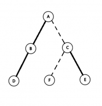
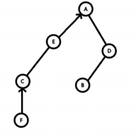
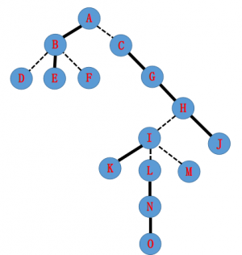
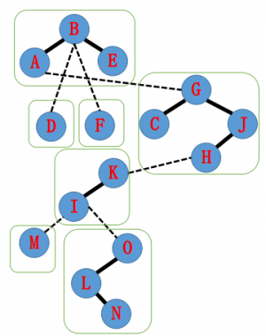
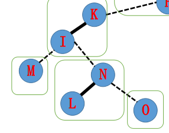
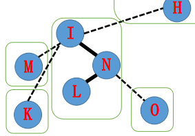
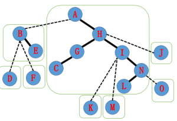

## 简介

1. Link/Cut Tree 是一种数据结构，我们用它来解决<font color="red">动态树问题</font>。
2. Link/Cut Tree 又称 Link-Cut Tree，简称 LCT，但它不叫动态树，动态树是指一类问题。
3. Splay Tree 是 LCT 的基础，但是 LCT 用的 Splay Tree 和普通的 Splay 在细节处不太一样（进行了一些扩展）。
4. 这是一个和 Splay 一样只需要写几 (yi) 个 (dui) 核心函数就能实现一切的数据结构。

## 问题引入

- 维护一棵树，支持如下操作。
- 修改两点间路径权值。
- 查询两点间路径权值和。
- 修改某点子树权值。
-   查询某点子树权值和。
      唔，看上去是一道树剖模版题。

那么我们加一个操作

- 断开并连接一些边，保证仍是一棵树。

要求在线求出上面的答案。

——动态树问题的解决方法：Link/Cut Tree!

## 动态树问题

- 维护一个<font color="red">森林</font>, 支持删除某条边，加入某条边，并保证加边，删边之后仍是森林。我们要维护这个森林的一些信息。
- 一般的操作有两点连通性，两点路径权值和，连接两点和切断某条边、修改信息等。

* * *

### 从 LCT 的角度回顾一下树链剖分

- 对整棵树按子树大小进行剖分，并重新标号。
- 我们发现重新标号之后，在树上形成了一些以链为单位的连续区间，并且可以用线段树进行区间操作。

### 转向动态树问题

- 我们发现我们刚刚讲的树剖是以子树大小作为划分条件。
- 那我们能不能重定义一种剖分，使它更适应我们的动态树问题呢？
- 考虑动态树问题需要什么链。
- 由于动态维护一个森林，显然我们希望这个链是我们指定的链，以便利用来求解。

## <font color = "red">实链剖分</font>

- 对于一个点连向它所有儿子的边 , 我们自己选择一条边进行剖分，我们称被选择的边为实边，其他边则为虚边。
- 对于实边，我们称它所连接的儿子为实儿子。
- 对于一条由实边组成的链，我们同样称之为实链。
- 请记住我们选择实链剖分的最重要的原因：它是我们选择的，灵活且可变。
- 正是它的这种灵活可变性，我们采用 Splay Tree 来维护这些实链。

## LCT！

- 我们可以简单的把 LCT 理解成用一些 Splay 来维护动态的树链剖分，以期实现动态树上的区间操作。
- 对于每条实链，我们建一个 Splay 来维护整个链区间的信息。
- 接下来，我们来学习 LCT 的具体结构。

## 辅助树

- 我们先来看一看辅助树的一些性质，再通过一张图实际了解一下辅助树的具体结构。
- 在本文里，你可以认为一些 Splay 构成了一个辅助树，每棵辅助树维护的是一棵树，一些辅助树构成了 LCT，其维护的是整个森林。

1. 辅助树由多棵 Splay 组成，每棵 Splay 维护原树中的一条路径，且中序遍历这棵 Splay 得到的点序列，从前到后对应原树“从上到下”的一条路径。
2. 原树每个节点与辅助树的 Splay 节点一一对应。
3. 辅助树的各棵 Splay 之间并不是独立的。每棵 Splay 的根节点的父亲节点本应是空，但在 LCT 中每棵 Splay 的根节点的父亲节点指向原树中 **这条链** 的父亲节点（即链最顶端的点的父亲节点）。这类父亲链接与通常 Splay 的父亲链接区别在于儿子认父亲，而父亲不认儿子，对应原树的一条 **虚边**。因此，每个连通块恰好有一个点的父亲节点为空。
4. 由于辅助树的以上性质，我们维护任何操作都不需要维护原树，辅助树可以在任何情况下拿出一个唯一的原树，我们只需要维护辅助树即可。（本句来源自 @PoPoQQQ 大爷的 PPT)

- 现在我们有一棵原树，如图。
- 加粗边是实边，虚线边是虚边。



- 由刚刚的定义，辅助树的结构如下



### 考虑原树和辅助树的结构关系

- 原树中的实链 : 在辅助树中节点都在一棵 Splay 中。
- 原树中的虚链 : 在辅助树中，子节点所在 Splay 的 Father 指向父节点，但是父节点的两个儿子都不指向子节点。
- 注意：原树的根不等于辅助树的根。
- 原树的 Father 指向不等于辅助树的 Father 指向。
- 辅助树是可以在满足辅助树、Splay 的性质下任意换根的。
- 虚实链变换可以轻松在辅助树上完成，这也就是实现了动态维护树链剖分。

### 接下来要用到的变量声明

- `ch[N][2]` 左右儿子
- `f[N]` 父亲指向
- `sum[N]` 路径权值和
- `val[N]` 点权
- `tag[N]` 翻转标记
- `laz[N]` 权值标记
- `siz[N]` 辅助树上子树大小
- Other_Vars

### 函数声明

#### 一般数据结构函数（字面意思）

1. `PushUp(x)`
2. `PushDown(x)`

#### Splay 系函数（不会多做解释）

1. `Get(x)` 获取 $x$ 是父亲的哪个儿子。
2. `Splay(x)` 通过和 Rotate 操作联动实现把 $x$ 旋转到<font color = "red">当前 Splay 的根</font>。
3. `Rotate(x)` 将 $x$ 向上旋转一层的操作。

#### 新操作

1. `Access(x)` 把从根到 $x$ 的所有点放在一条实链里，使根到 $x$ 成为一条实路径，并且在同一棵 Splay 里。**只有此操作是必须实现的，其他操作视题目而实现。**
2. `IsRoot(x)` 判断 $x$ 是否是所在树的根。
3. `Update(x)` 在 `Access` 操作之后，递归地从上到下 `Pushdown` 更新信息。
4. `MakeRoot(x)` 使 $x$ 点成为其所在树的根。
5. `Link(x, y)` 在 $x, y$ 两点间连一条边。
6. `Cut(x, y)` 把 $x, y$ 两点间边删掉。
7. `Find(x)` 找到 $x$ 所在树的根节点编号。
8. `Fix(x, v)` 修改 $x$ 的点权为 $v$。
9. `Split(x, y)` 提取出 $x, y$ 间的路径，方便做区间操作。

### 宏定义

- `#define ls ch[p][0]`
- `#define rs ch[p][1]`

## 函数讲解

先从简单的来吧

### `PushUp()`

```cpp
inline void PushUp(int p) {
  // maintain other variables
  siz[p] = siz[ls] + siz[rs] + 1;
}
```

### `PushDown()`

```cpp
inline void PushDown(int p) {
  if (tag[p] != std_tag) {
    // pushdown the tag
    tag[p] = std_tag;
  }
}
```

### `Splay() && Rotate()`

有些不一样了哦。

```cpp
#define Get(x) (ch[f[x]][1] == x)
inline void Rotate(int x) {
  int y = f[x], z = f[y], k = Get(x);
  if (!isRoot(y)) ch[z][ch[z][1] == y] = x;
  // 上面这句一定要写在前面，普通的Splay是不用的，因为 isRoot  (后面会讲)
  ch[y][k] = ch[x][!k], f[ch[x][!k]] = y;
  ch[x][!k] = y, f[y] = x, f[x] = z;
  PushUp(y), PushUp(x);
}
inline void Splay(int x) {
  Update(
      x);  // 马上就能看到啦。 在 Splay之前要把旋转会经过的路径上的点都PushDown
  for (int fa; fa = f[x], !isRoot(x); Rotate(x)) {
    if (!isRoot(fa)) Rotate(Get(fa) == Get(x) ? fa : x);
  }
}
```

如果上面的几个函数你看不懂，请移步 [Splay](./splay.md)。

下面要开始 LCT 独有的函数了哦。

### `isRoot()`

```cpp
// 在前面我们已经说过，LCT 具有 如果一个儿子不是实儿子，他的父亲找不到它的性质
// 所以当一个点既不是它父亲的左儿子，又不是它父亲的右儿子，它就是当前 Splay 的根
#define isRoot(x) (ch[f[x]][0] != x && ch[f[x]][1] != x)
```

### <code><font color = "red">Access()</font></code>

```cpp
// Access 是 LCT
// 的核心操作，试想我们像求解一条路径，而这条路径恰好就是我们当前的一棵 Splay，
// 直接调用其信息即可。先来看一下代码，再结合图来看看过程
inline int Access(int x) {
  int p;
  for (p = 0; x; p = x, x = f[x]) {
    Splay(x), ch[x][1] = p, PushUp(x);
  }
  return p;
}
```

我们有这样一棵树，实线为实边，虚线为虚边。



- 它的辅助树可能长成这样（构图方式不同可能 LCT 的结构也不同）。
- 每个绿框里是一棵 Splay。



- 现在我们要 `Access(N)`, 把 $A$ 到 $N$ 路径上的边都变为实边，拉成一棵 Splay。


- 实现的方法是从下到上逐步更新 Splay。
- 首先我们要把 $N$ 旋至当前 Splay 的根。
- 为了保证 AuxTree（辅助树）的性质，原来 $N$ 到 $O$ 的实边要更改为虚边。
- 由于认父不认子的性质，我们可以单方面的把 $N$ 的儿子改为 Null。
- 于是原来的 AuxTree 就从下图变成了下下图。





- 下一步，我们把 $N$ 指向的 Father $I$ 也旋转到 $I$ 的 Splay 树根。
- 原来的实边 $I$—$K$ 要去掉，这时候我们把 $I$ 的右儿子指向 $N$, 就得到了 $I$—$L$ 这样一棵 Splay。


- 接下来，按照刚刚的操作步骤，由于 $I$ 的 Father 指向 $H$, 我们把 $H$ 旋转到他所在 Splay Tree 的根，然后把 $H$ 的 rs 设为 $I$。
- 之后的树是这样的。


- 同理我们 `Splay(A)`, 并把 $A$ 的右儿子指向 $H$。
- 于是我们得到了这样一棵 AuxTree。并且发现 $A$—$N$ 的整个路径已经在同一棵 Splay 中了。大功告成！



```cpp
// 回顾一下代码
inline int Access(int x) {
  int p;
  for (p = 0; x; p = x, x = f[x]) {
    Splay(x), ch[x][1] = p, PushUp(x);
  }
  return p;
}
```

我们发现 `Access()` 其实很容易，只有如下四步操作：

1. 把当前节点转到根。
2. 把儿子换成之前的节点。
3. 更新当前点的信息。
4. 把当前点换成当前点的父亲，继续操作。

这里提供的 Access 还有一个返回值。这个返回值相当于最后一次虚实链变换时虚边父亲节点的编号。该值有两个含义：

- 连续两次 Access 操作时，第二次 Access 操作的返回值等于这两个节点的 LCA.
- 表示 $x$ 到根的链所在的 Splay 树的根。这个节点一定已经被旋转到了根节点，且父亲一定为空。

### `Update()`

```cpp
// 从上到下一层一层 pushDown 即可
void Update(int p) {
  if (!isRoot(p)) Update(f[p]);
  pushDown(p);
}
```

### `makeRoot()`

- `Make_Root()` 的重要性丝毫不亚于 `Access()`。我们在需要维护路径信息的时候，一定会出现路径深度无法严格递增的情况，根据 AuxTree 的性质，这种路径是不能出现在一棵 Splay 中的。
- 这时候我们需要用到 `Make_Root()`。
- `Make_Root()` 的作用是使指定的点成为原树的根，考虑如何实现这种操作。
- 设 `Access(x)` 的返回值为 $y$，则此时 $x$ 到当前根的路径恰好构成一个 Splay，且该 Splay 的根为 $y$.
- 考虑将树用有向图表示出来，给每条边定一个方向，表示从儿子到父亲的方向。容易发现换根相当于将 $x$ 到根的路径的所有边反向（请仔细思考）。
- 因此将 $x$ 到当前根的路径翻转即可。
- 由于 $y$ 是 $x$ 到当前根的路径所代表的 Splay 的根，因此将以 $y$ 为根的 Splay 树进行区间翻转即可。

```cpp
inline void makeRoot(int p) {
  p = Access(p);
  swap(ch[p][0], ch[p][1]);
  tag[p] ^= 1;
}
```

### `Link()`

- Link 两个点其实很简单，先 `Make_Root(x)`, 然后把 $x$ 的父亲指向 $y$ 即可。显然，这个操作肯定不能发生在同一棵树内，所以记得先判一下。

```cpp
inline void Link(int x, int p) {
  makeRoot(x);
  splay(x);
  f[x] = p;
}
```

### `Split()`

- `Split` 操作意义很简单，就是拿出一棵 Splay , 维护的是 $x$ 到 $y$ 的路径。
- 先 `MakeRoot(x)`，然后 `Access(y)`。如果要 $y$ 做根，再 `Splay(y)`。
- 就这三句话，没写代码，需要的时候可以直接打这三个就好辣！
- 另外 Split 这三个操作直接可以把需要的路径拿出到 $y$ 的子树上，那不是随便干嘛咯。

### `Cut()`

- `Cut` 有两种情况，保证合法和不一定保证合法。（废话）
- 如果保证合法，直接 `Split(x, y)`，这时候 $y$ 是根，$x$ 一定是它的儿子，双向断开即可。就像这样：

```cpp
inline void Cut(int x, int p) {
  makeRoot(x), Access(p), Splay(p), ls = f[x] = 0;
}
```

如果是不保证合法，我们需要判断一下是否有，我选择使用 `map` 存一下，但是这里有一个利用性质的方法：

想要删边，必须要满足如下三个条件：

1. $x,y$ 连通。
2. $x,y$ 的路径上没有其他的链。
3. $x$ 没有右儿子。

总结一下，上面三句话的意思就一个：$x,y$ 之间有边。

具体实现就留作一个思考题给大家。判断连通需要用到后面的 `Find`, 其他两点稍作思考分析一下结构就知道该怎么判断了。

### `Find()`

- `Find()` 其实就是找到当前辅助树的根。在 `Access(p)` 后，再 `Splay(p)`。这样根就是树里最小的那个，一直往 ls 走，沿途 `PushDown` 即可。
- 一直走到没有 ls, 非常简单。
- 注意，每次查询之后需要把查询到的答案对应的结点 `Splay` 上去以保证复杂度。

```cpp
inline int Find(int p) {
  Access(p), Splay(p), pushDown(p);
  while (ls) p = ls, pushDown(p);
  Splay(p);
  return p;
}
```

### 一些提醒

- 干点啥前一定要想一想需不需要 `PushUp` 或者 `PushDown`, LCT 由于特别灵活的原因，少 `Pushdown` 或者 `Pushup` 一次就可能把修改改到不该改的点上！
- LCT 的 `Rotate` 和 Splay 的不太一样，`if (z)` 一定要放在前面。
- LCT 的 `Splay` 操作就是旋转到根，没有旋转到谁儿子的操作，因为不需要。

## 习题

- [「BZOJ 3282」Tree](https://lydsy.com/JudgeOnline/problem.php?id=3282)
- [「HNOI2010」弹飞绵羊](https://www.luogu.com.cn/problem/P3203)

## 维护树链信息

LCT 通过 `Split(x,y)` 操作，可以将树上从点 $x$ 到点 $y$ 的路径提取到以 $y$ 为根的 Splay 内，树链信息的修改和统计转化为平衡树上的操作，这使得 LCT 在维护树链信息上具有优势。此外，借助 LCT 实现的在树链上二分比树链剖分少一个 $O(\log n)$ 的复杂度。

???+note " 例题[「国家集训队」Tree II](https://www.luogu.com.cn/problem/P1501)"
    给出一棵有 $n$ 个结点的树，每个点的初始权值为 $1$。$q$ 次操作，每次操作均为以下四种之一：
    
    1. `- u1 v1 u2 v2`：将树上 $u_1,v_1$ 两点之间的边删除，连接 $u_2,v_2$ 两点，保证操作合法且连边后仍是一棵树。
    2. `+ u v c`：将树上 $u,v$ 两点之间的路径上的点权都增加 $c$。
    3. `* u v c`：将树上 $u,v$ 两点之间的路径上的点权都乘以 $c$。
    4.  `/ u v`：输出树上 $u,v$ 两点之间的路径上的点权之和对 $51061$ 取模后的值。
    
        $1\le n,q\le 10^5,0\le c\le 10^4$
    
        `-` 操作可以直接 `Cut(u1,v1),Link(u2,v2)`。

对树上 $u,v$ 两点之间的路径进行修改时，先 `Split(u,v)`。

此题要求进行在辅助树上的子树加，子树乘，子树求和操作，所以我们除了一般 LCT 需要维护的子树翻转标记，还要维护子树加法标记和子树乘法标记。处理标记的方法和在 Splay 上是一样的。

在打上和下传加法标记时，子树权值和的变化量和子树中的结点数有关，所以我们还要维护子树的大小 `siz`。

在下传标记时，需要注意顺序，先下传乘法标记再下传加法标记。子树翻转和子树加乘两种标记没有冲突。

??? "参考代码"
    ```cpp
    #include <algorithm>
    #include <cstdio>
    #include <cstring>
    using namespace std;
    #define int long long
    const int maxn = 100010;
    const int mod = 51061;
    int n, q, u, v, c;
    char op;
    struct Splay {
      int ch[maxn][2], fa[maxn], siz[maxn], val[maxn], sum[maxn], rev[maxn],
          add[maxn], mul[maxn];
      void clear(int x) {
        ch[x][0] = ch[x][1] = fa[x] = siz[x] = val[x] = sum[x] = rev[x] = add[x] =
            0;
        mul[x] = 1;
      }
      int getch(int x) { return (ch[fa[x]][1] == x); }
      int isroot(int x) {
        clear(0);
        return ch[fa[x]][0] != x && ch[fa[x]][1] != x;
      }
      void maintain(int x) {
        clear(0);
        siz[x] = (siz[ch[x][0]] + 1 + siz[ch[x][1]]) % mod;
        sum[x] = (sum[ch[x][0]] + val[x] + sum[ch[x][1]]) % mod;
      }
      void pushdown(int x) {
        clear(0);
        if (mul[x] != 1) {
          if (ch[x][0])
            mul[ch[x][0]] = (mul[x] * mul[ch[x][0]]) % mod,
            val[ch[x][0]] = (val[ch[x][0]] * mul[x]) % mod,
            sum[ch[x][0]] = (sum[ch[x][0]] * mul[x]) % mod,
            add[ch[x][0]] = (add[ch[x][0]] * mul[x]) % mod;
          if (ch[x][1])
            mul[ch[x][1]] = (mul[x] * mul[ch[x][1]]) % mod,
            val[ch[x][1]] = (val[ch[x][1]] * mul[x]) % mod,
            sum[ch[x][1]] = (sum[ch[x][1]] * mul[x]) % mod,
            add[ch[x][1]] = (add[ch[x][1]] * mul[x]) % mod;
          mul[x] = 1;
        }
        if (add[x]) {
          if (ch[x][0])
            add[ch[x][0]] = (add[ch[x][0]] + add[x]) % mod,
            val[ch[x][0]] = (val[ch[x][0]] + add[x]) % mod,
            sum[ch[x][0]] = (sum[ch[x][0]] + add[x] * siz[ch[x][0]] % mod) % mod;
          if (ch[x][1])
            add[ch[x][1]] = (add[ch[x][1]] + add[x]) % mod,
            val[ch[x][1]] = (val[ch[x][1]] + add[x]) % mod,
            sum[ch[x][1]] = (sum[ch[x][1]] + add[x] * siz[ch[x][1]] % mod) % mod;
          add[x] = 0;
        }
        if (rev[x]) {
          if (ch[x][0]) rev[ch[x][0]] ^= 1, swap(ch[ch[x][0]][0], ch[ch[x][0]][1]);
          if (ch[x][1]) rev[ch[x][1]] ^= 1, swap(ch[ch[x][1]][0], ch[ch[x][1]][1]);
          rev[x] = 0;
        }
      }
      void update(int x) {
        if (!isroot(x)) update(fa[x]);
        pushdown(x);
      }
      void print(int x) {
        if (!x) return;
        pushdown(x);
        print(ch[x][0]);
        printf("%lld ", x);
        print(ch[x][1]);
      }
      void rotate(int x) {
        int y = fa[x], z = fa[y], chx = getch(x), chy = getch(y);
        fa[x] = z;
        if (!isroot(y)) ch[z][chy] = x;
        ch[y][chx] = ch[x][chx ^ 1];
        fa[ch[x][chx ^ 1]] = y;
        ch[x][chx ^ 1] = y;
        fa[y] = x;
        maintain(y);
        maintain(x);
        maintain(z);
      }
      void splay(int x) {
        update(x);
        for (int f = fa[x]; f = fa[x], !isroot(x); rotate(x))
          if (!isroot(f)) rotate(getch(x) == getch(f) ? f : x);
      }
      void access(int x) {
        for (int f = 0; x; f = x, x = fa[x]) splay(x), ch[x][1] = f, maintain(x);
      }
      void makeroot(int x) {
        access(x);
        splay(x);
        swap(ch[x][0], ch[x][1]);
        rev[x] ^= 1;
      }
      int find(int x) {
        access(x);
        splay(x);
        while (ch[x][0]) x = ch[x][0];
        splay(x);
        return x;
      }
    } st;
    main() {
      scanf("%lld%lld", &n, &q);
      for (int i = 1; i <= n; i++) st.val[i] = 1, st.maintain(i);
      for (int i = 1; i < n; i++) {
        scanf("%lld%lld", &u, &v);
        if (st.find(u) != st.find(v)) st.makeroot(u), st.fa[u] = v;
      }
      while (q--) {
        scanf(" %c%lld%lld", &op, &u, &v);
        if (op == '+') {
          scanf("%lld", &c);
          st.makeroot(u), st.access(v), st.splay(v);
          st.val[v] = (st.val[v] + c) % mod;
          st.sum[v] = (st.sum[v] + st.siz[v] * c % mod) % mod;
          st.add[v] = (st.add[v] + c) % mod;
        }
        if (op == '-') {
          st.makeroot(u);
          st.access(v);
          st.splay(v);
          if (st.ch[v][0] == u && !st.ch[u][1]) st.ch[v][0] = st.fa[u] = 0;
          scanf("%lld%lld", &u, &v);
          if (st.find(u) != st.find(v)) st.makeroot(u), st.fa[u] = v;
        }
        if (op == '*') {
          scanf("%lld", &c);
          st.makeroot(u), st.access(v), st.splay(v);
          st.val[v] = st.val[v] * c % mod;
          st.sum[v] = st.sum[v] * c % mod;
          st.mul[v] = st.mul[v] * c % mod;
        }
        if (op == '/')
          st.makeroot(u), st.access(v), st.splay(v), printf("%lld\n", st.sum[v]);
      }
      return 0;
    }
    ```

### 习题

- [luogu P3690【模板】Link Cut Tree（动态树）](https://www.luogu.com.cn/problem/P3690)
- [「SDOI2011」染色](https://www.luogu.com.cn/problem/P2486)
- [「SHOI2014」三叉神经树](https://loj.ac/problem/2187)

## 维护连通性质

### 判断是否连通

借助 LCT 的 `Find()` 函数，可以判断动态森林上的两点是否连通。如果有 `Find(x)==Find(y)`，则说明 $x,y$ 两点在一棵树上，相互连通。

???+note " 例题[「SDOI2008」洞穴勘测](https://www.luogu.com.cn/problem/P2147)"
    一开始有 $n$ 个独立的点，$m$ 次操作。每次操作为以下之一：
    
    1. `Connect u v`：在 $u,v$ 两点之间连接一条边。
    2. `Destroy u v`：删除在 $u,v$ 两点之间的边，保证之前存在这样的一条边。
    3. `Query u v`：询问 $u,v$ 两点是否连通。
    
    保证在任何时刻图的形态都是一个森林。
    
    $n\le 10^4, m\le 2\times 10^5$

??? "参考代码"
    ```cpp
    #include <algorithm>
    #include <cstdio>
    #include <cstring>
    using namespace std;
    const int maxn = 10010;
    struct Splay {
      int ch[maxn][2], fa[maxn], tag[maxn];
      void clear(int x) { ch[x][0] = ch[x][1] = fa[x] = tag[x] = 0; }
      int getch(int x) { return ch[fa[x]][1] == x; }
      int isroot(int x) { return ch[fa[x]][0] != x && ch[fa[x]][1] != x; }
      void pushdown(int x) {
        if (tag[x]) {
          if (ch[x][0]) swap(ch[ch[x][0]][0], ch[ch[x][0]][1]), tag[ch[x][0]] ^= 1;
          if (ch[x][1]) swap(ch[ch[x][1]][0], ch[ch[x][1]][1]), tag[ch[x][1]] ^= 1;
          tag[x] = 0;
        }
      }
      void update(int x) {
        if (!isroot(x)) update(fa[x]);
        pushdown(x);
      }
      void rotate(int x) {
        int y = fa[x], z = fa[y], chx = getch(x), chy = getch(y);
        fa[x] = z;
        if (!isroot(y)) ch[z][chy] = x;
        ch[y][chx] = ch[x][chx ^ 1];
        fa[ch[x][chx ^ 1]] = y;
        ch[x][chx ^ 1] = y;
        fa[y] = x;
      }
      void splay(int x) {
        update(x);
        for (int f = fa[x]; f = fa[x], !isroot(x); rotate(x))
          if (!isroot(f)) rotate(getch(x) == getch(f) ? f : x);
      }
      void access(int x) {
        for (int f = 0; x; f = x, x = fa[x]) splay(x), ch[x][1] = f;
      }
      void makeroot(int x) {
        access(x);
        splay(x);
        swap(ch[x][0], ch[x][1]);
        tag[x] ^= 1;
      }
      int find(int x) {
        access(x);
        splay(x);
        while (ch[x][0]) x = ch[x][0];
        splay(x);
        return x;
      }
    } st;
    int n, q, x, y;
    char op[maxn];
    int main() {
      scanf("%d%d", &n, &q);
      while (q--) {
        scanf("%s%d%d", op, &x, &y);
        if (op[0] == 'Q') {
          if (st.find(x) == st.find(y))
            printf("Yes\n");
          else
            printf("No\n");
        }
        if (op[0] == 'C')
          if (st.find(x) != st.find(y)) st.makeroot(x), st.fa[x] = y;
        if (op[0] == 'D') {
          st.makeroot(x);
          st.access(y);
          st.splay(y);
          if (st.ch[y][0] == x && !st.ch[x][1]) st.ch[y][0] = st.fa[x] = 0;
        }
      }
      return 0;
    }
    ```

### 维护边双连通分量

如果要求将边双连通分量缩成点，每次添加一条边，所连接的树上的两点如果相互连通，那么这条路径上的所有点都会被缩成一个点。

???+note " 例题[「AHOI2005」航线规划](https://www.luogu.com.cn/problem/P2542)"
    给出 $n$ 个点，初始时有 $m$ 条无向边，$q$ 次操作，每次操作为以下之一：
    
    1. `0 u v`：删除 $u,v$ 之间的连边，保证此时存在这样的一条边。
    2. `1 u v`：查询此时 $u,v$ 两点之间可能的所有路径必须经过的边的数量。
    
    保证图在任意时刻都连通。
    
    $1<n<3\times 10^4,1<m<10^5,0\le q\le 4\times 10^4$

可以发现，$u,v$ 两点之间的所有可能路径必须经过的边的数量为将所有边双连通分量缩成点之后 $u$ 所在点和 $v$ 所在点之间的路径上的结点数 $-1$。

由于题目中的删边操作不好进行，我们考虑离线逆向进行操作，改删边为加边。

加入一条边时，如果两点原来不连通，则在 LCT 上连接两点；否则提取出加这条边之前 LCT 上这两点之间的路径，遍历辅助树上的这个子树，相当于遍历了这条路径，将这些点合并，利用并查集维护合并的信息。

用合并后并查集的代表元素代替原来树上的路径。注意之后的每次操作都要找到操作点在并查集上的代表元素进行操作。

??? "参考代码"
    ```cpp
    #include <algorithm>
    #include <cstdio>
    #include <cstring>
    #include <map>
    using namespace std;
    const int maxn = 200010;
    int f[maxn];
    int findp(int x) { return f[x] ? f[x] = findp(f[x]) : x; }
    void merge(int x, int y) {
      x = findp(x);
      y = findp(y);
      if (x != y) f[x] = y;
    }
    struct Splay {
      int ch[maxn][2], fa[maxn], tag[maxn], siz[maxn];
      void clear(int x) { ch[x][0] = ch[x][1] = fa[x] = tag[x] = siz[x] = 0; }
      int getch(int x) { return ch[findp(fa[x])][1] == x; }
      int isroot(int x) {
        return ch[findp(fa[x])][0] != x && ch[findp(fa[x])][1] != x;
      }
      void maintain(int x) {
        clear(0);
        if (x) siz[x] = siz[ch[x][0]] + 1 + siz[ch[x][1]];
      }
      void pushdown(int x) {
        if (tag[x]) {
          if (ch[x][0]) tag[ch[x][0]] ^= 1, swap(ch[ch[x][0]][0], ch[ch[x][0]][1]);
          if (ch[x][1]) tag[ch[x][1]] ^= 1, swap(ch[ch[x][1]][0], ch[ch[x][1]][1]);
          tag[x] = 0;
        }
      }
      void print(int x) {
        if (!x) return;
        pushdown(x);
        print(ch[x][0]);
        printf("%d ", x);
        print(ch[x][1]);
      }
      void update(int x) {
        if (!isroot(x)) update(findp(fa[x]));
        pushdown(x);
      }
      void rotate(int x) {
        x = findp(x);
        int y = findp(fa[x]), z = findp(fa[y]), chx = getch(x), chy = getch(y);
        fa[x] = z;
        if (!isroot(y)) ch[z][chy] = x;
        ch[y][chx] = ch[x][chx ^ 1];
        fa[ch[x][chx ^ 1]] = y;
        ch[x][chx ^ 1] = y;
        fa[y] = x;
        maintain(y);
        maintain(x);
        if (z) maintain(z);
      }
      void splay(int x) {
        x = findp(x);
        update(x);
        for (int f = findp(fa[x]); f = findp(fa[x]), !isroot(x); rotate(x))
          if (!isroot(f)) rotate(getch(x) == getch(f) ? f : x);
      }
      void access(int x) {
        for (int f = 0; x; f = x, x = findp(fa[x]))
          splay(x), ch[x][1] = f, maintain(x);
      }
      void makeroot(int x) {
        x = findp(x);
        access(x);
        splay(x);
        tag[x] ^= 1;
        swap(ch[x][0], ch[x][1]);
      }
      int find(int x) {
        x = findp(x);
        access(x);
        splay(x);
        while (ch[x][0]) x = ch[x][0];
        splay(x);
        return x;
      }
      void dfs(int x) {
        pushdown(x);
        if (ch[x][0]) dfs(ch[x][0]), merge(ch[x][0], x);
        if (ch[x][1]) dfs(ch[x][1]), merge(ch[x][1], x);
      }
    } st;
    int n, m, q, x, y, cur, ans[maxn];
    struct oper {
      int op, a, b;
    } s[maxn];
    map<pair<int, int>, int> mp;
    int main() {
      scanf("%d%d", &n, &m);
      for (int i = 1; i <= n; i++) st.maintain(i);
      for (int i = 1; i <= m; i++)
        scanf("%d%d", &x, &y), mp[{x, y}] = mp[{y, x}] = 1;
      while (scanf("%d", &s[++q].op)) {
        if (s[q].op == -1) {
          q--;
          break;
        }
        scanf("%d%d", &s[q].a, &s[q].b);
        if (!s[q].op) mp[{s[q].a, s[q].b}] = mp[{s[q].b, s[q].a}] = 0;
      }
      reverse(s + 1, s + q + 1);
      for (map<pair<int, int>, int>::iterator it = mp.begin(); it != mp.end(); it++)
        if (it->second) {
          mp[{it->first.second, it->first.first}] = 0;
          x = findp(it->first.first);
          y = findp(it->first.second);
          if (st.find(x) != st.find(y))
            st.makeroot(x), st.fa[x] = y;
          else {
            if (x == y) continue;
            st.makeroot(x);
            st.access(y);
            st.splay(y);
            st.dfs(y);
            int t = findp(y);
            st.fa[t] = findp(st.fa[y]);
            st.ch[t][0] = st.ch[t][1] = 0;
            st.maintain(t);
          }
        }
      for (int i = 1; i <= q; i++) {
        if (s[i].op == 0) {
          x = findp(s[i].a);
          y = findp(s[i].b);
          st.makeroot(x);
          st.access(y);
          st.splay(y);
          st.dfs(y);
          int t = findp(y);
          st.fa[t] = st.fa[y];
          st.ch[t][0] = st.ch[t][1] = 0;
          st.maintain(t);
        }
        if (s[i].op == 1) {
          x = findp(s[i].a);
          y = findp(s[i].b);
          st.makeroot(x);
          st.access(y);
          st.splay(y);
          ans[++cur] = st.siz[y] - 1;
        }
      }
      for (int i = cur; i >= 1; i--) printf("%d\n", ans[i]);
      return 0;
    }
    ```

### 习题

- [luogu P3950 部落冲突](https://www.luogu.com.cn/problem/P3950)
- [bzoj 4998 星球联盟](https://www.lydsy.com/JudgeOnline/problem.php?id=4998)
- [bzoj 2959 长跑](https://www.lydsy.com/JudgeOnline/problem.php?id=2959)

## 维护边权

LCT 并不能直接处理边权，此时需要对每条边建立一个对应点，方便查询链上的边信息。利用这一技巧可以动态维护生成树。

???+note " 例题[luogu P4234 最小差值生成树](https://www.luogu.com.cn/problem/P4234)"
    给定一个 $n$ 个点，$m$ 条边的带权无向图，求其边权最大值和边权最小值的差值最小的生成树，输出这个差值。
    
    数据保证至少存在一棵生成树。
    
    $1\le n\le 5\times 10^4,1\le m\le 2\times 10^5,1\le w_i\le 10^4$

将边按照边权从小到大排序，枚举选择的最右边的一条边，要得到最优解，需要使边权最小边的边权最大。

每次按照顺序添加边，如果将要连接的这两个点已经连通，则删除这两点之间边权最小的一条边。如果整个图已经连通成了一棵树，则用当前边权减去最小边权更新答案。最小边权可用双指针法更新。

LCT 上没有固定的父子关系，所以不能将边权记录在点权中。

记录树链上的边的信息，可以使用 **拆边**。对每条边建立一个对应的点，从这条边向其两个端点连接一条边，原先的连边与删边操作都变成两次操作。

??? "参考代码"
    ```cpp
    #include <algorithm>
    #include <cstdio>
    #include <cstring>
    #include <set>
    using namespace std;
    const int maxn = 5000010;
    struct Splay {
      int ch[maxn][2], fa[maxn], tag[maxn], val[maxn], minn[maxn];
      void clear(int x) {
        ch[x][0] = ch[x][1] = fa[x] = tag[x] = val[x] = minn[x] = 0;
      }
      int getch(int x) { return ch[fa[x]][1] == x; }
      int isroot(int x) { return ch[fa[x]][0] != x && ch[fa[x]][1] != x; }
      void maintain(int x) {
        if (!x) return;
        minn[x] = x;
        if (ch[x][0]) {
          if (val[minn[ch[x][0]]] < val[minn[x]]) minn[x] = minn[ch[x][0]];
        }
        if (ch[x][1]) {
          if (val[minn[ch[x][1]]] < val[minn[x]]) minn[x] = minn[ch[x][1]];
        }
      }
      void pushdown(int x) {
        if (tag[x]) {
          if (ch[x][0]) tag[ch[x][0]] ^= 1, swap(ch[ch[x][0]][0], ch[ch[x][0]][1]);
          if (ch[x][1]) tag[ch[x][1]] ^= 1, swap(ch[ch[x][1]][0], ch[ch[x][1]][1]);
          tag[x] = 0;
        }
      }
      void update(int x) {
        if (!isroot(x)) update(fa[x]);
        pushdown(x);
      }
      void print(int x) {
        if (!x) return;
        pushdown(x);
        print(ch[x][0]);
        printf("%d ", x);
        print(ch[x][1]);
      }
      void rotate(int x) {
        int y = fa[x], z = fa[y], chx = getch(x), chy = getch(y);
        fa[x] = z;
        if (!isroot(y)) ch[z][chy] = x;
        ch[y][chx] = ch[x][chx ^ 1];
        fa[ch[x][chx ^ 1]] = y;
        ch[x][chx ^ 1] = y;
        fa[y] = x;
        maintain(y);
        maintain(x);
        if (z) maintain(z);
      }
      void splay(int x) {
        update(x);
        for (int f = fa[x]; f = fa[x], !isroot(x); rotate(x))
          if (!isroot(f)) rotate(getch(x) == getch(f) ? f : x);
      }
      void access(int x) {
        for (int f = 0; x; f = x, x = fa[x]) splay(x), ch[x][1] = f, maintain(x);
      }
      void makeroot(int x) {
        access(x);
        splay(x);
        tag[x] ^= 1;
        swap(ch[x][0], ch[x][1]);
      }
      int find(int x) {
        access(x);
        splay(x);
        while (ch[x][0]) x = ch[x][0];
        splay(x);
        return x;
      }
      void link(int x, int y) {
        makeroot(x);
        fa[x] = y;
      }
      void cut(int x, int y) {
        makeroot(x);
        access(y);
        splay(y);
        ch[y][0] = fa[x] = 0;
        maintain(y);
      }
    } st;
    const int inf = 2e9 + 1;
    int n, m, ans, nww, x, y;
    struct Edge {
      int u, v, w;
      bool operator<(Edge x) const { return w < x.w; };
    } s[maxn];
    multiset<int> mp;
    int main() {
      scanf("%d%d", &n, &m);
      for (int i = 1; i <= n; i++) st.val[i] = inf, st.maintain(i);
      for (int i = 1; i <= m; i++) scanf("%d%d%d", &s[i].u, &s[i].v, &s[i].w);
      sort(s + 1, s + m + 1);
      for (int i = 1; i <= m; i++) st.val[n + i] = s[i].w, st.maintain(n + i);
      for (int i = 1; i <= m; i++) {
        x = s[i].u;
        y = s[i].v;
        if (x == y) continue;
        if (st.find(x) != st.find(y)) {
          nww++;
          st.link(x, n + i);
          st.link(n + i, y);
          mp.insert(s[i].w);
          if (nww == n - 1) ans = s[i].w - (*(mp.begin()++));
        } else {
          st.makeroot(x);
          st.access(y);
          st.splay(y);
          int t = st.minn[y] - n;
          st.cut(s[t].u, t + n);
          st.cut(t + n, s[t].v);
          mp.erase(mp.find(s[t].w));
          st.link(x, n + i);
          st.link(n + i, y);
          mp.insert(s[i].w);
          if (nww == n - 1) ans = min(ans, s[i].w - (*(mp.begin()++)));
        }
      }
      printf("%d\n", ans);
      return 0;
    }
    ```

### 习题

- [「WC2006」水管局长](https://www.luogu.com.cn/problem/P4172)
- [「BJWC2010」严格次小生成树](https://www.luogu.com.cn/problem/P4180)
- [「NOI2014」魔法森林](https://uoj.ac/problem/3)

## 维护子树信息

LCT 不擅长维护子树信息。统计一个结点所有虚子树的信息，就可以求得整棵树的信息。

???+note " 例题[「BJOI2014」大融合](https://loj.ac/problem/2230)"
    给定 $n$ 个结点和 $q$ 次操作，每个操作为如下形式：
    
    1. `A x y` 在结点 $x$ 和 $y$ 之间连接一条边。
    2. `Q x y` 给定一条已经存在的边 $(x,y)$，求有多少条简单路径，其中包含边 $(x,y)$。
    
    保证在任意时刻，图的形态都是一棵森林。
    
    $1\le n,q,x,y\le 10^5$

为询问 `Q` 考虑另一种表述，我们发现答案等于边 $(x,y)$ 在 $x$ 侧的结点数与 $y$ 侧的结点数的乘积，即将边 $(x,y)$ 断开后分别包含 $x$ 和 $y$ 的树的结点数。为了消除断边的影响，在询问后我们再次连接边 $(x,y)$。

题目中的操作既有连边，又有删边，还保证在任意时刻都是一棵森林，我们不由得想到用 LCT 来维护。但是这题中 LCT 维护的是子树的大小，不像我们印象中的维护一条链的信息，而 LCT 的构造 **认父不认子**，不方便我们直接进行子树的统计。怎么办呢？

方法是统计一个结点 $x$ 所有虚儿子（即父亲为 $x$，但 $x$ 在 Splay 中的左右儿子并不包含它）所代表的子树的贡献。

定义 $siz2[x]$ 为结点 $x$ 的所有虚儿子代表的子树的结点数，$siz[x]$ 为 结点 $x$ 子树中的结点数。

不同于以往我们维护 Splay 中子树结点个数的方法，我们在计算结点 $x$ 子树中的结点数时，还要加上 $siz2[x]$，即

```cpp
void maintain(int x) {
  clear(0);
  if (x) siz[x] = siz[ch[x][0]] + 1 + siz[ch[x][1]] + siz2[x];
}
```

而且在我们 **改变 Splay 的形态**（即改变一个结点在 Splay 上的左右儿子指向时），需要及时修改 $siz2[x]$ 的值。

在 `Rotate(),Splay()` 操作中，我们都只是改变了 Splay 中结点的相对位置，没有改变任意一条边的虚实情况，所以不对 $siz2[x]$ 进行任何修改。

在 `access` 操作中，在每次 splay 完后，都会改变刚刚 splay 完的结点的右儿子，即该结点与其原右儿子的连边和该节点和新右儿子的连边的虚实情况发生了变化，我们需要加上新变成虚边所连的子树的贡献，减去刚刚变成实边所连的子树的贡献。代码如下：

```cpp
void access(int x) {
  for (int f = 0; x; f = x, x = fa[x])
    splay(x), siz2[x] += siz[ch[x][1]] - siz[f], ch[x][1] = f, maintain(x);
}
```

在 `MakeRoot(),Find()` 操作中，我们都只是调用了之前的函数或者在 Splay 上条边，并不用做任何修改。

在连接两点时，我们修改了一个结点的父亲。我们需要在父亲结点的 $siz2$ 值中加上新子结点的子树大小贡献。

```cpp
st.makeroot(x);
st.makeroot(y);
st.fa[x] = y;
st.siz2[y] += st.siz[x];
```

在断开一条边时，我们只是删除了 Splay 上的一条实边，`Maintain` 操作会维护这些信息，不需要做任何修改。

代码修改的细节讲完了，总结一下 LCT 维护子树信息的要求与方法：

1. 维护的信息要有 **可减性**，如子树结点数，子树权值和，但不能直接维护子树最大最小值，因为在将一条虚边变成实边时要排除原先虚边的贡献。
2. 新建一个附加值存储虚子树的贡献，在统计时将其加入本结点答案，在改变边的虚实时及时维护。
3. 其余部分同普通 LCT，在统计子树信息时一定将其作为根节点。
4. 如果维护的信息没有可减性，如维护区间最值，可以对每个结点开一个平衡树维护结点的虚子树中的最值。

??? "参考代码"
    ```cpp
    #include <algorithm>
    #include <cstdio>
    #include <cstring>
    using namespace std;
    const int maxn = 100010;
    typedef long long ll;
    struct Splay {
      int ch[maxn][2], fa[maxn], siz[maxn], siz2[maxn], tag[maxn];
      void clear(int x) {
        ch[x][0] = ch[x][1] = fa[x] = siz[x] = siz2[x] = tag[x] = 0;
      }
      int getch(int x) { return ch[fa[x]][1] == x; }
      int isroot(int x) { return ch[fa[x]][0] != x && ch[fa[x]][1] != x; }
      void maintain(int x) {
        clear(0);
        if (x) siz[x] = siz[ch[x][0]] + 1 + siz[ch[x][1]] + siz2[x];
      }
      void pushdown(int x) {
        if (tag[x]) {
          if (ch[x][0]) swap(ch[ch[x][0]][0], ch[ch[x][0]][1]), tag[ch[x][0]] ^= 1;
          if (ch[x][1]) swap(ch[ch[x][1]][0], ch[ch[x][1]][1]), tag[ch[x][1]] ^= 1;
          tag[x] = 0;
        }
      }
      void update(int x) {
        if (!isroot(x)) update(fa[x]);
        pushdown(x);
      }
      void rotate(int x) {
        int y = fa[x], z = fa[y], chx = getch(x), chy = getch(y);
        fa[x] = z;
        if (!isroot(y)) ch[z][chy] = x;
        ch[y][chx] = ch[x][chx ^ 1];
        fa[ch[x][chx ^ 1]] = y;
        ch[x][chx ^ 1] = y;
        fa[y] = x;
        maintain(y);
        maintain(x);
        maintain(z);
      }
      void splay(int x) {
        update(x);
        for (int f = fa[x]; f = fa[x], !isroot(x); rotate(x))
          if (!isroot(f)) rotate(getch(x) == getch(f) ? f : x);
      }
      void access(int x) {
        for (int f = 0; x; f = x, x = fa[x])
          splay(x), siz2[x] += siz[ch[x][1]] - siz[f], ch[x][1] = f, maintain(x);
      }
      void makeroot(int x) {
        access(x);
        splay(x);
        swap(ch[x][0], ch[x][1]);
        tag[x] ^= 1;
      }
      int find(int x) {
        access(x);
        splay(x);
        while (ch[x][0]) x = ch[x][0];
        splay(x);
        return x;
      }
    } st;
    int n, q, x, y;
    char op;
    int main() {
      scanf("%d%d", &n, &q);
      while (q--) {
        scanf(" %c%d%d", &op, &x, &y);
        if (op == 'A') {
          st.makeroot(x);
          st.makeroot(y);
          st.fa[x] = y;
          st.siz2[y] += st.siz[x];
        }
        if (op == 'Q') {
          st.makeroot(x);
          st.access(y);
          st.splay(y);
          st.ch[y][0] = st.fa[x] = 0;
          st.maintain(x);
          st.makeroot(x);
          st.makeroot(y);
          printf("%lld\n", (ll)(st.siz[x] * st.siz[y]));
          st.makeroot(x);
          st.makeroot(y);
          st.fa[x] = y;
          st.siz2[y] += st.siz[x];
        }
      }
      return 0;
    }
    ```

### 习题

- [luogu P4299 首都](https://www.luogu.com.cn/problem/P4299)
- [SPOJ QTREE5 - Query on a tree V](https://www.luogu.com.cn/problem/SP2939)
