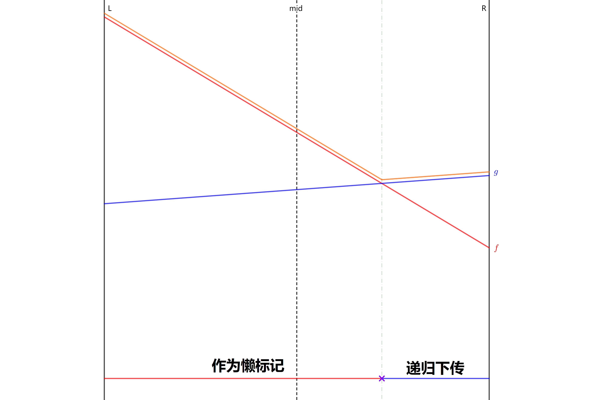
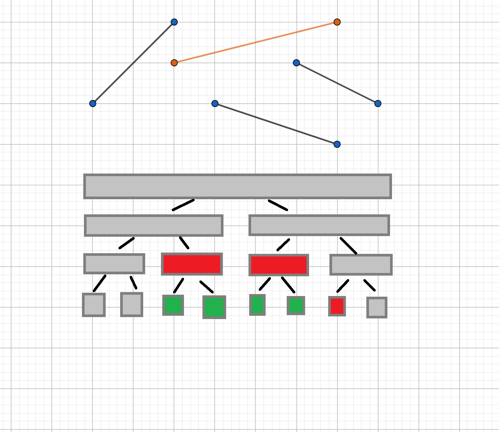

## 引入

???+note "[洛谷 4097 [HEOI2013]Segment](https://www.luogu.com.cn/problem/P4097)"
    要求在平面直角坐标系下维护两个操作（强制在线）：
    
    1. 在平面上加入一条线段。记第 $i$ 条被插入的线段的标号为 $i$，该线段的两个端点分别为 $(x_0,y_0)$，$(x_1,y_1)$。
    2. 给定一个数 $k$，询问与直线 $x = k$ 相交的线段中，交点纵坐标最大的线段的编号（若有多条线段与查询直线的交点纵坐标都是最大的，则输出编号最小的线段）。特别地，若不存在线段与给定直线相交，输出 $0$。
    
    数据满足：操作总数 $1 \leq n \leq 10^5$，$1 \leq k, x_0, x_1 \leq 39989$，$1 \leq y_0, y_1 \leq 10^9$。

我们发现，传统的线段树无法很好地维护这样的信息。这种情况下，**李超线段树** 便应运而生。

## 李超线段树

我们可以把任务转化为维护如下操作：

- 加入一个一次函数，定义域为 $[l,r]$；
- 给定 $k$，求定义域包含 $k$ 的所有一次函数中，在 $x=k$ 处取值最大的那个，如果有多个函数取值相同，选编号最小的。

???+warning "注意"
    当线段垂直于 $y$ 轴时，会出现除以零的情况。假设线段两端点分别为 $(x,y_0)$ 和 $(x,y_1)$，$y_0<y_1$，则插入定义域为 $[x,x]$ 的一次函数 $f(x)=0\cdot x+y_1$。

看到区间修改，我们按照线段树解决区间问题的常见方法，给每个节点一个懒标记。每个节点 $i$ 的懒标记都是一条线段，记为 $l_i$，表示要用 $l_i$ 更新该节点所表示的整个区间。

现在我们需要插入一条线段 $f$，考虑某个被新线段 $f$ 完整覆盖的线段树区间。若该区间无标记，直接打上用该线段更新的标记。

如果该区间已经有标记了，由于标记难以合并，只能把标记下传。但是子节点也有自己的标记，也可能产生冲突，所以我们要递归下传标记。



如图，按新线段 $f$ 取值是否大于原标记 $g$，我们可以把当前区间分为两个子区间。其中 **肯定有一个子区间被左区间或右区间完全包含**，也就是说，在两条线段中，肯定有一条线段，只可能成为左区间的答案，或者只可能成为右区间的答案。我们用这条线段递归更新对应子树，用另一条线段作为懒标记更新整个区间，这就保证了递归下传的复杂度。当一条线段只可能成为左或右区间的答案时，才会被下传，所以不用担心漏掉某些线段。

具体来说，设当前区间的中点为 $m$，我们拿新线段 $f$ 在中点处的值与原最优线段 $g$ 在中点处的值作比较。

如果新线段 $f$ 更优，则将 $f$ 和 $g$ 交换。那么现在考虑在中点处 $f$ 不如 $g$ 优的情况：

1. 若在左端点处 $f$ 更优，那么 $f$ 和 $g$ 必然在左半区间中产生了交点，$f$ 只有在左区间才可能优于 $g$，递归到左儿子中进行下传；
2. 若在右端点处 $f$ 更优，那么 $f$ 和 $g$ 必然在右半区间中产生了交点，$f$ 只有在右区间才可能优于 $g$，递归到右儿子中进行插入；
3. 若在左右端点处 $g$ 都更优，那么 $f$ 不可能成为答案，不需要继续下传。

最后将 $g$ 作为当前区间的懒标记。

下传标记：

```cpp
const double eps = 1e-9;

int cmp(double x, double y) {  // 因为用到了浮点数，所以会有精度误差
  if (x - y > eps) return 1;
  if (y - x > eps) return -1;
  return 0;
}

//...

void upd(int root, int cl, int cr, int u) {  // 对线段完全覆盖到的区间进行修改
  int &v = s[root], mid = (cl + cr) >> 1;
  if (cmp(calc(u, mid), calc(v, mid)) == 1) swap(u, v);
  int bl = cmp(calc(u, cl), calc(v, cl)), br = cmp(calc(u, cr), calc(v, cr));
  if (bl == 1 || (!bl && u < v))  // 在此题中记得判线段编号
    upd(root << 1, cl, mid, u);
  if (br == 1 || (!br && u < v)) upd(root << 1 | 1, mid + 1, cr, u);
  // 上面两个 if 的条件最多只有一个成立，这保证了李超树的时间复杂度
}
```

拆分线段：

```cpp
void update(int root, int cl, int cr, int l, int r,
            int u) {  // 定位插入线段完全覆盖到的区间
  if (l <= cl && cr <= r) {
    upd(root, cl, cr, u);  // 完全覆盖当前区间，更新当前区间的标记
    return;
  }
  int mid = (cl + cr) >> 1;
  if (l <= mid) update(root << 1, cl, mid, l, r, u);  // 递归拆分区间
  if (mid < r) update(root << 1 | 1, mid + 1, cr, l, r, u);
}
```

注意懒标记并不等价于在区间中点处取值最大的线段。



如图，加入黄色线段后，只有红色节点的标记被更新，而绿色节点的标记还未被改变。但在第二、三、四个绿色区间的中点处显然黄色线段取值最大。

查询时，我们可以利用标记永久化思想，在包含 $x$ 的所有线段树区间（不超过 $O(\log n)$ 个）的标记线段中，比较得出最终答案。

查询：

```cpp
pdi query(int root, int l, int r, int d) {  // 查询
  if (r < d || d < l) return {0, 0};
  int mid = (l + r) >> 1;
  double res = calc(s[root], d);
  if (l == r) return {res, s[root]};
  return pmax({res, s[root]}, pmax(query(root << 1, l, mid, d),
                                   query(root << 1 | 1, mid + 1, r, d)));
}
```

根据上面的描述，查询过程的时间复杂度显然为 $O(\log n)$，而插入过程中，我们需要将原线段拆分到 $O(\log n)$ 个区间中，对于每个区间，我们又需要花费 $O(\log n)$ 的时间递归下传，从而插入过程的时间复杂度为 $O(\log^2 n)$。

??? note "[[HEOI2013]Segment](https://www.luogu.com.cn/problem/P4097) 参考代码"
    ```cpp
    --8<-- "docs/ds/code/li-chao-tree/li-chao-tree_1.cpp"
    ```
