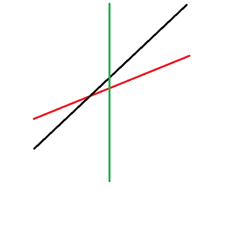
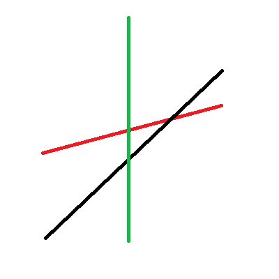
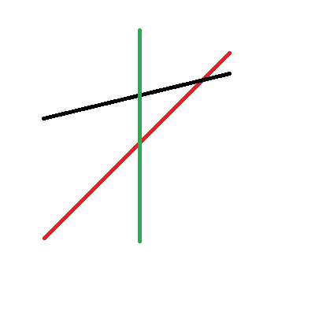
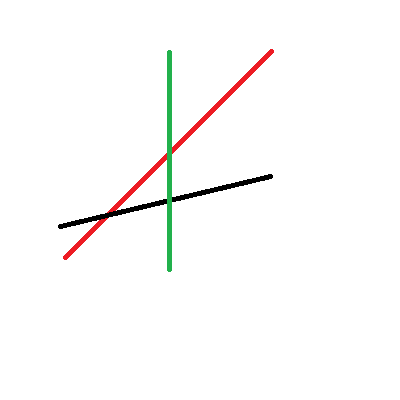

## 引入

???+note "洛谷 4097 [HEOI2013]Segment"
    要求在平面直角坐标系下维护两个操作（强制在线）：

    1. 在平面上加入一条线段。记第 $i$ 条被插入的线段的标号为 $i$，该线段的两个端点分别为 $(x_0,y_0)$，$(x_1,y_1)$。
    2. 给定一个数 $k$，询问与直线 $x = k$ 相交的线段中，交点纵坐标最大的线段的编号（若有多条线段与查询直线的交点纵坐标都是最大的，则输出编号最小的线段）。特别地，若不存在线段与给定直线相交，输出 $0$。

    数据满足：操作总数 $1 \leq n \leq 10^5$，$1 \leq k, x_0, x_1 \leq 39989$，$1 \leq y_0, y_1 \leq 10^9$。

我们发现，传统的线段树无法很好地维护这样的信息。这种情况下， **李超线段树** 便应运而生。

## 概述

我们设法维护每个区间中，可能成为最优解的线段。

称一条线段在 $x=x_0$ 处最优，当且仅当该线段在 $x_0$ 处取值最大。

称一条线段能成为区间 $[l,r]$ 中的 **最优线段** ，当且仅当：

1. 该线段的定义域完整覆盖了区间 $[l,r]$ ；
2. 该线段在区间中点处最优。

现在我们需要插入一条线段，在这条线段完整覆盖的区间中，某些区间的最优线段可能发生改变。

考虑某个被新线段完整覆盖的区间，若该区间无最优线段，则该线段可以直接成为最优线段。

否则，设该区间的中点为 $mid$ ，我们拿新线段在中点处的值与原最优线段在中点处的值作比较。

首先，如果新线段斜率大于原线段，

1. 如果新线段在 $mid$ 处更优，则新线段在右半区间 **一定** 最优，旧线段在左半区间 **可能** 最优；
2. 反之，旧线段在左半区间 **一定** 最优，新线段在右半区间 **可能** 最优。

结合图片理解一下（红色线段代表原来的最优线段，黑色线段代表新插入的线段，绿色直线则代表 $x=mid$ 这条直线）：





接下来考虑新线段斜率小于原线段的情况，

1. 如果新线段在 $mid$ 处更优，则新线段在左半区间 **一定** 最优，旧线段在右半区间 **可能** 最优；
2. 反之，旧线段在右半区间 **一定** 最优，新线段在左半区间 **可能** 最优。

再来两张图：





最后考虑新线段和旧线段斜率相同的情况，此时只需比较截距即可，截距大的一定在整个区间内更优。

确定完当前区间的最优线段后，我们需要递归进入子区间，更新最优线段可能改变的区间。

这样的过程与一般线段树的递归过程类似，因此我们可以使用线段树来维护。

现在考虑如何查询一个区间的最优线段。

查询过程利用了标记永久化的思想，简单地说，我们将所有包含 $x_0$ 区间（易知这样的区间只有 $O(\log n)$ 个）的最优线段拿出来，在这些线段中比较，从而得出最优线段。

根据上面的描述，查询过程的时间复杂度显然为 $O(\log n)$ ，而插入过程中，我们需要将原线段分割到 $O(\log n)$ 个区间中，对于每个区间，我们又需要花费 $O(\log n)$ 的时间更新该区间以及其子区间的最优线段，从而插入过程的时间复杂度为 $O(\log^2 n)$ 。

??? note "[HEOI2013]Segment 参考代码"
    ```cpp
    #include <iostream>
    #include <string>
    #define MOD1 39989
    #define MOD2 1000000000
    #define MAXT 40000
    using namespace std;
    typedef pair<double, int> pdi;
    struct line {
      double k, b;
    } p[100005];
    int s[160005];
    int cnt;
    double calc(int id, int d) { return p[id].b + p[id].k * d; }
    void add(int x0, int y0, int x1, int y1) {
      cnt++;
      if (x0 == x1)  // 特判直线斜率不存在的情况
        p[cnt].k = 0, p[cnt].b = max(y0, y1);
      else
        p[cnt].k = 1.0 * (y1 - y0) / (x1 - x0), p[cnt].b = y0 - p[cnt].k * x0;
    }
    void update(int root, int cl, int cr, int l, int r, int u) {
      int v = s[root], mid = (cl + cr) >> 1;
      int ls = root << 1, rs = root << 1 | 1;
      double resu = calc(u, mid), resv = calc(v, mid);
      if (r < cl || cr < l) return;
      if (l <= cl && cr <= r) {
        if (cl == cr) {
          if (resu > resv) s[root] = u;
          return;
        }
        if (p[v].k < p[u].k) {
          if (resu > resv) {
            s[root] = u;
            update(ls, cl, mid, l, r, v);
          } else
            update(rs, mid + 1, cr, l, r, u);
        } else if (p[v].k > p[u].k) {
          if (resu > resv) {
            s[root] = u;
            update(rs, mid + 1, cr, l, r, v);
          } else
            update(ls, cl, mid, l, r, u);
        } else {
          if (p[u].b > p[v].b) s[root] = u;
        }
        return;
      }
      update(ls, cl, mid, l, r, u);
      update(rs, mid + 1, cr, l, r, u);
    }
    pdi pmax(pdi x, pdi y) {
      if (x.first < y.first)
        return y;
      else if (x.first > y.first)
        return x;
      else
        return x.second < y.second ? x : y;
    }
    pdi query(int root, int l, int r, int d) {
      if (r < d || d < l) return {0, 0};
      int mid = (l + r) >> 1;
      double res = calc(s[root], d);
      if (l == r) return {res, s[root]};
      return pmax({res, s[root]}, pmax(query(root << 1, l, mid, d),
                                       query(root << 1 | 1, mid + 1, r, d)));
    }
    int main() {
      ios::sync_with_stdio(false);
      int n, lastans = 0;
      cin >> n;
      while (n--) {
        int op;
        cin >> op;
        if (op == 1) {
          int x0, y0, x1, y1;
          cin >> x0 >> y0 >> x1 >> y1;
          x0 = (x0 + lastans - 1 + MOD1) % MOD1 + 1,
          x1 = (x1 + lastans - 1 + MOD1) % MOD1 + 1;
          y0 = (y0 + lastans - 1 + MOD2) % MOD2 + 1,
          y1 = (y1 + lastans - 1 + MOD2) % MOD2 + 1;
          if (x0 > x1) swap(x0, x1), swap(y0, y1);
          add(x0, y0, x1, y1);
          update(1, 1, MOD1, x0, x1, cnt);
        } else {
          int x;
          cin >> x;
          x = (x + lastans - 1 + MOD1) % MOD1 + 1;
          cout << (lastans = query(1, 1, MOD1, x).second) << endl;
        }
      }
      return 0;
    }
    ```
