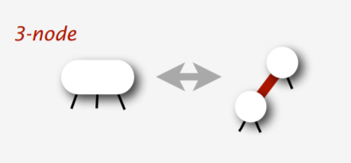
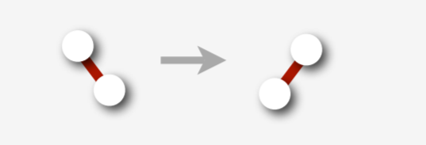

左偏红黑树是红黑树的一种变体，它的对红边（点）的位置做了一定限制，使得其插入与删除操作可以与 2-3-4 树构成一一对应。

我们假设读者已经至少掌握了一种基于旋转的平衡树，因此本文不会对旋转操作进行讲解。

## 红黑树

### 性质

一棵红黑树满足如下性质：

1.  节点是红色或黑色；
2.  红色的节点的所有儿子的颜色必须是黑色，即从每个叶子到根的所有路径上不能有两个连续的红色节点；
3.  从任一节点到其子树中的每个叶子的所有简单路径上都包含相同数目的黑色节点。（黑高平衡）

这保证了从根节点到任意叶子的最长路径（红黑交替）不会超过最短路径（全黑）的二倍。从而保证了树的平衡性。

维护这些性质是比较复杂的，如果我们要插入一个节点，首先，它一定会被染色成红色，否则会破坏性质 3。即使这样，我们还是有可能会破坏性质 2。因此需要进行调整。而删除节点就更加麻烦，与插入类似，我们不能删除黑色节点，否则会破坏黑高的平衡。如何方便地解决这些问题呢？

## 左偏红黑树（Left Leaning Red Black Tree）

左偏红黑树是一种容易实现的红黑树变体。

与普通的红黑树不同的是，在左偏红黑树中，是边具有颜色而不是节点具有颜色。我们习惯用一个节点的颜色代指它的父亲边的颜色。

左偏红黑树对红黑树进行了进一步限制，一个黑色节点的左右儿子：

-   要么全是黑色；
-   要么左儿子是红色，右儿子是黑色。

符合条件的情况：



不符合条件的情况：


这是左偏树的「左偏」性质：红色边只能是左偏的。

### 插入

我们首先使用普通的 BST 插入方法，在树的底部插入一个红色的叶子节点，然后通过从下向上的调整，使得插入后的树仍然符合左偏红黑树的性质。下面描述调整的过程：


插入后，可能会产生一条右偏的红色边，因此需要对红边右偏的情况进行一次左旋：



考虑左旋后会产生两条连续的左偏红色边：


因此需要把它进行一次右旋。而对于右旋后的情况，我们应该对它进行 `color_filp` ：即翻转该节点和它的两个儿子的颜色


从而消灭右偏的红边。

??? note "参考代码（部分）"
    ```cpp
    template <class Key, class Compare>
    typename Set<Key, Compare>::Node *Set<Key, Compare>::fix_up(
        Set::Node *root) const {
      if (is_red(root->rc) && !is_red(root->lc))  // fix right leaned red link
        root = rotate_left(root);
      if (is_red(root->lc) &&
          is_red(root->lc->lc))  // fix doubly linked left leaned red link
        // if (root->lc == nullptr), then the second expr won't be evaluated
        root = rotate_right(root);
      if (is_red(root->lc) && is_red(root->rc))
        // break up 4 node
        color_flip(root);
      root->size = size(root->lc) + size(root->rc) + 1;
      return root;
    }
    
    template <class Key, class Compare>
    typename Set<Key, Compare>::Node_Set<Key, Compare>::insert(
        Set::Node_root, const Key &key) const {
      if (root == nullptr) return new Node(key, kRed, 1);
      if (root->key == key)
        ;
      else if (cmp\_(key, root->key))  // if (key < root->key)
        root->lc = insert(root->lc, key);
      else
        root->rc = insert(root->rc, key);
      return fix_up(root);
    }
    ```

### 删除

删除操作基于这样的思想：我们不能删除黑色的节点，因为这样会破坏黑高。所以我们需要保证我们最后删除的节点是红色的。

#### 删除最小值节点

首先来试一下删除整棵树里的最小值。

怎么才能保证最后删除的节点是红色的呢？我们需要在向下递归的过程中保证一个性质：如果当前节点是 `h` ，那么需要保证 `h` 是红色，或者 `h->lc` 是红色。

考虑这样做的正确性，如果我们能够通过各种旋转和反转颜色操作成功维护这个性质，那么当我们到达最小的节点 `h_min` 的时候，有 `h_min` 是红色，或者 `h_min` 的左子树——但是 `h_min` 根本没有左子树！所以这就保证了最小值节点一定是红的，既然它是红色的，我们就可以大胆的删除它，然后用与插入操作相同的调整思路对树进行调整。

下面我们来考虑怎么满足这个性质，注意，我们会在向下递归的时候 **临时地** 破坏左偏红黑树的若干性质，但是当我们从递归中返回时还会将其恢复。


下图描述一种简单的情况，我们只需要一次翻转颜色即可。

但如果 `h->rc->lc` 是红色，情况会比较复杂：


如果只进行翻转颜色，会产生连续的红边，而考虑我们递归返回的时候，是无法修复这样的情况的，因此需要进行处理。

然后就可以进行删除了：

??? note "参考代码（部分）"
    ```cpp
    template <class Key, class Compare>
    typename Set<Key, Compare>::Node *Set<Key, Compare>::move_red_left(
        Set::Node *root) const {
      color_flip(root);
      if (is_red(root->rc->lc)) {
        // assume that root->rc != nullptr when calling this function
        root->rc = rotate_right(root->rc);
        root = rotate_left(root);
        color_flip(root);
      }
      return root;
    }
    template <class Key, class Compare>
    typename Set<Key, Compare>::Node *Set<Key, Compare>::delete_min(
        Set::Node *root) const {
      if (root->lc == nullptr) {
        delete root;
        return nullptr;
      }
      if (!is_red(root->lc) && !is_red(root->lc->lc)) {
        // make sure either root->lc or root->lc->lc is red
        // thus make sure we will delete a red node in the end
        root = move_red_left(root);
      }
      root->lc = delete_min(root->lc);
      return fix_up(root);
    }
    ```

#### 删除任意节点

我们首先考虑删除叶子：与删最小值类似，我们在删除任意值的过程中也要维护一个性质，不过这次比较特殊，因为我们不是只向左边走，而是可以向左右两个方向走，因此在删除过程中维护的性质是这样的：如果往左走，当前节点是 `h` ，那么需要保证 `h` 是红色，或者 `h->lc` 是红色；如果往右走，当前节点是 `h` ，那么需要保证 `h` 是红色，或者 `h->rc` 是红色。这样可以保证我们最后总会删掉一个红色节点。

下面考虑删除非叶子节点，我们只需要找到其右子树（如果有）里的最小节点，然后用右子树的最小节点的值代替该节点的值，最后删除右子树里的最小节点。


那如果没有右子树怎么办？我们需要把左子树旋转过来，这样就不会出现这个问题了。

??? note "参考代码（部分）"
    ```cpp
    template <class Key, class Compare>
    typename Set<Key, Compare>::Node *Set<Key, Compare>::delete_arbitrary(
        Set::Node *root, Key key) const {
      if (cmp_(key, root->key)) {
        // key < root->key
        if (!is_red(root->lc) && !(is_red(root->lc->lc)))
          root = move_red_left(root);
        // ensure the invariant: either root->lc or root->lc->lc (or root and
        // root->lc after dive into the function) is red, to ensure we will
        // eventually delete a red node. therefore we will not break the black
        // height balance
        root->lc = delete_arbitrary(root->lc, key);
      } else {
        // key >= root->key
        if (is_red(root->lc)) root = rotate_right(root);
        if (key == root->key && root->rc == nullptr) {
          delete root;
          return nullptr;
        }
        if (!is_red(root->rc) && !is_red(root->rc->lc)) root = move_red_right(root);
        if (key == root->key) {
          root->key = get_min(root->rc);
          root->rc = delete_min(root->rc);
        } else {
          root->rc = delete_arbitrary(root->rc, key);
        }
      }
      return fix_up(root);
    }
    ```

## 参考代码

下面的代码是用左偏红黑树实现的 `Set` ，即有序不可重集合：

??? note "参考代码"
    ```cpp
    #include <algorithm>
    #include <memory>
    #include <vector>
    template <class Key, class Compare = std::less<Key>>
    class Set {
     private:
      enum NodeColor { kBlack = 0, kRed = 1 };
    
      struct Node {
        Key key;
        Node *lc{nullptr}, *rc{nullptr};
        size_t size{0};
        NodeColor color;  // the color of the parent link
    
        Node(Key key, NodeColor color, size_t size)
            : key(key), color(color), size(size) {}
    
        Node() = default;
      };
    
      void destroyTree(Node *root) const {
        if (root != nullptr) {
          destroyTree(root->lc);
          destroyTree(root->rc);
          root->lc = root->rc = nullptr;
          delete root;
        }
      }
    
      bool is_red(const Node *nd) const {
        return nd == nullptr ? false : nd->color;  // kRed == 1, kBlack == 0
      }
    
      size_t size(const Node *nd) const { return nd == nullptr ? 0 : nd->size; }
    
      Node *rotate_left(Node *node) const {
        // left rotate a red link
        //          <1>                   <2>
        //        /    \\               //    \
        //       *      <2>    ==>     <1>     *
        //             /   \          /   \
        //            *     *        *     *
        Node *res = node->rc;
        node->rc = res->lc;
        res->lc = node;
        res->color = node->color;
        node->color = kRed;
        res->size = node->size;
        node->size = size(node->lc) + size(node->rc) + 1;
        return res;
      }
    
      Node *rotate_right(Node *node) const {
        // right rotate a red link
        //            <1>               <2>
        //          //    \           /    \\
        //         <2>     *   ==>   *      <1>
        //        /   \                    /   \
        //       *     *                  *     *
        Node *res = node->lc;
        node->lc = res->rc;
        res->rc = node;
        res->color = node->color;
        node->color = kRed;
        res->size = node->size;
        node->size = size(node->lc) + size(node->rc) + 1;
        return res;
      }
    
      NodeColor neg_color(NodeColor n) const { return n == kBlack ? kRed : kBlack; }
    
      void color_flip(Node *node) const {
        node->color = neg_color(node->color);
        node->lc->color = neg_color(node->lc->color);
        node->rc->color = neg_color(node->rc->color);
      }
    
      Node *insert(Node *root, const Key &key) const;
      Node *delete_arbitrary(Node *root, Key key) const;
      Node *delete_min(Node *root) const;
      Node *move_red_right(Node *root) const;
      Node *move_red_left(Node *root) const;
      Node *fix_up(Node *root) const;
      const Key &get_min(Node *root) const;
      void serialize(Node *root, std::vector<Key> *) const;
      void print_tree(Set::Node *root, int indent) const;
      Compare cmp_ = Compare();
      Node *root_{nullptr};
    
     public:
      typedef Key KeyType;
      typedef Key ValueType;
      typedef std::size_t SizeType;
      typedef std::ptrdiff_t DifferenceType;
      typedef Compare KeyCompare;
      typedef Compare ValueCompare;
      typedef Key &Reference;
      typedef const Key &ConstReference;
    
      Set() = default;
    
      Set(Set &) = default;
    
      Set(Set &&) noexcept = default;
    
      ~Set() { destroyTree(root_); }
    
      SizeType size() const;
    
      SizeType count(const KeyType &key) const;
    
      SizeType erase(const KeyType &key);
    
      void clear();
    
      void insert(const KeyType &key);
    
      bool empty() const;
    
      std::vector<Key> serialize() const;
    
      void print_tree() const;
    };
    
    template <class Key, class Compare>
    typename Set<Key, Compare>::SizeType Set<Key, Compare>::count(
        ConstReference key) const {
      Node *x = root_;
      while (x != nullptr) {
        if (key == x->key) return 1;
        if (cmp_(key, x->key))  // if (key < x->key)
          x = x->lc;
        else
          x = x->rc;
      }
      return 0;
    }
    
    template <class Key, class Compare>
    typename Set<Key, Compare>::SizeType Set<Key, Compare>::erase(
        const KeyType &key) {
      if (count(key) > 0) {
        if (!is_red(root_->lc) && !(is_red(root_->rc))) root_->color = kRed;
        root_ = delete_arbitrary(root_, key);
        if (root_ != nullptr) root_->color = kBlack;
        return 1;
      } else {
        return 0;
      }
    }
    
    template <class Key, class Compare>
    void Set<Key, Compare>::clear() {
      destroyTree(root_);
      root_ = nullptr;
    }
    
    template <class Key, class Compare>
    void Set<Key, Compare>::insert(const KeyType &key) {
      root_ = insert(root_, key);
      root_->color = kBlack;
    }
    
    template <class Key, class Compare>
    bool Set<Key, Compare>::empty() const {
      return size(root_) == 0;
    }
    
    template <class Key, class Compare>
    typename Set<Key, Compare>::Node *Set<Key, Compare>::insert(
        Set::Node *root, const Key &key) const {
      if (root == nullptr) return new Node(key, kRed, 1);
      if (root->key == key)
        ;
      else if (cmp_(key, root->key))  // if (key < root->key)
        root->lc = insert(root->lc, key);
      else
        root->rc = insert(root->rc, key);
      return fix_up(root);
    }
    
    template <class Key, class Compare>
    typename Set<Key, Compare>::Node *Set<Key, Compare>::delete_min(
        Set::Node *root) const {
      if (root->lc == nullptr) {
        delete root;
        return nullptr;
      }
      if (!is_red(root->lc) && !is_red(root->lc->lc)) {
        // make sure either root->lc or root->lc->lc is red
        // thus make sure we will delete a red node in the end
        root = move_red_left(root);
      }
      root->lc = delete_min(root->lc);
      return fix_up(root);
    }
    
    template <class Key, class Compare>
    typename Set<Key, Compare>::Node *Set<Key, Compare>::move_red_right(
        Set::Node *root) const {
      color_flip(root);
      if (is_red(root->lc->lc)) {  // assume that root->lc != nullptr when calling
                                   // this function
        root = rotate_right(root);
        color_flip(root);
      }
      return root;
    }
    
    template <class Key, class Compare>
    typename Set<Key, Compare>::Node *Set<Key, Compare>::move_red_left(
        Set::Node *root) const {
      color_flip(root);
      if (is_red(root->rc->lc)) {
        // assume that root->rc != nullptr when calling this function
        root->rc = rotate_right(root->rc);
        root = rotate_left(root);
        color_flip(root);
      }
      return root;
    }
    
    template <class Key, class Compare>
    typename Set<Key, Compare>::Node *Set<Key, Compare>::fix_up(
        Set::Node *root) const {
      if (is_red(root->rc) && !is_red(root->lc))  // fix right leaned red link
        root = rotate_left(root);
      if (is_red(root->lc) &&
          is_red(root->lc->lc))  // fix doubly linked left leaned red link
        // if (root->lc == nullptr), then the second expr won't be evaluated
        root = rotate_right(root);
      if (is_red(root->lc) && is_red(root->rc))
        // break up 4 node
        color_flip(root);
      root->size = size(root->lc) + size(root->rc) + 1;
      return root;
    }
    
    template <class Key, class Compare>
    const Key &Set<Key, Compare>::get_min(Set::Node *root) const {
      Node *x = root;
      // will crash as intended when root == nullptr
      for (; x->lc != nullptr; x = x->lc)
        ;
      return x->key;
    }
    
    template <class Key, class Compare>
    typename Set<Key, Compare>::SizeType Set<Key, Compare>::size() const {
      return size(root_);
    }
    
    template <class Key, class Compare>
    typename Set<Key, Compare>::Node *Set<Key, Compare>::delete_arbitrary(
        Set::Node *root, Key key) const {
      if (cmp_(key, root->key)) {
        // key < root->key
        if (!is_red(root->lc) && !(is_red(root->lc->lc)))
          root = move_red_left(root);
        // ensure the invariant: either root->lc or root->lc->lc (or root and
        // root->lc after dive into the function) is red, to ensure we will
        // eventually delete a red node. therefore we will not break the black
        // height balance
        root->lc = delete_arbitrary(root->lc, key);
      } else {
        // key >= root->key
        if (is_red(root->lc)) root = rotate_right(root);
        if (key == root->key && root->rc == nullptr) {
          delete root;
          return nullptr;
        }
        if (!is_red(root->rc) && !is_red(root->rc->lc)) root = move_red_right(root);
        if (key == root->key) {
          root->key = get_min(root->rc);
          root->rc = delete_min(root->rc);
        } else {
          root->rc = delete_arbitrary(root->rc, key);
        }
      }
      return fix_up(root);
    }
    
    template <class Key, class Compare>
    std::vector<Key> Set<Key, Compare>::serialize() const {
      std::vector<int> v;
      serialize(root_, &v);
      return v;
    }
    
    template <class Key, class Compare>
    void Set<Key, Compare>::serialize(Set::Node *root,
                                      std::vector<Key> *res) const {
      if (root == nullptr) return;
      serialize(root->lc, res);
      res->push_back(root->key);
      serialize(root->rc, res);
    }
    
    template <class Key, class Compare>
    void Set<Key, Compare>::print_tree(Set::Node *root, int indent) const {
      if (root == nullptr) return;
      print_tree(root->lc, indent + 4);
      std::cout << std::string(indent, '-') << root->key << std::endl;
      print_tree(root->rc, indent + 4);
    }
    
    template <class Key, class Compare>
    void Set<Key, Compare>::print_tree() const {
      print_tree(root_, 0);
    }
    ```

## 参考资料与拓展阅读

-    [Left-Leaning Red-Black Trees](https://www.cs.princeton.edu/~rs/talks/LLRB/RedBlack.pdf) -  Robert Sedgewick Princeton University
-    [Balanced Search Trees](https://algs4.cs.princeton.edu/lectures/33BalancedSearchTrees-2x2.pdf) -\_Algorithms_Robert Sedgewick | Kevin Wayne
