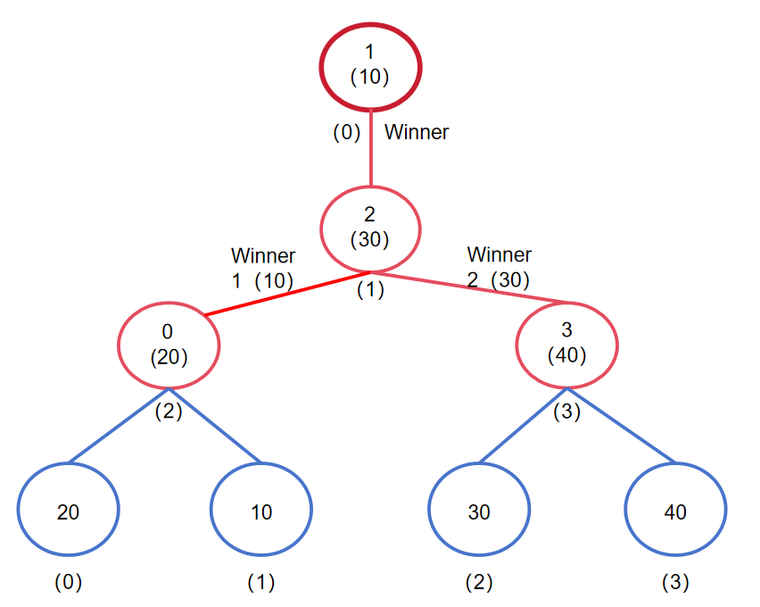
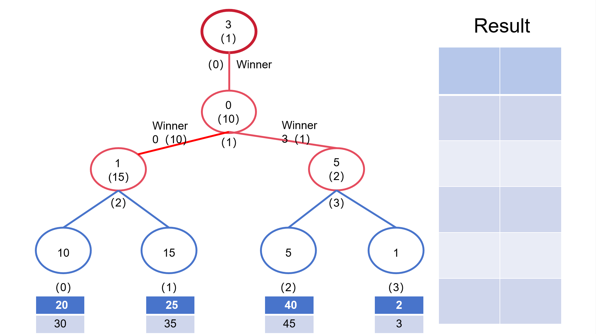

本页面将介绍败者树，一种用于多路归并排序的高效数据结构。

## 引入

败者树是一种高效的完全二叉树结构，主要用于处理多路归并排序问题。通过使用每个非叶子节（内部节点）存储一轮比较中的**败者**，而允许**胜者**推进到下一轮比赛。败者树能够迅速确定多个排序序列中的最小（或最大）元素，适合在序列更新频繁的情况下进行高效调整。

## 结构

- **叶子节点**：代表各个输入序列的当前元素，直接关联到数据流的输出。
- **内部节点**：记录两个子节点比较后的败者索引，即较小（或较大）元素的索引。
- **根节点**：表示所有叶子节点比较后的胜者，即当前所有输入序列中的最小（或最大）元素的索引。

假设败者为两个元素中较小的元素，输入序列为`{20, 10, 30, 40}`，则败者树的结构如下：



如上图所示，败者树的结构包括以下几个部分：

1. 败者树的叶子节点存储输入序列的当前元素，即索引为0的元素20、索引为1的元素10、索引为2的元素30以及索引为3的元素40。
2. 败者树的内部节点存储叶子节点中的败者信息，保存每一轮败者的索引，如节点（2）中存储叶子节点（0）和（1）中的败者（0）。
3. 根节点（0）存储了所有比较中的胜者，即当前所有输入序列中的最小元素的索引 1。

## 过程

败者树的操作主要包括初始化、构建和调整。

### 初始化

败者树初始化时，将每个叶子节点设置为输入序列的首元素，内部节点则初始化为一个特殊值（如最大值或 `-1`）。这使得在初次构建树时可以方便地进行比较和败者的确定，从而快速形成初始化的败者树结构。

### 构建

构建败者树涉及通过比较叶子节点中的元素以确定败者，并递归地将败者信息存储至内部节点。从最底层叶子节点开始，逐步向上比较，直至根节点，形成一个完整的败者树。

根节点始终代表当前所有输入序列中的最小（或最大）元素的索引，每当树中的数据发生变化时，都需要通过调整操作来更新树的结构，从而确保根节点始终反映出当前的最小（或最大）元素。

### 调整

当叶节点的元素被消费后（如输出到结果数组），并由其序列中的下一个元素替换时，树需要调整来更新其结构。从该叶节点开始，向上逐级调整，确保每一步都重新计算败者信息，以保持树的正确性。

以下是一个简单的调整函数示例，用于阐明败者树如何更新其内部节点以维持整体数据的一致性：

???+ note "示例代码"
    ```cpp
    void adjust(int index)
    {
        int parent = (index + size) / 2;  // 计算从叶节点到其父节点的索引
        while (parent > 0) {
        // 比较当前节点和父节点的值，选择较小的节点作为胜者，将败者信息存储到父节点
        if (segments[index].empty() || segments[index].front() > segments[tree[parent]].front()) {
            std::swap(index, tree[parent]);
        }
        // 继续向上调整
        parent /= 2;
        }
        // 更新根节点
        tree[0] = index;
    }
    ```

通过这样的机制，败者树能够有效地支持复杂的多路归并排序算法，特别适用于处理大量数据的合并场景，如外部排序和流数据处理。

### 时间复杂度

败者树是一种特殊的完全二叉树，因此N个节点的败者树的高度为log(N)，败者树的节点数为2N-1，因此构建败者树的时间复杂度为O(N)。

在调整败者树时，由于只需更新和比较对应叶子节点的路径上的节点，无需比较兄弟节点，因此在最坏情况下，单次调整败者树的时间复杂度为O(log(N))。

## 应用和示例

败者树广泛应用于多路归并排序、外部排序和流数据处理，特别是在需要从多个数据源中持续合并数据时。其优势在于：

- **高效性**：能够迅速确定多个输入序列中的最小（或最大）元素，显著提高排序效率。
- **快速更新**：在输入序列发生变化时，能够进行快速调整，实时反映最新状态。
- **易扩展性**：结构简单，易于实现和扩展，适合处理大量数据。

以下是一个简单的败者树示例，用于合并多个有序序列：

假设有四个输入序列，分别为`{10, 20, 30}`、`{15, 25, 35}`、`{5, 40, 45}`和`{1, 2, 3}`。我们可以使用败者树来合并这些序列，并输出排序后的结果，以下是一个简单的演示动画。



如图所示，通过每一次的败者树的调整和输出，我们可以逐步合并多个有序序列，并输出排序后的结果，直到源序列全部合并完成。

## 实现

??? note "参考代码"
    ```cpp
    --8<-- "docs/ds/code/loser-tree/loser-tree_1.cpp"
    ```

