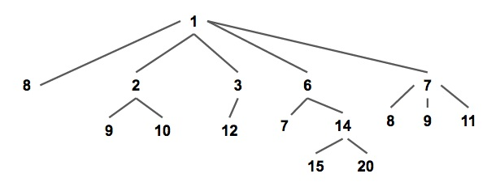
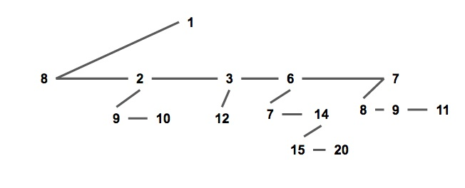
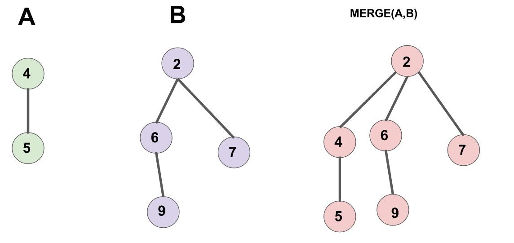
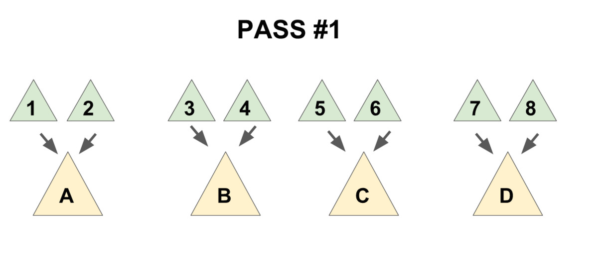

## 引入

配对堆是一个支持插入，查询/删除最小值，合并，修改元素等操作的数据结构，是一种可并堆。有速度快和结构简单的优势，但由于其为基于势能分析的均摊复杂度，无法可持久化。

## 定义

配对堆是一棵满足堆性质的带权多叉树（如下图），即每个节点的权值都小于或等于他的所有儿子（以小根堆为例，下同）。  


通常我们使用儿子 - 兄弟表示法储存一个配对堆（如下图），一个节点的所有儿子节点形成一个单向链表。每个节点储存第一个儿子的指针，即链表的头节点；和他的右兄弟的指针。

这种方式便于实现配对堆，也将方便复杂度分析。



```cpp
struct Node {
  T v;  // T为权值类型
  Node *child, *sibling;
  // child 指向该节点第一个儿子，sibling 指向该节点的下一个兄弟。
  // 若该节点没有儿子/下个兄弟则指针指向 nullptr。
};
```

从定义可以发现，和其他常见的堆结构相比，配对堆不维护任何额外的树大小，深度，排名等信息（二叉堆也不维护额外信息，但它是通过维持一个严格的完全二叉树结构来保证操作的复杂度），且任何一个满足堆性质的树都是一个合法的配对堆，这样简单又高度灵活的数据结构奠定了配对堆在实践中优秀效率的基础；作为对比，斐波那契堆糟糕的常数就是因为它需要维护很多额外的信息。

配对堆通过一套精心设计的操作顺序来保证它的总复杂度，原论文[^ref1]将其称为「一种自调整的堆（Self Adjusting Heap）」。在这方面和 Splay 树（在原论文中被称作「Self Adjusting Binary Tree」）颇有相似之处。

## 过程

### 查询最小值

从配对堆的定义可看出，配对堆的根节点的权值一定最小，直接返回根节点即可。

### 合并

合并两个配对堆的操作很简单，首先令两个根节点较小的一个为新的根节点，然后将较大的根节点作为它的儿子插入进去。（见下图）



需要注意的是，一个节点的儿子链表是按插入时间排序的，即最右边的节点最早成为父节点的儿子，最左边的节点最近成为父节点的儿子。

???+ note "实现"
    ```cpp
    Node* meld(Node* x, Node* y) {
      // 若有一个为空则直接返回另一个
      if (x == nullptr) return y;
      if (y == nullptr) return x;
      if (x->v > y->v) std::swap(x, y);  // swap后x为权值小的堆，y为权值大的堆
      // 将y设为x的儿子
      y->sibling = x->child;
      x->child = y;
      return x;  // 新的根节点为 x
    }
    ```

### 插入

合并都有了，插入就直接把新元素视为一个新的配对堆和原堆合并就行了。

### 删除最小值

首先要提及的一点是，上文的几个操作都十分偷懒，完全没有对数据结构进行维护，所以我们需要小心设计删除最小值的操作，来保证总复杂度不出问题。

根节点即为最小值，所以要删除的是根节点。考虑拿掉根节点之后会发生什么：根节点原来的所有儿子构成了一片森林；而配对堆应当是一棵树，所以我们需要通过某种顺序把这些儿子全部合并起来。

一个很自然的想法是使用 `meld` 函数把儿子们从左到右挨个并在一起，这样做的话正确性是显然的，但是会导致单次操作复杂度退化到 $O(n)$。

为了保证总的均摊复杂度，需要使用一个「两步走」的合并方法：

1.  把儿子们两两配成一对，用 `meld` 操作把被配成同一对的两个儿子合并到一起（见下图 1），
2.  将新产生的堆 **从右往左**（即老的儿子到新的儿子的方向）挨个合并在一起（见下图 2）。




先实现一个辅助函数 `merges`，作用是合并一个节点的所有兄弟。

???+ note "实现"
    ```cpp
    Node* merges(Node* x) {
      if (x == nullptr || x->sibling == nullptr)
        return x;  // 如果该树为空或他没有下一个兄弟，就不需要合并了，return。
      Node* y = x->sibling;                // y 为 x 的下一个兄弟
      Node* c = y->sibling;                // c 是再下一个兄弟
      x->sibling = y->sibling = nullptr;   // 拆散
      return meld(merges(c), meld(x, y));  // 核心部分
    }
    ```

最后一句话是该函数的核心，这句话分三部分：

1.  `meld(x,y)`「配对」了 x 和 y。
2.  `merges(c)` 递归合并 c 和他的兄弟们。
3.  将上面 2 个操作产生的 2 个新树合并。

需要注意到的是，上文提到了第二步时的合并方向是有要求的（从右往左合并），该递归函数的实现已保证了这个顺序，如果读者需要自行实现迭代版本的话请务必注意保证该顺序，否则复杂度将失去保证。

有了 `merges` 函数，`delete-min` 操作就显然了。

???+ note "实现"
    ```cpp
    Node* delete_min(Node* x) {
      Node* t = merges(x->child);
      delete x;  // 如果需要内存回收
      return t;
    }
    ```

### 减小一个元素的值

要实现这个操作，需要给节点添加一个「父」指针，当节点有左兄弟时，其指向左兄弟而非实际的父节点；否则，指向其父节点。

首先节点的定义修改为：

???+ note "实现"
    ```cpp
    struct Node {
      LL v;
      int id;
      Node *child, *sibling;
      Node *father;  // 新增：父指针，若该节点为根节点则指向空节点 nullptr
    };
    ```

`meld` 操作修改为：

???+ note "实现"
    ```cpp
    Node* meld(Node* x, Node* y) {
      if (x == nullptr) return y;
      if (y == nullptr) return x;
      if (x->v > y->v) std::swap(x, y);
      if (x->child != nullptr) {  // 新增：维护父指针
        x->child->father = y;
      }
      y->sibling = x->child;
      y->father = x;  // 新增：维护父指针
      x->child = y;
      return x;
    }
    ```

`merges` 操作修改为：

???+ note "实现"
    ```cpp
    Node *merges(Node *x) {
      if (x == nullptr) return nullptr;
      x->father = nullptr;  // 新增：维护父指针
      if (x->sibling == nullptr) return x;
      Node *y = x->sibling, *c = y->sibling;
      y->father = nullptr;  // 新增：维护父指针
      x->sibling = y->sibling = nullptr;
      return meld(merges(c), meld(x, y));
    }
    ```

现在我们来考虑如何实现 `decrease-key` 操作。  
首先我们发现，当我们减少节点 `x` 的权值之后，以 `x` 为根的子树仍然满足配对堆性质，但 `x` 的父亲和 `x` 之间可能不再满足堆性质。  
因此我们把整棵以 `x` 为根的子树剖出来，现在两棵树都符合配对堆性质了，然后把他们合并起来，就完成了全部操作。

???+ note "实现"
    ```cpp
    // root为堆的根，x为要操作的节点，v为新的权值，调用时需保证 v <= x->v
    // 返回值为新的根节点
    Node *decrease_key(Node *root, Node *x, LL v) {
      x->v = v;                 // 更新权值
      if (x == root) return x;  // 如果 x 为根，则直接返回
      // 把x从fa的子节点中剖出去，这里要分x的位置讨论一下。
      if (x->father->child == x) {
        x->father->child = x->sibling;
      } else {
        x->father->sibling = x->sibling;
      }
      if (x->sibling != nullptr) {
        x->sibling->father = x->father;
      }
      x->sibling = nullptr;
      x->father = nullptr;
      return meld(root, x);  // 重新合并 x 和根节点
    }
    ```

## 复杂度分析

配对堆结构与实现简单，但时间复杂度分析并不容易。

原论文[^ref1]仅将复杂度分析到 `meld` 和 `delete-min` 操作均为均摊 $O(\log n)$，但提出猜想认为其各操作都有和斐波那契堆相同的复杂度。

遗憾的是，后续发现，不维护额外信息的配对堆，在特定的操作序列下，`decrease-key` 操作的均摊复杂度下界至少为 $\Omega (\log \log n)$[^ref2]。

目前对复杂度上界比较好的估计有，Iacono 的 $O(1)$ `meld`，$O(\log n)$ `decrease-key`[^ref3]；Pettie 的 $O(2^{2 \sqrt{\log \log n}})$ `meld` 和 `decrease-key`[^ref4]。需要注意的是，前述复杂度均为均摊复杂度，因此不能对各结果分别取最小值。

## 参考文献

[^ref1]: [The pairing heap: a new form of self-adjusting heap](http://www.cs.cmu.edu/~sleator/papers/pairing-heaps.pdf)

[^ref2]: [On the efficiency of pairing heaps and related data structures](https://dl.acm.org/doi/10.1145/320211.320214)

[^ref3]: [Improved upper bounds for pairing heaps](https://arxiv.org/abs/1110.4428)

[^ref4]: [Towards a Final Analysis of Pairing Heaps](http://web.eecs.umich.edu/~pettie/papers/focs05.pdf)

-   <https://en.wikipedia.org/wiki/Pairing_heap>
-   <https://brilliant.org/wiki/pairing-heap/>
