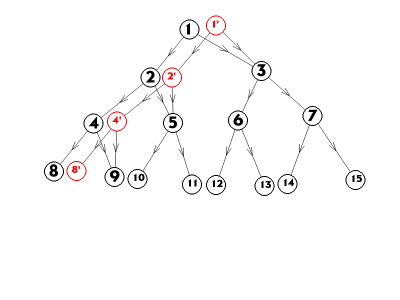

## 主席树

主席树全称是可持久化权值线段树，参见 [知乎讨论](https://www.zhihu.com/question/59195374)。

!!! warning
    **函数式线段树** 是指使用函数式编程思想的线段树。在函数式编程思想中，将计算机运算视为数学函数，并避免可改变的状态或变量。不难发现，函数式线段树是 [完全可持久化](/ds/persistent/#_2) 的。

面对眼前的区间第 $k$ 小问题，你该何从下手？

一种可行的方案是：使用主席树。  
主席树的主要思想就是：保存每次插入操作时的历史版本，以便查询区间第 $k$ 小。

怎么保存呢？简单暴力一点，每次开一棵线段树呗。  
那空间还不爆掉？

那么我们分析一下，发现每次修改操作修改的点的个数是一样的。  
（例如下图，修改了 $[1,8]$ 中对应权值为 1 的结点，红色的点即为更改的点）  


只更改了 $O(\log{n})$ 个结点，形成一条链，也就是说每次更改的结点数 = 树的高度。  
注意主席树不能使用堆式存储法，就是说不能用 $x\times 2$ , $x\times 2+1$ 来表示左右儿子，而是应该动态开点，并保存每个节点的左右儿子编号。  
所以我们只要在记录左右儿子的基础上存一下插入每个数的时候的根节点就可以持久化辣。

我们把问题简化一下：每次求 $[1,r]$ 区间内的 $k$ 小值。  
怎么做呢？只需要找到插入 r 时的根节点版本，然后用普通权值线段树（有的叫键值线段树 / 值域线段树）做就行了。

那么这个相信大家很简单都能理解，把问题扩展到原问题——求 $[l,r]$ 区间 $k$ 小值。  
这里我们再联系另外一个知识理解：**前缀和**。  
这个小东西巧妙运用了区间减法的性质，通过预处理从而达到 $O(1)$ 回答每个询问。

那么我们阔以发现，主席树统计的信息也满足这个性质。  
所以…… 如果需要得到 $[l,r]$ 的统计信息，只需要用 $[1,r]$ 的信息减去 $[1,l - 1]$ 的信息就行了。

那么至此，该问题解决！（完结撒花）

关于空间问题，我们分析一下：由于我们是动态开点的，所以一棵线段树只会出现 $2n-1$ 个结点。  
然后，有 $n$ 次修改，每次增加 $\log{n}$ 个结点。那么最坏情况结点数会达到 $2n-1+n\log{n}$ ，那么此题的 $n \leq 10^5$ ，通过计算得到 $\lceil\log_2{10^5}\rceil = 17$ 。  
那么把 $n$ 和 $\log$ 的结果代入这个式子，变成 $2\times 10^5-1+17\times 10^5$，忽略掉 $-1$ ，大概就是 $19\times 10^5$ 。

算了这么一大堆，I tell you: 千万不要吝啬空间！保守一点，直接上个 $2^5\times 10^5$，接近原空间的两倍（即`n << 5`）。  
（较真的同学请注意，如果你真的很吝啬，可以自己造个数据输出一下结点数量，但是如果数据没造好把自己卡掉了就 ~~尴尬了~~ 赖你了）

代码：

```cpp
#include <algorithm>
#include <cstdio>
#include <cstring>
using namespace std;
const int maxn = 1e5;  //数据范围
int tot, n, m;
int sum[(maxn << 5) + 10], rt[maxn + 10], ls[(maxn << 5) + 10],
    rs[(maxn << 5) + 10];
int a[maxn + 10], ind[maxn + 10], len;
inline int getid(const int &val)  //离散化
{
  return lower_bound(ind + 1, ind + len + 1, val) - ind;
}
int build(int l, int r)  //建树
{
  int root = ++tot;
  if (l == r) return root;
  int mid = l + r >> 1;
  ls[root] = build(l, mid);
  rs[root] = build(mid + 1, r);
  return root;  //返回该子树的根节点
}
int update(int k, int l, int r, int root)  //插入操作
{
  int dir = ++tot;
  ls[dir] = ls[root], rs[dir] = rs[root], sum[dir] = sum[root] + 1;
  if (l == r) return dir;
  int mid = l + r >> 1;
  if (k <= mid)
    ls[dir] = update(k, l, mid, ls[dir]);
  else
    rs[dir] = update(k, mid + 1, r, rs[dir]);
  return dir;
}
int query(int u, int v, int l, int r, int k)  //查询操作
{
  int mid = l + r >> 1,
      x = sum[ls[v]] - sum[ls[u]];  //通过区间减法得到左儿子的信息
  if (l == r) return l;
  if (k <= x)  //说明在左儿子中
    return query(ls[u], ls[v], l, mid, k);
  else  //说明在右儿子中
    return query(rs[u], rs[v], mid + 1, r, k - x);
}
inline void init() {
  scanf("%d%d", &n, &m);
  for (register int i = 1; i <= n; ++i) scanf("%d", a + i);
  memcpy(ind, a, sizeof ind);
  sort(ind + 1, ind + n + 1);
  len = unique(ind + 1, ind + n + 1) - ind - 1;
  rt[0] = build(1, len);
  for (register int i = 1; i <= n; ++i)
    rt[i] = update(getid(a[i]), 1, len, rt[i - 1]);
}
int l, r, k;
inline void work() {
  while (m--) {
    scanf("%d%d%d", &l, &r, &k);
    printf("%d\n", ind[query(rt[l - 1], rt[r], 1, len, k)]);  //回答询问
  }
}
int main() {
  init();
  work();
  return 0;
}
```

## 参考

<https://en.wikipedia.org/wiki/Persistent_data_structure>

<https://www.cnblogs.com/zinthos/p/3899565.html>
