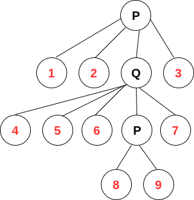

author: isdanni

**PQ 树** 是一种基于树的数据结构，代表一组元素上的一系列排列，由 Kellogg S. Booth 和 George S. Lueker 于 1976 年发现命名。

## 性质

1. PQ 树是有标有根的树。
2. PQ 树中的每个元素由一个叶节点表示，每个非叶节点都标记为 `P` 或 `Q`。
3. 一个 P 节点至少有两个子节点。
4. 一个 Q 节点至少有三个子节点。
5. PQ 树通过重新排序子结点来表示排列。P 节点的子节点可以被任意序列重新排序。Q 节点的子节点可以按相反的顺序排列，否则不能重新排序。

PQ 树表示可以通过这两个操作的任何序列实现的所有叶节点排序。也就是说，它可以表示所有可能排序的集合的子集。但是，并非每种排序集都可以用这种方式表示。例如，如果一个排序可以由 PQ 树表示，那么他的逆序也必须由同一棵树表示。

如上所示，例图中的 PQ 树共有 $3$ 个非叶节点，其中两个为 $P$ 节点，一个为 $Q$ 节点。它代表了 ${1, 2, 4, 5, 6, 8, 9, 7, 3}$ 这个集合中的不同排列。

## PQ 树 vs 析合树

PQ 树和析合树（Permutation Tree/Cut Join Tree）都是处理连续子序列的树状结构，那么他们的区别是什么呢？

我们先来看析合树的定义：析合树的每个子节点大于其父节点，并且子节点从左到右按照升序排列。树的高度是在从根节点到一个叶节点为止的最长路径上根的后代数。它用于查找满足特定条件的所有连续子序列。比如下面这道例题：

??? note " 例题 [F. Pudding Monsters](https://codeforces.com/contest/526/problem/F)"
    题目大意：给一个地图，n 个怪物的独特坐标，保证地图的每一行和每一列都只有一个怪物，求可以形成新地图的原始字段的不同正方形片段的数量。

PQ 树则作用于查找具有给定连续子集的有效排列。常见问题是求一个满足若干限制的排列。

## PC 树

PC 树，是由 Shiwei-Kuan Shih 和 Hen-Lian Hsu 于 [2001](https://www.researchgate.net/publication/221427187_PC-trees_vs_PQ-trees) 年定义的树状数据结构，我们可以把它看作是基于 PQ 树的更新。和 PQ 树一样，PC 树通过节点的重新排序来表示排列，元素通过叶节点表示。

但与 PQ 树不同的是，PC 树是无根的。与标记为 P 的任何非叶节点相邻的节点都可以像在 PQ 树中那样任意地重新排序，而与标记为 C 的任何非叶节点相邻的节点都具有固定的循环顺序，并且重新排序只能遵循逆序列。

因此，PC 树只能表示每个顺序的任何循环排列或逆转也都在该集合中的顺序集合。但是，我们可以通过 `n+1` 个元素的 PC 树来模拟 `n` 个元素的 PQ 树，其中多余的元素用于使 PC 树成为根。在 PC 树上执行平面性测试算法所需的操作比 PQ 树上的相应操作要简单一些。

## 参考链接

[^ref1]: [PQ tree - Wikipedia](https://en.wikipedia.org/wiki/PQ_tree)

[^ref2]: [PC-trees vs. PQ-trees](https://www.researchgate.net/publication/221427187_PC-trees_vs_PQ-trees)

[^ref3]: [Breakpoint Distance and PQ-Trees](https://www.researchgate.net/publication/221313779_Breakpoint_Distance_and_PQ-Trees)

[^ref4]: [PQ Tree vs Permutation Tree](https://codeforces.com/blog/entry/69158?#comment-536295)
