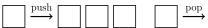

本页面介绍和队列有关的数据结构及其应用．



## 引入

队列（queue）是一种具有「先进入队列的元素一定先出队列」性质的表．由于该性质，队列通常也被称为先进先出（first in first out）表，简称 FIFO 表．

## 实现

### 数组模拟队列

通常用一个数组模拟一个队列，用两个变量标记队列的首尾．

```cpp
int q[SIZE], ql = 1, qr;
```

队列操作对应的代码如下：

-   插入元素：`q[++qr] = x;`
-   删除元素：`ql++;`
-   访问队首：`q[ql]`
-   访问队尾：`q[qr]`
-   清空队列：`ql = 1; qr = 0;`

??? example "[Luogu B3616【模板】队列](https://www.luogu.com.cn/problem/B3616) 数组模拟参考实现"
    ```cpp
    --8<-- "docs/ds/code/queue/queue_1.cpp"
    ```

### 双栈模拟队列

还有一种冷门的方法是使用两个 [栈](./stack.md) 来模拟一个队列．

这种方法使用两个栈 $F$ 和 $S$ 模拟一个队列，其中 $F$ 是队尾的栈，$S$ 代表队首的栈，支持 push（在队尾插入），pop（在队首弹出）操作：

-   push：插入到栈 $F$ 中．
-   pop：如果 $S$ 非空，让 $S$ 弹栈；否则把 $F$ 的元素倒过来压到 $S$ 中（其实就是一个一个弹出插入，做完后是首尾颠倒的），然后再让 $S$ 弹栈．

容易证明，每个元素只会进入/转移/弹出一次，均摊复杂度 $O(1)$．

??? example "[Luogu B3616【模板】队列](https://www.luogu.com.cn/problem/B3616) 双栈模拟参考实现"
    ```cpp
    --8<-- "docs/ds/code/queue/queue_2.cpp"
    ```

## C++ STL 中的队列

C++ 在 STL 中提供了一个容器 `std::queue`，使用前需要先引入 `<queue>` 头文件．

???+ info "STL 中对 `queue` 的定义"
    ```cpp
    // clang-format off
    template<
        class T,
        class Container = std::deque<T>
    > class queue;
    ```
    
    `T` 为 queue 中要存储的数据类型．
    
    `Container` 为用于存储元素的底层容器类型．这个容器必须提供通常语义的下列函数：
    
    -   `back()`
    -   `front()`
    -   `push_back()`
    -   `pop_front()`
    
    STL 容器 `std::deque` 和 `std::list` 满足这些要求．如果不指定，则默认使用 `std::deque` 作为底层容器．

STL 中的 `queue` 容器提供了一众成员函数以供调用．其中较为常用的有：

-   元素访问
    -   `q.front()` 返回队首元素
    -   `q.back()` 返回队尾元素
-   修改
    -   `q.push()` 在队尾插入元素
    -   `q.pop()` 弹出队首元素
-   容量
    -   `q.empty()` 队列是否为空
    -   `q.size()` 返回队列中元素的数量

此外，`queue` 还提供了一些运算符．较为常用的是使用赋值运算符 `=` 为 `queue` 赋值，示例：

```cpp
std::queue<int> q1, q2;

// 向 q1 的队尾插入 1
q1.push(1);

// 将 q1 赋值给 q2
q2 = q1;

// 输出 q2 的队首元素
std::cout << q2.front() << std::endl;
// 输出: 1
```

## 特殊队列

### 双端队列

双端队列是指一个可以在队首/队尾插入或删除元素的队列．相当于是栈与队列功能的结合．具体地，双端队列支持的操作有 4 个：

-   在队首插入一个元素
-   在队尾插入一个元素
-   在队首删除一个元素
-   在队尾删除一个元素

数组模拟双端队列的方式与普通队列相同．

同样地，也可以使用双栈模拟队列的思想来维护双端队列，但需注意当某个栈为空时，交替查询队首和队尾将导致均摊分析失效．考虑在移动时，只将非空栈的一半元素移动到空栈中，并保持队首与队尾栈的性质，这样处理后仍可以做到均摊常数时间的插入和删除．

??? note "简要证明"
    由于插入操作只贡献常数复杂度，现在考虑弹出操作．假设初始时队列中有 $m$ 个元素，下面我们计算将所有元素全部弹出（无论首尾）的时间复杂度．则第一次平衡的复杂度是 $O(m)$ 的．然后两个栈就各有 $\frac{m}{2}$ 个元素．这时就需要 $O(\frac{m}{2})$ 的时间清空其中一个栈，然后就又可以触发一次复杂度为 $O(\frac{m}{2})$ 的平衡操作，以此类推，直到所有元素被弹出．因此，这样做的总复杂度是
    
    $$
    T(m)=T\left(\frac{m}{2}\right)+O(m)
    $$
    
    根据主定理，解得 $T(m)=O(m)$．于是，这种维护方式的总复杂度仍是均摊常数的．

??? example "[Luogu B3656【模板】双端队列 1](https://www.luogu.com.cn/problem/B3656) 参考实现"
    ```cpp
    --8<-- "docs/ds/code/queue/queue_3.cpp"
    ```

#### C++ STL 中的双端队列

C++ 在 STL 中也提供了一个容器 `std::deque`，使用前需要先引入 `<deque>` 头文件．

??? info "STL 中对 `deque` 的定义"
    ```cpp
    // clang-format off
    template<
        class T,
        class Allocator = std::allocator<T>
    > class deque;
    ```
    
    `T` 为 deque 中要存储的数据类型．
    
    `Allocator` 为分配器，此处不做过多说明，一般保持默认即可．

STL 中的 `deque` 容器提供了一众成员函数以供调用．其中较为常用的有：

-   元素访问
    -   `q.front()` 返回队首元素
    -   `q.back()` 返回队尾元素
-   修改
    -   `q.push_back()` 在队尾插入元素
    -   `q.pop_back()` 弹出队尾元素
    -   `q.push_front()` 在队首插入元素
    -   `q.pop_front()` 弹出队首元素
    -   `q.insert()` 在指定位置前插入元素（传入迭代器和元素）
    -   `q.erase()` 删除指定位置的元素（传入迭代器）
-   容量
    -   `q.empty()` 队列是否为空
    -   `q.size()` 返回队列中元素的数量

此外，`deque` 还提供了一些运算符．其中较为常用的有：

-   使用赋值运算符 `=` 为 `deque` 赋值，类似 `queue`．
-   使用 `[]` 访问元素，类似 `vector`．

`<queue>` 头文件中还提供了优先队列 `std::priority_queue`，因其与 [堆](./heap.md) 更为相似，在此不作过多介绍．

#### Python 中的双端队列

在 Python 中，双端队列的容器由 `collections.deque` 提供．

示例如下：

???+ note "实现"
    ```python
    from collections import deque
    
    # 新建一个 deque，并初始化内容为 [1, 2, 3]
    queue = deque([1, 2, 3])
    
    # 在队尾插入元素 4
    queue.append(4)
    
    # 在队首插入元素 0
    queue.appendleft(0)
    
    # 访问队列
    # >>> queue
    # deque([0, 1, 2, 3, 4])
    ```

### 循环队列

使用数组模拟队列会导致一个问题：随着时间的推移，整个队列会向数组的尾部移动，一旦到达数组的最末端，即使数组的前端还有空闲位置，再进行入队操作也会导致溢出（这种数组里实际有空闲位置而发生了上溢的现象被称为「假溢出」）．

解决假溢出的办法是采用循环的方式来组织存放队列元素的数组，即将数组下标为 0 的位置看做是最后一个位置的后继．（数组下标为 `x` 的元素，它的后继为 `(x + 1) % SIZE`）．这样就形成了循环队列．

## 参考资料

1.  [std::queue - zh.cppreference.com](https://zh.cppreference.com/w/cpp/container/queue)
2.  [std::deque - zh.cppreference.com](https://zh.cppreference.com/w/cpp/container/deque)
