本页面介绍和队列有关的数据结构及其应用。



队列（queue）是一种具有「先进入队列的元素一定先出队列」性质的表。由于该性质，队列通常也被称为先进先出（first in first out）表，简称 FIFO 表。

## 数组模拟队列

通常用一个数组模拟一个队列，用两个变量标记队列的首尾。

```cpp
int q[SIZE], ql = 1, qr;
```

队列操作对应的代码如下：

- 插入元素：`q[++qr] = x;`
- 删除元素：`ql++;`
- 访问队首：`q[ql]`
- 访问队尾：`q[qr]`
- 清空队列：`ql = 1; qr = 0;`

## 双栈模拟队列

还有一种冷门的方法是使用两个 [栈](./stack.md) 来模拟一个队列。

这种方法使用两个栈 F, S 模拟一个队列，其中 F 是队尾的栈，S 代表队首的栈，支持 push（在队尾插入），pop（在队首弹出）操作：

- push：插入到栈 F 中。
- pop：如果 S 非空，让 S 弹栈；否则把 F 的元素倒过来压到 S 中（其实就是一个一个弹出插入，做完后是首位颠倒的），然后再让 S 弹栈。

容易证明，每个元素只会进入/转移/弹出一次，均摊复杂度 $O(1)$。

## C++ STL 中的队列

C++ 在 STL 中提供了一个容器 `std::queue`，使用前需要先引入 `<queue>` 头文件。

???+ info "STL 中对 `queue` 的定义"
    ```cpp
    // clang-format off
    template<
        class T,
        class Container = std::deque<T>
    > class queue;
    ```
    
    `T` 为 queue 中要存储的数据类型。
    
    `Container` 为用于存储元素的底层容器类型。这个容器必须提供通常语义的下列函数：
    
    - `back()`
    - `front()`
    - `push_back()`
    - `pop_front()`
    
    STL 容器 `std::deque` 和 `std::list` 满足这些要求。如果不指定，则默认使用 `std::deque` 作为底层容器。

STL 中的 `queue` 容器提供了一众成员函数以供调用。其中较为常用的有：

-   元素访问
    - `q.front()` 返回队首元素
    - `q.back()` 返回队尾元素
-   修改
    - `q.push()` 在队尾插入元素
    - `q.pop()` 弹出队首元素
-   容量
    - `q.empty()` 队列是否为空
    - `q.size()` 返回队列中元素的数量

此外，`queue` 还提供了一些运算符。较为常用的是使用赋值运算符 `=` 为 `queue` 赋值，示例：

```cpp
std::queue<int> q1, q2;

// 向 q1 的队尾插入 1
q1.push(1);

// 将 q1 赋值给 q2
q2 = q1;

// 输出 q2 的队首元素
std::cout << q2.front() << std::endl;
// 输出: 1
```

## 特殊队列

### 双端队列

双端队列是指一个可以在队首/队尾插入或删除元素的队列。相当于是栈与队列功能的结合。具体地，双端队列支持的操作有 4 个：

- 在队首插入一个元素
- 在队尾插入一个元素
- 在队首删除一个元素
- 在队尾删除一个元素

数组模拟双端队列的方式与普通队列相同。

#### C++ STL 中的双端队列

C++ 在 STL 中也提供了一个容器 `std::deque`，使用前需要先引入 `<deque>` 头文件。

??? info "STL 中对 `deque` 的定义"
    ```cpp
    // clang-format off
    template<
        class T,
        class Allocator = std::allocator<T>
    > class deque;
    ```
    
    `T` 为 deque 中要存储的数据类型。
    
    `Allocator` 为分配器，此处不做过多说明，一般保持默认即可。

STL 中的 `deque` 容器提供了一众成员函数以供调用。其中较为常用的有：

-   元素访问
    - `q.front()` 返回队首元素
    - `q.back()` 返回队尾元素
-   修改
    - `q.push_back()` 在队尾插入元素
    - `q.pop_back()` 弹出队尾元素
    - `q.push_front()` 在队首插入元素
    - `q.pop_front()` 弹出队首元素
    - `q.insert()` 在指定位置前插入元素（传入迭代器和元素）
    - `q.erase()` 删除指定位置的元素（传入迭代器）
-   容量
    - `q.empty()` 队列是否为空
    - `q.size()` 返回队列中元素的数量

此外，`deque` 还提供了一些运算符。其中较为常用的有：

- 使用赋值运算符 `=` 为 `deque` 赋值，类似 `queue`。
- 使用 `[]` 访问元素，类似 `vector`。

`<queue>` 头文件中还提供了优先队列 `std::priority_queue`，因其与 [堆](./heap.md) 更为相似，在此不作过多介绍。

#### Python 中的双端队列

在 Python 中，双端队列的容器由 `collections.deque` 提供。

示例如下：

```python
from collections import deque

# 新建一个 deque，并初始化内容为 [1, 2, 3]
queue = deque([1, 2, 3])

# 在队尾插入元素 4
queue.append(4)

# 在队首插入元素 0
queue.appendleft(0)

# 访问队列
# >>> queue
# deque([0, 1, 2, 3, 4])
```

### 循环队列

使用数组模拟队列会导致一个问题：随着时间的推移，整个队列会向数组的尾部移动，一旦到达数组的最末端，即使数组的前端还有空闲位置，再进行入队操作也会导致溢出（这种数组里实际有空闲位置而发生了上溢的现象被称为“假溢出”）。

解决假溢出的办法是采用循环的方式来组织存放队列元素的数组，即将数组下标为 0 的位置看做是最后一个位置的后继。（数组下标为 `x` 的元素，它的后继为 `(x + 1) % SIZE`）。这样就形成了循环队列。

## 例题

???+note "[LOJ6515「雅礼集训 2018 Day10」贪玩蓝月](https://loj.ac/problem/6515)"
    一个双端队列（deque），m 个事件：
    
    1. 在前端插入 (w,v)
    2. 在后端插入 (w,v)
    3. 删除前端的二元组
    4. 删除后端的二元组
    5.  给定 l,r，在当前 deque 中选择一个子集 S 使得 $\sum_{(w,v)\in S}w\bmod p\in[l,r]$，且最大化 $\sum_{(w,v)\in S}v$.
    
        $m\leq 5\times 10^4,p\leq 500$.

??? note "解题思路"
    每个二元组是有一段存活时间的，因此对时间建立线段树，每个二元组做 log 个存活标记。因此我们要做的就是对每个询问，求其到根节点的路径上的标记的一个最优子集。显然这个可以 DP 做。$f[S,j]$ 表示选择集合 S 中的物品余数为 j 的最大价值。（其实实现的时侯是有序的，直接 f[i,j]做）
    
    一共有 $O(m\log m)$ 个标记，因此这么做的话复杂度是 $O(mp\log m)$ 的。
    
    * * *
    
    这是一个在线算法比离线算法快的神奇题目。而且还比离线的好写。
    
    上述离线算法其实是略微小题大做的，因为如果把题目的 deque 改成直接维护一个集合的话（即随机删除集合内元素），那么离线算法同样适用。既然是 deque，不妨在数据结构上做点文章。
    
    * * *
    
    如果题目中维护的数据结构是一个栈呢？
    
    直接 DP 即可。$f[i,j]$ 表示前 i 个二元组，余数为 j 时的最大价值。
    
    $$
    f[i,j]=\max(f[i-1,j],f[i-1,(j-w_i)\bmod p]+v_i)
    $$
    
    妥妥的背包啊。
    
    删除的时侯直接指针前移即可。这样做的复杂度是 $O(mp)$ 的。
    
    * * *
    
    如果题目中维护的数据结构是队列？
    
    有一种操作叫双栈模拟队列。这就是这个东西的用武之地。因为用栈是可以轻松维护 DP 过程的，而双栈模拟队列的复杂度是均摊 $O(1)$ 的，因此，复杂度仍是 $O(mp)$。
    
    * * *
    
    回到原题，那么 Deque 怎么做？
    
    类比推理，我们尝试用栈模拟双端队列，于是似乎把维护队列的方法扩展一下就可以了。但如果每次是全部转移栈中的元素的话，单次操作复杂度很容易退化为 $O(m)$。
    
    于是乎，神仙的想一想，我们可以丢一半过去啊。
    
    这样的复杂度其实均摊下来仍是常数级别。具体地说，丢一半指的是把一个栈靠近栈底的一半倒过来丢到另一个栈中。也就是说要手写栈以支持这样的操作。
    
    * * *
    
    似乎可以用 [势能分析法](https://yhx-12243.github.io/OI-transit/records/cf601E.html) 证明。其实本蒟蒻有一个很仙的想法。我们考虑这个双栈结构的整体复杂度。m 个事件，我们希望尽可能增加这个结构的复杂度。
    
    首先，如果全是插入操作的话显然是严格 $\Theta(m)$ 的，因为插入的复杂度是 $O(1)$ 的。
    
    “丢一半”操作是在什么时侯触发的？当某一个栈为空又要求删除元素的时侯。设另一个栈的元素个数是 $O(k)$，那么丢一半的复杂度就是 $O(k)\geq O(1)$ 的。因此我们要尽可能增加“丢一半”操作的次数。
    
    为了增加丢一半的操作次数，必然需要不断删元素直到某一个栈为空。由于插入操作对增加复杂度是无意义的，因此我们不考虑插入操作。初始时有 m 个元素，假设全在一个栈中。则第一次丢一半的复杂度是 $O(m)$ 的。然后两个栈就各有 $\frac{m}{2}$ 个元素。这时就需要 $O(\frac{m}{2})$ 删除其中一个栈，然后就又可以触发一次复杂度为 $O(\frac{m}{2})$ 的丢一半操作……
    
    考虑这样做的总复杂度。
    
    $$
    T(m)=2\cdot O(m)+T\left(\frac{m}{2}\right)
    $$
    
    解得 $T(m)=O(m)$。
    
    于是，总复杂度仍是 $O(mp)$。
    
    * * *
    
    在询问的时侯，我们要处理的应该是“在两个栈中选若干个元素的最大价值”的问题。因此要对栈顶的 DP 值做查询，即两个 $f,g$ 对于询问[l,r]的最大价值：
    
    $$
    \max_{0\leq i<p}\left\{f[i]+\max_{l\leq i+j\leq r}g_j\right\}
    $$
    
    这个问题暴力做是 $O(p^2)$ 的，不过一个妥妥的单调队列可以做到 $O(p)$。

??? note "参考代码"
    ```cpp
    --8<-- "docs/ds/code/queue/queue_1.cpp"
    ```

## 参考资料

1. [std::queue - zh.cppreference.com](https://zh.cppreference.com/w/cpp/container/queue)
2. [std::deque - zh.cppreference.com](https://zh.cppreference.com/w/cpp/container/deque)
