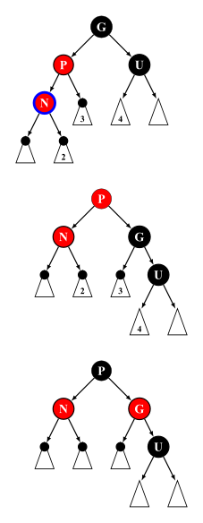
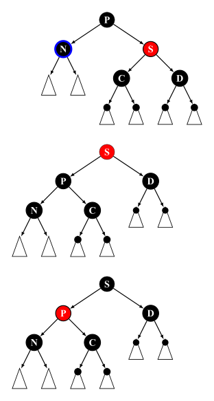
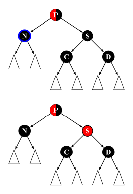
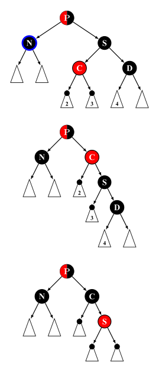
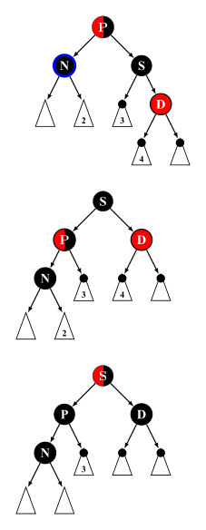

author: LeverImmy

红黑树是一种自平衡的二叉搜索树。每个节点额外存储了一个 color 字段 ("RED" or "BLACK")，用于确保树在插入和删除时保持平衡。

红黑树是 4 阶 B 树（[2-3-4 树](./2-3-4-tree.md)）的变体。[^gilbas1978]

## 性质

一棵合法的红黑树必须遵循以下四条性质：

1.  节点为红色或黑色
2.  NIL 节点（空叶子节点）为黑色
3.  红色节点的子节点为黑色
4.  从根节点到 NIL 节点的每条路径上的黑色节点数量相同

下图为一棵合法的红黑树：


???+ note
    部分资料中还加入了第五条性质，即根节点必须为黑色，这条性质要求完成插入操作后若根节点为红色则将其染黑，但由于将根节点染黑的操作也可以延迟至删除操作时进行，因此，该条性质并非必须满足（本文给出的代码实现中满足该性质）。为严谨起见，这里同时引用 [维基百科原文](https://en.wikipedia.org/wiki/Red%E2%80%93black_tree#Properties) 进行说明：
    
    > Some authors, e.g. Cormen & al.,[^cite_note-Cormen2009-18]claim "the root is black" as fifth requirement; but not Mehlhorn & Sanders[^cite_note-Mehlhorn2008-17]or Sedgewick & Wayne.[^cite_note-Algs4-16]Since the root can always be changed from red to black, this rule has little effect on analysis. This article also omits it, because it slightly disturbs the recursive algorithms and proofs.

## 红黑树类的定义

```cpp
--8<-- "docs/ds/code/rbtree/rbtree.hpp:class-node1"
  // ...
--8<-- "docs/ds/code/rbtree/rbtree.hpp:class-node2"
```

???+ note
    在红黑树节点的存储中，用数组来存储子节点指针可以提高代码复用率。

## 操作

???+ note
    红黑树的插入/删除有多种实现方式，本文采用《算法导论》的实现方式，将插入后的平衡维护分为 3 种情况，删除后的平衡维护分为 4 种情况。

红黑树的遍历、查找最小/最大值、搜索元素、求元素的排名、根据排名反查元素、查找前驱/后继等操作和 [二叉搜索树](./bst.md) 一致，此处不再赘述。

另外，在下文插入/删除平衡维护的代码注释中，我们作如下约定：

-   用 `p` 表示节点 `p` 为黑色；
-   用 `[p]` 表示节点 `p` 为红色；
-   用 `{p}` 表示节点 `p` 为红色或黑色；
-   用 `|p|` 表示节点 `p` 为 NIL 节点或颜色为黑色。

### 旋转

旋转操作是多数平衡树能够维持平衡的关键，它能在不改变一棵合法 BST 中序遍历结果的情况下改变局部节点的深度。


???+ note "实现"
    ```cpp
    --8<-- "docs/ds/code/rbtree/rbtree.hpp:rotate"
    ```

### 插入

红黑树的插入操作与普通的 BST 类似，对于红黑树来说，新插入的节点初始为红色，完成插入后需根据插入节点及相关节点的状态进行修正以满足上文提到的四条性质。

???+ note "实现"
    ```cpp
    --8<-- "docs/ds/code/rbtree/rbtree.hpp:insert"
    --8<-- "docs/ds/code/rbtree/rbtree.hpp:insert-leaf"
    --8<-- "docs/ds/code/rbtree/rbtree.hpp:insert-fixup1"
        // ...
    --8<-- "docs/ds/code/rbtree/rbtree.hpp:insert-fixup2"
    ```

### 插入后的平衡维护

???+ note
    为加深理解，请读者自行验证平衡维护后是否满足性质 4。

由于插入的节点若不为根节点则必为红色，所以插入后可能违反性质 3，需要维护平衡性。

令插入的节点为 $n$，其父节点为 $p$，祖父节点为 $g$，叔节点为 $u$。由性质 3 可知 $g$ 必为黑色。

我们从插入的位置开始向上递归维护，若 $p$ 为黑色即可终止，否则分为 3 种情况。

```cpp
--8<-- "docs/ds/code/rbtree/rbtree.hpp:insert-aux1"
      // ...
--8<-- "docs/ds/code/rbtree/rbtree.hpp:insert-aux2"
```

#### Insert case 1

$p$ 和 $u$ 均为红色。此时我们只需重新染色即可。


???+ note "实现"
    ```cpp
    --8<-- "docs/ds/code/rbtree/rbtree.hpp:insert-case1"
    ```

#### Insert case 2

$p$ 为红色，$u$ 为黑色，$p$ 的方向和 $n$ 的方向不同。

此时我们需要旋转 $p$ 节点来转为第三种情况。


???+ note "实现"
    ```cpp
    --8<-- "docs/ds/code/rbtree/rbtree.hpp:insert-case2"
    ```

#### Insert case 3

$p$ 为红色，$u$ 为黑色，$p$ 的方向和 $n$ 的方向相同。

此时我们需要旋转 $g$ 节点以将 $p$ 转为子树的根，之后交换 $p$ 和 $g$ 的颜色即可。



???+ note "实现"
    ```cpp
    --8<-- "docs/ds/code/rbtree/rbtree.hpp:insert-case3"
    ```

### 删除

红黑树的删除操作与普通的 BST 相比要多一些步骤。具体而言：

-   若待删除的节点 $n$ 有两个子节点，则交换 $n$ 和左子树中最大节点 $s$ 的数据，并将 $n$ 设为 $s$。此时 $n$ 不可能有两个子节点。
-   若待删除的节点 $n$ 有一个子节点 $s$。由性质 4 可知 $s$ 必为红色，再由性质 3 可知 $n$ 必为黑色。所以只需将 $n$ 在父节点 $p$ 中对应的指针替换为 $s$ 的地址，以及将 $s$ 的父节点指针替换为 $p$ 的地址，之后再将 $s$ 染黑即可。
-   若待删除的节点 $n$ 没有子节点。若 $n$ 是根节点或 $n$ 是红色节点，则直接删除即可，否则直接删除会违反性质 4，需要维护平衡性。

???+ note "实现"
    ```cpp
    --8<-- "docs/ds/code/rbtree/rbtree.hpp:delete"
    --8<-- "docs/ds/code/rbtree/rbtree.hpp:delete-leaf"
    --8<-- "docs/ds/code/rbtree/rbtree.hpp:delete-fixup1"
        // ...
    --8<-- "docs/ds/code/rbtree/rbtree.hpp:delete-fixup2"
    ```

### 删除后的平衡维护

???+ note
    为加深理解，请读者自行验证平衡维护后是否满足性质 4。

由上文讨论可知 $n$ 是黑色叶子节点且不为根节点。我们设 $n$ 的父节点为 $p$，兄弟节点为 $s$，侄节点分别为 $c$ 和 $d$。

删除的维护也是从 $n$ 开始向上递归维护，若 $n$ 不是根或 $n$ 为红色即可终止，否则分为 4 种情况。

```cpp
--8<-- "docs/ds/code/rbtree/rbtree.hpp:delete-aux1"
      // Delete case 1
      // ...
      // Other cases
--8<-- "docs/ds/code/rbtree/rbtree.hpp:delete-aux2"
      // ...
--8<-- "docs/ds/code/rbtree/rbtree.hpp:delete-aux3"
```

#### Delete case 1

$s$ 为红色。

此时我们旋转 $p$，将 $s$ 转为子树根节点，之后交换 $s$ 和 $p$ 的颜色来转为其余三种情况之一。



???+ note "实现"
    ```cpp
    --8<-- "docs/ds/code/rbtree/rbtree.hpp:delete-case1"
    ```

#### Delete case 2

$p$ 的颜色不确定，$s$、$c$、$d$ 均为黑色。

此时只需将 $s$ 染红即可。



需要注意的是，若 $p$ 为红色则会违反性质 3，但是若 $p$ 为红色则会直接退出循环，所以我们在最后将其染黑。

???+ note "实现"
    ```cpp
    --8<-- "docs/ds/code/rbtree/rbtree.hpp:delete-case2"
    ```

#### Delete case 3

$p$ 的颜色不确定，$s$、$d$ 均为黑色，$c$ 为红色。

此时需要旋转 $s$ 使 $c$ 为原来 $s$ 对应子树的根节点，并交换 $s$ 和 $c$ 的颜色转为第四种情况即可。



???+ note "实现"
    ```cpp
    --8<-- "docs/ds/code/rbtree/rbtree.hpp:delete-case3"
    ```

#### Delete case 4

$p$、$c$ 的颜色不确定，$s$ 为黑色，$d$ 为红色。

此时需要旋转 $p$ 使 $s$ 为子树的根节点，交换 $s$ 和 $p$ 的颜色，并将 $d$ 染黑即可终止维护平衡。



???+ note "实现"
    ```cpp
    --8<-- "docs/ds/code/rbtree/rbtree.hpp:delete-case4"
    ```

## 参考代码

下面的代码是用红黑树实现的 set：

??? note "实现"
    ```cpp
    --8<-- "docs/ds/code/rbtree/rbtree.hpp:full"
    ```

??? note " 例题：[Luogu P3369【模板】普通平衡树](https://www.luogu.com.cn/problem/P3369) 与 [Luogu P6136【模板】普通平衡树（数据加强版）](https://www.luogu.com.cn/problem/P6136)"
    ```cpp
    --8<-- "docs/ds/code/rbtree/rbtree.hpp:class"
    --8<-- "docs/ds/code/rbtree/rbtree_1.cpp:main"
    ```

## 实际工程项目中的使用

由于红黑树是目前主流工业界综合效率最高的内存型平衡树，其在实际的工程项目中有着广泛的使用，这里列举几个实际的使用案例并给出相应的源码链接，以便读者进行对比学习。

### Linux

源码：

-   [`linux/lib/rbtree.c`](https://elixir.bootlin.com/linux/latest/source/lib/rbtree.c)

Linux 中的红黑树所有操作均使用循环迭代进行实现，保证效率的同时又增加了大量的注释来保证代码可读性，十分建议读者阅读学习。Linux 内核中的红黑树使用非常广泛，这里仅列举几个经典案例。

-   [CFS 非实时任务调度](https://www.kernel.org/doc/html/latest/scheduler/sched-design-CFS.html)

    Linux 的稳定内核版本在 2.6.24 之后，使用了新的调度程序 CFS，所有非实时可运行进程都以虚拟运行时间为键值用一棵红黑树进行维护，以完成更公平高效地调度所有任务。CFS 弃用 active/expired 数组和动态计算优先级，不再跟踪任务的睡眠时间和区别是否交互任务，而是在调度中采用基于时间计算键值的红黑树来选取下一个任务，根据所有任务占用 CPU 时间的状态来确定调度任务优先级。

-   [epoll](https://man7.org/linux/man-pages/man7/epoll.7.html)

    epoll 全称 event poll，是 Linux 内核实现 IO 多路复用 (IO multiplexing) 的一个实现，是原先 poll/select 的改进版。Linux 中 epoll 的实现选择使用红黑树来储存文件描述符。

### Nginx

源码：

-   [`nginx/src/core/ngx_rbtree.h`](https://github.com/nginx/nginx/blob/master/src/core/ngx_rbtree.h)
-   [`nginx/src/core/ngx_rbtree.c`](https://github.com/nginx/nginx/blob/master/src/core/ngx_rbtree.c)

nginx 中的用户态定时器是通过红黑树实现的。在 nginx 中，所有 timer 节点都由一棵红黑树进行维护，在 worker 进程的每一次循环中都会调用 `ngx_process_events_and_timers` 函数，在该函数中就会调用处理定时器的函数 `ngx_event_expire_timers`，每次该函数都不断的从红黑树中取出时间值最小的，查看他们是否已经超时，然后执行他们的函数，直到取出的节点的时间没有超时为止。

关于 nginx 中红黑树的源码分析公开资源很多，读者可以自行查找学习。

### C++

源码：

-   GNU libstdc++

    -   [`libstdc++-v3/include/bits/stl_tree.h`](https://github.com/gcc-mirror/gcc/blob/master/libstdc%2B%2B-v3/include/bits/stl_tree.h)
    -   [`libstdc++-v3/src/c++98/tree.cc`](https://github.com/gcc-mirror/gcc/blob/master/libstdc%2B%2B-v3/src/c%2B%2B98/tree.cc)

    另外，`libstdc++` 在 `<ext/rb_tree>` 中提供了 [`__gnu_cxx::rb_tree`](https://github.com/gcc-mirror/gcc/blob/master/libstdc%2B%2B-v3/include/ext/rb_tree)，其继承了 `std::_Rb_tree`，可以认为是供外部使用的类型别名。需要注意的是，该头文件 **不是** C++ 标准的一部分，所以非必要不推荐使用。

    `libstdc++` 的 [`pb_ds`](../lang/pb-ds/tree.md) 中也提供了红黑树。

-   LLVM libcxx
    -   [`libcxx/include/__tree`](https://github.com/llvm/llvm-project/blob/main/libcxx/include/__tree)

-   Microsoft STL
    -   [`stl/inc/xtree`](https://github.com/microsoft/STL/blob/main/stl/inc/xtree)

大多数 STL 中的 `std::set` 和 `std::map` 的内部数据结构就是红黑树（例如上面提到的这些）。不过值得注意的是，C++ 标准并未规定必须以红黑树实现 `std::set` 和 `std::map`，所以不应该在工程项目中直接使用 `std::set` 和 `std::map` 的内部数据结构。

### OpenJDK

源码：

-   [`java.util.TreeMap<K, V>`](https://github.com/openjdk/jdk/blob/master/src/java.base/share/classes/java/util/TreeMap.java)
-   [`java.util.TreeSet<K, V>`](https://github.com/openjdk/jdk/blob/master/src/java.base/share/classes/java/util/TreeSet.java)
-   [`java.util.HashMap<K, V>`](https://github.com/openjdk/jdk/blob/master/src/java.base/share/classes/java/util/HashMap.java)

JDK 中的 `TreeMap` 和 `TreeSet` 都是使用红黑树作为底层数据结构的。同时在 JDK 1.8 之后 `HashMap` 内部哈希表中每个表项的链表长度超过 8 时也会自动转变为红黑树以提升查找效率。

## 参考资料

-   Cormen, T. H., Leiserson, C. E., Rivest, R. L., & Stein, C. (2022).*Introduction to algorithms*. MIT press.
-   [Red-Black Tree - Wikipedia](https://en.wikipedia.org/wiki/Red%E2%80%93black_tree)
-   [Red-Black Tree Visualization](https://www.cs.usfca.edu/~galles/visualization/RedBlack.html)

[^gilbas1978]: L. J. Guibas and R. Sedgewick, "A dichromatic framework for balanced trees,"*19th Annual Symposium on Foundations of Computer Science (sfcs 1978)*, Ann Arbor, MI, USA, 1978, pp. 8-21, doi:[10.1109/SFCS.1978.3](https://doi.org/10.1109%2FSFCS.1978.3).

[^cite_note-Cormen2009-18]: <https://en.wikipedia.org/wiki/Red–black_tree#cite_note-Cormen2009-18>

[^cite_note-Mehlhorn2008-17]: <https://en.wikipedia.org/wiki/Red–black_tree#cite_note-Mehlhorn2008-17>

[^cite_note-Algs4-16]: <https://en.wikipedia.org/wiki/Red–black_tree#cite_note-Algs4-16>: 432–447
