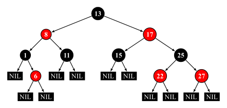

红黑树是一种自平衡的二叉搜索树。每个节点额外存储了一个 color 字段 ("RED" or "BLACK")，用于确保树在插入和删除时保持平衡。

## 性质

一棵合法的红黑树必须遵循以下四条性质

1. 每个节点都必须是红色或黑色
2. NIL 节点（空叶子节点）为黑色
3. 红色节点的左右子节点必须为黑色
4. 从跟节点向下到 NIL 节点的每条路径上的黑色节点（包含 NIL）数量必须相同

下图为一棵合法的红黑树：



注：部分资料中还加入了第五条性质，即根节点必须为黑色，这条性质要求完成插入操作后若根节点为红色则将其染黑，但由于将根节点染黑的操作也可以延迟至删除操作时进行，因此，该条性质并非必须满足。（在本文给出的代码实现中就没有选择满足该性质）。为严谨起见，这里同时引用维基百科原文进行说明：

> Some authors, e.g. Cormen & al.,\[[18\]](https://en.wikipedia.org/wiki/Red–black_tree#cite_note-Cormen2009-18) claim "the root is black" as fifth requirement; but not Mehlhorn & Sanders\[[17\]](https://en.wikipedia.org/wiki/Red–black_tree#cite_note-Mehlhorn2008-17) or Sedgewick & Wayne.\[[16\]](https://en.wikipedia.org/wiki/Red–black_tree#cite_note-Algs4-16): 432–447  Since the root can always be changed from red to black, this rule has little effect on analysis. This article also omits it, because it slightly disturbs the recursive algorithms and proofs.

## 结构

### 红黑树类的定义

```cpp
template <typename Key, typename Value, typename Compare = std::less<Key>>
class RBTreeMap {
  // 排序函数
  Compare compare = Compare();

  // 节点结构体
  struct Node {
    ...
  };

  // 根节点指针
  Node* root = nullptr;
  // 记录红黑树中当前的节点个数
  size_t count = 0;
}
```

### 节点维护的信息

| Identifier | Type                  | Description     |
| ---------- | --------------------- | --------------- |
| `left`     | `Node*`               | 左子节点指针          |
| `right`    | `Node*`               | 右子节点指针          |
| `parent`   | `Node*`               | 父节点指针           |
| `color`    | `enum { BLACK, RED }` | 颜色枚举            |
| `key`      | `Key`                 | 节点键值，具有唯一性和可排序性 |
| `value`    | `Value`               | 节点内储存的值         |

注：由于本文提供的代码示例中使用 `std::share_ptr` 进行内存管理，对此不熟悉的读者可以将下文中所有的 `NodePtr` 和 `ConstNodePtr` 理解为裸指针 `Node*`。但在实现删除操作时若使用 `Node*` 作为节点引用需注意应手动释放内存以避免内存泄漏，该操作在使用 `std::shared_ptr` 作为节点引用的示例代码中并未体现。

## 操作

注：由于红黑树是由 B 树衍生而来（发明时的最初的名字 symmetric binary B-tree 足以证明这点），并非直接由平衡二叉树外加限制条件推导而来，插入操作的后续维护和删除操作的后续维护中部分对操作的解释作用仅是帮助理解，并不能将其作为该操作的原理推导和证明。

### 旋转操作

旋转操作是多数平衡树能够维持平衡的关键，它能在不改变一棵合法 BST 中序遍历结果的情况下改变局部节点的深度。


如上图，从左图到右图的过程被称为左旋，左旋操作会使得 $\alpha$ 子树上结点的深度均减 1，使 $\gamma$ 子树上结点的深度均加 1，而 $\beta$ 子树上节点的深度则不变。从右图到左图的过程被称为右旋，右旋是左旋的镜像操作。

这里给出红黑树中节点的左旋操作的示例代码：

```cpp
void rotateLeft(ConstNodePtr node) {
  // clang-format off
  //     |                       |
  //     N                       S
  //    / \     l-rotate(N)     / \
  //   L   S    ==========>    N   R
  //      / \                 / \
  //     M   R               L   M
  // clang-format on
  assert(node != nullptr && node->right != nullptr);

  NodePtr parent = node->parent;
  Direction direction = node->direction();

  NodePtr successor = node->right;
  node->right = successor->left;
  successor->left = node;

  // 以下的操作用于维护各个节点的`parent`指针
  // `Direction`的定义以及`maintainRelationship`
  // 的实现请参照文章末尾的完整示例代码
  maintainRelationship(node);
  maintainRelationship(successor);

  switch (direction) {
    case Direction::ROOT:
      this->root = successor;
      break;
    case Direction::LEFT:
      parent->left = successor;
      break;
    case Direction::RIGHT:
      parent->right = successor;
      break;
  }

  successor->parent = parent;
}
```

注：代码中的 `successor` 并非平衡树中的后继节点，而是表示取代原本节点的新节点，由于在图示中 `replacement` 的简称 `R` 会与右子节点的简称 `R` 冲突，因此此处使用 `successor` 避免歧义。

### 插入操作

红黑树的插入操作与普通的 BST 类似，对于红黑树来说，新插入的节点初始为红色，完成插入后需根据插入节点及相关节点的状态进行修正以满足上文提到的四条性质。

### 插入后的平衡维护

#### Case 1

该树原先为空，插入第一个节点后不需要进行修正。

#### Case 2

当前的节点的父节点为黑色且为根节点，这时性质已经满足，不需要进行修正。

#### Case 3

当前节点 N 的父节点 P 是为根节点且为红色，将其染为黑色即可，此时性质也已满足，不需要进一步修正。

```cpp
// clang-format off
// Case 3: Parent is root and is RED
//   Paint parent to BLACK.
//    <P>         [P]
//     |   ====>   |
//    <N>         <N>
//   p.s.
//    `<X>` is a RED node;
//    `[X]` is a BLACK node (or NIL);
//    `{X}` is either a RED node or a BLACK node;
// clang-format on
assert(node->parent->isRed());
node->parent->color = Node::BLACK;
return;
```

#### Case 4

当前节点 N 的父节点 P 和叔节点 U 均为黑色，此时 P 包含了一个红色子节点，违反了红黑树的性质，需要进行重新染色。由于在当前节点 N 之前该树是一棵合法的红黑树，根据性质 4 可以确定 N 的祖父节点 G 一定是黑色，这时只要后续操作可以保证以 G 为根节点的子树在不违反性质 4 的情况下再递归维护祖父节点 G 以保证性质 3 即可。

因此，这种情况的维护需要：

1. 将 P，U 节点染黑，将 G 节点染红（可以保证每条路径上黑色节点个数不发生改变）。
2. 递归维护 G 节点（因为不确定 G 的父节点的状态，递归维护可以确保性质 3 成立）。


```cpp
// clang-format off
// Case 4: Both parent and uncle are RED
//   Paint parent and uncle to BLACK;
//   Paint grandparent to RED.
//        [G]             <G>
//        / \             / \
//      <P> <U>  ====>  [P] [U]
//      /               /
//    <N>             <N>
// clang-format on
assert(node->parent->isRed());
node->parent->color = Node::BLACK;
node->uncle()->color = Node::BLACK;
node->grandParent()->color = Node::RED;
maintainAfterInsert(node->grandParent());
return;
```

#### Case 5

当前节点 N 与父节点 P 的方向相反（即 N 节点为右子节点且父节点为左子节点，或 N 节点为左子节点且父节点为右子节点。类似 AVL 树中 LR 和 RL 的情况）。根据性质 4，若 N 为新插入节点，U 则为 NIL 黑色节点，否则为普通黑色节点。

该种情况无法直接进行维护，需要通过旋转操作将子树结构调整为 Case 6 的初始状态并进入 Case 6 进行后续维护。


```cpp
// clang-format off
// Case 5: Current node is the opposite direction as parent
//   Step 1. If node is a LEFT child, perform l-rotate to parent;
//           If node is a RIGHT child, perform r-rotate to parent.
//   Step 2. Goto Case 6.
//      [G]                 [G]
//      / \    rotate(P)    / \
//    <P> [U]  ========>  <N> [U]
//      \                 /
//      <N>             <P>
// clang-format on

// Step 1: Rotation
NodePtr parent = node->parent;
if (node->direction() == Direction::LEFT) {
  rotateRight(node->parent);
} else /* node->direction() == Direction::RIGHT */ {
  rotateLeft(node->parent);
}
node = parent;
// Step 2: vvv
```

#### Case 6

当前节点 N 与父节点 P 的方向相同（即 N 节点为右子节点且父节点为右子节点，或 N 节点为左子节点且父节点为右子节点。类似 AVL 树中 LL 和 RR 的情况）。根据性质 4，若 N 为新插入节点，U 则为 NIL 黑色节点，否则为普通黑色节点。

在这种情况下，若想在不改变结构的情况下使得子树满足性质 3，则需将 G 染成红色，将 P 染成黑色。但若这样维护的话则性质 4 被打破，且无法保证在 G 节点的父节点上性质 3 是否成立。而选择通过旋转改变子树结构后再进行重新染色即可同时满足性质 3 和 4。

因此，这种情况的维护需要：

1. 若 N 为左子节点则左旋祖父节点 G，否则右旋祖父节点 G.（该操作使得旋转过后 P - N 这条路径上的黑色节点个数比 P - G - U 这条路径上少 1，暂时打破性质 4)。
2. 重新染色，将 P 染黑，将 N 染红，同时满足了性质 3 和 4。


```cpp
// clang-format off
// Case 6: Current node is the same direction as parent
//   Step 1. If node is a LEFT child, perform r-rotate to grandparent;
//           If node is a RIGHT child, perform l-rotate to grandparent.
//   Step 2. Paint parent (before rotate) to BLACK;
//           Paint grandparent (before rotate) to RED.
//        [G]                 <P>               [P]
//        / \    rotate(G)    / \    repaint    / \
//      <P> [U]  ========>  <N> [G]  ======>  <N> <G>
//      /                         \                 \
//    <N>                         [U]               [U]
// clang-format on
assert(node->grandParent() != nullptr);

// Step 1
if (node->parent->direction() == Direction::LEFT) {
  rotateRight(node->grandParent());
} else {
  rotateLeft(node->grandParent());
}

// Step 2
node->parent->color = Node::BLACK;
node->sibling()->color = Node::RED;

return;
```

### 删除操作

红黑树的删除操作情况繁多，较为复杂。这部分内容主要通过代码示例来进行讲解。大多数红黑树的实现选择将节点的删除以及删除之后的维护写在同一个函数或逻辑块中（例如 [Wikipedia](https://en.wikipedia.org/wiki/Red%E2%80%93black_tree) 给出的 [代码示例](https://en.wikipedia.org/wiki/Red%E2%80%93black_tree#Removal_of_a_black_non-root_leaf)，[linux 内核中的 rbtree](https://github.com/torvalds/linux/blob/master/lib/rbtree.c) 以及 GNU libstdc++ 中的 [`std::_Rb_tree`](https://github.com/gcc-mirror/gcc/blob/master/libstdc%2B%2B-v3/include/bits/stl_tree.h) 都使用了类似的写法）。笔者则认为这种实现方式并不利于对算法本身的理解，因此，本文给出的示例代码参考了 OpenJDK 中 [`TreeMap`](https://github.com/openjdk/jdk/blob/master/src/java.base/share/classes/java/util/TreeMap.java) 的实现，将删除操作本身与删除后的平衡维护操作解耦成两个独立的函数，并对这两部分的逻辑单独进行分析。

#### Case 0

若待删除节点为根节点的话，直接删除即可，这里不将其算作删除操作的 3 种基本情况中。

#### Case 1

若待删除节点 N 既有左子节点又有右子节点，则需找到它的前驱或后继节点进行替换（仅替换数据，不改变节点颜色和内部引用关系），则后续操作中只需要将后继节点删除即可。这部分操作与普通 BST 完全相同，在此不再过多赘述。

注：这里选择的前驱或后继节点保证不会是一个既有非 NIL 左子节点又有非 NIL 右子节点的节点。这里拿后继节点进行简单说明：若该节点包含非空左子节点，则该节点并非是 N 节点右子树上键值最小的节点，与后继节点的性质矛盾，因此后继节点的左子节点必须为 NIL。

```cpp
// clang-format off
// Case 1: If the node is strictly internal
//   Step 1. Find the successor S with the smallest key
//           and its parent P on the right subtree.
//   Step 2. Swap the data (key and value) of S and N,
//           S is the node that will be deleted in place of N.
//   Step 3. N = S, goto Case 2, 3
//     |                    |
//     N                    S
//    / \                  / \
//   L  ..   swap(N, S)   L  ..
//       |   =========>       |
//       P                    P
//      / \                  / \
//     S  ..                N  ..
// clang-format on

// Step 1
NodePtr successor = node->right;
NodePtr parent = node;
while (successor->left != nullptr) {
  parent = successor;
  successor = parent->left;
}
// Step 2
swapNode(node, successor);
maintainRelationship(parent);
// Step 3: vvv
```

#### Case 2

待删除节点为叶子节点，若该节点为红色，直接删除即可，删除后仍能保证红黑树的 4 条性质。若为黑色，删除后性质 4 被打破，需要重新进行维护。

注：由于维护操作不会改变待删除节点的任何结构和数据，因此此处的代码示例中为了实现方便起见选择先进行维护，再解引用相关节点。

```cpp
// clang-format off
// Case 2: Current node is a leaf
//   Step 1. Unlink and remove it.
//   Step 2. If N is BLACK, maintain N;
//           If N is RED, do nothing.
// clang-format on
// The maintain operation won't change the node itself,
//  so we can perform maintain operation before unlink the node.
if (node->isBlack()) {
  maintainAfterRemove(node);
}
if (node->direction() == Direction::LEFT) {
  node->parent->left = nullptr;
} else /* node->direction() == Direction::RIGHT */ {
  node->parent->right = nullptr;
}
```

#### Case 3

待删除节点有且仅有一个非 NIL 子节点，若待删除节点为红色，直接使用其子节点 S 替换即可；若为黑色，则直接使用子节点 S 替代会打破性质 4，需要在使用 S 替代后判断 S 的颜色，若为红色，则将其染黑后即可满足性质 4，否则需要进行维护才可以满足性质 4。

```cpp
// Case 3: Current node has a single left or right child
//   Step 1. Replace N with its child
//   Step 2. If N is BLACK, maintain N
NodePtr parent = node->parent;
NodePtr replacement = (node->left != nullptr ? node->left : node->right);

switch (node->direction()) {
  case Direction::ROOT:
    this->root = replacement;
    break;
  case Direction::LEFT:
    parent->left = replacement;
    break;
  case Direction::RIGHT:
    parent->right = replacement;
    break;
}

if (!node->isRoot()) {
  replacement->parent = parent;
}

if (node->isBlack()) {
  if (replacement->isRed()) {
    replacement->color = Node::BLACK;
  } else {
    maintainAfterRemove(replacement);
  }
}
```

### 删除后的平衡维护

#### Case 1

兄弟节点 (sibling node) S 为红色，则父节点 P 和侄节点 (nephew node) C 和 D 必为黑色（否则违反性质 3)。与插入后维护操作的 Case 5 类似，这种情况下无法通过直接的旋转或染色操作使其满足所有性质，因此通过前置操作优先保证部分结构满足性质，再进行后续维护即可。

这种情况的维护需要：

1. 若待删除节点 N 为左子节点，左旋 P; 若为右子节点，右旋 P。
2. 将 S 染黑，P 染红（保证 S 节点的父节点满足性质 4)。
3. 此时只需根据结构对以当前 P 节点为根的子树进行维护即可（无需再考虑旋转染色后的 S 和 D 节点）。


```cpp
// clang-format off

// Case 1: Sibling is RED, parent and nephews must be BLACK
//   Step 1. If N is a left child, left rotate P;
//           If N is a right child, right rotate P.
//   Step 2. Paint S to BLACK, P to RED
//   Step 3. Goto Case 2, 3, 4, 5
//      [P]                   <S>               [S]
//      / \    l-rotate(P)    / \    repaint    / \
//    [N] <S>  ==========>  [P] [D]  ======>  <P> [D]
//        / \               / \               / \
//      [C] [D]           [N] [C]           [N] [C]
// clang-format on
ConstNodePtr parent = node->parent;
assert(parent != nullptr && parent->isBlack());
assert(sibling->left != nullptr && sibling->left->isBlack());
assert(sibling->right != nullptr && sibling->right->isBlack());
// Step 1
rotateSameDirection(node->parent, direction);
// Step 2
sibling->color = Node::BLACK;
parent->color = Node::RED;
// Update sibling after rotation
sibling = node->sibling();
// Step 3: vvv
```

#### Case 2

兄弟节点 S 和侄节点 C, D 均为黑色，父节点 P 为红色。此时只需将 S 染黑，将 P 染红即可满足性质 3 和 4。


```cpp
// clang-format off
// Case 2: Sibling and nephews are BLACK, parent is RED
//   Swap the color of P and S
//      <P>             [P]
//      / \             / \
//    [N] [S]  ====>  [N] <S>
//        / \             / \
//      [C] [D]         [C] [D]
// clang-format on
sibling->color = Node::RED;
node->parent->color = Node::BLACK;
return;
```

#### Case 3

兄弟节点 S，父节点 P 以及侄节点 C, D 均为黑色。

此时也无法通过一步操作同时满足性质 3 和 4，因此选择将 S 染红，优先满足局部性质 4 的成立，再递归维护 P 节点根据上部结构进行后续维护。


```cpp
// clang-format off
// Case 3: Sibling, parent and nephews are all black
//   Step 1. Paint S to RED
//   Step 2. Recursively maintain P
//      [P]             [P]
//      / \             / \
//    [N] [S]  ====>  [N] <S>
//        / \             / \
//      [C] [D]         [C] [D]
// clang-format on
sibling->color = Node::RED;
maintainAfterRemove(node->parent);
return;
```

#### Case 4

兄弟节点是黑色，且与 N 同向的侄节点 C（由于没有固定中文翻译，下文还是统一将其称作 close nephew) 为红色，与 N 反向的侄节点 D（同理，下文称作 distant nephew) 为黑色，父节点既可为红色又可为黑色。

此时同样无法通过一步操作使其满足性质，因此优先选择将其转变为 Case 5 的状态利用后续 Case 5 的维护过程进行修正。

该过程分为三步：

1. 若 N 为左子节点，右旋 P，否则左旋 P。
2. 将节点 C 染红，将节点 S 染黑。
3. 此时已满足 Case 5 的条件，进入 Case 5 完成后续维护。


```cpp
// clang-format off
// Case 4: Sibling is BLACK, close nephew is RED,
//         distant nephew is BLACK
//   Step 1. If N is a left child, right rotate P;
//           If N is a right child, left rotate P.
//   Step 2. Swap the color of close nephew and sibling
//   Step 3. Goto case 5
//                            {P}                {P}
//      {P}                   / \                / \
//      / \    r-rotate(S)  [N] <C>   repaint  [N] [C]
//    [N] [S]  ==========>        \   ======>        \
//        / \                     [S]                <S>
//      <C> [D]                     \                  \
//                                  [D]                [D]
// clang-format on

// Step 1
rotateOppositeDirection(sibling, direction);
// Step 2
closeNephew->color = Node::BLACK;
sibling->color = Node::RED;
// Update sibling and nephews after rotation
sibling = node->sibling();
closeNephew = direction == Direction::LEFT ? sibling->left : sibling->right;
distantNephew = direction == Direction::LEFT ? sibling->right : sibling->left;
// Step 3: vvv
```

#### Case 5

兄弟节点是黑色，且 close nephew 节点 C 为红色，distant nephew 节点 D 为黑色，父节点既可为红色又可为黑色。此时性质 4 无法满足，通过旋转操作使得黑色节点 S 变为该子树的根节点再进行染色即可满足性质 4。具体步骤如下：

1. 若 N 为左子节点，左旋 P，反之右旋 P。
2. 交换父节点 P 和兄弟节点 S 的颜色，此时性质 3 可能被打破。
3. 将 distant nephew 节点 D 染黑，同时保证了性质 3 和 4。


```cpp
// clang-format off
// Case 5: Sibling is BLACK, close nephew is BLACK,
//         distant nephew is RED
//   Step 1. If N is a left child, left rotate P;
//           If N is a right child, right rotate P.
//   Step 2. Swap the color of parent and sibling.
//   Step 3. Paint distant nephew D to BLACK.
//      {P}                   [S]               {S}
//      / \    l-rotate(P)    / \    repaint    / \
//    [N] [S]  ==========>  {P} <D>  ======>  [P] [D]
//        / \               / \               / \
//      [C] <D>           [N] [C]           [N] [C]
// clang-format on
assert(closeNephew == nullptr || closeNephew->isBlack());
assert(distantNephew->isRed());
// Step 1
rotateSameDirection(node->parent, direction);
// Step 2
sibling->color = node->parent->color;
node->parent->color = Node::BLACK;
// Step 3
distantNephew->color = Node::BLACK;
return;
```

## 红黑树与 4 阶 B 树 (2-3-4 树）的关系


红黑树是由德国计算机科学家 [Rudolf Bayer](https://en.wikipedia.org/wiki/Rudolf_Bayer) 在 1972 年从 B 树上改进过来的，红黑树在当时被称作 "symmetric binary B-tree"，因此与 B 树有众多相似之处。比如红黑树与 4 阶 B 树每个簇（对于红黑树来说一个簇是一个非 NIL 黑色节点和它的两个子节点，对 B 树来说一个簇就是一个节点）的最大容量为 3 且最小填充量均为 $\frac{1}{3}$。因此我们甚至可以说红黑树与 4 阶 B 树 (2-3-4 树）在结构上是等价的。

对这方面内容感兴趣的可以观看 [从 2-3-4 树的角度学习理解红黑树（视频）](https://www.bilibili.com/video/BV1BB4y1X7u3) 进行学习。

虽然二者在结构上是等价的，但这并不意味这二者可以互相取代或者在所有情况下都可以互换使用。最显然的例子就是数据库的索引，由于 B 树不存在旋转操作，因此其所有节点的存储位置都是可以被确定的，这种结构对于不区分堆栈的磁盘来说显然比红黑树动态分配节点存储空间要更加合适。另外一点就是由于 B 树/B+ 树内储存的数据都是连续的，对于有着大量连续查询需求的数据库来说更加友好。而对于小数据量随机插入/查询的需求，由于 B 树的每个节点都存储了若干条记录，因此发生 cache miss 时就需要将整个节点的所有数据读入缓存中，在这些情况下 BST（红黑树，AVL，Splay 等）则反而会优与 B 树/B+ 树。对这方面内容感兴趣的读者可以去阅读一下 [为什么 rust 中的 Map 使用的是 B 树而不是像其他主流语言一样使用红黑树](https://doc.rust-lang.org/std/collections/struct.BTreeMap.html)。

## 红黑树在实际工程项目中的使用

由于红黑树是目前主流工业界综合效率最高的内存型平衡树，其在实际的工程项目中有着广泛的使用，这里列举几个实际的使用案例并给出相应的源码链接，以便读者进行对比学习。

### Linux

源码：

- [linux/lib/rbtree.c](https://elixir.bootlin.com/linux/latest/source/lib/rbtree.c)

Linux 中的红黑树所有操作均使用循环迭代进行实现，保证效率的同时又增加了大量的注释来保证代码可读性，十分建议读者阅读学习。Linux 内核中的红黑树使用非常广泛，这里仅列举几个经典案例。

#### [CFS 非实时任务调度](https://www.kernel.org/doc/html/latest/scheduler/sched-design-CFS.html)

Linux 的稳定内核版本在 2.6.24 之后，使用了新的调度程序 CFS，所有非实时可运行进程都以虚拟运行时间为键值用一棵红黑树进行维护，以完成更公平高效地调度所有任务。CFS 弃用 active/expired 数组和动态计算优先级，不再跟踪任务的睡眠时间和区别是否交互任务，而是在调度中采用基于时间计算键值的红黑树来选取下一个任务，根据所有任务占用 CPU 时间的状态来确定调度任务优先级。

#### [epoll](https://man7.org/linux/man-pages/man7/epoll.7.html)

epoll 全称 event poll，是 Linux 内核实现 IO 多路复用 (IO multiplexing) 的一个实现，是原先 poll/select 的改进版。Linux 中 epoll 的实现选择使用红黑树来储存文件描述符。

### Nginx

源码：

- [nginx/src/core/ngx_rbtree.h](https://github.com/nginx/nginx/blob/master/src/core/ngx_rbtree.h)
- [nginx/src/core/ngx_rbtree.c](https://github.com/nginx/nginx/blob/master/src/core/ngx_rbtree.c)

nginx 中的用户态定时器是通过红黑树实现的。在 nginx 中，所有 timer 节点都由一棵红黑树进行维护，在 worker 进程的每一次循环中都会调用 `ngx_process_events_and_timers` 函数，在该函数中就会调用处理定时器的函数 `ngx_event_expire_timers`，每次该函数都不断的从红黑树中取出时间值最小的，查看他们是否已经超时，然后执行他们的函数，直到取出的节点的时间没有超时为止。

关于 nginx 中红黑树的源码分析公开资源很多，读者可以自行查找学习。

### STL

源码：

-   GNU libstdc++
    - [libstdc++-v3/include/bits/stl_tree.h](https://github.com/gcc-mirror/gcc/blob/master/libstdc%2B%2B-v3/include/bits/stl_tree.h)
    - [libstdc++-v3/src/c++98/tree.cc](https://github.com/gcc-mirror/gcc/blob/master/libstdc%2B%2B-v3/src/c%2B%2B98/tree.cc)

-   LLVM libcxx
    - [libcxx/include/\_\_tree](https://github.com/llvm/llvm-project/blob/main/libcxx/include/__tree)

-   Microsoft STL
    - [stl/inc/xtree](https://github.com/microsoft/STL/blob/main/stl/inc/xtree)

大多数 STL 中的 `std::map` 和 `std::set` 的内部数据结构就是一棵红黑树（例如上面提到的这些）。不过值得注意的是，这些红黑树（包括可能有读者用过的 `std::_Rb_tree`) 都不是 C++ 标准，虽然部分竞赛（例如 NOIP) 并未命令禁止这类数据结构，但还是应当注意这类标准库中的非标准实现不应该在工程项目中直接使用。

由于 STL 的特殊性，其中大多数实现的代码可读性都不高，因此并不建议读者使用 STL 学习红黑树。

### OpenJDK

源码：

- [java.util.TreeMap&lt;K, V>](https://github.com/openjdk/jdk/blob/master/src/java.base/share/classes/java/util/TreeMap.java)
- [java.util.TreeSet&lt;K, V>](https://github.com/openjdk/jdk/blob/master/src/java.base/share/classes/java/util/TreeSet.java)
- [java.util.HashMap&lt;K, V>](https://github.com/openjdk/jdk/blob/master/src/java.base/share/classes/java/util/HashMap.java)

JDK 中的 `TreeMap` 和 `TreeSet` 都是使用红黑树作为底层数据结构的。同时在 JDK 1.8 之后 `HashMap` 内部哈希表中每个表项的链表长度超过 8 时也会自动转变为红黑树以提升查找效率。

笔者认为，JDK 中的红黑树实现是主流红黑树实现中可读性最高的，本文提供的参考代码很大程度上借鉴了 JDK 中 `TreeMap` 的实现，因此也建议读者阅读学习 JDK 中 `TreeMap` 的实现。

## 参考代码

下面的代码是用红黑树实现的 `Map`，即有序不可重映射：

??? note "完整代码"
    ```cpp
    /**
     * @file RBTreeMap.hpp
     * @brief An RBTree-based map implementation
     * @details The map is sorted according to the natural ordering of its
     *  keys or by a {@code Compare} function provided; This implementation
     *  provides guaranteed log(n) time cost for the contains, get, insert
     *  and remove operations.
     * @author [r.ivance](https://github.com/RIvance)
     */

    #ifndef RBTREE_MAP_HPP
    #define RBTREE_MAP_HPP

    #include <cstdint>
    #include <cstddef>
    #include <cassert>
    #include <memory>
    #include <functional>
    #include <utility>
    #include <stack>
    #include <vector>

    /**
     * An RBTree-based map implementation
     * https://en.wikipedia.org/wiki/Red–black_tree
     *
     * A red–black tree (RBTree) is a kind of self-balancing binary search tree.
     * Each node stores an extra field representing "color" (RED or BLACK), used
     * to ensure that the tree remains balanced during insertions and deletions.
     *
     * In addition to the requirements imposed on a binary search tree the following
     * must be satisfied by a red–black tree:
     *
     *  1. Every node is either RED or BLACK.
     *  2. All NIL nodes (`nullptr` in this implementation) are considered BLACK.
     *  3. A RED node does not have a RED child.
     *  4. Every path from a given node to any of its descendant NIL nodes goes through
     *     the same number of BLACK nodes.
     *
     * @tparam Key the type of keys maintained by this map
     * @tparam Value the type of mapped values
     * @tparam Compare the compare function
     */
    template <
        typename Key, typename Value,
        typename Compare = std::less<Key>
    >
    class RBTreeMap
    {
      private:

        using USize = size_t;

        Compare compare = Compare();

      public:

        struct Entry
        {
            Key key;
            Value value;

            bool operator==(const Entry & rhs) const noexcept
            {
                return this->key == rhs.key && this->value == rhs.value;
            }

            bool operator!=(const Entry & rhs) const noexcept
            {
                return this->key != rhs.key || this->value != rhs.value;
            }
        };

      private:

        struct Node
        {
            using Ptr = std::shared_ptr<Node>;
            using Provider = const std::function<Ptr(void)> &;
            using Consumer = const std::function<void(const Ptr &)> &;

            enum { RED, BLACK } color = RED;
            enum Direction { LEFT = -1, ROOT = 0, RIGHT = 1 };

            Key key;
            Value value {};

            Ptr parent = nullptr;
            Ptr left = nullptr;
            Ptr right = nullptr;

            explicit Node(Key k) : key(std::move(k)) {}
            explicit Node(Key k, Value v) : key(std::move(k)), value(std::move(v)) {}

            ~Node() = default;

            inline bool isLeaf() const noexcept
            {
                return this->left == nullptr && this->right == nullptr;
            }

            inline bool isRoot() const noexcept
            {
                return this->parent == nullptr;
            }
            
            inline bool isRed() const noexcept
            {
                return this->color == RED;
            }
            
            inline bool isBlack() const noexcept
            {
                return this->color == BLACK;
            }

            inline Direction direction() const noexcept
            {
                if (this->parent != nullptr) {
                    if (this == this->parent->left.get()) {
                        return Direction::LEFT;
                    } else {
                        return Direction::RIGHT;
                    }
                } else {
                    return Direction::ROOT;
                }
            }

            inline Ptr & sibling() const noexcept
            {
                assert(!this->isRoot());
                if (this->direction() == LEFT) {
                    return this->parent->right;
                } else {
                    return this->parent->left;
                }
            }

            inline bool hasSibling() const noexcept
            {
                return !this->isRoot() && this->sibling() != nullptr;
            }

            inline Ptr & uncle() const noexcept
            {
                assert(this->parent != nullptr);
                return parent->sibling();
            }

            inline bool hasUncle() const noexcept
            {
                return !this->isRoot() && this->parent->hasSibling();
            }

            inline Ptr & grandParent() const noexcept
            {
                assert(this->parent != nullptr);
                return this->parent->parent;
            }

            inline bool hasGrandParent() const noexcept
            {
                return !this->isRoot() && this->parent->parent != nullptr;
            }

            inline void release() noexcept
            {
                // avoid memory leak caused by circular reference
                this->parent = nullptr;
                if (this->left != nullptr) {
                    this->left->release();
                }
                if (this->right != nullptr) {
                    this->right->release();
                }
            }

            inline Entry entry() const
            {
                return Entry { key, value };
            }

            static Ptr from(const Key & k)
            {
                return std::make_shared<Node>(Node(k));
            }

            static Ptr from(const Key & k, const Value & v)
            {
                return std::make_shared<Node>(Node(k, v));
            }
        };

        using NodePtr = typename Node::Ptr;
        using ConstNodePtr = const NodePtr&;
        using Direction = typename Node::Direction;
        using NodeProvider = typename Node::Provider;
        using NodeConsumer = typename Node::Consumer;

        NodePtr root = nullptr;
        USize count = 0;

        using K = const Key&;
        using V = const Value&;

      public:

        using EntryList = std::vector<Entry>;
        using KeyValueConsumer = const std::function<void(K, V)> &;
        using MutKeyValueConsumer = const std::function<void(K, Value &)> &;
        using KeyValueFilter = const std::function<bool(K, V)> &;

        class NoSuchMappingException : protected std::exception
        {
          private:

            const char* message;

          public:

            explicit NoSuchMappingException(const char* msg) : message(msg) {}
            const char* what() const noexcept override { return message; }
        };

        RBTreeMap() noexcept = default;

        ~RBTreeMap() noexcept
        {
            // Unlinking circular references to avoid memory leak
            this->clear();
        }

        /**
         * Returns the number of entries in this map.
         * @return size_t
         */
        inline USize size() const noexcept
        {
            return this->count;
        }

        /**
         * Returns true if this collection contains no elements.
         * @return bool
         */
        inline bool empty() const noexcept
        {
            return this->count == 0;
        }

        /**
         * Removes all of the elements from this map.
         */
        void clear() noexcept
        {
            // Unlinking circular references to avoid memory leak
            if (this->root != nullptr) {
                this->root->release();
                this->root = nullptr;
            }
            this->count = 0;
        }

        /**
         * Returns the value to which the specified key is mapped; If this map
         * contains no mapping for the key, a {@code NoSuchMappingException} will
         * be thrown.
         * @param key
         * @return RBTreeMap<Key, Value>::Value
         * @throws NoSuchMappingException
         */
        Value get(K key) const
        {
            if (this->root == nullptr) {
                throw NoSuchMappingException("Invalid key");
            } else {
                NodePtr node = this->getNode(this->root, key);
                if (node != nullptr) {
                    return node->value;
                } else {
                    throw NoSuchMappingException("Invalid key");
                }
            }
        }

        /**
         * Returns the value to which the specified key is mapped; If this map
         * contains no mapping for the key, a new mapping with a default value
         * will be inserted.
         * @param key
         * @return RBTreeMap<Key, Value>::Value &
         */
        Value & getOrDefault(K key)
        {
            if (this->root == nullptr) {
                this->root = Node::from(key);
                this->root->color = Node::BLACK;
                this->count += 1;
                return this->root->value;
            } else {
                return this->getNodeOrProvide(this->root, key, [&key]() {
                    return Node::from(key);
                })->value;
            }
        }

        /**
         * Returns true if this map contains a mapping for the specified key.
         * @param key
         * @return bool
         */
        bool contains(K key) const
        {
            return this->getNode(this->root, key) != nullptr;
        }

        /**
         * Associates the specified value with the specified key in this map.
         * @param key
         * @param value
         */
        void insert(K key, V value)
        {
            if (this->root == nullptr) {
                this->root = Node::from(key, value);
                this->root->color = Node::BLACK;
                this->count += 1;
            } else {
                this->insert(this->root, key, value);
            }
        }

        /**
         * If the specified key is not already associated with a value, associates
         * it with the given value and returns true, else returns false.
         * @param key
         * @param value
         * @return bool
         */
        bool insertIfAbsent(K key, V value)
        {
            USize sizeBeforeInsertion = this->size();
            if (this->root == nullptr) {
                this->root = Node::from(key, value);
                this->root->color = Node::BLACK;
                this->count += 1;
            } else {
                this->insert(this->root, key, value, false);
            }
            return this->size() > sizeBeforeInsertion;
        }

        /**
         * If the specified key is not already associated with a value, associates
         * it with the given value and returns the value, else returns the associated
         * value.
         * @param key
         * @param value
         * @return RBTreeMap<Key, Value>::Value &
         */
        Value & getOrInsert(K key, V value)
        {
            if (this->root == nullptr) {
                this->root = Node::from(key, value);
                this->root->color = Node::BLACK;
                this->count += 1;
                return root->value;
            } else {
                NodePtr node = getNodeOrProvide(this->root, key, [&]() {
                    return Node::from(key, value);
                });
                return node->value;
            }
        }

        Value operator[](K key) const
        {
            return this->get(key);
        }

        Value & operator[](K key)
        {
            return this->getOrDefault(key);
        }

        /**
         * Removes the mapping for a key from this map if it is present;
         * Returns true if the mapping is present else returns false
         * @param key the key of the mapping
         * @return bool
         */
        bool remove(K key)
        {
            if (this->root == nullptr) {
                return false;
            } else {
                return this->remove(this->root, key, [](ConstNodePtr) {});
            }
        }

        /**
         * Removes the mapping for a key from this map if it is present and returns the
         * value which is mapped to the key; If this map contains no mapping for the key,
         * a {@code NoSuchMappingException} will be thrown.
         * @param key
         * @return RBTreeMap<Key, Value>::Value
         * @throws NoSuchMappingException
         */
        Value getAndRemove(K key)
        {
            Value result;
            NodeConsumer action = [&](ConstNodePtr node) {
                result = node->value;
            };

            if (root == nullptr) {
                throw NoSuchMappingException("Invalid key");
            } else {
                if (remove(this->root, key, action)) {
                    return result;
                } else {
                    throw NoSuchMappingException("Invalid key");
                }
            }
        }

        /**
         * Gets the entry corresponding to the specified key; if no such entry
         * exists, returns the entry for the least key greater than the specified
         * key; if no such entry exists (i.e., the greatest key in the Tree is less
         * than the specified key), a {@code NoSuchMappingException} will be thrown.
         * @param key
         * @return RBTreeMap<Key, Value>::Entry
         * @throws NoSuchMappingException
         */
        Entry getCeilingEntry(K key) const
        {
            if (this->root == nullptr) {
                throw NoSuchMappingException("No ceiling entry in this map");
            }

            NodePtr node = this->root;

            while (node != nullptr) {
                if (key == node->key) {
                    return node->entry();
                }

                if (compare(key, node->key)) {
                    /* key < node->key */
                    if (node->left != nullptr) {
                        node = node->left;
                    } else {
                        return node->entry();
                    }
                } else {
                    /* key > node->key */
                    if (node->right != nullptr) {
                        node = node->right;
                    } else {
                        while (node->direction() == Direction::RIGHT) {
                            if (node != nullptr) {
                                node = node->parent;
                            } else {
                                throw NoSuchMappingException("No ceiling entry exists in this map");
                            }
                        }
                        if (node->parent == nullptr) {
                            throw NoSuchMappingException("No ceiling entry exists in this map");
                        }
                        return node->parent->entry();
                    }
                }
            }

            throw NoSuchMappingException("No ceiling entry in this map");
        }

        /**
         * Gets the entry corresponding to the specified key; if no such entry exists,
         * returns the entry for the greatest key less than the specified key;
         * if no such entry exists, a {@code NoSuchMappingException} will be thrown.
         * @param key
         * @return RBTreeMap<Key, Value>::Entry
         * @throws NoSuchMappingException
         */
        Entry getFloorEntry(K key) const
        {
            if (this->root == nullptr) {
                throw NoSuchMappingException("No floor entry exists in this map");
            }

            NodePtr node = this->root;

            while (node != nullptr) {
                if (key == node->key) {
                    return node->entry();
                }

                if (compare(key, node->key)) {
                    /* key < node->key */
                    if (node->left != nullptr) {
                        node = node->left;
                    } else {
                        while (node->direction() == Direction::LEFT) {
                            if (node != nullptr) {
                                node = node->parent;
                            } else {
                                throw NoSuchMappingException("No floor entry exists in this map");
                            }
                        }
                        if (node->parent == nullptr) {
                            throw NoSuchMappingException("No floor entry exists in this map");
                        }
                        return node->parent->entry();
                    }
                } else {
                    /* key > node->key */
                    if (node->right != nullptr) {
                        node = node->right;
                    } else {
                        return node->entry();
                    }
                }
            }

            throw NoSuchMappingException("No floor entry exists in this map");
        }

        /**
         * Gets the entry for the least key greater than the specified
         * key; if no such entry exists, returns the entry for the least
         * key greater than the specified key; if no such entry exists,
         * a {@code NoSuchMappingException} will be thrown.
         * @param key
         * @return RBTreeMap<Key, Value>::Entry
         * @throws NoSuchMappingException
         */
        Entry getHigherEntry(K key)
        {
            if (this->root == nullptr) {
                throw NoSuchMappingException("No higher entry exists in this map");
            }

            NodePtr node = this->root;

            while (node != nullptr) {
                if (compare(key, node->key)) {
                    /* key < node->key */
                    if (node->left != nullptr) {
                        node = node->left;
                    } else {
                        return node->entry();
                    }
                } else {
                    /* key >= node->key */
                    if (node->right != nullptr) {
                        node = node->right;
                    } else {
                        while (node->direction() == Direction::RIGHT) {
                            if (node != nullptr) {
                                node = node->parent;
                            } else {
                                throw NoSuchMappingException("No higher entry exists in this map");
                            }
                        }
                        if (node->parent == nullptr) {
                            throw NoSuchMappingException("No higher entry exists in this map");
                        }
                        return node->parent->entry();
                    }
                }
            }

            throw NoSuchMappingException("No higher entry exists in this map");
        }

        /**
         * Returns the entry for the greatest key less than the specified key; if
         * no such entry exists (i.e., the least key in the Tree is greater than
         * the specified key), a {@code NoSuchMappingException} will be thrown.
         * @param key
         * @return RBTreeMap<Key, Value>::Entry
         * @throws NoSuchMappingException
         */
        Entry getLowerEntry(K key) const
        {
            if (this->root == nullptr) {
                throw NoSuchMappingException("No lower entry exists in this map");
            }

            NodePtr node = this->root;

            while (node != nullptr) {
                if (compare(key, node->key) || key == node->key) {
                    /* key <= node->key */
                    if (node->left != nullptr) {
                        node = node->left;
                    } else {
                        while (node->direction() == Direction::LEFT) {
                            if (node != nullptr) {
                                node = node->parent;
                            } else {
                                throw NoSuchMappingException("No lower entry exists in this map");
                            }
                        }
                        if (node->parent == nullptr) {
                            throw NoSuchMappingException("No lower entry exists in this map");
                        }
                        return node->parent->entry();
                    }
                } else {
                    /* key > node->key */
                    if (node->right != nullptr) {
                        node = node->right;
                    } else {
                        return node->entry();
                    }
                }
            }

            throw NoSuchMappingException("No lower entry exists in this map");
        }

        /**
         * Remove all entries that satisfy the filter condition.
         * @param filter
         */
        void removeAll(KeyValueFilter filter)
        {
            std::vector<Key> keys;
            this->inorderTraversal([&](ConstNodePtr node) {
                if (filter(node->key, node->value)) {
                    keys.push_back(node->key);
                }
            });
            for (const Key & key : keys) {
                this->remove(key);
            }
        }

        /**
         * Performs the given action for each key and value entry in this map.
         * The value is immutable for the action.
         * @param action
         */
        void forEach(KeyValueConsumer action) const
        {
            this->inorderTraversal([&](ConstNodePtr node) {
                action(node->key, node->value);
            });
        }

        /**
         * Performs the given action for each key and value entry in this map.
         * The value is mutable for the action.
         * @param action
         */
        void forEachMut(MutKeyValueConsumer action)
        {
            this->inorderTraversal([&](ConstNodePtr node) {
                action(node->key, node->value);
            });
        }

        /**
         * Returns a list containing all of the entries in this map.
         * @return RBTreeMap<Key, Value>::EntryList
         */
        EntryList toEntryList() const
        {
            EntryList entryList;
            this->inorderTraversal([&](ConstNodePtr node) {
                entryList.push_back(node->entry());
            });
            return entryList;
        }

      private:

        static void maintainRelationship(ConstNodePtr node)
        {
            if (node->left != nullptr) {
                node->left->parent = node;
            }
            if (node->right != nullptr) {
                node->right->parent = node;
            }
        }

        static void swapNode(NodePtr & lhs, NodePtr & rhs)
        {
            std::swap(lhs->key, rhs->key);
            std::swap(lhs->value, rhs->value);
            std::swap(lhs, rhs);
        }

        void rotateLeft(ConstNodePtr node)
        {
            //     |                       |
            //     N                       S
            //    / \     l-rotate(N)     / \
            //   L   S    ==========>    N   R
            //      / \                 / \
            //     M   R               L   M
            assert(node != nullptr && node->right != nullptr);

            NodePtr parent = node->parent;
            Direction direction = node->direction();

            NodePtr successor = node->right;
            node->right = successor->left;
            successor->left = node;

            maintainRelationship(node);
            maintainRelationship(successor);

            switch (direction) {
                case Direction::ROOT:  this->root    = successor; break;
                case Direction::LEFT:  parent->left  = successor; break;
                case Direction::RIGHT: parent->right = successor; break;
            }

            successor->parent = parent;
        }

        void rotateRight(ConstNodePtr node)
        {
            //       |                   |
            //       N                   S
            //      / \   r-rotate(N)   / \
            //     S   R  ==========>  L   N
            //    / \                     / \
            //   L   M                   M   R
            assert(node != nullptr && node->left != nullptr);

            NodePtr parent = node->parent;
            Direction direction = node->direction();

            NodePtr successor = node->left;
            node->left = successor->right;
            successor->right = node;

            maintainRelationship(node);
            maintainRelationship(successor);

            switch (direction) {
                case Direction::ROOT:  this->root    = successor; break;
                case Direction::LEFT:  parent->left  = successor; break;
                case Direction::RIGHT: parent->right = successor; break;
            }

            successor->parent = parent;
        }

        inline void rotateSameDirection(ConstNodePtr node, Direction direction)
        {
            assert(direction != Direction::ROOT);
            if (direction == Direction::LEFT) {
                rotateLeft(node);
            } else {
                rotateRight(node);
            }
        }

        inline void rotateOppositeDirection(ConstNodePtr node, Direction direction)
        {
            assert(direction != Direction::ROOT);
            if (direction == Direction::LEFT) {
                rotateRight(node);
            } else {
                rotateLeft(node);
            }
        }

        void maintainAfterInsert(NodePtr node)
        {
            assert(node != nullptr);

            if (node->isRoot()) {
                // Case 1: Current node is root (RED)
                //  No need to fix.
                assert(node->isRed());
                return;
            }

            if (node->parent->isBlack()) {
                // Case 2: Parent is BLACK
                //  No need to fix.
                return;
            }

            if (node->parent->isRoot()) {
                // Case 3: Parent is root and is RED
                //   Paint parent to BLACK.
                //    <P>         [P]
                //     |   ====>   |
                //    <N>         <N>
                //   p.s.
                //    `<X>` is a RED node;
                //    `[X]` is a BLACK node (or NIL);
                //    `{X}` is either a RED node or a BLACK node;
                assert(node->parent->isRed());
                node->parent->color = Node::BLACK;
                return;
            }

            if (node->hasUncle() && node->uncle()->isRed()) {
                // Case 4: Both parent and uncle are RED
                //   Paint parent and uncle to BLACK;
                //   Paint grandparent to RED.
                //        [G]             <G>
                //        / \             / \
                //      <P> <U>  ====>  [P] [U]
                //      /               /
                //    <N>             <N>
                assert(node->parent->isRed());
                node->parent->color = Node::BLACK;
                node->uncle()->color = Node::BLACK;
                node->grandParent()->color = Node::RED;
                maintainAfterInsert(node->grandParent());
                return;
            }

            if (!node->hasUncle() || node->uncle()->isBlack()) {
                // Case 5 & 6: Parent is RED and Uncle is BLACK
                //   p.s. NIL nodes are also considered BLACK
                assert(!node->isRoot());

                if (node->direction() != node->parent->direction()) {
                    // Case 5: Current node is the opposite direction as parent
                    //   Step 1. If node is a LEFT child, perform l-rotate to parent;
                    //           If node is a RIGHT child, perform r-rotate to parent.
                    //   Step 2. Goto Case 6.
                    //      [G]                 [G]
                    //      / \    rotate(P)    / \
                    //    <P> [U]  ========>  <N> [U]
                    //      \                 /
                    //      <N>             <P>

                    // Step 1: Rotation
                    NodePtr parent = node->parent;
                    if (node->direction() == Direction::LEFT) {
                        rotateRight(node->parent);
                    } else /* node->direction() == Direction::RIGHT */ {
                        rotateLeft(node->parent);
                    }
                    node = parent;
                    // Step 2: vvv
                }

                // Case 6: Current node is the same direction as parent
                //   Step 1. If node is a LEFT child, perform r-rotate to grandparent;
                //           If node is a RIGHT child, perform l-rotate to grandparent.
                //   Step 2. Paint parent (before rotate) to BLACK;
                //           Paint grandparent (before rotate) to RED.
                //        [G]                 <P>               [P]
                //        / \    rotate(G)    / \    repaint    / \
                //      <P> [U]  ========>  <N> [G]  ======>  <N> <G>
                //      /                         \                 \
                //    <N>                         [U]               [U]

                assert(node->grandParent() != nullptr);

                // Step 1
                if (node->parent->direction() == Direction::LEFT) {
                    rotateRight(node->grandParent());
                } else {
                    rotateLeft(node->grandParent());
                }

                // Step 2
                node->parent->color = Node::BLACK;
                node->sibling()->color = Node::RED;

                return;
            }
        }

        NodePtr getNodeOrProvide(NodePtr & node, K key, NodeProvider provide)
        {
            assert(node != nullptr);

            if (key == node->key) {
                return node;
            }

            assert(key != node->key);

            NodePtr result;

            if (compare(key, node->key)) {
                /* key < node->key */
                if (node->left == nullptr) {
                    result = node->left = provide();
                    node->left->parent = node;
                    maintainAfterInsert(node->left);
                    this->count += 1;
                } else {
                    result = getNodeOrProvide(node->left, key, provide);
                }
            } else {
                /* key > node->key */
                if (node->right == nullptr) {
                    result = node->right = provide();
                    node->right->parent = node;
                    maintainAfterInsert(node->right);
                    this->count += 1;
                } else {
                    result = getNodeOrProvide(node->right, key, provide);
                }
            }

            return result;
        }

        NodePtr getNode(ConstNodePtr node, K key) const
        {
            assert(node != nullptr);

            if (key == node->key) {
                return node;
            }

            if (compare(key, node->key)) {
                /* key < node->key */
                return node->left == nullptr ? nullptr : getNode(node->left, key);
            } else {
                /* key > node->key */
                return node->right == nullptr ? nullptr : getNode(node->right, key);
            }
        }

        void insert(NodePtr & node, K key, V value, bool replace = true)
        {
            assert(node != nullptr);

            if (key == node->key) {
                if (replace) {
                    node->value = value;
                }
                return;
            }

            assert(key != node->key);

            if (compare(key, node->key)) {
                /* key < node->key */
                if (node->left == nullptr) {
                    node->left = Node::from(key, value);
                    node->left->parent = node;
                    maintainAfterInsert(node->left);
                    this->count += 1;
                } else {
                    insert(node->left, key, value, replace);
                }
            } else {
                /* key > node->key */
                if (node->right == nullptr) {
                    node->right = Node::from(key, value);
                    node->right->parent = node;
                    maintainAfterInsert(node->right);
                    this->count += 1;
                } else {
                    insert(node->right, key, value, replace);
                }
            }
        }

        void maintainAfterRemove(ConstNodePtr node)
        {
            if (node->isRoot()) {
                return;
            }

            assert(node->isBlack() && node->hasSibling());

            Direction direction = node->direction();
                
            NodePtr sibling = node->sibling();
            if (sibling->isRed()) {
                // Case 1: Sibling is RED, parent and nephews must be BLACK
                //   Step 1. If N is a left child, left rotate P;
                //           If N is a right child, right rotate P.
                //   Step 2. Paint S to BLACK, P to RED
                //   Step 3. Goto Case 2, 3, 4, 5
                //      [P]                   <S>               [S]
                //      / \    l-rotate(P)    / \    repaint    / \
                //    [N] <S>  ==========>  [P] [D]  ======>  <P> [D]
                //        / \               / \               / \
                //      [C] [D]           [N] [C]           [N] [C]
                ConstNodePtr parent = node->parent;
                assert(parent != nullptr && parent->isBlack());
                assert(sibling->left != nullptr && sibling->left->isBlack());
                assert(sibling->right != nullptr && sibling->right->isBlack());
                // Step 1
                rotateSameDirection(node->parent, direction);
                // Step 2
                sibling->color = Node::BLACK;
                parent->color = Node::RED;
                // Update sibling after rotation
                sibling = node->sibling();
                // Step 3: vvv
            }

            NodePtr closeNephew = direction == Direction::LEFT ? sibling->left : sibling->right;
            NodePtr distantNephew = direction == Direction::LEFT ? sibling->right : sibling->left;

            bool closeNephewIsBlack = closeNephew == nullptr || closeNephew->isBlack();
            bool distantNephewIsBlack = distantNephew == nullptr || distantNephew->isBlack();

            assert(sibling->isBlack());

            if (closeNephewIsBlack && distantNephewIsBlack) {
                if (node->parent->isRed()) {
                    // Case 2: Sibling and nephews are BLACK, parent is RED
                    //   Swap the color of P and S
                    //      <P>             [P]
                    //      / \             / \
                    //    [N] [S]  ====>  [N] <S>
                    //        / \             / \
                    //      [C] [D]         [C] [D]
                    sibling->color = Node::RED;
                    node->parent->color = Node::BLACK;
                    return;
                } else {
                    // Case 3: Sibling, parent and nephews are all black
                    //   Step 1. Paint S to RED
                    //   Step 2. Recursively maintain P
                    //      [P]             [P]
                    //      / \             / \
                    //    [N] [S]  ====>  [N] <S>
                    //        / \             / \
                    //      [C] [D]         [C] [D]
                    sibling->color = Node::RED;
                    maintainAfterRemove(node->parent);
                    return;
                }
            } else {
                if (closeNephew != nullptr && closeNephew->isRed()) {
                    // Case 4: Sibling is BLACK, close nephew is RED,
                    //         distant nephew is BLACK
                    //   Step 1. If N is a left child, right rotate P;
                    //           If N is a right child, left rotate P.
                    //   Step 2. Swap the color of close nephew and sibling
                    //   Step 3. Goto case 5
                    //                            {P}                {P}
                    //      {P}                   / \                / \
                    //      / \    r-rotate(S)  [N] <C>   repaint  [N] [C]
                    //    [N] [S]  ==========>        \   ======>        \
                    //        / \                     [S]                <S>
                    //      <C> [D]                     \                  \
                    //                                  [D]                [D]

                    // Step 1
                    rotateOppositeDirection(sibling, direction);
                    // Step 2
                    closeNephew->color = Node::BLACK;
                    sibling->color = Node::RED;
                    // Update sibling and nephews after rotation
                    sibling = node->sibling();
                    closeNephew = direction == Direction::LEFT ? sibling->left : sibling->right;
                    distantNephew = direction == Direction::LEFT ? sibling->right : sibling->left;
                    // Step 3: vvv
                }

                // Case 5: Sibling is BLACK, close nephew is BLACK,
                //         distant nephew is RED
                //   Step 1. If N is a left child, left rotate P;
                //           If N is a right child, right rotate P.
                //   Step 2. Swap the color of parent and sibling.
                //   Step 3. Paint distant nephew D to BLACK.
                //      {P}                   [S]               {S}
                //      / \    l-rotate(P)    / \    repaint    / \
                //    [N] [S]  ==========>  {P} <D>  ======>  [P] [D]
                //        / \               / \               / \
                //      [C] <D>           [N] [C]           [N] [C]
                assert(closeNephew == nullptr || closeNephew->isBlack());
                assert(distantNephew->isRed());
                // Step 1
                rotateSameDirection(node->parent, direction);
                // Step 2
                sibling->color = node->parent->color;
                node->parent->color = Node::BLACK;
                // Step 3
                distantNephew->color = Node::BLACK;
                return;
            }

        }

        bool remove(NodePtr node, K key, NodeConsumer action)
        {
            assert(node != nullptr);

            if (key != node->key) {
                if (compare(key, node->key)) {
                    /* key < node->key */
                    NodePtr & left = node->left;
                    if (left != nullptr && remove(left, key, action)) {
                        maintainRelationship(node);
                        return true;
                    } else {
                        return false;
                    }
                } else {
                    /* key > node->key */
                    NodePtr & right = node->right;
                    if (right != nullptr && remove(right, key, action)) {
                        maintainRelationship(node);
                        return true;
                    } else {
                        return false;
                    }
                }
            }

            assert(key == node->key);
            action(node);

            if (this->size() == 1) {
                // Current node is the only node of the tree
                this->clear();
                return true;
            }

            if (node->left != nullptr && node->right != nullptr) {
                // Case 1: If the node is strictly internal
                //   Step 1. Find the successor S with the smallest key
                //           and its parent P on the right subtree.
                //   Step 2. Swap the data (key and value) of S and N,
                //           S is the node that will be deleted in place of N.
                //   Step 3. N = S, goto Case 2, 3
                //     |                    |
                //     N                    S
                //    / \                  / \
                //   L  ..   swap(N, S)   L  ..
                //       |   =========>       |
                //       P                    P
                //      / \                  / \
                //     S  ..                N  ..

                // Step 1
                NodePtr successor = node->right;
                NodePtr parent = node;
                while (successor->left != nullptr) {
                    parent = successor;
                    successor = parent->left;
                }
                // Step 2
                swapNode(node, successor);
                maintainRelationship(parent);
                // Step 3: vvv
            }

            if (node->isLeaf()) {
                // Current node must not be the root
                assert(node->parent != nullptr);

                // Case 2: Current node is a leaf
                //   Step 1. Unlink and remove it.
                //   Step 2. If N is BLACK, maintain N;
                //           If N is RED, do nothing.

                // The maintain operation won't change the node itself,
                //  so we can perform maintain operation before unlink the node.
                if (node->isBlack()) {
                    maintainAfterRemove(node);
                }
                if (node->direction() == Direction::LEFT) {
                    node->parent->left = nullptr;
                } else /* node->direction() == Direction::RIGHT */ {
                    node->parent->right = nullptr;
                }
            } else /* !node->isLeaf() */ {
                assert(node->left == nullptr || node->right == nullptr);
                // Case 3: Current node has a single left or right child
                //   Step 1. Replace N with its child
                //   Step 2. If N is BLACK, maintain N
                NodePtr parent = node->parent;
                NodePtr replacement = (node->left != nullptr ? node->left : node->right);
                switch (node->direction()) {
                    case Direction::ROOT:  this->root    = replacement; break;
                    case Direction::LEFT:  parent->left  = replacement; break;
                    case Direction::RIGHT: parent->right = replacement; break;
                }

                if (!node->isRoot()) {
                    replacement->parent = parent;
                }

                if (node->isBlack()) {
                    if (replacement->isRed()) {
                        replacement->color = Node::BLACK;
                    } else {
                        maintainAfterRemove(replacement);
                    }
                }
            }

            this->count -= 1;
            return true;
        }

        void inorderTraversal(NodeConsumer action) const
        {
            if (this->root == nullptr) {
                return;
            }

            std::stack<NodePtr> stack;
            NodePtr node = this->root;

            while (node != nullptr || !stack.empty()) {
                while (node != nullptr) {
                    stack.push(node);
                    node = node->left;
                }
                if (!stack.empty()) {
                    node = stack.top();
                    stack.pop();
                    action(node);
                    node = node->right;
                }
            }
        }
    };

    #endif // RBTREE_MAP_HPP
    ```

## 其他资料

- [Red-Black Tree - Wikipedia](https://en.wikipedia.org/wiki/Red%E2%80%93black_tree)
- [Red-Black Tree Visualization](https://www.cs.usfca.edu/~galles/visualization/RedBlack.html)
