author: Marcythm, Ir1d, Ycrpro, Xeonacid, konnyakuxzy, CJSoft, HeRaNO, ethan-enhe, ChungZH, Chrogeek, hsfzLZH1, billchenchina, orzAtalod, luoguojie

线段树是算法竞赛中常用的用来维护 **区间信息** 的数据结构。

线段树可以在 $O(\log N)$ 的时间复杂度内实现单点修改、区间修改、区间查询（区间求和，求区间最大值，求区间最小值）等操作。

线段树维护的信息在很多时候可以认为是满足（幺）半群的性质的信息。

一个幺半群 $M=(S,\circ ,e)$，其中 $\circ$ 为在集合 $S$ 上定义的二元运算符，幺半群具有以下性质：

- 封闭性：$\forall x\in S$ 和 $\forall y\in S$ 有 $x\circ y\in S$。
- 结合律：$\forall x,y,z\in S$ 有 $(x\circ y)\circ z=x\circ (y\circ z)$。
- 存在幺元：即 $\exists e\in S$ 满足 $\forall x \in S$ 有 $e\circ x=x$，$e$ 为左幺元；或 $x\circ e=x$，$e$ 为右幺元。

我们观察到线段树上的信息一般满足这样的性质，一些数域上的加法与乘法自然，考虑二元的 $\max(x,y)$ 运算，此时幺元为 $-\infty$ 也满足这样的性质（一般左右幺元相同时简称为幺元）。

## 线段树

### 线段树的基本结构与建树

线段树将每个长度不为 $1$ 的区间划分成左右两个区间递归求解，把整个线段划分为一个树形结构，通过合并左右两区间信息来求得该区间的信息。这种数据结构可以方便的进行大部分的区间操作。

有个大小为 $5$ 的数组 $a=\{10,11,12,13,14\}$，要将其转化为线段树，有以下做法：设线段树的根节点编号为 $1$，用数组 $d$ 来保存我们的线段树，$d_i$ 用来保存线段树上编号为 $i$ 的节点的值（这里每个节点所维护的值就是这个节点所表示的区间总和），如图所示：


图中 $d_1$ 表示根节点，紫色方框是数组 $a$，红色方框是数组 $d$，红色方框中的括号中的黄色数字表示它所在的那个红色方框表示的线段树节点所表示的区间，如 $d_1$ 所表示的区间就是 $[1,5]$（$a_1,a_2, \cdots ,a_5$），即 $d_1$ 所保存的值是 $a_1+a_2+ \cdots +a_5$，$d_1=60$ 表示的是 $a_1+a_2+ \cdots +a_5=60$。

通过观察不难发现，$d_i$ 的左儿子节点就是 $d_{2\times i}$，$d_i$ 的右儿子节点就是 $d_{2\times i+1}$。如果 $d_i$ 表示的是区间 $[s,t]$（即 $d_i=a_s+a_{s+1}+ \cdots +a_t$) 的话，那么 $d_i$ 的左儿子节点表示的是区间 $[ s, \frac{s+t}{2} ]$，$d_i$ 的右儿子表示的是区间 $[ \frac{s+t}{2} +1,t ]$。

具体要怎么用代码实现呢？

我们继续观察，有没有发现如果 $d_i$ 表示的区间大小等于 $1$ 的话（区间大小指的是区间包含的元素的个数，即 $a$ 的个数。设 $d_j$ 表示区间 $[s,t]$，它的区间大小就是 $t-s+1$），那么 $d_i$ 所表示的区间 $[s,t]$ 中肯定有 $s=t$，且 $d_i=a_s=a_t$。这就是线段树的递归边界。

**思路如下：**

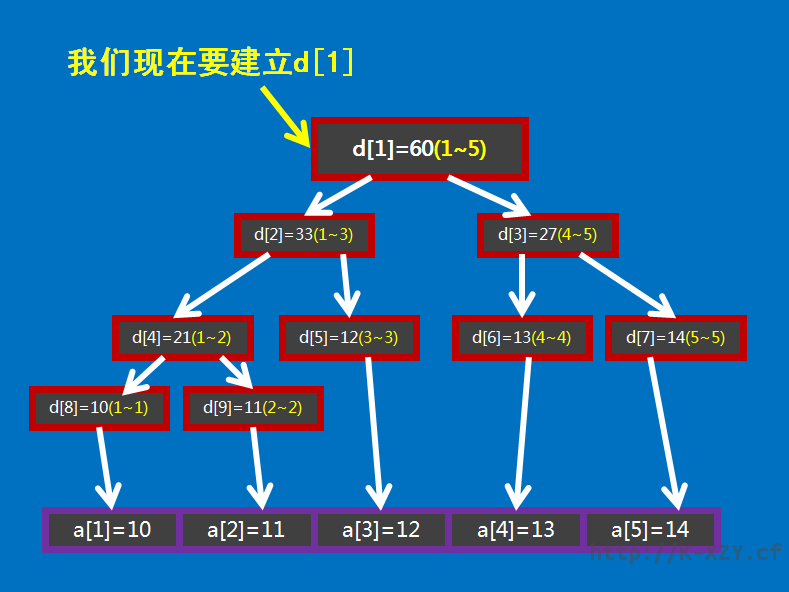

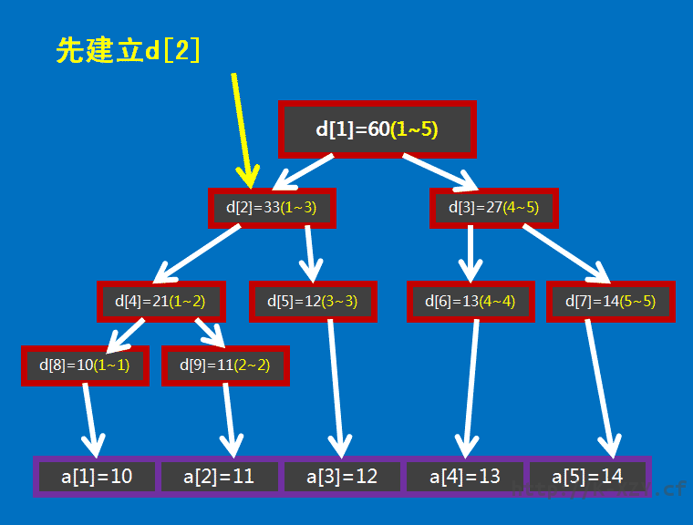

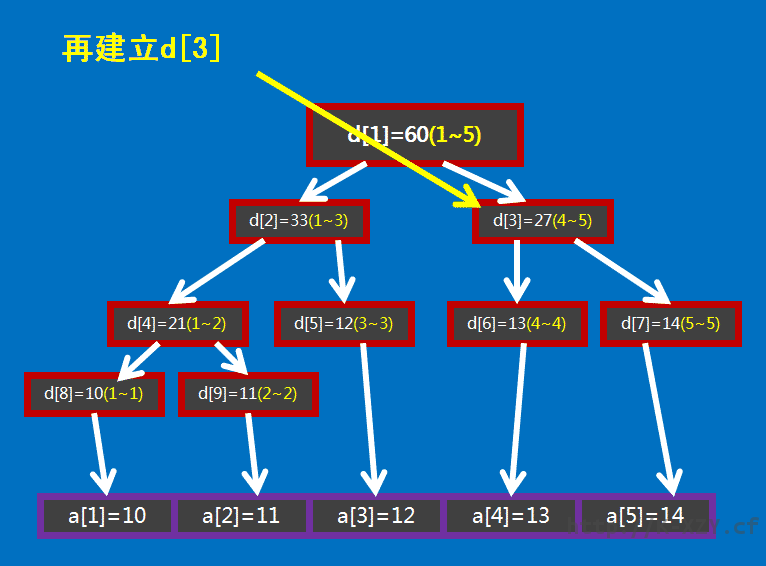

此处给出 C++ 的代码实现，可参考注释理解：

```cpp
void build(int s, int t, int p) {
  // 对 [s,t] 区间建立线段树,当前根的编号为 p
  if (s == t) {
    d[p] = a[s];
    return;
  }
  int m = s + ((t - s) >> 1);
  // 移位运算符的优先级小于加减法，所以加上括号
  // 如果写成 (s + t) >> 1 可能会时间超限
  build(s, m, p * 2), build(m + 1, t, p * 2 + 1);
  // 递归对左右区间建树
  d[p] = d[p * 2] + d[(p * 2) + 1];
}
```

关于线段树的空间：如果采用堆式存储（$2p$ 是 $p$ 的左儿子，$2p+1$ 是 $p$ 的右儿子），若有 $n$ 个叶子结点，则 d 数组的范围最大为 $2^{\left\lceil\log{n}\right\rceil+1}$。

分析：容易知道线段树的深度是 $\left\lceil\log{n}\right\rceil$ 的，则在堆式储存情况下叶子节点（包括无用的叶子节点）数量为 $2^{\left\lceil\log{n}\right\rceil}$ 个，又由于其为一棵完全二叉树，则其总节点个数 $2^{\left\lceil\log{n}\right\rceil+1}-1$。当然如果你懒得计算的话可以直接把数组长度设为 $4n$，因为 $\frac{2^{\left\lceil\log{n}\right\rceil+1}-1}{n}$ 的最大值在 $n=2^{x}+1(x\in N_{+})$ 时取到，此时节点数为 $2^{\left\lceil\log{n}\right\rceil+1}-1=2^{x+2}-1=4n-5$。

### 线段树的区间查询

区间查询，比如求区间 $[l,r]$ 的总和（即 $a_l+a_{l+1}+ \cdots +a_r$）、求区间最大值/最小值等操作。

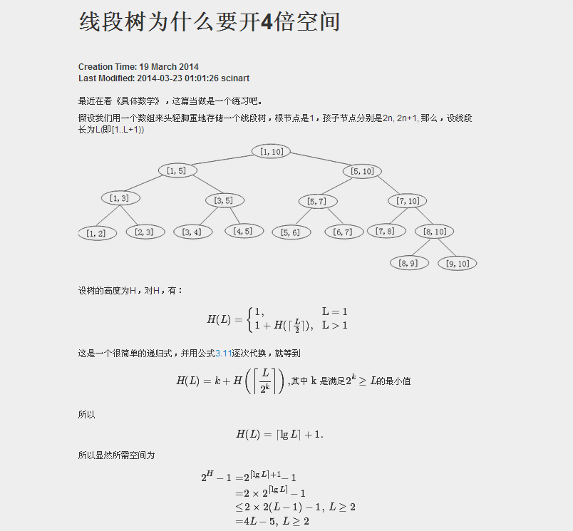

以上面这张图为例，如果要查询区间 $[1,5]$ 的和，那直接获取 $d_1$ 的值（$60$）即可。

如果要查询的区间为 $[3,5]$，此时就不能直接获取区间的值，但是 $[3,5]$ 可以拆成 $[3,3]$ 和 $[4,5]$，可以通过合并这两个区间的答案来求得这个区间的答案。

一般地，如果要查询的区间是 $[l,r]$，则可以将其拆成最多为 $O(\log n)$ 个 **极大** 的区间，合并这些区间即可求出 $[l,r]$ 的答案。

此处给出 C++ 的代码实现，可参考注释理解：

```cpp
int getsum(int l, int r, int s, int t, int p) {
  // [l,r] 为查询区间,[s,t] 为当前节点包含的区间,p 为当前节点的编号
  if (l <= s && t <= r)
    return d[p];  // 当前区间为询问区间的子集时直接返回当前区间的和
  int m = s + ((t - s) >> 1), sum = 0;
  if (l <= m) sum += getsum(l, r, s, m, p * 2);
  // 如果左儿子代表的区间 [l,m] 与询问区间有交集,则递归查询左儿子
  if (r > m) sum += getsum(l, r, m + 1, t, p * 2 + 1);
  // 如果右儿子代表的区间 [m+1,r] 与询问区间有交集,则递归查询右儿子
  return sum;
}
```

### 线段树的区间修改与懒惰标记

如果要求修改区间 $[l,r]$，把所有包含在区间 $[l,r]$ 中的节点都遍历一次、修改一次，时间复杂度无法承受。我们这里要引入一个叫做 **「懒惰标记」** 的东西。

我们设一个数组 $b$，$b_i$ 表示编号为 $i$ 的节点的懒惰标记值。为了加强对懒惰标记的理解，此处举个例子：

> A 有两个儿子，一个是 B，一个是 C。
>
> 有一天 A 要建一个新房子，没钱。刚好过年嘛，有人要给 B 和 C 红包，两个红包的钱数相同都是 $1$ 元，然而因为 A 是父亲所以红包肯定是先塞给 A 咯~
>
> 理论上来讲 A 应该把两个红包分别给 B 和 C，但是……缺钱嘛，A 就把红包偷偷收到自己口袋里了。
>
> A 高兴地说：「我现在有 $2$ 份红包了！我又多了 $2\times 1=2$ 元了！哈哈哈~」
>
> 但是 A 知道，如果他不把红包给 B 和 C，那 B 和 C 肯定会不爽然后导致家庭矛盾最后崩溃，所以 A 对儿子 B 和 C 说：「我欠你们每人 $1$ 份 $1$ 元的红包，下次有新红包给过来的时候再给你们！这里我先做下记录……嗯……我欠你们各 $1$ 元……」
>
> 儿子 B、C 有点恼怒：「可是如果有同学问起我们我们收到了多少红包咋办？你把我们的红包都收了，我们还怎么装？」
>
> 父亲 A 赶忙说：「有同学问起来我就会给你们的！我欠条都写好了不会不算话的！」
>
> 这样 B、C 才放了心。

在这个故事中我们不难看出，A 就是父亲节点，B 和 C 是 A 的儿子节点，而且 B 和 C 是叶子节点，分别对应一个数组中的值（就是之前讲的数组 $a$），我们假设节点 A 表示区间 $[1,2]$（即 $a_1+a_2$），节点 B 表示区间 $[1,1]$（即 $a_1$），节点 C 表示区间 $[2,2]$（即 $a_2$），它们的初始值都为 $0$（现在才刚开始呢，还没拿到红包，所以都没钱）。

如图：

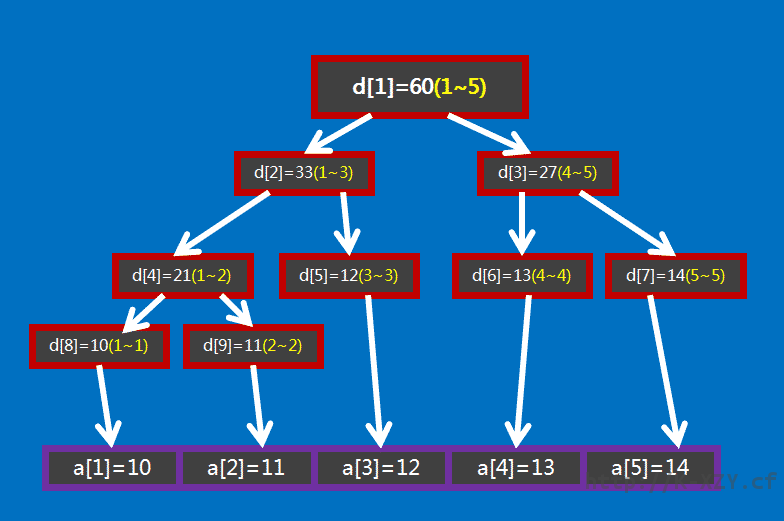


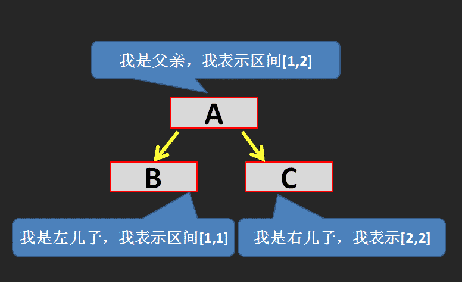

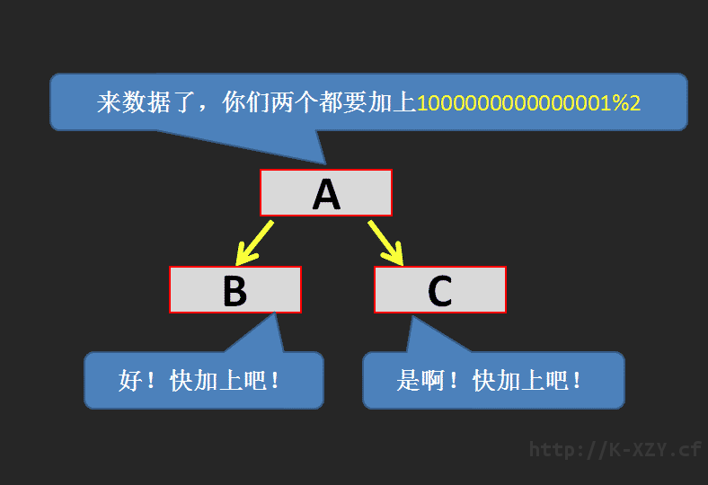

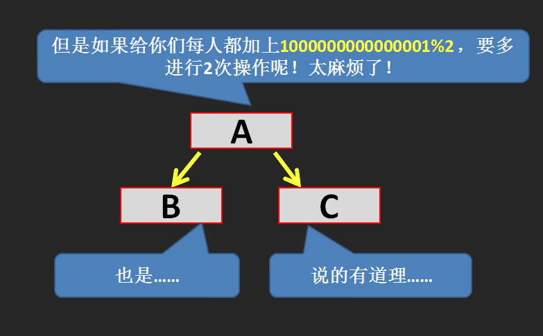

注：这里 D 表示当前节点的值（即所表示区间的区间和）。
为什么节点 A 的 D 是 $2\times 1=2$ 呢？原因很简单：节点 A 表示的区间是 $[1,2]$，一共包含 $2$ 个元素。我们是让 $[1,2]$ 这个区间的每个元素都加上 $1$，所以节点 A 的值就加上了 $2\times 1=2$ 咯。

如果这时候我们要查询区间 $[1,1]$（即节点 B 的值），A 就把它欠的还给 B，此时的操作称为 **下传懒惰标记**。

具体是这样操作（如图）：

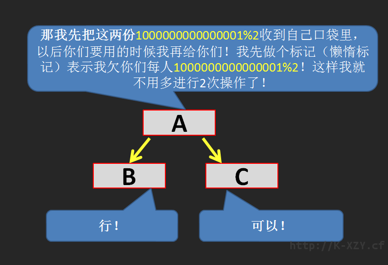

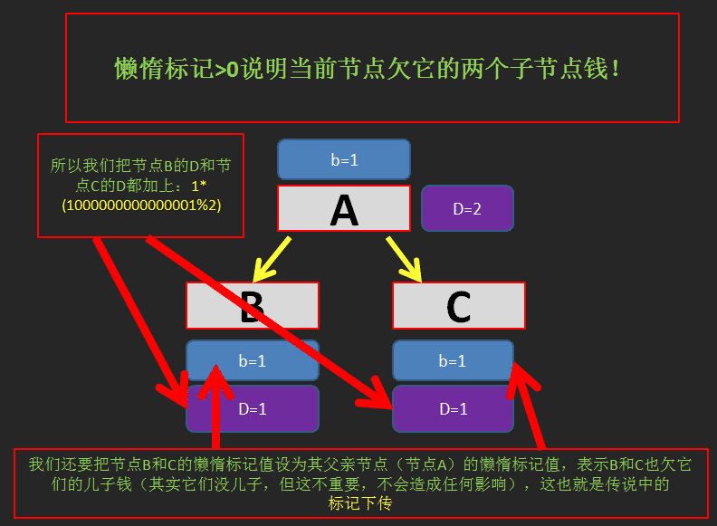

注：为什么是加上 $1\times 1=1$ 呢？因为 B 和 C 表示的区间中只有 $1$ 个元素。

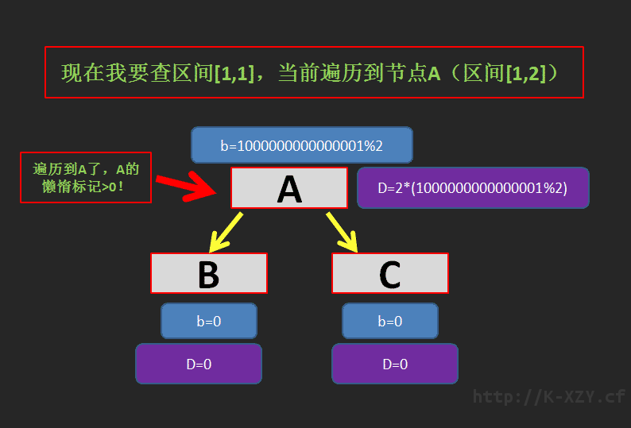

由此我们可以得到，区间 $[1,1]$ 的区间和就是 $1$。

区间修改（区间加上某个值）：

```cpp
void update(int l, int r, int c, int s, int t, int p) {
  // [l,r] 为修改区间,c 为被修改的元素的变化量,[s,t] 为当前节点包含的区间,p
  // 为当前节点的编号
  if (l <= s && t <= r) {
    d[p] += (t - s + 1) * c, b[p] += c;
    return;
  }  // 当前区间为修改区间的子集时直接修改当前节点的值,然后打标记,结束修改
  int m = s + ((t - s) >> 1);
  if (b[p] && s != t) {
    // 如果当前节点的懒标记非空,则更新当前节点两个子节点的值和懒标记值
    d[p * 2] += b[p] * (m - s + 1), d[p * 2 + 1] += b[p] * (t - m);
    b[p * 2] += b[p], b[p * 2 + 1] += b[p];  // 将标记下传给子节点
    b[p] = 0;                                // 清空当前节点的标记
  }
  if (l <= m) update(l, r, c, s, m, p * 2);
  if (r > m) update(l, r, c, m + 1, t, p * 2 + 1);
  d[p] = d[p * 2] + d[p * 2 + 1];
}
```

区间查询（区间求和）：

```cpp
int getsum(int l, int r, int s, int t, int p) {
  // [l,r] 为查询区间,[s,t] 为当前节点包含的区间,p为当前节点的编号
  if (l <= s && t <= r) return d[p];
  // 当前区间为询问区间的子集时直接返回当前区间的和
  int m = s + ((t - s) >> 1);
  if (b[p]) {
    // 如果当前节点的懒标记非空,则更新当前节点两个子节点的值和懒标记值
    d[p * 2] += b[p] * (m - s + 1), d[p * 2 + 1] += b[p] * (t - m),
        b[p * 2] += b[p], b[p * 2 + 1] += b[p];  // 将标记下传给子节点
    b[p] = 0;                                    // 清空当前节点的标记
  }
  int sum = 0;
  if (l <= m) sum = getsum(l, r, s, m, p * 2);
  if (r > m) sum += getsum(l, r, m + 1, t, p * 2 + 1);
  return sum;
}
```

如果你是要实现区间修改为某一个值而不是加上某一个值的话，代码如下：

```cpp
void update(int l, int r, int c, int s, int t, int p) {
  if (l <= s && t <= r) {
    d[p] = (t - s + 1) * c, b[p] = c;
    return;
  }
  int m = s + ((t - s) >> 1);
  if (b[p]) {
    d[p * 2] = b[p] * (m - s + 1), d[p * 2 + 1] = b[p] * (t - m),
          b[p * 2] = b[p * 2 + 1] = b[p];
    b[p] = 0;
  }
  if (l <= m) update(l, r, c, s, m, p * 2);
  if (r > m) update(l, r, c, m + 1, t, p * 2 + 1);
  d[p] = d[p * 2] + d[p * 2 + 1];
}
int getsum(int l, int r, int s, int t, int p) {
  if (l <= s && t <= r) return d[p];
  int m = s + ((t - s) >> 1);
  if (b[p]) {
    d[p * 2] = b[p] * (m - s + 1), d[p * 2 + 1] = b[p] * (t - m),
          b[p * 2] = b[p * 2 + 1] = b[p];
    b[p] = 0;
  }
  int sum = 0;
  if (l <= m) sum = getsum(l, r, s, m, p * 2);
  if (r > m) sum += getsum(l, r, m + 1, t, p * 2 + 1);
  return sum;
}
```

## 一些优化

这里总结几个线段树的优化：

- 在叶子节点处无需下放懒惰标记，所以懒惰标记可以不下传到叶子节点。

- 下放懒惰标记可以写一个专门的函数 `pushdown`，从儿子节点更新当前节点也可以写一个专门的函数 `maintain`（或者对称地用 `pushup`），降低代码编写难度。

- 标记永久化，如果确定懒惰标记不会在中途被加到溢出（即超过了该类型数据所能表示的最大范围），那么就可以将标记永久化。标记永久化可以避免下传懒惰标记，只需在进行询问时把标记的影响加到答案当中，从而降低程序常数。具体如何处理与题目特性相关，需结合题目来写。这也是树套树和可持久化数据结构中会用到的一种技巧。

## 线段树基础题推荐

### [luogu P3372【模板】线段树 1](https://www.luogu.com.cn/problem/P3372)

??? "参考代码"
    ```cpp
    #include <iostream>
    typedef long long LL;
    LL n, a[100005], d[270000], b[270000];
    void build(LL l, LL r, LL p) {
      if (l == r) {
        d[p] = a[l];
        return;
      }
      LL m = l + ((r - l) >> 1);
      build(l, m, p << 1), build(m + 1, r, (p << 1) | 1);
      d[p] = d[p << 1] + d[(p << 1) | 1];
    }
    void update(LL l, LL r, LL c, LL s, LL t, LL p) {
      if (l <= s && t <= r) {
        d[p] += (t - s + 1) * c, b[p] += c;
        return;
      }
      LL m = s + ((t - s) >> 1);
      if (b[p])
        d[p << 1] += b[p] * (m - s + 1), d[(p << 1) | 1] += b[p] * (t - m),
            b[p << 1] += b[p], b[(p << 1) | 1] += b[p];
      b[p] = 0;
      if (l <= m) update(l, r, c, s, m, p << 1);
      if (r > m) update(l, r, c, m + 1, t, (p << 1) | 1);
      d[p] = d[p << 1] + d[(p << 1) | 1];
    }
    LL getsum(LL l, LL r, LL s, LL t, LL p) {
      if (l <= s && t <= r) return d[p];
      LL m = s + ((t - s) >> 1);
      if (b[p])
        d[p << 1] += b[p] * (m - s + 1), d[(p << 1) | 1] += b[p] * (t - m),
            b[p << 1] += b[p], b[(p << 1) | 1] += b[p];
      b[p] = 0;
      LL sum = 0;
      if (l <= m) sum = getsum(l, r, s, m, p << 1);
      if (r > m) sum += getsum(l, r, m + 1, t, (p << 1) | 1);
      return sum;
    }
    int main() {
      std::ios::sync_with_stdio(0);
      LL q, i1, i2, i3, i4;
      std::cin >> n >> q;
      for (LL i = 1; i <= n; i++) std::cin >> a[i];
      build(1, n, 1);
      while (q--) {
        std::cin >> i1 >> i2 >> i3;
        if (i1 == 2)
          std::cout << getsum(i2, i3, 1, n, 1) << std::endl;
        else
          std::cin >> i4, update(i2, i3, i4, 1, n, 1);
      }
      return 0;
    }
    ```

### [luogu P3373【模板】线段树 2](https://www.luogu.com.cn/problem/P3373)

??? "参考代码"
    ```cpp
    #include <cstdio>
    #define ll long long
    ll read() {
      ll w = 1, q = 0;
      char ch = ' ';
      while (ch != '-' && (ch < '0' || ch > '9')) ch = getchar();
      if (ch == '-') w = -1, ch = getchar();
      while (ch >= '0' && ch <= '9') q = (ll)q * 10 + ch - '0', ch = getchar();
      return (ll)w * q;
    }
    int n, m;
    ll mod;
    ll a[100005], sum[400005], mul[400005], laz[400005];
    void up(int i) { sum[i] = (sum[(i << 1)] + sum[(i << 1) | 1]) % mod; }
    void pd(int i, int s, int t) {
      int l = (i << 1), r = (i << 1) | 1, mid = (s + t) >> 1;
      if (mul[i] != 1) {
        mul[l] *= mul[i];
        mul[l] %= mod;
        mul[r] *= mul[i];
        mul[r] %= mod;
        laz[l] *= mul[i];
        laz[l] %= mod;
        laz[r] *= mul[i];
        laz[r] %= mod;
        sum[l] *= mul[i];
        sum[l] %= mod;
        sum[r] *= mul[i];
        sum[r] %= mod;
        mul[i] = 1;
      }
      if (laz[i]) {
        sum[l] += laz[i] * (mid - s + 1);
        sum[l] %= mod;
        sum[r] += laz[i] * (t - mid);
        sum[r] %= mod;
        laz[l] += laz[i];
        laz[l] %= mod;
        laz[r] += laz[i];
        laz[r] %= mod;
        laz[i] = 0;
      }
      return;
    }
    void build(int s, int t, int i) {
      mul[i] = 1;
      if (s == t) {
        sum[i] = a[s];
        return;
      }
      int mid = s + ((t - s) >> 1);
      build(s, mid, i << 1);
      build(mid + 1, t, (i << 1) | 1);
      up(i);
    }
    void chen(int l, int r, int s, int t, int i, ll z) {
      int mid = s + ((t - s) >> 1);
      if (l <= s && t <= r) {
        mul[i] *= z;
        mul[i] %= mod;
        laz[i] *= z;
        laz[i] %= mod;
        sum[i] *= z;
        sum[i] %= mod;
        return;
      }
      pd(i, s, t);
      if (mid >= l) chen(l, r, s, mid, (i << 1), z);
      if (mid + 1 <= r) chen(l, r, mid + 1, t, (i << 1) | 1, z);
      up(i);
    }
    void add(int l, int r, int s, int t, int i, ll z) {
      int mid = s + ((t - s) >> 1);
      if (l <= s && t <= r) {
        sum[i] += z * (t - s + 1);
        sum[i] %= mod;
        laz[i] += z;
        laz[i] %= mod;
        return;
      }
      pd(i, s, t);
      if (mid >= l) add(l, r, s, mid, (i << 1), z);
      if (mid + 1 <= r) add(l, r, mid + 1, t, (i << 1) | 1, z);
      up(i);
    }
    ll getans(int l, int r, int s, int t, int i) {
      int mid = s + ((t - s) >> 1);
      ll tot = 0;
      if (l <= s && t <= r) return sum[i];
      pd(i, s, t);
      if (mid >= l) tot += getans(l, r, s, mid, (i << 1));
      tot %= mod;
      if (mid + 1 <= r) tot += getans(l, r, mid + 1, t, (i << 1) | 1);
      return tot % mod;
    }
    int main() {
      int i, j, x, y, bh;
      ll z;
      n = read();
      m = read();
      mod = read();
      for (i = 1; i <= n; i++) a[i] = read();
      build(1, n, 1);
      for (i = 1; i <= m; i++) {
        bh = read();
        if (bh == 1) {
          x = read();
          y = read();
          z = read();
          chen(x, y, 1, n, 1, z);
        } else if (bh == 2) {
          x = read();
          y = read();
          z = read();
          add(x, y, 1, n, 1, z);
        } else if (bh == 3) {
          x = read();
          y = read();
          printf("%lld\n", getans(x, y, 1, n, 1));
        }
      }
      return 0;
    }
    ```

### [HihoCoder 1078 线段树的区间修改](https://cn.vjudge.net/problem/HihoCoder-1078)

??? "参考代码"
    ```cpp
    #include <iostream>
    
    int n, a[100005], d[270000], b[270000];
    void build(int l, int r, int p) {
      if (l == r) {
        d[p] = a[l];
        return;
      }
      int m = l + ((r - l) >> 1);
      build(l, m, p << 1), build(m + 1, r, (p << 1) | 1);
      d[p] = d[p << 1] + d[(p << 1) | 1];
    }
    void update(int l, int r, int c, int s, int t, int p) {
      if (l <= s && t <= r) {
        d[p] = (t - s + 1) * c, b[p] = c;
        return;
      }
      int m = s + ((t - s) >> 1);
      if (b[p]) {
        d[p << 1] = b[p] * (m - s + 1), d[(p << 1) | 1] = b[p] * (t - m);
        b[p << 1] = b[(p << 1) | 1] = b[p];
        b[p] = 0;
      }
      if (l <= m) update(l, r, c, s, m, p << 1);
      if (r > m) update(l, r, c, m + 1, t, (p << 1) | 1);
      d[p] = d[p << 1] + d[(p << 1) | 1];
    }
    int getsum(int l, int r, int s, int t, int p) {
      if (l <= s && t <= r) return d[p];
      int m = s + ((t - s) >> 1);
      if (b[p]) {
        d[p << 1] = b[p] * (m - s + 1), d[(p << 1) | 1] = b[p] * (t - m);
        b[p << 1] = b[(p << 1) | 1] = b[p];
        b[p] = 0;
      }
      int sum = 0;
      if (l <= m) sum = getsum(l, r, s, m, p << 1);
      if (r > m) sum += getsum(l, r, m + 1, t, (p << 1) | 1);
      return sum;
    }
    int main() {
      std::ios::sync_with_stdio(0);
      std::cin >> n;
      for (int i = 1; i <= n; i++) std::cin >> a[i];
      build(1, n, 1);
      int q, i1, i2, i3, i4;
      std::cin >> q;
      while (q--) {
        std::cin >> i1 >> i2 >> i3;
        if (i1 == 0)
          std::cout << getsum(i2, i3, 1, n, 1) << endl;
        else
          std::cin >> i4, update(i2, i3, i4, 1, n, 1);
      }
      return 0;
    }
    ```

### [2018 Multi-University Training Contest 5 Problem G. Glad You Came](http://acm.hdu.edu.cn/showproblem.php?pid=6356)

维护一下每个区间的永久标记就可以了，最后在线段树上跑一边 dfs 统计结果即可。注意打标记的时候加个剪枝优化，否则会 T。

## 拓展 - 猫树

众所周知线段树可以支持高速查询某一段区间的信息和，比如区间最大子段和，区间和，区间矩阵的连乘积等等。

但是有一个问题在于普通线段树的区间询问在某些毒瘤的眼里可能还是有些慢了。

简单来说就是线段树建树的时候需要做 $O(n)$ 次合并操作，而每一次区间询问需要做 $O(\log{n})$ 次合并操作，询问区间和这种东西的时候还可以忍受，但是当我们需要询问区间线性基这种合并复杂度高达 $O(\log^2{w})$ 的信息的话，此时就算是做 $O(\log{n})$ 次合并有些时候在时间上也是不可接受的。

而所谓 "猫树" 就是一种不支持修改，仅仅支持快速区间询问的一种静态线段树。

构造一棵这样的静态线段树需要 $O(n\log{n})$ 次合并操作，但是此时的查询复杂度被加速至 $O(1)$ 次合并操作。

在处理线性基这样特殊的信息的时候甚至可以将复杂度降至 $O(n\log^2{w})$。

### 原理

在查询 $[l,r]$ 这段区间的信息和的时候，将线段树树上代表 $[l,l]$ 的节点和代表 $[r,r]$ 这段区间的节点在线段树上的 lca 求出来，设这个节点 $p$ 代表的区间为 $[L,R]$，我们会发现一些非常有趣的性质：

**1.$[L,R]$ 这个区间一定包含 $[l,r]$**

显然，因为它既是 $l$ 的祖先又是 $r$ 的祖先。

**2.$[l,r]$ 这个区间一定跨越 $[L,R]$ 的中点**

由于 $p$ 是 $l$ 和 $r$ 的 lca，这意味着 $p$ 的左儿子是 $l$ 的祖先而不是 $r$ 的祖先，$p$ 的右儿子是 $r$ 的祖先而不是 $l$ 的祖先。

因此 $l$ 一定在 $[L,MID]$ 这个区间内，$r$ 一定在 $(MID,R]$ 这个区间内。

有了这两个性质，我们就可以将询问的复杂度降至 $O(1)$ 了。

### 实现

具体来讲我们建树的时候对于线段树树上的一个节点，设它代表的区间为 $(l,r]$。

不同于传统线段树在这个节点里只保留 $[l,r]$ 的和，我们在这个节点里面额外保存 $(l,mid]$ 的后缀和数组和 $(mid,r]$ 的前缀和数组。

这样的话建树的复杂度为 $T(n)=2T(n/2)+O(n)=O(n\log{n})$ 同理空间复杂度也从原来的 $O(n)$ 变成了 $O(n\log{n})$。

下面是最关键的询问了~

如果我们询问的区间是 $[l,r]$ 那么我们把代表 $[l,l]$ 的节点和代表 $[r,r]$ 的节点的 lca 求出来，记为 $p$。

根据刚才的两个性质，$l,r$ 在 $p$ 所包含的区间之内并且一定跨越了 $p$ 的中点。

这意味这一个非常关键的事实是我们可以使用 $p$ 里面的前缀和数组和后缀和数组，将 $[l,r]$ 拆成 $[l,mid]+(mid,r]$ 从而拼出来 $[l,r]$ 这个区间。

而这个过程仅仅需要 $O(1)$ 次合并操作！

不过我们好像忽略了点什么？

似乎求 lca 的复杂度似乎还不是 $O(1)$，暴力求是 $O(\log{n})$ 的，倍增法则是 $O(\log{\log{n}})$ 的，转 ST 表的代价又太大……

### 堆式建树

具体来将我们将这个序列补成 2 的整次幂，然后建线段树。

此时我们发现线段树上两个节点的 lca 编号，就是两个节点二进制编号的 lcp。

稍作思考即可发现发现在 $x$ 和 $y$ 的二进制下 `lcp(x,y)=x>>log[x^y]`。

所以我们预处理一个 `log` 数组即可轻松完成求 lca 的工作。

这样我们就完成了一个猫树。

由于建树的时候涉及到求前缀和和求后缀和，所以对于线性基这种虽然合并是 $O(\log^2{w})$ 但是求前缀和却是 $O(n\log{n})$ 的信息，使用猫树可以将静态区间线性基从 $O(n\log^2{w}+m\log^2{w}\log{n})$ 优化至 $O(n\log{n}\log{w}+m\log^2{w})$ 的复杂度。

### 参考

- [immortalCO 大爷的博客](https://immortalco.blog.uoj.ac/blog/2102)
- [\[Kle77\]](http://ieeexplore.ieee.org/document/1675628/) V. Klee,“Can the Measure of be Computed in Less than O (n log n) Steps?,”Am. Math. Mon., vol. 84, no. 4, pp. 284–285, Apr. 1977.
- [\[BeW80\]](https://www.tandfonline.com/doi/full/10.1080/00029890.1977.11994336) Bentley and Wood,“An Optimal Worst Case Algorithm for Reporting Intersections of Rectangles,”IEEE Trans. Comput., vol. C–29, no. 7, pp. 571–577, Jul. 1980.
