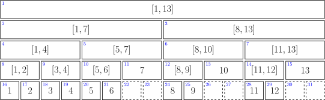
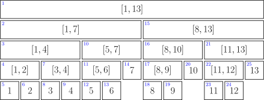
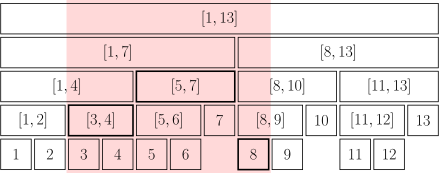
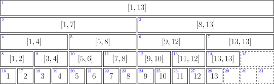

author: Ir1d, hsfzLZH1, Tiphereth-A, ksyx, Marcythm, StudyingFather, Xeonacid, ChungZH, Early0v0, chenryang, Enter-tainer, CCXXXI, cjsoft, HeRaNO, konnyakuxzy, NachtgeistW, orzAtalod, wy-luke, amlhdsan, billchenchina, c-forrest, Chrogeek, countercurrent-time, ethan-enhe, GavinZhengOI, H-J-Granger, iamtwz, luoguojie, AKindMouse, AngelKitty, chenzheAya, CJSoft, DawnMagnet, diauweb, ezoixx130, GekkaSaori, Gesrua, Haohu Shen, Henry-ZHR, hjsjhn, hly1204, jaxvanyang, Jebearssica, kenlig, Konano, kxccc, LovelyBuggies, lychees, Makkiy, megakite, Menci, mgt, minghu6, moon-dim, onelittlechildawa, ouuan, P-Y-Y, Peanut-Tang, PotassiumWings, SamZhangQingChuan, shadowice1984, shawlleyw, shuzhouliu, sshwy, SukkaW, Suyun514, weiyong1024, x2e6, Ycrpro, yifan0305, zeningc

## 引入

线段树是算法竞赛中常用的用来维护 **区间信息** 的数据结构。

线段树可以在 $O(\log N)$ 的时间复杂度内实现单点修改、单点查询、区间修改、区间查询等操作。

## 基本结构与操作

线段树是一棵二叉树。它的每个结点都存储一段区间的信息：

-   叶结点处存储的是单个元素 $x$ 处的信息，也可以看作是长度为 $1$ 的区间 $[x,x]$ 上的信息。
-   以非叶结点 $x$ 为根的子树的叶结点构成一段连续的区间 $[l,r]$。那么，结点 $x$ 处就存储区间 $[l,r]$ 上的信息。

对于有两个子结点的非叶结点，它对应的区间就恰为两个子结点对应区间的不交并。设某个非叶结点存储区间 $[l,r]$ 上的信息且 $l < r$，那么，它的两个子结点存储的就分别是 $[l,m]$ 和 $[m+1,r]$ 上的信息，其中，$l \le m < r$。

线段树的根结点处就存储着整段区间 $[L,R]$ 上的信息。线段树的规模用该区间的长度 $N = R - L + 1$ 表示。

### 区间信息

线段树可以维护区间信息。本节介绍区间信息需要满足的常见性质以及相应的实现方法。

一般地，区间信息是以区间为自变量的函数 $\varphi:\mathcal I\rightarrow M$，其中，$\mathcal I$ 表示 $[L,R]$ 的所有子区间。线段树存储的区间信息需要满足如下性质：

1.  将一段区间划分成两段子区间，相应的信息也可以从子区间信息合并得到。也就是说，如果设 $I$ 是 $I_1$ 和 $I_2$ 的不交并，那么 $\varphi(I)=\varphi(I_1)\circ\varphi(I_2)$，其中，运算 $\circ$ 表示信息合并操作。
2.  将一段区间划分为多段子区间的不交并，这些子区间信息合并的结果与合并顺序、划分方式都无关，都等于最开始一段区间的信息。也就是说，运算 $\circ$ 满足结合律。
3.  空区间 $\varnothing$ 也有良定义的信息 $e=\varphi(\varnothing)$。而且，因为任何区间 $I$ 都可以看作是它自身与空区间 $\varnothing$ 的不交并，所以任何区间信息与空区间信息的合并都保持不变。也就是说，$\varphi(I)\circ e = e\circ\varphi(I) = \varphi(I)$。这说明 $e$ 是运算 $\circ$ 的单位元。

这些性质保证，要查询区间 $I$ 对应的信息时，只要能够找到一系列结点，使得它们对应的区间构成 $I$ 的划分，就能从这些结点存储的信息中合并出区间 $I$ 的信息。

区间信息可以合并，合并操作满足结合律，且存在单位元。这些性质意味着区间信息的集合 $M$ 在合并操作 $\circ$ 下构成一个 [幺半群](../math/algebra/basic.md#群)。在给出线段树操作的参考实现时，本文假设区间信息存储在 `Info` 结构体中，它的默认构造函数返回单位元，且它重载了加法运算符用于实现合并操作。

???+ example "例子"
    满足幺半群性质的区间信息有很多。区间和、区间乘积、区间最大（小）值都是一些简单的例子。它们对应的幺半群分别是 $(\mathbf R,+),(\mathbf R,\times),(\mathbf R,\max)$，对应的幺元则分别是 $0,1,-\infty$。这些例子可以拓展到其他常见的符合幺半群性质的操作，例如按位取异或、矩阵乘法、函数复合等。
    
    还有一些更为复杂的例子。例如，区间最大（非空）子段和同样可以通过幺半群来维护。当然，如果只维护最大子段和这一个变量，是无法进行合并操作的。对于划分 $I = I_1 \cup I_2$，区间 $I$ 的最大子段和可能在区间 $I_1$ 的子区间处取得，可能在区间 $I_2$ 的子区间处取得，也可能在某个横跨 $I_1$ 和 $I_2$ 的子区间处取得。为了计算最后一种情况对应的最大值，需要分别记录区间和、区间最大（非空）前缀和、区间最大（非空）后缀和。

需要注意的是，区间信息的合并未必满足交换律。当执行合并操作时，需要严格按照子区间的顺序进行。

### 递归建树与存储方式

为了尽可能地减小树高，需要将当前结点的区间尽可能均匀地分成两段。为此，常选取

$$
m = \left\lfloor\dfrac{l + r}{2}\right\rfloor.
$$

这样，如果当前结点区间长度为 $n > 1$，它的两个子结点就分别对应长度为 $\lceil n/2\rceil$ 和 $\lfloor n/2\rfloor$ 的区间。由此得到的线段树高度是 $\lceil\log_2N\rceil + 1$。这就保证了线段树是平衡二叉树，单点操作的复杂度总是 $O(\log N)$ 的。


存储长度为 $N$ 的区间上的信息，需要建立有 $N$ 个叶结点的线段树。作为满二叉树，线段树恰有 $2N-1$ 个存储信息的结点。这说明线段树的空间复杂度是 $\Theta(N)$ 的。

虽然线段树的结构相对固定，但是它的存储方式却并不唯一。



第一种常见的方式是堆式存储（如上图所示），即将线段树嵌入完美二叉树中。此时，根结点编号为 $1$；如果当前结点编号是 $i$，那么它的左右子结点编号分别是 $2i$ 和 $2i+1$。因为树高为 $\lceil\log_2N\rceil + 1$，所以这样存储线段树需要开长度为 $2^{\lceil\log_2N\rceil + 1}$ 的数组。为计算简便，通常会直接开长度为 $4N$ 的数组[^heap-size]。这样存储的长处是无需额外存储子结点编号，短处则是存在部分无用结点，空间利用效率不高。



第二种常见的方式是利用内存池，动态地指定结点编号。因为线段树形态固定，只要在建树的时候分配一次结点编号即可。这样做保证了没有无用结点，只需要开出长度为 $2N$ 的数组。此时，结点编号是线段树前序遍历的序号。但是，由于（右）子结点的编号无法仅由当前结点编号计算，需要额外分配总长度为 $4N$ 的数组存储左右子结点编号。如果设存储单个编号需要的空间为 $1$，存储单个结点需要的空间为 $K$，那么，只要 $2NK + 4N \le 4NK$，即 $K \ge 2$ 时，动态分配就比堆式存储占用更小的空间。

### 单点修改与查询

线段树操作中，最简单的就是单点操作。

首先考虑单点查询操作。线段树中，叶结点的编号是有序排列的。所以，当递归到非叶结点时，只需要比较要查询的编号和当前区间中点，就可以决定继续访问左子结点还是右子结点。当找到叶结点时，返回该叶结点处存储的信息即可。这就完成了单点查询操作。

单点修改操作类似。同样是自上而下地找到要访问的叶结点。然后，对该叶结点进行修改操作。之后，仍需要在回溯时，相应地更新该叶结点的所有祖先结点的信息。这就是单点修改操作。由于所有对单点的修改操作都可以看作是将它的值进行替换，所以这里仅提供了更改值的参考实现。区间修改操作一节讨论了更一般的修改操作。

由于树高是 $\Theta(\log N)$ 的，线段树的单点操作都是 $O(\log N)$ 的。

### 区间查询

接下来，考虑区间查询操作。



前文已经说明，只要将要查询的区间拆分成若干个线段树结点对应的区间的不交并，然后将这些结点处的信息依次合并到一起即可。当然，拆分出的结点越少越好。这就要求拆分出的结点对应的是包含在查询区间内的极大区间。上图中，浅色区域标记查询区间，粗边结点就标记了相应的极大区间对应结点。要找到这些极大区间对应结点也很容易：从根结点开始向下遍历所有对应区间与查询区间有交集的结点，那些完全包含在查询区间内的结点就是这些极大区间对应结点。

可以说明，在区间查询过程中遍历到的所有结点——所有极大区间结点及其祖先结点——的总数是 $O(\log N)$ 的。因此，区间查询的复杂度也是 $O(\log N)$ 的。

### 区间修改与懒惰标记

最后，考虑区间修改操作。

与区间查询操作不同的是，区间修改操作不能只修改极大区间结点及其祖先结点。这是因为区间修改操作会影响极大区间的子区间，也就是相应结点的子孙结点。如果要修改区间波及的所有结点，复杂度显然过高，并不现实。因此，实现区间修改操作时，采取了 **懒惰标记**（lazy tag）的思想。具体地，每次区间操作修改操作仅实际修改极大区间结点及其祖先结点，而对极大区间结点子孙结点的修改则推迟到有必要的时候再进行。为了记录后续需要进行的修改操作，还需要在极大区间结点处留下一个标记。这个标记记录了对其子孙结点（不包括自身）需要进行但是尚未进行的操作。它就是懒惰标记。注意，本文假定，带有懒惰标记的结点自身的修改已经完成。这并非强制要求，可能会因实现而异。

在支持区间修改操作的线段树中，其他操作的实现也需要相应调整。对线段树进行所有操作时，当需要访问某结点的子结点时，都要检查是否存在尚未清空的懒惰标记。如果存在，需要先下传该懒惰标记，再继续访问子结点或进行其他操作。所谓下传懒惰标记，就是指对该结点的子结点进行相应修改操作，同时给相应的子结点打上懒惰标记。单次下传操作的复杂度通常是 $O(1)$ 的。

除了上述操作步骤外，区间修改操作还涉及修改操作的记录问题。由于执行区间修改操作时，相应结点可能已经存在未清空的懒惰标记，所以不能直接覆盖标记，而需要讨论如何更新已存在的标记。仍然设线段树记录的区间信息可以总结为函数 $\varphi:\mathcal I\rightarrow M$。进一步地，设修改操作是 $\pi:M\rightarrow M$，它将旧信息依某种规则变化为新信息。由此，可以总结出区间修改操作需要满足如下性质：

1.  它是良定义的。也就是说，区间修改的结果只与信息 $m\in M$ 有关，而与所处区间 $I\in\mathcal I$ 无关。对于区间修改结果涉及所处区间特征的情形，可以将区间特征（例如区间长度、左右端点等）视为区间信息的一部分。
2.  修改操作必须要与区间信息的合并相兼容。也就是说，如果某区间信息可以由子区间信息合并得到，那么对该区间进行修改操作得到的结果，仍然可以由对子区间信息进行修改操作得到的结果合并得到，亦即对于 $m_1,m_2\in M$，总是有 $\pi(m_1\circ m_2) = \pi(m_1)\circ\pi(m_2)$。

这说明，修改操作是幺半群 $M$ 上的 [自同态映射](../math/algebra/group-theory.md#群同态)。考虑这些修改操作形成的集合 $\Pi$，它对映射复合封闭、满足结合律且有单位元，所以 $\Pi$ 也是一个幺半群。在给出线段树操作的参考实现时，本文假设修改操作存储在 `Transform` 结构体中，默认构造函数返回恒等操作，它重载了加法运算符用于实现复合操作，且它重载了括号运算符用于修改区间信息。

### 参考实现

## 常见技巧

### 非递归实现

前文介绍了递归实现的线段树。



第三种常见的方式仍然是要将线段树嵌入完美二叉树中。与堆式存储不同的是，第三种方法自下而上地建树。首先，它将线段树的所有叶结点都存储在完美二叉树中深度为 $\lceil\log_2N\rceil + 1$ 的位置。完美二叉树中多余的叶结点置空即可，可以看作是空区间对应信息。然后，自上而下地遍历完美二叉树的非叶结点，将子结点的信息合并到当前结点中。这样仍然可以得到一棵线段树。这样建立的线段树和前两种方式建立的线段树结构略有差异，但功能一致。自下而上建树的好处是，可以根据叶结点编号快速地计算它的祖先结点编号。所以，线段树的操作不再需要自上而下递归地实现，而是可以直接自下而上地计算。缺点是它仍然需要开辟长度约为 $4N$ 的数组。

线段树的存储方式不同，相对应的实现方式也略有不同。前两种方法存储的线段树方便自上而下地访问，多用于递归实现线段树操作；第三种方法存储的线段树方便自下而上地访问，可以非递归地实现线段树操作。由于省去了递归的损耗，非递归实现往往效率更高。但是，非递归实现不支持动态开点。

### 动态开点线段树

前面讲到堆式储存的情况下，需要给线段树开 $4n$ 大小的数组。为了节省空间，我们可以不一次性建好树，而是在最初只建立一个根结点代表整段区间。当我们需要访问某个子区间时，才建立代表这段区间的子结点。这样我们不再使用 $2p$ 和 $2p+1$ 代表 $p$ 结点的儿子，而是用 $\text{ls}$ 和 $\text{rs}$ 记录儿子的编号。总之，动态开点线段树的核心思想就是：**结点只有在有需要的时候才被创建**。

单次操作的时间复杂度是不变的，为 $O(\log n)$。由于每次操作都有可能创建并访问全新的一系列结点，因此 $m$ 次单点操作后结点的数量规模是 $O(m\log n)$。最多也只需要 $2n-1$ 个结点，没有浪费。

单点修改：

```cpp
// root 表示整棵线段树的根结点；cnt 表示当前结点个数
int n, cnt, root;
int sum[n * 2], ls[n * 2], rs[n * 2];

// 用法：update(root, 1, n, x, f); 其中 x 为待修改结点的编号
void update(int& p, int s, int t, int x, int f) {  // 引用传参
  if (!p) p = ++cnt;  // 当结点为空时，创建一个新的结点
  if (s == t) {
    sum[p] += f;
    return;
  }
  int m = s + ((t - s) >> 1);
  if (x <= m)
    update(ls[p], s, m, x, f);
  else
    update(rs[p], m + 1, t, x, f);
  sum[p] = sum[ls[p]] + sum[rs[p]];  // pushup
}
```

区间询问：

```cpp
// 用法：query(root, 1, n, l, r);
int query(int p, int s, int t, int l, int r) {
  if (!p) return 0;  // 如果结点为空，返回 0
  if (s >= l && t <= r) return sum[p];
  int m = s + ((t - s) >> 1), ans = 0;
  if (l <= m) ans += query(ls[p], s, m, l, r);
  if (r > m) ans += query(rs[p], m + 1, t, l, r);
  return ans;
}
```

区间修改也是一样的，不过下放标记时要注意如果缺少孩子，就直接创建一个新的孩子。或者使用标记永久化技巧。

### 标记永久化

如果确定懒惰标记不会在中途被加到溢出（即超过了该类型数据所能表示的最大范围），那么就可以将标记永久化。标记永久化可以避免下传懒惰标记，只需在进行询问时把标记的影响加到答案当中，从而降低程序常数。具体如何处理与题目特性相关，需结合题目来写。这也是树套树和可持久化数据结构中会用到的一种技巧。

### 线段树二分

## 一些优化

这里总结几个线段树的优化：

-   在叶结点处无需下放懒惰标记，所以懒惰标记可以不下传到叶结点。

-   下放懒惰标记可以写一个专门的函数 `pushdown`，从儿子结点更新当前结点也可以写一个专门的函数 `maintain`（或者对称地用 `pushup`），降低代码编写难度。

## 例题

???+ note "[luogu P3372【模板】线段树 1](https://www.luogu.com.cn/problem/P3372)"
    已知一个数列，你需要进行下面两种操作：
    
    -   将某区间每一个数加上 $k$。
    
    -   求出某区间每一个数的和。
    
    ??? note "参考代码"
        ```cpp
        --8<-- "docs/ds/code/seg/seg_1.cpp"
        ```

???+ note "[luogu P3373【模板】线段树 2](https://www.luogu.com.cn/problem/P3373)"
    已知一个数列，你需要进行下面三种操作：
    
    -   将某区间每一个数乘上 $x$。
    
    -   将某区间每一个数加上 $x$。
    
    -   求出某区间每一个数的和。
    
    ??? note "参考代码"
        ```cpp
        --8<-- "docs/ds/code/seg/seg_2.cpp"
        ```

???+ note "[HihoCoder 1078 线段树的区间修改](https://vjudge.net/problem/HihoCoder-1078)"
    假设货架上从左到右摆放了 $N$ 种商品，并且依次标号为 $1$ 到 $N$，其中标号为 $i$ 的商品的价格为 $Pi$。小 Hi 的每次操作分为两种可能，第一种是修改价格：小 Hi 给出一段区间 $[L, R]$ 和一个新的价格 $\textit{NewP}$，所有标号在这段区间中的商品的价格都变成 $\textit{NewP}$。第二种操作是询问：小 Hi 给出一段区间 $[L, R]$，而小 Ho 要做的便是计算出所有标号在这段区间中的商品的总价格，然后告诉小 Hi。
    
    ??? note "参考代码"
        ```cpp
        --8<-- "docs/ds/code/seg/seg_3.cpp"
        ```

???+ note "[2018 Multi-University Training Contest 5 Problem G. Glad You Came](https://acm.hdu.edu.cn/showproblem.php?pid=6356)"
    ??? note "解题思路"
        维护一下每段区间的永久标记就可以了，最后在线段树上跑一边 DFS 统计结果即可。注意打标记的时候加个剪枝优化，否则会 TLE。

## 拓展

线段树应用十分广泛，常见的拓展和变体如下：

-   [可持久化线段树](./persistent-seg.md)
-   各类树套树：
    -   [线段树套线段树](./seg-in-seg.md)
    -   [树状数组套线段树](./seg-in-bit.md)
    -   [线段树套平衡树](./balanced-in-seg.md)
    -   [平衡树套树状数组](./seg-in-balanced.md)
-   [李超线段树](./li-chao-tree.md)
-   [猫树](./cat-tree.md)
-   [吉司机线段树](./seg-beats.md)

详细内容请参阅相关页面。

## 应用：线段树优化建图

在建图连边的过程中，我们有时会碰到这种题目，一个点向一段连续的区间中的点连边或者一个连续的区间向一个点连边，如果我们真的一条一条连过去，那一旦点的数量多了复杂度就爆炸了，这里就需要用线段树的区间性质来优化我们的建图了。

下面是一个线段树。


每个结点都代表了一段区间，假设我们要向区间 $[2, 4]$ 连边。


在一些题目中，还会出现一段区间连向一个点的情况，则我们将上面第一张图的有向边全部反过来即可，上面的树叫做入树，下面这个叫做出树。


???+ note "[Legacy](https://codeforces.com/problemset/problem/786/B)"
    题目大意：有 $n$ 个点、$q$ 次操作。每一种操作为以下三种类型中的一种：
    
    -   操作一：连一条 $u \rightarrow v$ 的有向边，权值为 $w$。
    -   操作二：对于所有 $i \in [l,r]$ 连一条 $u \rightarrow i$ 的有向边，权值为 $w$。
    -   操作三：对于所有 $i \in [l,r]$ 连一条 $i \rightarrow u$ 的有向边，权值为 $w$。
    
    求从点 $s$ 到其他点的最短路。
    
    $1 \le n,q \le 10^5, 1 \le w \le 10^9$。
    
    ??? note "参考代码"
        ```cpp
        --8<-- "docs/ds/code/seg/seg_8.cpp"
        ```

## 练习题目

-   [luogu P3372【模板】线段树 1](https://www.luogu.com.cn/problem/P3372)
-   [luogu P13825 线段树 1.5【动态开点线段树】](https://www.luogu.com.cn/problem/P13825)
-   [luogu P3373【模板】线段树 2](https://www.luogu.com.cn/problem/P3373)
-   [luogu P4588【TJOI2018】数学计算](https://www.luogu.com.cn/problem/P4588)
-   [luogu P5490【模板】扫描线 & 矩形面积并](https://www.luogu.com.cn/problem/P5490)
-   [luogu P1471 方差](https://www.luogu.com.cn/problem/P1471)

## 参考资料与注释

-   [统计的力量 - 张昆玮](https://github.com/hzwer/shareOI/blob/master/%E6%95%B0%E6%8D%AE%E7%BB%93%E6%9E%84/%E7%BB%9F%E8%AE%A1%E7%9A%84%E5%8A%9B%E9%87%8F%E2%80%94%E2%80%94%E7%BA%BF%E6%AE%B5%E6%A0%91%E5%85%A8%E6%8E%A5%E8%A7%A6_%E5%BC%A0%E6%98%86%E7%8E%AE.pptx)

[^heap-size]: 考察二叉树占用的空间 $2^{\lceil\log_2N\rceil+1}$ 与线段树规模 $N$ 的比值。前者只与二叉树的高度有关。当线段树高度为 $k$ 时，线段树的最小规模为 $N = 2^{k-2}+1$。相应地，二者比值为 $(4N-4)/N = 4 - 4/N$，上确界为 $4$。这就是为什么存储规模为 $N$ 的线段树时，需要为相应的完美二叉树开辟大小为 $4N$ 的数组。
