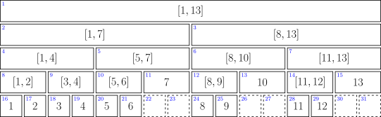
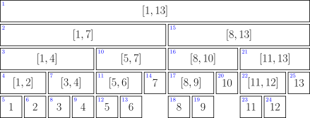
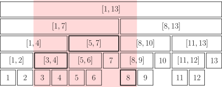
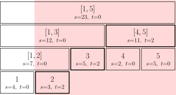
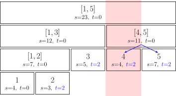
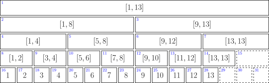
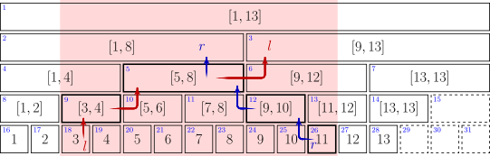
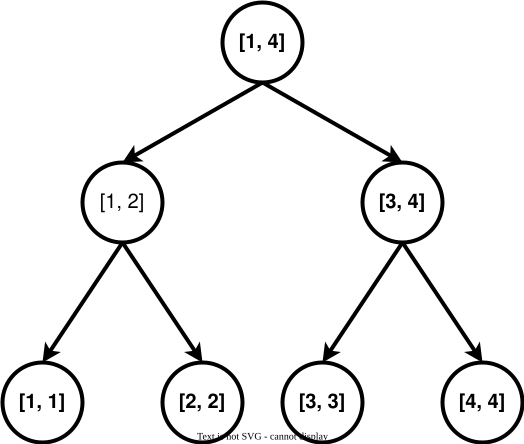
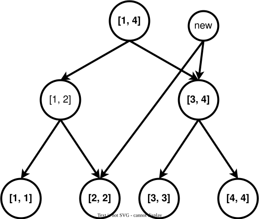

author: Ir1d, hsfzLZH1, Tiphereth-A, ksyx, Marcythm, StudyingFather, Xeonacid, ChungZH, Early0v0, chenryang, Enter-tainer, CCXXXI, cjsoft, HeRaNO, konnyakuxzy, NachtgeistW, orzAtalod, wy-luke, amlhdsan, billchenchina, c-forrest, Chrogeek, countercurrent-time, ethan-enhe, GavinZhengOI, H-J-Granger, iamtwz, luoguojie, AKindMouse, AngelKitty, chenzheAya, CJSoft, DawnMagnet, diauweb, ezoixx130, GekkaSaori, Gesrua, Haohu Shen, Henry-ZHR, hjsjhn, hly1204, jaxvanyang, Jebearssica, kenlig, Konano, kxccc, LovelyBuggies, lychees, Makkiy, megakite, Menci, mgt, minghu6, moon-dim, onelittlechildawa, ouuan, P-Y-Y, Peanut-Tang, PotassiumWings, SamZhangQingChuan, shadowice1984, shawlleyw, shuzhouliu, sshwy, SukkaW, Suyun514, weiyong1024, x2e6, Ycrpro, yifan0305, zeningc

## 引入

线段树是算法竞赛中常用的用来维护 **区间信息** 的数据结构．

线段树可以在 $O(\log N)$ 的时间复杂度内实现单点修改、单点查询、区间修改、区间查询等操作．

## 基本结构与操作

线段树是一棵二叉树．它的每个结点都存储一段区间的信息：

-   叶结点处存储的是单个元素 $x$ 处的信息，也可以看作是长度为 $1$ 的区间 $[x,x]$ 上的信息．
-   以非叶结点 $x$ 为根的子树的叶结点构成一段连续的区间 $[l,r]$．那么，结点 $x$ 处就存储区间 $[l,r]$ 上的信息．

对于有两个子结点的非叶结点，它对应的区间就恰为两个子结点对应区间的不交并．设某个非叶结点存储区间 $[l,r]$ 上的信息且 $l < r$，那么，它的两个子结点存储的就分别是 $[l,m]$ 和 $[m+1,r]$ 上的信息，其中，$l \le m < r$．

线段树的根结点处就存储着整段区间 $[L,R]$ 上的信息．线段树的规模用该区间的长度 $N = R - L + 1$ 表示．

### 区间信息

线段树可以维护区间信息．本节介绍区间信息需要满足的常见性质以及相应的实现方法．

一般地，**区间信息** 是以区间为自变量的函数 $\varphi:\mathcal I\rightarrow M$，其中，$\mathcal I$ 表示 $[L,R]$ 的所有子区间（包括空区间），$M$ 表示区间信息可以取值的空间——本文称 **信息空间**．线段树存储的区间信息 $\varphi$ 需要满足如下性质：

1.  将一段区间划分成两段子区间，相应的信息也可以从子区间信息合并得到．也就是说，如果设 $I$ 是 $I_1$ 和 $I_2$ 的不交并，且 $I_1$ 位于 $I_2$ 左侧，那么 $\varphi(I)=\varphi(I_1)\circ\varphi(I_2)$，其中，运算 $\circ$ 表示 **信息合并** 操作．
2.  将一段区间划分为多段子区间的不交并，这些子区间信息合并的结果与划分和结合的方式都无关，都等于最开始一段区间的信息．也就是说，运算 $\circ$ 满足结合律．
3.  空区间 $\varnothing$ 也有良定义的信息 $e=\varphi(\varnothing)$．而且，因为任何区间 $I$ 都可以看作是它自身与空区间 $\varnothing$ 的不交并，所以任何区间信息与空区间信息的合并都保持不变．也就是说，$\varphi(I)\circ e = e\circ\varphi(I) = \varphi(I)$．这说明 $e$ 是运算 $\circ$ 的单位元．

这些性质保证，要查询区间 $I$ 对应的信息时，只要能够找到一系列结点，使得它们对应的区间构成 $I$ 的划分，就能从这些结点存储的信息中合并出区间 $I$ 的信息．

区间信息可以合并，合并操作满足结合律，且存在单位元．这些性质意味着信息空间 $M$ 在信息合并操作 $\circ$ 下构成一个 [幺半群](../math/algebra/basic.md#群)．

???+ info "约定"
    在给出线段树操作的参考实现时，本文假设信息空间 $M$ 的元素存储在 `Info` 结构体中，它的默认构造得到单位元，且它重载了加法运算符用于实现信息合并操作．

???+ example "例子"
    满足幺半群性质的区间信息有很多．区间长度、区间和、区间乘积、区间最大（小）值都是一些简单的例子．它们对应的幺半群分别是 $(\mathbf N,+),~(\mathbf R,+),~(\mathbf R,\times),~(\mathbf R\cup\{-\infty\},\max)$，对应的单位元则分别是 $0,0,1,-\infty$．这些例子可以拓展到其他常见的符合幺半群性质的操作，例如按位取异或、矩阵乘法、函数复合等．
    
    还有一些更为复杂的例子．例如，区间最大（非空）子段和同样可以通过幺半群来维护．当然，如果只维护最大子段和这一个变量，是无法进行合并操作的．对于划分 $I = I_1 \cup I_2$，区间 $I$ 的最大子段和可能在区间 $I_1$ 的子区间处取得，可能在区间 $I_2$ 的子区间处取得，也可能在某个横跨 $I_1$ 和 $I_2$ 的子区间处取得．为了计算最后一种情况对应的最大值，需要分别记录区间和、区间最大（非空）前缀和、区间最大（非空）后缀和．
    
    === "区间和"
        ```cpp
        --8<-- "docs/ds/code/seg/seg-2.cpp:info"
        ```
    
    === "区间最大值（值域非负）"
        ```cpp
        --8<-- "docs/ds/code/seg/seg-bisect-recursive.cpp:info"
        ```
    
    === "线性函数"
        ```cpp
        --8<-- "docs/ds/code/seg/seg-recursive.cpp:info"
        ```
    
    === "区间最大非空子段和"
        ```cpp
        --8<-- "docs/ds/code/seg/seg-1.cpp:info"
        ```

需要注意的是，区间信息的合并未必满足交换律．当执行合并操作时，需要严格按照子区间的顺序从左向右进行．

### 递归建树与存储方式

为了尽可能地减小树高，需要将当前结点的区间 $[l,r]$ 尽可能均匀地分成两段．为此，常选取

$$
m = \left\lfloor\dfrac{l + r}{2}\right\rfloor.
$$

这样，如果当前结点区间长度为 $n > 1$，它的两个子结点 $[l,m]$ 和 $[m+1,r]$ 就分别对应长度为 $\lceil n/2\rceil$ 和 $\lfloor n/2\rfloor$ 的区间．由此得到的线段树高度是 $\lceil\log_2N\rceil + 1$．这就保证了线段树是平衡二叉树，单点操作的复杂度总是 $O(\log N)$ 的．


存储长度为 $N$ 的区间上的信息，需要建立有 $N$ 个叶结点的线段树．作为满二叉树（即每个结点都有 $0$ 或 $2$ 个子结点），线段树恰有 $2N-1$ 个存储信息的结点．也就是说，这样构造的线段树空间复杂度是 $\Theta(N)$ 的；递归建树时每个结点恰好访问一次，时间复杂度也是 $\Theta(N)$ 的．

虽然线段树的结构相对固定，但是它的存储方式却并不唯一．



第一种常见的方式是堆式存储（如上图所示），即将线段树嵌入完美二叉树中．此时，根结点编号为 $1$；如果当前结点编号是 $i$，那么它的左右子结点编号分别是 $2i$ 和 $2i+1$．因为树高为 $\lceil\log_2N\rceil + 1$，所以这样存储线段树需要开长度为 $2^{\lceil\log_2N\rceil + 1}$ 的数组．为计算简便，通常会直接开长度为 $4N$ 的数组[^heap-size]；或者将 $N$ 补齐为 $2$ 的幂次后，开长度为 $2N$ 的数组．这样存储的长处是无需额外存储子结点编号，短处则是存在部分无用结点，空间利用效率不高．



第二种常见的方式是利用内存池，动态地指定结点编号．因为线段树形态固定，只要在建树的时候分配一次结点编号即可．这样做保证了没有无用结点，只需要开出长度为 $2N$ 的数组．此时，结点编号是线段树前序遍历的序号．但是，由于（右）子结点的编号无法仅由当前结点编号计算[^child-id]，通常会额外分配总长度为 $4N$ 的数组存储左右子结点编号．如果设存储单个编号需要的空间为 $1$，存储单个结点需要的空间为 $K$，那么，只要 $2NK + 4N \le 4NK$，即 $K \ge 2$ 时，动态分配的空间占用就不会劣于堆式存储．

这两种存储和建立线段树的方式实现如下：

???+ example "参考实现"
    === "堆式存储"
        ```cpp
        --8<-- "docs/ds/code/seg/seg-recursive.cpp:build"
        ```
    
    === "动态分配结点"
        ```cpp
        --8<-- "docs/ds/code/seg/seg-lazy-recursive.cpp:build"
        ```

???+ tip "提示"
    1.  计算区间 $[l,r]$ 中点 $m = \lfloor(l+r)/2\rfloor$ 时，使用 `m = l + (r - l) / 2` 而不是 `m = (l + r) / 2` 可以避免整型溢出和负数整除向上取整等问题．
    2.  通常可以实现一个 `push_up` 函数用于将子结点信息合并到当前结点．

除了访问子结点的方法有所差异外，存储方式的选取不会影响建树后线段树操作的实现．但是，堆式存储中结点编号由它在完美二叉树中的位置决定，扩展性较差，无法支持动态开点和可持久化等拓展．

### 单点修改与查询

线段树操作中，最简单的就是单点操作．

首先考虑单点查询操作．线段树中，叶结点存储的元素是有序排列的．所以，当递归到非叶结点时，只需要比较要查询的元素和当前区间中点，就可以决定继续访问左子结点还是右子结点．当找到叶结点时，返回该叶结点处存储的信息即可．这就完成了单点查询操作．

???+ example "参考实现"
    ```cpp
    --8<-- "docs/ds/code/seg/seg-recursive.cpp:point-get"
    ```

单点修改操作类似．同样是自上而下地找到要访问的叶结点．然后，对该叶结点进行修改操作．之后，仍需要在回溯时，相应地更新该叶结点的所有祖先结点的信息．这就是单点修改操作．由于所有对单点的修改操作都可以看作是将它的值进行替换，所以这里仅提供了更改值的参考实现．区间修改操作一节讨论了更一般的修改操作．

???+ example "参考实现"
    ```cpp
    --8<-- "docs/ds/code/seg/seg-recursive.cpp:point-set"
    ```

由于树高是 $\Theta(\log N)$ 的，线段树的单点操作都是 $O(\log N)$ 的．

### 区间查询

接下来，考虑区间查询操作．



前文已经说明，只要将要查询的区间拆分成若干个线段树结点对应的区间的不交并，然后将这些结点处的信息依次合并到一起即可．当然，拆分出的结点越少越好．这就要求拆分出的结点对应的是包含在查询区间内的极大区间．上图中，浅色区域标记查询区间，粗边结点就标记了相应的极大区间对应结点．要找到这些极大区间对应结点也很容易：从根结点开始，向下搜索所有对应区间与查询区间相交的结点；当搜索到一个完全包含于查询区间内的结点时，就找到了一个极大区间所对应的结点，因而无需继续搜索该结点的子孙结点．

???+ example "参考实现"
    ```cpp
    --8<-- "docs/ds/code/seg/seg-recursive.cpp:range-get"
    ```

???+ tip "提示"
    1.  除了上述实现方式外，还可以在向下搜索到与查询区间不交的区间结点时终止搜索．
    2.  由于结果初始化为信息空间 $M$ 中的单位元，左子结点返回结果可以直接覆盖，无需进行信息合并．

可以说明，在区间查询过程中访问的所有结点——所有极大区间结点及其祖先结点——的总数是 $O(\log N)$ 的．因此，区间查询的复杂度也是 $O(\log N)$ 的．

??? note "证明"
    进行区间查询时，访问到的每个非根结点，其父结点对应区间必然包含查询区间左端点或右端点．如果不然，父结点对应区间要么完全包含在查询区间内，要么与查询区间不交，都不应该继续访问其子结点（即当前结点）．而且，相同深度的结点对应区间两两不交，包含左、右端点的各至多 $1$ 个，而每个结点至多有 $2$ 个子结点．所以，区间查询时访问到的相同深度结点，至多只有 $4$ 个．线段树高度是 $\Theta(\log N)$ 的，区间查询所访问到的结点数目就也是 $O(\log N)$ 的．

### 区间修改与懒惰标记

最后，考虑区间修改操作．

与区间查询操作不同的是，区间修改操作不能只修改极大区间结点及其祖先结点．这是因为区间修改操作会影响这些极大区间的子区间，也就是相应结点的子孙结点．如果要修改区间波及的所有结点，复杂度显然过高，并不现实．因此，实现区间修改操作时，利用了 **懒惰标记**（lazy tag）的思想．具体地，每次区间修改操作仅实际修改极大区间结点及其祖先结点，而对极大区间结点子孙结点的修改则推迟到有必要的时候再进行．为了记录后续需要进行的修改操作，还需要在极大区间结点处留下一个标记．这个标记记录了对其子孙结点（不包括自身）需要进行但是尚未进行的操作．它就是懒惰标记．

???+ info "约定"
    本文假定，带有懒惰标记的结点自身的修改已经完成．这并非强制要求，可能会因实现而异．

在支持区间修改操作的线段树中，其他操作的实现也需要相应调整．对线段树进行所有操作（包括区间修改操作），每当需要访问某结点的子结点时，都要检查当前结点是否存在尚未清空的懒惰标记．如果存在，需要先下传该懒惰标记，再继续访问子结点或进行其他操作．所谓下传懒惰标记，就是指对该结点的子结点进行相应修改操作，同时给相应的子结点打上懒惰标记，最后清空当前结点处的标记．

???+ example "示例"
    下图展示了由数组 $[4,1,3,2,5]$ 建立的线段树结构．
    
    
    
    每个结点处，$s$ 表示当前区间的元素和，$t$ 是懒惰标记，用于实现区间加操作．初始时，所有区间元素和都是正确的，且懒惰标记均为空．现在，将区间 $[2,5]$ 中的所有元素都加 $2$，所得结果如下图所示．
    
    
    
    图中，浅色区域标出操作区间，粗边结点对应极大区间．在这些极大区间结点处，元素和 $s$ 增加了区间长度的 $2$ 倍，正确反映了区间加操作带来的变化；同时懒惰标记增加了 $2$，表示其子孙结点尚未更新．极大区间结点的祖先结点则从其子结点处获得了更新后的元素和．此时若再查询区间 $[4,4]$ 的元素和，所得结果如下图所示．
    
    
    
    在访问区间 $[4,4]$ 的过程中，会先访问区间 $[4,5]$，并注意到它带有懒惰标记 $t=2$．在访问其子结点之前，需要先下传懒惰标记：对其子结点各执行一次区间加 $2$，子结点的懒惰标记也增加 $2$，表示其子孙结点（尽管图中并不存在）尚未更新，最后清空 $[4,5]$ 处的标记．下传之后，再继续访问子结点区间 $[4,4]$，就能读取到正确的元素和 $4$ 了．

在执行区间修改操作或下传懒惰标记时，要标记的结点可能已经存在未清空的懒惰标记．此时，不能够直接覆盖标记，而需要将标记更新为两次操作复合的结果．由于操作的复合未必满足交换律，复合时需要注意顺序：新的操作总是复合在原有标记之后．下传标记时，总是将父结点的标记复合在子结点原有标记之后．这是因为访问子结点前必然先下传标记，给子结点打上标记时父结点必定不带标记，父结点现有的标记只可能来自之后的操作．

为了正确记录区间修改操作，需要理解这类操作需要满足的性质．仍然设线段树记录的区间信息可以总结为函数 $\varphi:\mathcal I\rightarrow M$．进一步地，设修改操作是 $\pi:M\rightarrow M$，它将旧信息依某种规则变化为新信息．那么，区间修改操作 $\pi$ 需要满足如下性质：

1.  它是良定义的．也就是说，区间修改的结果只与信息 $m\in M$ 有关，而与所处区间 $I\in\mathcal I$ 无关．对于区间修改结果涉及所处区间特征的情形，可以将区间特征（例如区间长度、左右端点等）视为区间信息的一部分．
2.  修改操作必须要与区间信息的合并相兼容．也就是说，如果某区间信息可以由子区间信息合并得到，那么对该区间进行修改操作得到的结果，仍然可以由对子区间信息进行修改操作得到的结果合并得到，亦即对于 $m_1,m_2\in M$，总是有 $\pi(m_1\circ m_2) = \pi(m_1)\circ\pi(m_2)$．

这说明，修改操作是幺半群 $M$ 上的 [自同态映射](../math/algebra/group-theory.md#群同态)．而且，考虑这些修改操作形成的集合 $\Pi$，只要它对映射复合封闭，由于映射复合满足结合律且恒等映射是单位元，$\Pi$ 也是一个幺半群．

???+ info "约定"
    在给出线段树操作的参考实现时，本文假设修改操作存储在 `Transform` 结构体中，默认构造得到恒等操作，它重载了加法运算符用于实现操作的复合，且它重载了括号运算符用于修改区间信息．为了方便判断懒惰标记是否为空（即不修改），还重载了到布尔值的显式类型转换．

???+ example "例子"
    略．

在实现好用于存储区间修改操作的结构后，懒惰更新和下传懒惰标记的操作就可以实现如下：

???+ example "参考实现"
    ```cpp
    --8<-- "docs/ds/code/seg/seg-lazy-recursive.cpp:tag"
    ```

???+ tip "提示"
    1.  不要将懒惰标记打到空结点上．
    2.  如果实现得仔细，也可以不将懒惰标记打到叶结点上．

单次下传操作的复杂度通常是 $O(1)$ 的．

进而，区间修改操作就可以实现如下：

???+ example "参考实现"
    ```cpp
    --8<-- "docs/ds/code/seg/seg-lazy-recursive.cpp:range-set"
    ```

和区间查询操作一样，带懒惰标记的线段树区间修改操作同样是 $O(\log N)$ 的．带懒惰标记的线段树的其他操作和不带懒惰标记的情形实现基本相同，只需要在访问子结点之前添加下传标记操作即可．由于单次操作至多下传 $O(\log N)$ 次标记，所以这些操作时间复杂度仍然是 $O(\log N)$，只是常数变大了．如果不涉及区间修改操作，通常选择实现不带懒惰标记的线段树，降低算法常数．

### 参考实现

下面给出不带懒惰标记和带懒惰标记的线段树的完整参考实现．

??? example "参考实现"
    === "不带懒惰标记"
        ```cpp
        --8<-- "docs/ds/code/seg/seg-recursive.cpp:seg-tree"
        ```
    
    === "带懒惰标记"
        ```cpp
        --8<-- "docs/ds/code/seg/seg-lazy-recursive.cpp:seg-tree"
        ```

具体应用时，可能需要判断修改和查询操作是否合法．

## 常用技巧

本节介绍用线段树解决具体问题时常用的几类技巧．它们或优化了算法常数，或丰富了基本功能．

### 非递归实现

前文介绍的递归实现的线段树，都只能自上而下地递归访问，需要支付相应的递归开销．另一种方法是自下而上地维护线段树．在国内竞赛资料中，这种实现因张昆玮介绍而广为流传，所以它也常称为 **zkw 线段树**．



上图展示了非递归实现的存储方式．它仍然将线段树嵌入完美二叉树中，但改为自下而上建树．首先，将所有叶结点存储在深度为 $\lceil\log_2N\rceil + 1$ 的同一层，多余的叶结点存储单位元 $e$，可以看作是空区间对应的信息．然后，自下而上遍历非叶结点，将子结点的信息合并到当前结点．由于所有叶结点都排在同一层，这样建立的线段树与前两种方式结构略有差异，但同样可以维护区间信息．空间上与堆式存储相同，需要长度为 $2^{\lceil\log_2N\rceil + 1}$ 的数组．

这种存储方式的最大好处是，叶结点编号连续，容易定位，且父子结点的编号都可以直接计算．如上图所示，若设 $n=2^{\lceil\log_2N\rceil}$，即把 $N$ 向上补齐到 $2$ 的幂，则元素 $x\in[L,R]$ 处的值就存储在编号为 $n+x-L$ 的结点处；对于编号为 $i$ 的非根结点，父结点编号是 $\lfloor i/2\rfloor$，更一般地，$d$ 级祖先结点的编号是 $\lfloor i/2^d\rfloor$；对于编号为 $i$ 的非叶结点，左右子结点编号分别是 $2i$ 和 $2i+1$．

根据这些特性，建树操作和单点操作都非常容易实现．建树操作只需要将元素对应信息拷贝到对应叶结点上，然后倒序遍历结点 $[1,n-1]$ 合并子结点信息即可．单点查询可以直接返回对应叶结点存储的信息．单点修改同样可以直接修改对应叶结点，同时还需要更新其祖先结点的信息．

???+ example "参考实现"
    ```cpp
    --8<-- "docs/ds/code/seg/seg-nonrecursive.cpp:build"
    --8<-- "docs/ds/code/seg/seg-nonrecursive.cpp:point-get"
    --8<-- "docs/ds/code/seg/seg-nonrecursive.cpp:point-set"
    ```



区间查询操作稍微复杂一些，需要找到区间 $[l,r]$ 在线段树上的所有极大区间结点．不妨暂且忽略查询区间右端点，先考虑左端点 $l$ 所在的极大区间．包含它的所有区间结点就是 $l$ 对应叶结点及其祖先．于是，从 $l$ 对应叶结点出发不断上跳，直到当前结点是其父结点的右子结点为止：此时父结点还包含当前结点左侧的元素，而它们并不属于尚未统计的部分，所以当前结点对应的区间就是 $l$ 所在的极大区间．累计它的信息后，在同一层向右移动一个结点，再跳到父结点，就得到尚未统计的最左元素所在的结点，重复上述操作即可．对于右端点的处理是对称的．实际实现时需要左右同时进行，直到两侧相遇，此时查询区间恰好统计完毕．需要注意的是，累计信息时需要左右分别统计，最后再将两侧的结果合并，以保证信息合并的顺序正确．

???+ example "参考实现"
    ```cpp
    --8<-- "docs/ds/code/seg/seg-nonrecursive.cpp:range-get"
    ```

???+ tip "提示"
    对于区间查询，不同实现存在细微差别．此处实现的是闭区间 $[l,r]$ 查询，[AtCoder Library](https://github.com/atcoder/ac-library/blob/master/atcoder/segtree.hpp#L52-L65) 实现的是 $[l,r)$ 查询，张昆玮原始资料实现的是 $(l,r)$ 查询．三者没有本质区别，只是边界的处理方式不同．

最后，考虑区间修改操作，关键在于懒惰标记的处理．结点的访问仍然可以自下而上进行，但标记的下传必须自上而下，否则无法清空自根到叶路径上的全部标记．因此，只要找出极大区间结点的所有祖先结点，自上而下依次下传标记即可．为此，注意到极大区间结点的父结点必然包含左右端点之一，而包含某个端点的结点都位于自根到该端点对应叶结点的路径上．不过，这条路径上并非每个结点都是极大区间结点的祖先：自包含该端点的极大区间结点起，往下直到叶结点的一段就不是，处理时应当跳过．所以，只要沿着左右端点对应叶结点的两条路径，自根向叶下传一遍标记，跳过这一段即可．修改完成后，再沿同样的两段路径自下而上地更新祖先结点的信息．

???+ example "参考实现"
    ```cpp
    --8<-- "docs/ds/code/seg/seg-lazy-nonrecursive.cpp:range-set"
    ```

???+ tip "提示"
    1.  此处实现的仍是闭区间 $[l,r]$ 修改，半闭半开区间 $[l,r)$ 版本可以参考 [AtCoder Library](https://github.com/atcoder/ac-library/blob/master/atcoder/lazysegtree.hpp#L110-L138)．两个版本都应用了位操作，核心想法也一致：应当跳过的那一段结点，其对应区间的左（右）端点与修改区间的左（右）端点对齐．
    2.  这一段结点，下传时跳过与否只影响效率，回溯时却必须跳过：对刚打上懒惰标记的结点调用 `push_up`，会用尚未更新的子结点信息覆盖它．

带懒惰标记的非递归实现中，其余操作也只需类似地在访问前增加自根向叶的下传．

非递归实现线段树的完整参考实现如下，同样分为不带懒惰标记和带懒惰标记两个版本：

??? example "参考实现"
    === "不带懒惰标记"
        ```cpp
        --8<-- "docs/ds/code/seg/seg-nonrecursive.cpp:seg-tree"
        ```
    
    === "带懒惰标记"
        ```cpp
        --8<-- "docs/ds/code/seg/seg-lazy-nonrecursive.cpp:seg-tree"
        ```

除了不带懒惰标记线段树的单点查询复杂度降低到 $O(1)$ 外，其余操作复杂度和递归实现版本相同，只是常数较小．

综上，非递归实现同样可以支持线段树的各种基本操作，包括区间修改和懒惰标记．但它和堆式存储一样，结点编号由位置决定，要求整棵完美二叉树的结点预先存在，因而无法动态开点，也不便可持久化．

### 动态开点线段树

前文介绍的所有存储方式，都需要在建树时一次性地分配大小为 $\Theta(N)$ 的存储空间．这样做在区间长度 $N$ 较大（例如 $\sim 10^9$）时并不可行．为了节省空间，可以不一次性建好树，而是在最初只建立一个根结点代表整段区间．当需要访问某个子区间时，才建立代表这段区间的子结点．由于结点编号不固定，动态开点线段树只能采用内存池动态分配的方式实现，需要用数组记录子结点编号．

这样做的前提是，尚未建立的结点对应的信息是已知的．最简单的情形是，未建立的结点对应区间的信息恰为信息空间 $M$ 中的单位元 $e$（即空区间对应的信息）．此时，查询遇到空结点直接返回 $e$ 即可，合并时也无需特殊处理；只有修改操作需要写入信息时，才沿途建立经过的结点．更一般的情形是，未建立的结点的信息与其对应区间有关．对于这类问题，查询空结点、创建新结点以及合并子结点信息时，都需要根据当前区间的端点计算出相应的信息．但无论如何，动态开点线段树通常无法从任意给定的初始序列建树．此外，由于结点编号不再蕴含区间信息，划分区间时需要沿用递归实现的做法，将当前结点对应的区间作为参数逐层传递；格外需要注意的是，下传懒惰标记前，也需要先建立子结点．

作为参考，此处给出不带懒惰标记和带懒惰标记的动态开点线段树实现．为对照上文两种情形，前者假定未建立结点的信息恰为单位元 $e$，后者则假定它与所处区间有关．

??? example "参考实现"
    === "不带懒惰标记"
        ```cpp
        --8<-- "docs/ds/code/seg/seg-dynamic.cpp:seg-tree"
        ```
    
    === "带懒惰标记"
        ```cpp
        --8<-- "docs/ds/code/seg/seg-lazy-dynamic.cpp:seg-tree"
        ```

???+ tip "提示"
    下传标记时需要先建立子结点，会增加空间常数因子，请分配好足量空间．

由于每次修改只沿着自根向叶的至多两条路径建立结点，单次操作至多新建 $O(\log N)$ 个结点．因此，$q$ 次操作后结点总数是 $O(q\log N)$ 的，这正是动态开点能处理大区间的原因．时间复杂度则与前文相同，单次操作仍是 $O(\log N)$．此处的 $O(q\log N)$ 只是上界．实际使用时，若操作区间大量重叠，新建的结点会少得多；反之，若每次操作都涉及互不相交的区间，就会接近这个上界．在初始化线段树时，应根据这一上界分配充足的空间．

动态开点只是处理这类问题的一种方法．如果已知所有操作涉及的端点，可以先将它们 [离散化](../misc/discrete.md)，再在离散化后的区间上建立普通线段树，效果相同且实现更简单；只有在操作无法预先得知（例如强制在线）时，才必须使用动态开点．

此外，[可持久化线段树](./persistent-seg.md) 也建立在动态开点的基础上：每次修改只新建自根向叶一条路径上的结点，其余部分与旧版本共享，从而在 $O(\log N)$ 的额外空间内保留历史版本．

### 标记永久化

前文介绍的懒惰标记都需要下传．但是，每次下传都需要读写子结点，常数不小；而且，某些情形下难以下传标记．为了避免下传懒惰标记，可以采用标记永久化的方法：标记一旦打上就永远留在原处，不再下传；查询时，再将自根到该结点沿途经过的标记复合起来，作用于该结点存储的信息．

和前文约定一致，设结点 $x$ 处的标记只对其子孙结点生效，而 $x$ 自身存储的信息已经计入了该标记的作用．换言之，$x$ 存储的信息是不考虑其祖先结点处标记时，$x$ 对应区间的信息．以递归实现为例，线段树区间操作的实现分别是：

-   区间修改：自上而下递归．递归到极大区间结点时，在该处打上标记，并更新其信息，随即返回，不再向下．回溯时，用子结点的信息合并出当前结点的信息，再作用上当前结点的标记．
-   区间查询：自上而下递归．递归到极大区间结点时，直接返回它存储的信息．回溯时，将各子结点返回的结果合并，再作用上当前结点的标记；逐层向上，沿途结点的标记便都作用到了结果上．

两种操作时间复杂度仍然是 $O(\log N)$，但省去了全部下传，常数更小．非递归实现类似，只是将递归换成了迭代．它们的参考实现如下：

??? example "参考实现"
    === "递归实现"
        ```cpp
        --8<-- "docs/ds/code/seg/seg-perm-recursive.cpp:seg-tree"
        ```
    
    === "非递归实现"
        ```cpp
        --8<-- "docs/ds/code/seg/seg-perm-nonrecursive.cpp:seg-tree"
        ```

但是，标记永久化并非总是可行，它对修改操作有额外要求．修改操作的复合必须满足 **交换律**．前文说明过，懒惰标记的复合未必可交换，而下传之所以能保证顺序正确，是因为每次访问子结点前都会先下传，从而根到叶的路径上，越靠近根的标记对应的操作总是越晚发生．标记永久化恰恰放弃了这一性质：标记始终停留在原处，位置由修改区间决定，与操作发生的先后无关．于是，祖先结点上的标记既可能早于、也可能晚于子孙结点上的标记．查询时按自根向叶的顺序复合标记，只有在复合可交换时才能保证结果正确．

???+ example "例子"
    区间加、区间乘等操作都是可交换的，可以标记永久化．区间仿射变换（即同时允许区间加和区间乘）、区间赋值则不可交换，无法标记永久化．

标记永久化经常应用于 [可持久化线段树](./persistent-seg.md) 和各类树套树中．这两种情形下，下传代价高昂；标记永久化即使不是必需的，也往往是更合适的选择．还有一些问题中，标记根本无从下传（见后文例题），此时标记永久化就是唯一的办法．

### 线段树二分

有些问题需要在序列上二分．例如，给定 $l$，求最大的 $r$，使得区间 $[l,r]$ 的信息满足某个条件．直接的做法是二分 $r$，每次用线段树查询一遍区间信息，复杂度是 $O(\log^2 N)$ 的．但是，线段树本身就是一棵二分的结构，把二分的过程放到线段树上进行，就可以做到 $O(\log N)$．

仍设线段树存储的区间信息为 $\varphi:\mathcal I\rightarrow M$．设条件是关于信息空间 $M$ 的谓词 $g:M\rightarrow\{\text{True},\text{False}\}$．要让二分有意义，$g$ 必须满足 **单调性**：若 $g(m)$ 为假，则对任意 $m'$，$g(m\circ m')$ 也为假．也就是说，一旦区间向右延伸到条件不再成立，就不会再重新成立．此外，还需要 $g(e)$ 为真，即空区间总是满足条件．于是，问题变为：给定 $l$，求最大的 $r$，使得 $g(\varphi([l,r]))$ 为真；若 $g(\varphi([l,l]))$ 已经为假，则约定答案为 $l-1$．

递归实现线段树中，二分的具体做法是，自上而下递归，同时维护一个累计信息 $m$，表示已经确定纳入答案区间的那一部分的信息．递归到某个结点时，若它对应的区间 $I$ 完全落在 $[l,R]$ 内，就先试着把整个结点并入：计算 $m\circ\varphi(I)$，若 $g$ 仍为真，说明该结点可以整个纳入，更新 $m$ 并返回该结点的右端点；否则，答案的分界就在该结点内部，需要继续向下递归．递归到叶结点时，若仍不满足条件，说明分界就在此处．

这样做的复杂度仍然是 $O(\log N)$ 的．这是因为，递归过程中只有两类结点会继续向下：一类是对应区间越出 $[l,R]$ 的结点，它们都在自根到 $l$ 的路径上；另一类是整个并入会使 $g$ 变假的结点，其中只有一个会真正向下，即分界所在的那条路径．两类结点都只有 $O(\log N)$ 个，其余结点要么整个纳入，要么整个跳过．

非递归实现把上述过程拆成两个阶段．先自下而上：从 $l$ 对应叶结点出发，只要当前结点是左子结点就上跳，直到它是右子结点为止，此时它对应区间的左端点恰与尚未纳入的部分对齐，于是尝试整个并入；成功则向右移动一个结点，继续上跳．一旦某个结点并入后 $g$ 变假，就转为自上而下：在该结点内部下行，每层先尝试并入左子结点，成功则转向右子结点，失败则进入左子结点，直到叶结点，即得分界．两个阶段各只走一趟，复杂度同样是 $O(\log N)$．

对称地，也可以给定 $r$，求最小的 $l$，使得 $g(\varphi([l,r]))$ 为真．此时累计信息应当从右向左合并，即计算 $\varphi(I)\circ m$，以保证合并顺序正确；无解时约定答案为 $r+1$．

??? example "参考实现"
    === "递归实现"
        ```cpp
        --8<-- "docs/ds/code/seg/seg-bisect-recursive.cpp:max-right"
        --8<-- "docs/ds/code/seg/seg-bisect-recursive.cpp:min-left"
        ```
    
    === "非递归实现"
        ```cpp
        --8<-- "docs/ds/code/seg/seg-bisect-nonrecursive.cpp:max-right"
        --8<-- "docs/ds/code/seg/seg-bisect-nonrecursive.cpp:min-left"
        ```

???+ tip "提示"
    1.  带懒惰标记时，向下访问子结点前同样需要下传标记．非递归实现中，上跳阶段开始前需要先沿自根到 $l$ 的路径下传一遍．
    2.  若判定只与当前结点自身的信息有关（例如「区间内是否存在大于 $x$ 的元素」），则无需维护累计信息，实现更为简单．
    3.  非递归实现中，多余的叶结点存储单位元，$g$ 在其上恒为真，因此上跳阶段可能一路越过它们．此时应直接返回 $R$，而不是由结点编号换算位置．

## 拓展

线段树应用十分广泛，常见的拓展和变体如下：

-   [可持久化线段树](./persistent-seg.md)
-   各类树套树：
    -   [线段树套线段树](./seg-in-seg.md)
    -   [树状数组套线段树](./seg-in-bit.md)
    -   [线段树套平衡树](./balanced-in-seg.md)
    -   [平衡树套树状数组](./seg-in-balanced.md)
-   [李超线段树](./li-chao-tree.md)
-   [猫树](./cat-tree.md)
-   [吉司机线段树](./seg-beats.md)

详细内容请参阅相关页面．

## 例题

前文介绍了线段树的基本原理，并给出了几份模板实现．但线段树的实现相当灵活．本节的参考实现将不拘泥于模板．

???+ example "[Library Checker - Point Add Range Sum](https://judge.yosupo.jp/problem/point_add_range_sum)"
    已知一个数列．需要进行如下操作：
    
    -   将第 $p$ 个数增加 $x$．
    -   求区间 $[l,r-1]$ 中元素的和．

??? note "解答"
    只要实现支持单点修改、区间查询的线段树即可．
    
    === "实现 1"
        ```cpp
        --8<-- "docs/ds/code/seg/seg-2.cpp"
        ```
    
    === "实现 2"
        ```cpp
        --8<-- "docs/ds/code/seg/seg-3.cpp"
        ```

???+ example "[Luogu P3372【模板】线段树 1](https://www.luogu.com.cn/problem/P3372)"
    已知一个数列．需要进行下面两种操作：
    
    -   将某区间每一个数加上 $k$．
    -   求出某区间每一个数的和．

??? note "解答"
    只要实现支持区间修改、区间查询的线段树即可．注意，为了得到区间加的修改，需要维护当前区间长度作为区间信息的一部分，或者在区间修改时利用区间端点计算．
    
    === "实现 1"
        ```cpp
        --8<-- "docs/ds/code/seg/seg-5.cpp"
        ```
    
    === "实现 2"
        ```cpp
        --8<-- "docs/ds/code/seg/seg-4.cpp"
        ```

???+ example "[Luogu P3373【模板】线段树 2](https://www.luogu.com.cn/problem/P3373)"
    已知一个数列．需要进行下面三种操作：
    
    -   将某区间每一个数乘上 $x$．
    -   将某区间每一个数加上 $x$．
    -   求出某区间每一个数的和．

??? note "解答"
    只要实现支持区间修改、区间查询的线段树即可．可以直接实现区间仿射变换来同时支持区间加、区间乘操作．如果要使用两个懒惰标记分别记录区间加和区间乘，需要注意两标记下放的顺序．
    
    === "实现 1"
        ```cpp
        --8<-- "docs/ds/code/seg/seg-7.cpp"
        ```
    
    === "实现 2"
        ```cpp
        --8<-- "docs/ds/code/seg/seg-6.cpp"
        ```

???+ example "[SPOJ GSS3 - Can you answer these queries III](https://spoj.com/problems/GSS3/)"
    已知一个数列．需要进行如下操作：
    
    -   将第 $x$ 个数设置为 $y$．
    -   求区间 $[x,y]$ 的最大非空子段和．

??? note "解答"
    只要实现支持单点修改、区间查询的线段树即可．[前文](#区间信息) 已经分析过维护最大非空子段和的方法．这道题目中，信息合并不再满足交换律，需要注意实现时的合并顺序．
    
    ```cpp
    --8<-- "docs/ds/code/seg/seg-1.cpp"
    ```

???+ example "[Luogu P13825【模板】线段树 1.5](https://www.luogu.com.cn/problem/P13825)"
    设长度为 $n\le 10^9$ 的序列 $\{a_i\}$ 初始为 $a_i = i$．需要进行如下操作：
    
    -   将某区间每一个数加上 $k$．
    -   求出某区间每一个数的和．

??? note "解答"
    由于 $n$ 的初始范围过大，不能直接建树，需要动态开点．又因为尚未修改过的区间信息并非单位元，空结点的信息需要由其区间端点算出，创建新结点时也要据此初始化．这也意味着下传标记、合并子结点信息时，都需要传入当前区间的端点．
    
    就本题而言，其实还可以把初始值的贡献单独算出，线段树只维护各元素的增量．此时空结点的增量之和为 $0$，恰是单位元，创建结点和合并信息都无需再考虑区间端点；但施加区间加时仍需知道区间长度，因此它只能由递归参数提供，不能并入区间信息．
    
    由于本题没有强制在线，也可以先把所有查询存下来，将端点离散化，再用普通线段树处理．离散化后，每个叶结点对应原序列的一段连续区间，其信息需要按该段的长度和元素之和初始化．
    
    === "实现 1"
        ```cpp
        --8<-- "docs/ds/code/seg/seg-8.cpp"
        ```
    
    === "实现 2"
        ```cpp
        --8<-- "docs/ds/code/seg/seg-9.cpp"
        ```
    
    === "实现 3"
        ```cpp
        --8<-- "docs/ds/code/seg/seg-10.cpp"
        ```

???+ example "[Luogu P5490【模板】扫描线 & 矩形面积并](https://www.luogu.com.cn/problem/P5490)"
    求 $n$ 个四边平行于坐标轴的矩形的面积并．

??? note "解答"
    这是一道 [扫描线](../geometry/scanning.md#二维矩形面积并问题) 模板题．利用扫描线转化问题的细节请参考所引页面，此处只讨论转化后的数据结构．转化后需要维护的是一个支持区间加减覆盖层数的结构：每次操作给某段区间的覆盖层数加一或减一，每次查询覆盖层数至少为一的位置的总长度．
    
    考虑利用线段树实现这些区间操作．一种自然的想法是，每个结点处维护该区间的覆盖层数和覆盖层数至少为一的总长度．但是，区间一旦整体覆盖，子区间各自的覆盖情况就从总长度中丢失了，之后撤去这层覆盖便无从恢复．解决办法是把两类操作分开记录：覆盖层数只计入恰好整体覆盖该区间的操作，总长度只统计记录在子孙结点上的覆盖长度．于是，该区间实际覆盖到的长度就是：覆盖层数大于零时为区间长度，否则为记录的总长度．合并时，把两个子结点各自算出的实际长度相加，即为本结点的总长度．这样一来，覆盖层数就不能下传了，因为每次覆盖的加入与移除落在同一组结点处，只有让层数留在原处才能相互抵消．这正是标记永久化．
    
    当然，本题也可以用前文的线段树模板实现．只需将区间信息设为该区间内的最小覆盖次数，以及取得该最小值的部分的总长度．容易验证，这样的信息空间是幺半群，而加减覆盖次数是其上的自同态，于是区间修改和区间查询都可以照搬模板．要得到覆盖到的总长度，用整段区间的长度减去覆盖次数为零的部分的长度即可；而后者就是最小覆盖次数为零时所记录的长度，否则为零．
    
    === "实现 1"
        ```cpp
        --8<-- "docs/ds/code/seg/seg-11.cpp"
        ```
    
    === "实现 2"
        ```cpp
        --8<-- "docs/ds/code/seg/seg-12.cpp"
        ```

???+ example "[Luogu P2894【USACO08FEB】Hotel G](https://www.luogu.com.cn/problem/P2894)"
    有 $n$ 个空房间，初始都是空房．需要进行如下操作：
    
    -   找到长度为 $x$ 的连续空房．如果存在，让它们住上人．
    -   房间 $[x,x+y-1]$ 退房．
    
    每次进行第一个操作时，返回连续 $x$ 个空房中最小的房间号；若不存在，返回 $0$．

??? note "解答"
    考虑构造线段树，维护每个区间中连续空房的最大长度．为了合并这一信息，还需维护最长空房前缀、最长空房后缀和区间长度：跨越中点的连续空房，恰是左子区间的最长后缀接上右子区间的最长前缀．懒惰标记只需实现区间赋值，即整段置为空或置为已住；不修改的情形记录为特殊值（例如 $-1$）．要找最小的可用房号，只需查询最小的 $r$，使得 $[1,r]$ 中连续空房的最大长度不小于 $x$，房号即 $r-x+1$．为此，利用线段树二分实现即可．
    
    ```cpp
    --8<-- "docs/ds/code/seg/seg-13.cpp"
    ```

## 习题

基础实现与区间信息设计：

-   [Luogu P2574 XOR 的艺术](https://www.luogu.com.cn/problem/P2574)
-   [Luogu P4588【TJOI2018】数学计算](https://www.luogu.com.cn/problem/P4588)
-   [Luogu P1253 扶苏的问题](https://www.luogu.com.cn/problem/P1253)
-   [Luogu P1471 方差](https://www.luogu.com.cn/problem/P1471)
-   [Luogu P4513 小白逛公园](https://www.luogu.com.cn/problem/P4513)
-   [Luogu P2572【SCOI2010】序列操作](https://www.luogu.com.cn/problem/P2572)

动态开点：

-   [Codeforces 915 E. Physical Education Lessons](https://codeforces.com/problemset/problem/915/E)
-   [Library Checker - Range Affine Range Sum (Large Array)](https://judge.yosupo.jp/problem/range_affine_range_sum_large_array)
-   [Codeforces 817 F. MEX Queries](https://codeforces.com/problemset/problem/817/F)

标记永久化：

-   [Luogu P1502 窗口的星星](https://www.luogu.com.cn/problem/P1502)
-   [2018 Multi-University Training Contest 5 G. Glad You Came](https://acm.hdu.edu.cn/showproblem.php?pid=6356)

线段树二分：

-   [AtCoder Library Practice Contest J - Segment Tree](https://atcoder.jp/contests/practice2/tasks/practice2_j)
-   [AtCoder Beginner Contest 292 Ex - Rating Estimator](https://atcoder.jp/contests/abc292/tasks/abc292_h)
-   [Luogu P4137 Rmq Problem/mex](https://www.luogu.com.cn/problem/P4137)
-   [Codeforces 773 E. Blog Post Rating](https://codeforces.com/problemset/problem/773/E)
-   [Codeforces 407 E. k-d-sequence](https://codeforces.com/problemset/problem/407/E)
-   [Codeforces 671 E. Organizing a Race](https://codeforces.com/problemset/problem/671/E)

## 应用：线段树优化建图

在建图连边的过程中，我们有时会碰到这种题目，一个点向一段连续的区间中的点连边或者一个连续的区间向一个点连边，如果我们真的一条一条连过去，那一旦点的数量多了复杂度就爆炸了，这里就需要用线段树的区间性质来优化我们的建图了．

下面是一个线段树．



每个结点都代表了一段区间，假设我们要向区间 $[2, 4]$ 连边．



在一些题目中，还会出现一段区间连向一个点的情况，则我们将上面第一张图的有向边全部反过来即可，上面的树叫做入树，下面这个叫做出树．


???+ note "[Legacy](https://codeforces.com/problemset/problem/786/B)"
    题目大意：有 $n$ 个点、$q$ 次操作．每一种操作为以下三种类型中的一种：
    
    -   操作一：连一条 $u \rightarrow v$ 的有向边，权值为 $w$．
    -   操作二：对于所有 $i \in [l,r]$ 连一条 $u \rightarrow i$ 的有向边，权值为 $w$．
    -   操作三：对于所有 $i \in [l,r]$ 连一条 $i \rightarrow u$ 的有向边，权值为 $w$．
    
    求从点 $s$ 到其他点的最短路．
    
    $1 \le n,q \le 10^5, 1 \le w \le 10^9$．
    
    ??? note "参考代码"
        ```cpp
        --8<-- "docs/ds/code/seg/seg_8.cpp"
        ```

## 参考资料与注释

-   [统计的力量 - 张昆玮](https://github.com/hzwer/shareOI/blob/master/%E6%95%B0%E6%8D%AE%E7%BB%93%E6%9E%84/%E7%BB%9F%E8%AE%A1%E7%9A%84%E5%8A%9B%E9%87%8F%E2%80%94%E2%80%94%E7%BA%BF%E6%AE%B5%E6%A0%91%E5%85%A8%E6%8E%A5%E8%A7%A6_%E5%BC%A0%E6%98%86%E7%8E%AE.pptx)
-   [Generalizing Segment Trees by Eklavya](https://sharmaeklavya2.github.io/blog/generalizing-segment-trees.html)
-   [线段树进阶 Part 1 by Alex\_Wei - 洛谷](https://www.luogu.com.cn/article/r1mp3hga)

[^child-id]: 实际上，当如图所示按照前序遍历编号时，右子结点编号可以由当前结点编号和左子树大小计算得到，而左子树大小可以通过区间长度计算．由于递归访问线段树结点时，通常都会维护区间左右端点，所以右子结点编号也是可以直接计算的．

[^heap-size]: 考察二叉树占用的空间 $2^{\lceil\log_2N\rceil+1}$ 与线段树规模 $N$ 的比值．前者只与二叉树的高度有关．当线段树高度为 $k$ 时，线段树的最小规模为 $N = 2^{k-2}+1$．相应地，二者比值为 $(4N-4)/N = 4 - 4/N$，上确界为 $4$．这就是为什么存储规模为 $N$ 的线段树时，需要为相应的完美二叉树开辟大小为 $4N$ 的数组．
